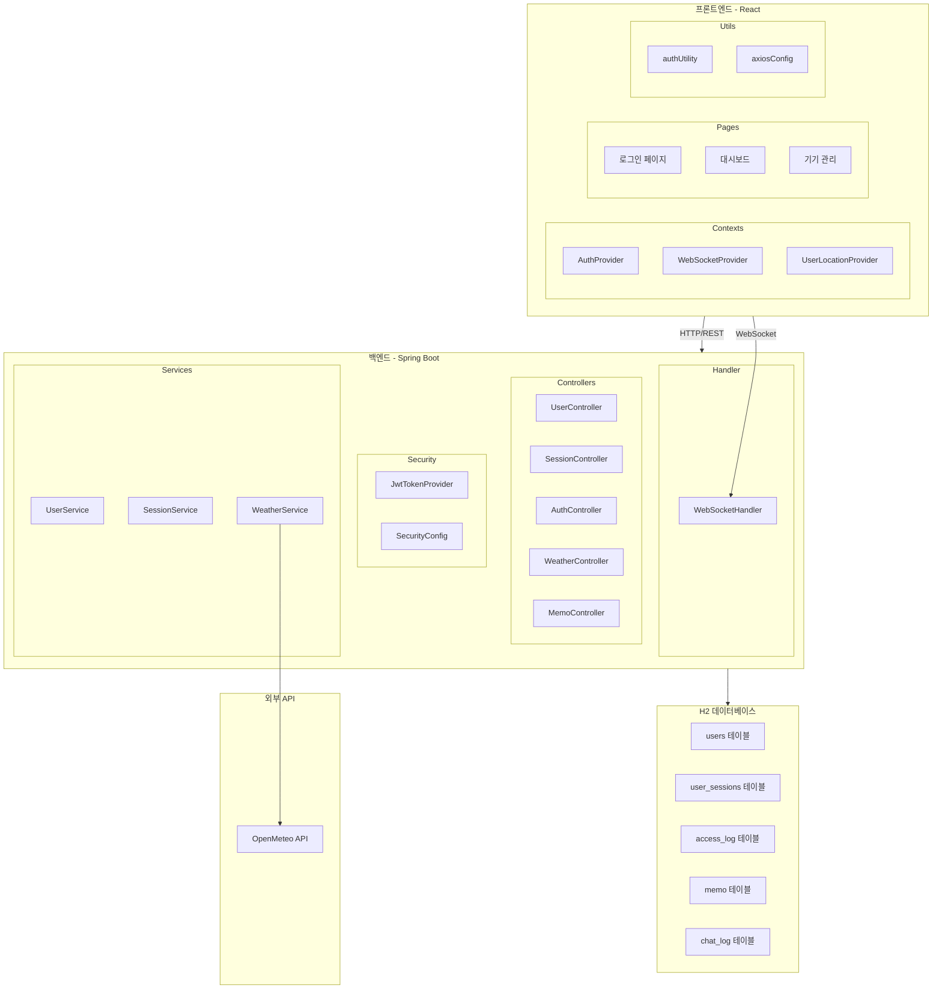
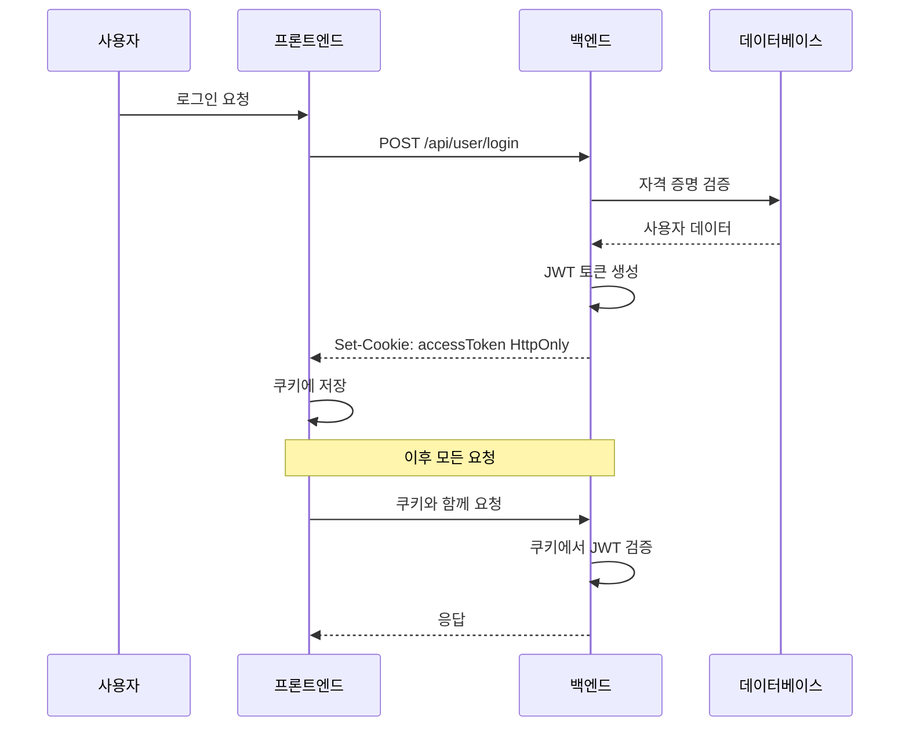
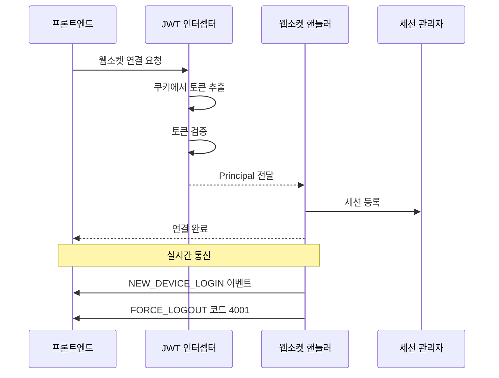
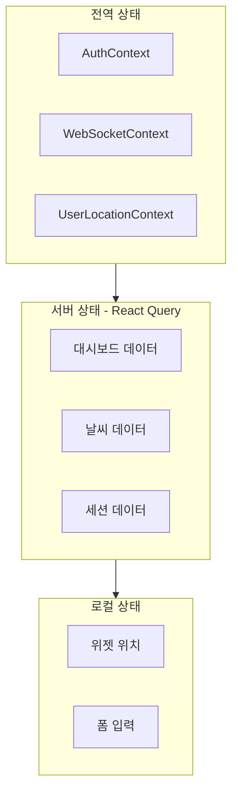
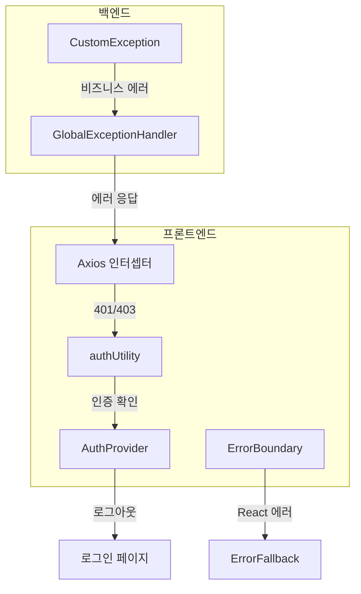
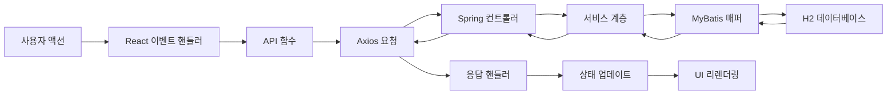
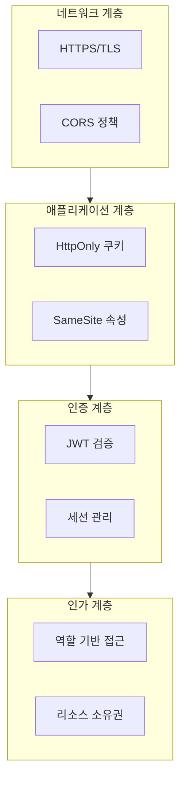

# 시스템 아키텍처

## 1. 전체 아키텍처



## 2. 인증 아키텍처

### 2.1 JWT 토큰 흐름



### 2.2 토큰 저장 전략

| 저장소 | 타입 | 용도 |
|--------|------|------|
| HttpOnly 쿠키 | accessToken | 인증 토큰 |
| 메모리 (authUtility) | isLoggingIn/isLoggingOut | 상태 플래그 |
| React 상태 | authState | UI 상태 |

### 2.3 보안 기능

1. **HttpOnly 쿠키**: JavaScript에서 토큰 접근 불가 (XSS 방지)
2. **SameSite 쿠키**: CSRF 방지
3. **세션 기반 기기 관리**: 각 기기마다 고유 세션 ID
4. **토큰 만료**: 설정 가능 (테스트 15초 / 운영 30분)

## 3. 웹소켓 아키텍처

### 3.1 연결 흐름



### 3.2 웹소켓 메시지 타입

| 타입 | 방향 | 설명 |
|------|------|------|
| NEW_DEVICE_LOGIN | 서버 -> 클라이언트 | 새 기기 로그인 알림 |
| FORCE_LOGOUT (4001) | 서버 -> 클라이언트 | 강제 연결 해제 알림 |
| CHAT | 클라이언트 -> 서버 | 채팅 메시지 전송 |
| CHAT | 서버 -> 클라이언트 | 채팅 메시지 브로드캐스트 |

## 4. 상태 관리 아키텍처

### 4.1 프론트엔드 상태 계층



### 4.2 상태 동기화

| 상태 | 저장소 | 동기화 방식 |
|------|--------|-------------|
| 인증 | Context + 쿠키 | JWT 검증 |
| 웹소켓 | Context | 이벤트 기반 |
| 대시보드 데이터 | React Query | 자동 갱신 |
| 위젯 레이아웃 | localStorage | 수동 저장 |

## 5. 에러 처리 아키텍처

### 5.1 에러 흐름



### 5.2 에러 코드 매핑

| HTTP 상태 | 에러 코드 | 동작 |
|-----------|----------|------|
| 401 | - | 토큰 만료, 재인증 |
| 403 | A006 | 새 기기 로그인 (에러 아님) |
| 403 | 기타 | 접근 거부, 로그아웃 |
| 404 | - | 리소스 없음 |
| 500 | - | 서버 에러, 토스트 표시 |

## 6. 데이터 흐름 아키텍처

### 6.1 요청 흐름



### 6.2 캐싱 전략

| 데이터 타입 | 캐시 방식 | TTL |
|-------------|----------|-----|
| 인증 상태 | 메모리 + TTL | 5초 |
| 날씨 데이터 | React Query | 5분 |
| 세션 목록 | React Query | 캐시 없음 |
| 위젯 레이아웃 | localStorage | 영구 |

## 7. 배포 아키텍처

### 7.1 개발 환경

```
프론트엔드 (Vite 개발 서버)  : http://localhost:5173
백엔드 (Spring Boot)         : http://localhost:8080
데이터베이스 (H2 콘솔)       : http://localhost:8080/h2-console
```

### 7.2 운영 환경 (권장)

```
프론트엔드 (정적 파일)        : Spring Boot에서 서빙
백엔드 (Spring Boot)         : 단일 인스턴스
데이터베이스 (H2 파일)       : 애플리케이션 내장
```

## 8. 보안 아키텍처

### 8.1 보안 계층



### 8.2 보안 설정 요약

| 기능 | 설정 | 목적 |
|------|------|------|
| 쿠키 HttpOnly | true | XSS 방지 |
| 쿠키 Secure | 자동 (HTTPS) | MITM 방지 |
| 쿠키 SameSite | Lax | CSRF 방지 |
| JWT 만료 | 15초/30분 | 토큰 수명 |
| 기기별 세션 | true | 기기 추적 |
