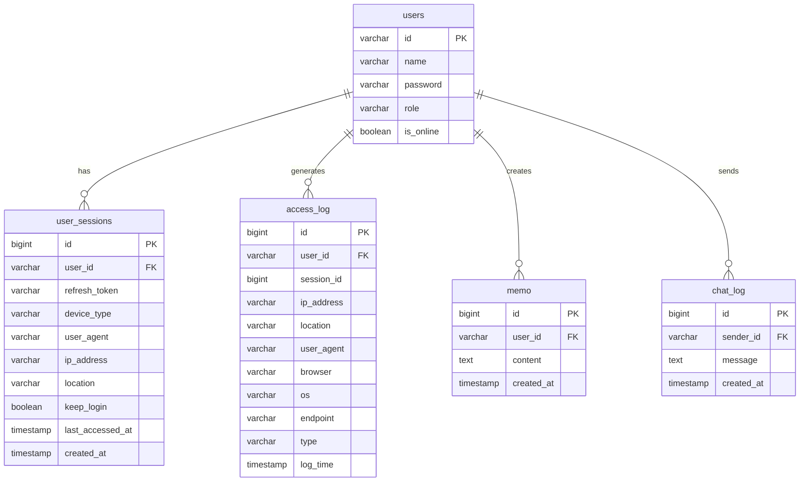

# 데이터베이스 설계

## 1. ER 다이어그램



## 2. 테이블 정의

### 2.1 users (사용자 테이블)

| 컬럼 | 타입 | 제약조건 | 설명 |
|------|------|----------|------|
| id | VARCHAR(50) | PRIMARY KEY | 사용자 ID (로그인 ID) |
| name | VARCHAR(50) | NOT NULL | 사용자 이름 |
| password | VARCHAR(100) | NOT NULL | 해시된 비밀번호 (BCrypt) |
| role | VARCHAR(20) | DEFAULT 'USER' | 권한 (USER, ADMIN) |
| is_online | BOOLEAN | DEFAULT FALSE | 온라인 상태 |

**인덱스:**
- PRIMARY KEY on `id`

**샘플 데이터:**
```sql
INSERT INTO users (id, name, password, role) 
VALUES ('admin', '관리자', '$2a$10$...', 'ADMIN');
```

---

### 2.2 user_sessions (세션 테이블)

| 컬럼 | 타입 | 제약조건 | 설명 |
|------|------|----------|------|
| id | BIGINT | PRIMARY KEY, AUTO_INCREMENT | 세션 ID |
| user_id | VARCHAR(50) | FOREIGN KEY, NOT NULL | 사용자 ID |
| refresh_token | VARCHAR(512) | NOT NULL | 기기 식별용 토큰 |
| device_type | VARCHAR(50) | NULLABLE | 기기 타입 (Mobile, Desktop, Tablet) |
| user_agent | VARCHAR(255) | NULLABLE | 브라우저 정보 |
| ip_address | VARCHAR(50) | NULLABLE | IP 주소 |
| location | VARCHAR(100) | NULLABLE | IP 기반 위치 |
| keep_login | BOOLEAN | DEFAULT FALSE | 로그인 유지 여부 |
| last_accessed_at | TIMESTAMP | NULLABLE | 마지막 접속 시간 |
| created_at | TIMESTAMP | DEFAULT CURRENT_TIMESTAMP | 생성 시간 |

**인덱스:**
- PRIMARY KEY on `id`
- INDEX on `user_id`
- INDEX on `refresh_token`

**관계:**
- FOREIGN KEY (`user_id`) REFERENCES `users(id)` ON DELETE CASCADE

**사용 참고:**
- 각 기기 로그인 시 새로운 세션 레코드 생성
- `refresh_token`으로 기기 식별
- 기기에서 로그아웃하면 해당 세션 삭제

---

### 2.3 access_log (접속 로그 테이블)

| 컬럼 | 타입 | 제약조건 | 설명 |
|------|------|----------|------|
| id | BIGINT | PRIMARY KEY, AUTO_INCREMENT | 로그 ID |
| user_id | VARCHAR(50) | FOREIGN KEY, NULLABLE | 사용자 ID |
| session_id | BIGINT | NULLABLE | 세션 ID |
| ip_address | VARCHAR(50) | NULLABLE | IP 주소 |
| location | VARCHAR(100) | NULLABLE | IP 기반 위치 |
| user_agent | VARCHAR(255) | NULLABLE | 브라우저 정보 |
| browser | VARCHAR(50) | NULLABLE | 브라우저 이름 (Chrome, Safari) |
| os | VARCHAR(50) | NULLABLE | OS 이름 (Windows, Mac) |
| endpoint | VARCHAR(100) | NULLABLE | API 엔드포인트 |
| type | VARCHAR(50) | NULLABLE | 로그 타입 (LOGIN, LOGOUT) |
| log_time | TIMESTAMP | DEFAULT CURRENT_TIMESTAMP | 로그 시간 |

**인덱스:**
- PRIMARY KEY on `id`
- INDEX on `user_id`
- INDEX on `session_id`

**관계:**
- FOREIGN KEY (`user_id`) REFERENCES `users(id)`

**로그 타입:**
| 타입 | 설명 |
|------|------|
| LOGIN | 사용자 로그인 |
| LOGOUT | 사용자 로그아웃 |
| FORCE_LOGOUT | 관리자 또는 사용자에 의한 강제 로그아웃 |
| SESSION_EXPIRED | 세션 만료 |

---

### 2.4 memo (메모 테이블)

| 컬럼 | 타입 | 제약조건 | 설명 |
|------|------|----------|------|
| id | BIGINT | PRIMARY KEY, AUTO_INCREMENT | 메모 ID |
| user_id | VARCHAR(50) | FOREIGN KEY, NOT NULL | 사용자 ID |
| content | TEXT | NULLABLE | 메모 내용 |
| created_at | TIMESTAMP | DEFAULT CURRENT_TIMESTAMP | 생성 시간 |

**인덱스:**
- PRIMARY KEY on `id`
- INDEX on `user_id`

**관계:**
- FOREIGN KEY (`user_id`) REFERENCES `users(id)`

---

### 2.5 chat_log (채팅 로그 테이블)

| 컬럼 | 타입 | 제약조건 | 설명 |
|------|------|----------|------|
| id | BIGINT | PRIMARY KEY, AUTO_INCREMENT | 메시지 ID |
| sender_id | VARCHAR(50) | FOREIGN KEY, NOT NULL | 발신자 ID |
| message | TEXT | NOT NULL | 메시지 내용 |
| created_at | TIMESTAMP | DEFAULT CURRENT_TIMESTAMP | 생성 시간 |

**인덱스:**
- PRIMARY KEY on `id`
- INDEX on `sender_id`

**관계:**
- FOREIGN KEY (`sender_id`) REFERENCES `users(id)`

---

## 3. 데이터 사전

### 3.1 사용자 권한

| 권한 | 설명 | 기능 |
|------|------|------|
| USER | 일반 사용자 | 대시보드, 메모, 날씨, 채팅 |
| ADMIN | 관리자 | 모든 USER 기능 + 사용자 관리 |

### 3.2 기기 타입

| 타입 | 설명 |
|------|------|
| Mobile | 모바일 폰 |
| Tablet | 태블릿 기기 |
| Desktop | 데스크톱/노트북 |

### 3.3 브라우저 타입

| 브라우저 | User Agent 패턴 |
|---------|-----------------|
| Chrome | Chrome/x.x |
| Safari | Safari/x.x |
| Firefox | Firefox/x.x |
| Edge | Edg/x.x |
| Other | - |

### 3.4 OS 타입

| OS | User Agent 패턴 |
|----|-----------------|
| Windows | Windows NT x.x |
| Mac | Mac OS X |
| Linux | Linux |
| Android | Android |
| iOS | iPhone/iPad |
| Other | - |

---

## 4. SQL 스크립트

### 4.1 테이블 생성

```sql
-- 사용자 테이블
CREATE TABLE IF NOT EXISTS users (
    id VARCHAR(50) PRIMARY KEY,
    name VARCHAR(50) NOT NULL,
    password VARCHAR(100) NOT NULL,
    role VARCHAR(20) DEFAULT 'USER',
    is_online BOOLEAN DEFAULT FALSE
);

-- 세션 테이블
CREATE TABLE IF NOT EXISTS user_sessions (
    id BIGINT AUTO_INCREMENT PRIMARY KEY,
    user_id VARCHAR(50) NOT NULL,
    refresh_token VARCHAR(512) NOT NULL,
    device_type VARCHAR(50),
    user_agent VARCHAR(255),
    ip_address VARCHAR(50),
    location VARCHAR(100),
    keep_login BOOLEAN DEFAULT FALSE,
    last_accessed_at TIMESTAMP,
    created_at TIMESTAMP DEFAULT CURRENT_TIMESTAMP,
    FOREIGN KEY (user_id) REFERENCES users(id) ON DELETE CASCADE
);

-- 접속 로그 테이블
CREATE TABLE IF NOT EXISTS access_log (
    id BIGINT AUTO_INCREMENT PRIMARY KEY,
    user_id VARCHAR(50),
    session_id BIGINT,
    ip_address VARCHAR(50),
    location VARCHAR(100),
    user_agent VARCHAR(255),
    browser VARCHAR(50),
    os VARCHAR(50),
    endpoint VARCHAR(100),
    type VARCHAR(50),
    log_time TIMESTAMP DEFAULT CURRENT_TIMESTAMP,
    FOREIGN KEY (user_id) REFERENCES users(id)
);

-- 메모 테이블
CREATE TABLE IF NOT EXISTS memo (
    id BIGINT AUTO_INCREMENT PRIMARY KEY,
    user_id VARCHAR(50) NOT NULL,
    content TEXT,
    created_at TIMESTAMP DEFAULT CURRENT_TIMESTAMP,
    FOREIGN KEY (user_id) REFERENCES users(id)
);

-- 채팅 로그 테이블
CREATE TABLE IF NOT EXISTS chat_log (
    id BIGINT AUTO_INCREMENT PRIMARY KEY,
    sender_id VARCHAR(50) NOT NULL,
    message TEXT NOT NULL,
    created_at TIMESTAMP DEFAULT CURRENT_TIMESTAMP,
    FOREIGN KEY (sender_id) REFERENCES users(id)
);
```

### 4.2 초기 데이터

```sql
-- 관리자 계정 (비밀번호: 1234, BCrypt 해시)
INSERT INTO users (id, name, password, role) 
VALUES ('admin', '관리자', '$2a$10$hjBO1B8SB4uKJpnSBk9vluUsMAxe44n7CAwQ4ijHOrAdWAwqMxo.e', 'ADMIN');

-- 테스트 사용자
INSERT INTO users (id, name, password, role) 
VALUES ('user1', '사용자1', '$2a$10$hjBO1B8SB4uKJpnSBk9vluUsMAxe44n7CAwQ4ijHOrAdWAwqMxo.e', 'USER');
```

---

## 5. 데이터베이스 설정

### 5.1 H2 데이터베이스 설정

```yaml
# application.yml
spring:
  datasource:
    url: jdbc:h2:file:./data/demo
    driver-class-name: org.h2.Driver
    username: sa
    password: 
  h2:
    console:
      enabled: true
      path: /h2-console
```

### 5.2 연결 정보

| 속성 | 값 |
|------|-----|
| URL | jdbc:h2:file:./data/demo |
| 드라이버 | org.h2.Driver |
| 사용자명 | sa |
| 비밀번호 | (없음) |
| 콘솔 | http://localhost:8080/h2-console |

---

## 6. 운영 환경 마이그레이션

### 6.1 MySQL/PostgreSQL로 전환 시

```yaml
# MySQL 예시
spring:
  datasource:
    url: jdbc:mysql://localhost:3306/dashboard
    driver-class-name: com.mysql.cj.jdbc.Driver
    username: dashboard_user
    password: secure_password
    hikari:
      maximum-pool-size: 10
      connection-timeout: 30000
```

### 6.2 스키마 변경 사항

| 변경 | 설명 |
|------|------|
| AUTO_INCREMENT | MySQL은 AUTO_INCREMENT, PostgreSQL은 SERIAL |
| TIMESTAMP | MySQL은 DATETIME, PostgreSQL은 TIMESTAMP |
| TEXT | MySQL은 TEXT, PostgreSQL은 TEXT |
