# 시나리오 다이어그램

## 1. 사용자 시나리오 개요

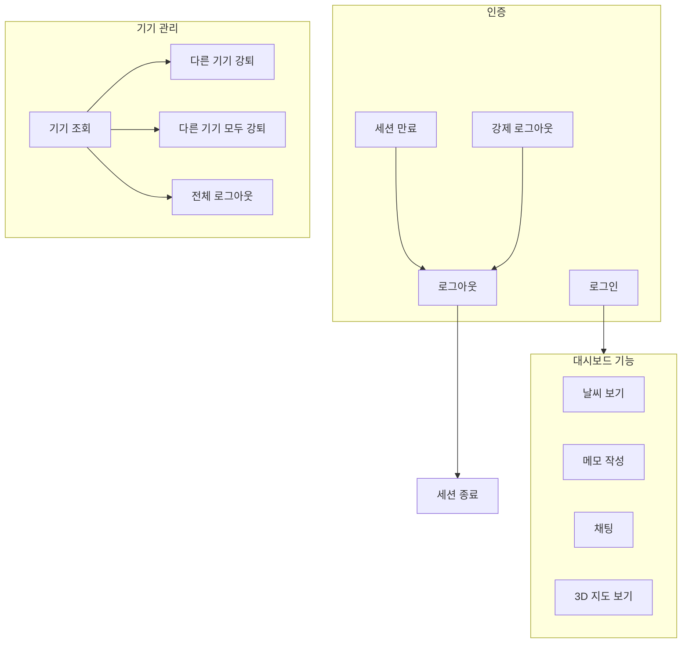
```mermaid
flowchart TB
    subgraph Auth [인증]
        A1[로그인]
        A2[로그아웃]
        A3[세션 만료]
        A4[강제 로그아웃]
    end
    
    subgraph Device [기기 관리]
        D1[기기 조회]
        D2[다른 기기 강퇴]
        D3[다른 기기 모두 강퇴]
        D4[전체 로그아웃]
    end
    
    subgraph Dashboard [대시보드 기능]
        DA1[날씨 보기]
        DA2[메모 작성]
        DA3[채팅]
        DA4[3D 지도 보기]
    end
    
    A1 --> Dashboard
    A2 --> End[세션 종료]
    A3 --> A2
    A4 --> A2
    
    D1 --> D2
    D1 --> D3
    D1 --> D4
```

---

## 2. 인증 시나리오

### 2.1 정상 로그인

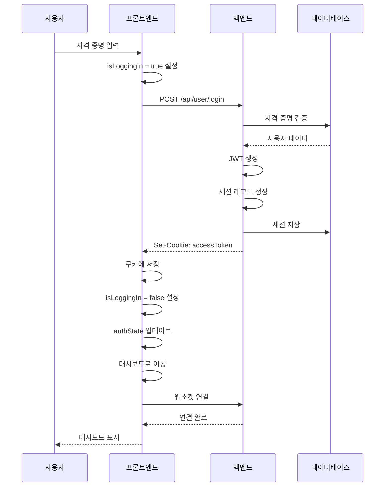
```mermaid
sequenceDiagram
    participant U as 사용자
    participant F as 프론트엔드
    participant B as 백엔드
    participant DB as 데이터베이스
    
    U->>F: 자격 증명 입력
    F->>F: isLoggingIn = true 설정
    F->>B: POST /api/user/login
    B->>DB: 자격 증명 검증
    DB-->>B: 사용자 데이터
    B->>B: JWT 생성
    B->>B: 세션 레코드 생성
    B->>DB: 세션 저장
    B-->>F: Set-Cookie: accessToken
    F->>F: 쿠키에 저장
    F->>F: isLoggingIn = false 설정
    F->>F: authState 업데이트
    F->>F: 대시보드로 이동
    F->>B: 웹소켓 연결
    B-->>F: 연결 완료
    F-->>U: 대시보드 표시
```

### 2.2 정상 로그아웃

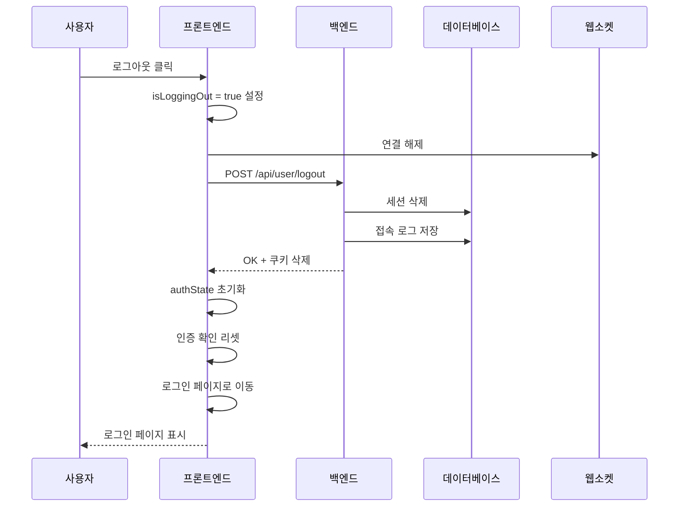
```mermaid
sequenceDiagram
    participant U as 사용자
    participant F as 프론트엔드
    participant B as 백엔드
    participant DB as 데이터베이스
    participant WS as 웹소켓
    
    U->>F: 로그아웃 클릭
    F->>F: isLoggingOut = true 설정
    F->>WS: 연결 해제
    F->>B: POST /api/user/logout
    B->>DB: 세션 삭제
    B->>DB: 접속 로그 저장
    B-->>F: OK + 쿠키 삭제
    F->>F: authState 초기화
    F->>F: 인증 확인 리셋
    F->>F: 로그인 페이지로 이동
    F-->>U: 로그인 페이지 표시
```

### 2.3 활동 중 토큰 만료

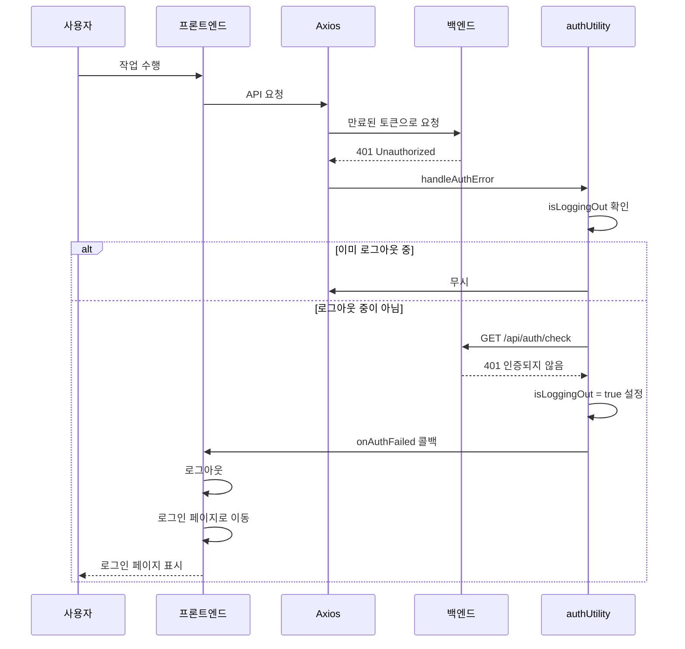
```mermaid
sequenceDiagram
    participant U as 사용자
    participant F as 프론트엔드
    participant AX as Axios
    participant B as 백엔드
    participant AU as authUtility
    
    U->>F: 작업 수행
    F->>AX: API 요청
    AX->>B: 만료된 토큰으로 요청
    B-->>AX: 401 Unauthorized
    AX->>AU: handleAuthError
    AU->>AU: isLoggingOut 확인
    alt 이미 로그아웃 중
        AU->>AX: 무시
    else 로그아웃 중이 아님
        AU->>B: GET /api/auth/check
        B-->>AU: 401 인증되지 않음
        AU->>AU: isLoggingOut = true 설정
        AU->>F: onAuthFailed 콜백
        F->>F: 로그아웃
        F->>F: 로그인 페이지로 이동
        F-->>U: 로그인 페이지 표시
    end
```

### 2.4 강제 로그아웃 (다른 기기에서 강퇴)

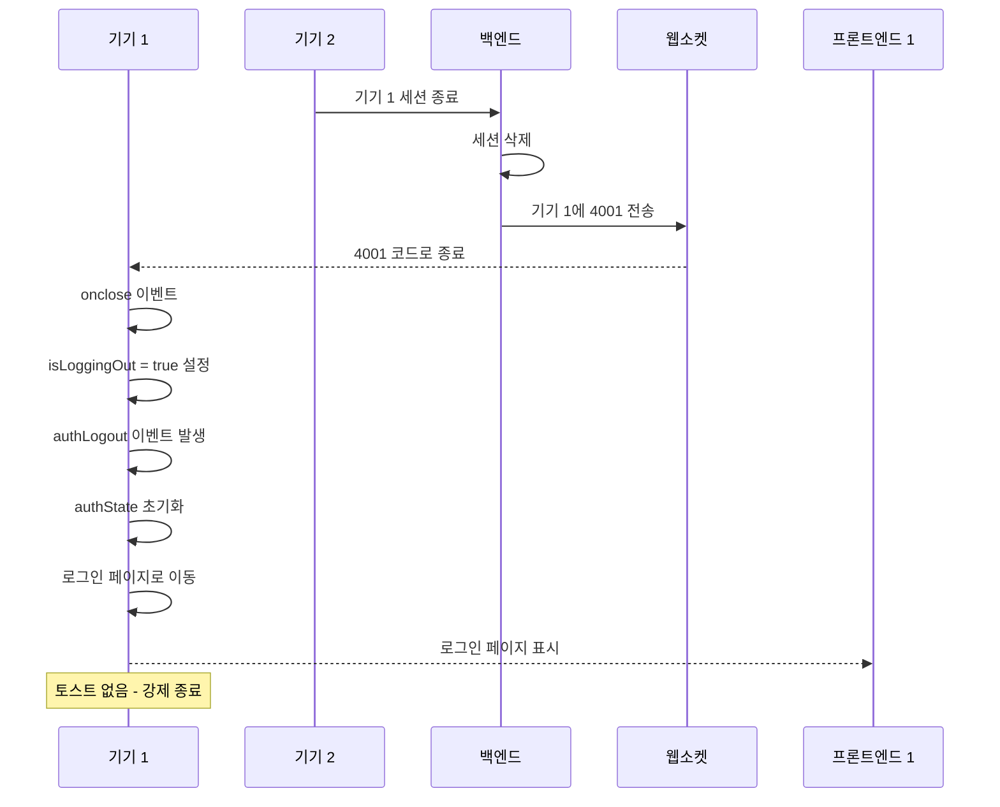
```mermaid
sequenceDiagram
    participant D1 as 기기 1
    participant D2 as 기기 2
    participant B as 백엔드
    participant WS as 웹소켓
    participant F1 as 프론트엔드 1
    
    D2->>B: 기기 1 세션 종료
    B->>B: 세션 삭제
    B->>WS: 기기 1에 4001 전송
    WS-->>D1: 4001 코드로 종료
    D1->>D1: onclose 이벤트
    D1->>D1: isLoggingOut = true 설정
    D1->>D1: authLogout 이벤트 발생
    D1->>D1: authState 초기화
    D1->>D1: 로그인 페이지로 이동
    D1-->>F1: 로그인 페이지 표시
    Note over D1: 토스트 없음 - 강제 종료
```

---

## 3. 기기 관리 시나리오

### 3.1 연결된 기기 조회

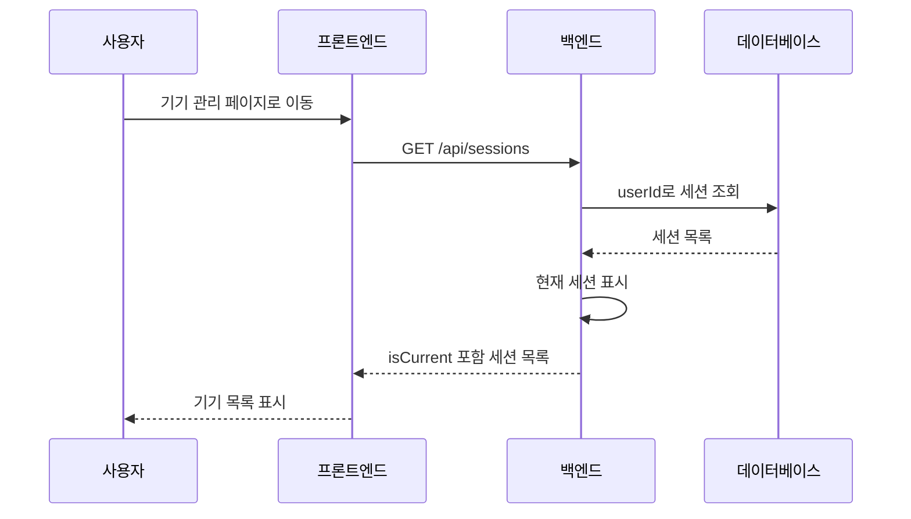
```mermaid
sequenceDiagram
    participant U as 사용자
    participant F as 프론트엔드
    participant B as 백엔드
    participant DB as 데이터베이스
    
    U->>F: 기기 관리 페이지로 이동
    F->>B: GET /api/sessions
    B->>DB: userId로 세션 조회
    DB-->>B: 세션 목록
    B->>B: 현재 세션 표시
    B-->>F: isCurrent 포함 세션 목록
    F-->>U: 기기 목록 표시
```

### 3.2 특정 기기 강퇴

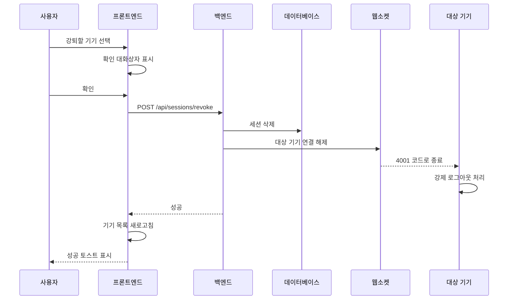
```mermaid
sequenceDiagram
    participant U as 사용자
    participant F as 프론트엔드
    participant B as 백엔드
    participant DB as 데이터베이스
    participant WS as 웹소켓
    participant TD as 대상 기기
    
    U->>F: 강퇴할 기기 선택
    F->>F: 확인 대화상자 표시
    U->>F: 확인
    F->>B: POST /api/sessions/revoke
    B->>DB: 세션 삭제
    B->>WS: 대상 기기 연결 해제
    WS-->>TD: 4001 코드로 종료
    TD->>TD: 강제 로그아웃 처리
    B-->>F: 성공
    F->>F: 기기 목록 새로고침
    F-->>U: 성공 토스트 표시
```

### 3.3 다른 기기 모두 강퇴

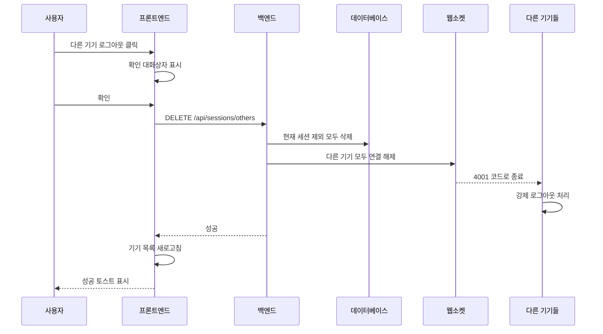
```mermaid
sequenceDiagram
    participant U as 사용자
    participant F as 프론트엔드
    participant B as 백엔드
    participant DB as 데이터베이스
    participant WS as 웹소켓
    participant OD as 다른 기기들
    
    U->>F: 다른 기기 로그아웃 클릭
    F->>F: 확인 대화상자 표시
    U->>F: 확인
    F->>B: DELETE /api/sessions/others
    B->>DB: 현재 세션 제외 모두 삭제
    B->>WS: 다른 기기 모두 연결 해제
    WS-->>OD: 4001 코드로 종료
    OD->>OD: 강제 로그아웃 처리
    B-->>F: 성공
    F->>F: 기기 목록 새로고침
    F-->>U: 성공 토스트 표시
```

### 3.4 전체 로그아웃

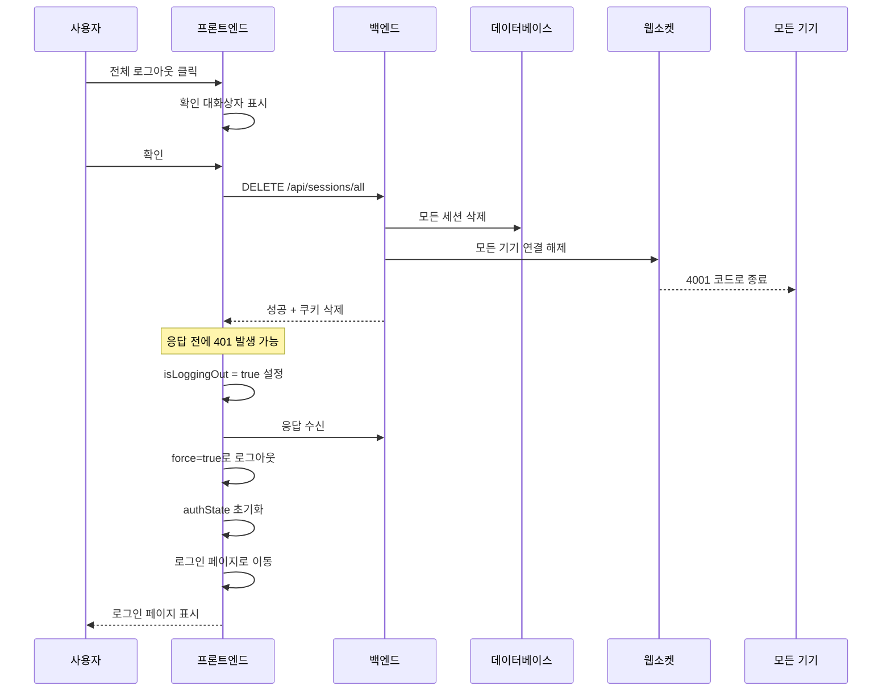
```mermaid
sequenceDiagram
    participant U as 사용자
    participant F as 프론트엔드
    participant B as 백엔드
    participant DB as 데이터베이스
    participant WS as 웹소켓
    participant AD as 모든 기기
    
    U->>F: 전체 로그아웃 클릭
    F->>F: 확인 대화상자 표시
    U->>F: 확인
    F->>B: DELETE /api/sessions/all
    B->>DB: 모든 세션 삭제
    B->>WS: 모든 기기 연결 해제
    WS-->>AD: 4001 코드로 종료
    B-->>F: 성공 + 쿠키 삭제
    Note over F: 응답 전에 401 발생 가능
    F->>F: isLoggingOut = true 설정
    F->>B: 응답 수신
    F->>F: force=true로 로그아웃
    F->>F: authState 초기화
    F->>F: 로그인 페이지로 이동
    F-->>U: 로그인 페이지 표시
```

---

## 4. 대시보드 기능 시나리오

### 4.1 날씨 위젯 보기

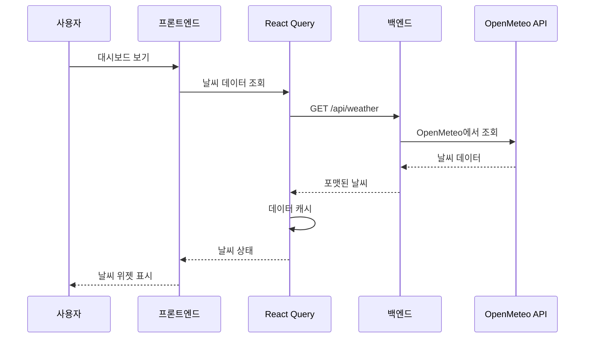
```mermaid
sequenceDiagram
    participant U as 사용자
    participant F as 프론트엔드
    participant RQ as React Query
    participant B as 백엔드
    participant E as OpenMeteo API
    
    U->>F: 대시보드 보기
    F->>RQ: 날씨 데이터 조회
    RQ->>B: GET /api/weather
    B->>E: OpenMeteo에서 조회
    E-->>B: 날씨 데이터
    B-->>RQ: 포맷된 날씨
    RQ->>RQ: 데이터 캐시
    RQ-->>F: 날씨 상태
    F-->>U: 날씨 위젯 표시
```

### 4.2 메모 작성

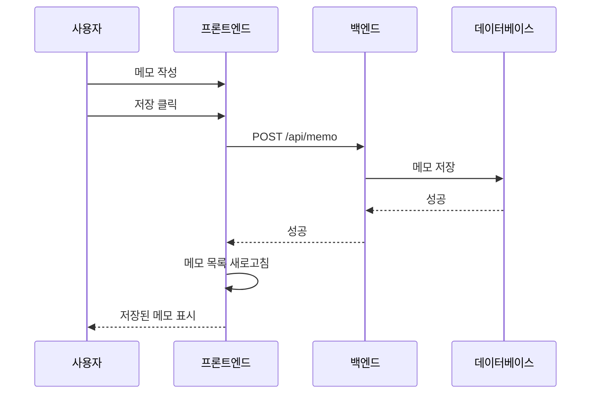
```mermaid
sequenceDiagram
    participant U as 사용자
    participant F as 프론트엔드
    participant B as 백엔드
    participant DB as 데이터베이스
    
    U->>F: 메모 작성
    U->>F: 저장 클릭
    F->>B: POST /api/memo
    B->>DB: 메모 저장
    DB-->>B: 성공
    B-->>F: 성공
    F->>F: 메모 목록 새로고침
    F-->>U: 저장된 메모 표시
```

### 4.3 채팅 메시지 전송

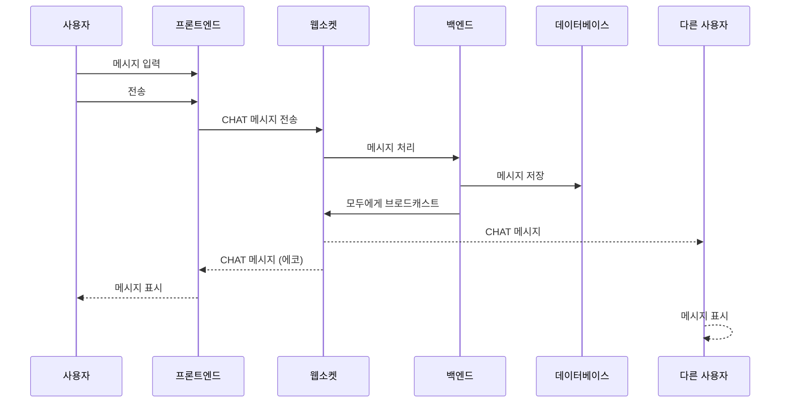
```mermaid
sequenceDiagram
    participant U as 사용자
    participant F as 프론트엔드
    participant WS as 웹소켓
    participant B as 백엔드
    participant DB as 데이터베이스
    participant O as 다른 사용자
    
    U->>F: 메시지 입력
    U->>F: 전송
    F->>WS: CHAT 메시지 전송
    WS->>B: 메시지 처리
    B->>DB: 메시지 저장
    B->>WS: 모두에게 브로드캐스트
    WS-->>O: CHAT 메시지
    WS-->>F: CHAT 메시지 (에코)
    F-->>U: 메시지 표시
    O-->>O: 메시지 표시
```

---

## 5. 에러 처리 시나리오

### 5.1 요청 중 네트워크 에러

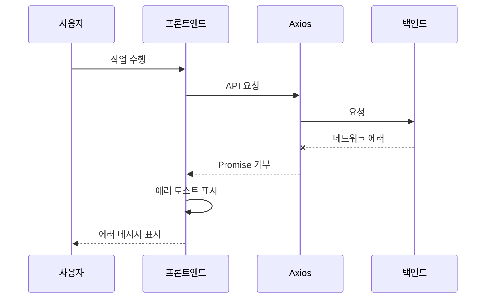
```mermaid
sequenceDiagram
    participant U as 사용자
    participant F as 프론트엔드
    participant AX as Axios
    participant B as 백엔드
    
    U->>F: 작업 수행
    F->>AX: API 요청
    AX->>B: 요청
    B--xAX: 네트워크 에러
    AX-->>F: Promise 거부
    F->>F: 에러 토스트 표시
    F-->>U: 에러 메시지 표시
```

### 5.2 같은 기기에서 동시 로그인

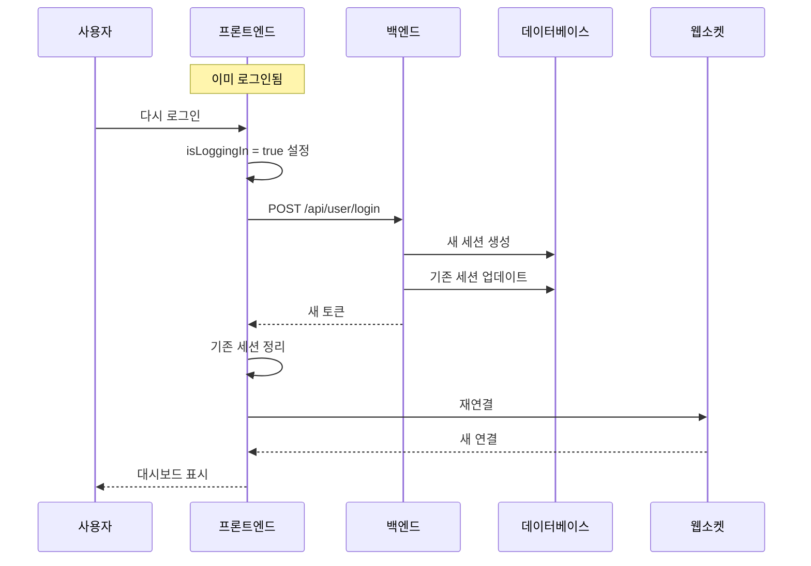
```mermaid
sequenceDiagram
    participant U as 사용자
    participant F as 프론트엔드
    participant B as 백엔드
    participant DB as 데이터베이스
    participant WS as 웹소켓
    
    Note over F: 이미 로그인됨
    U->>F: 다시 로그인
    F->>F: isLoggingIn = true 설정
    F->>B: POST /api/user/login
    B->>DB: 새 세션 생성
    B->>DB: 기존 세션 업데이트
    B-->>F: 새 토큰
    F->>F: 기존 세션 정리
    F->>WS: 재연결
    WS-->>F: 새 연결
    F-->>U: 대시보드 표시
```

### 5.3 레이스 컨디션: API 호출 중 로그아웃

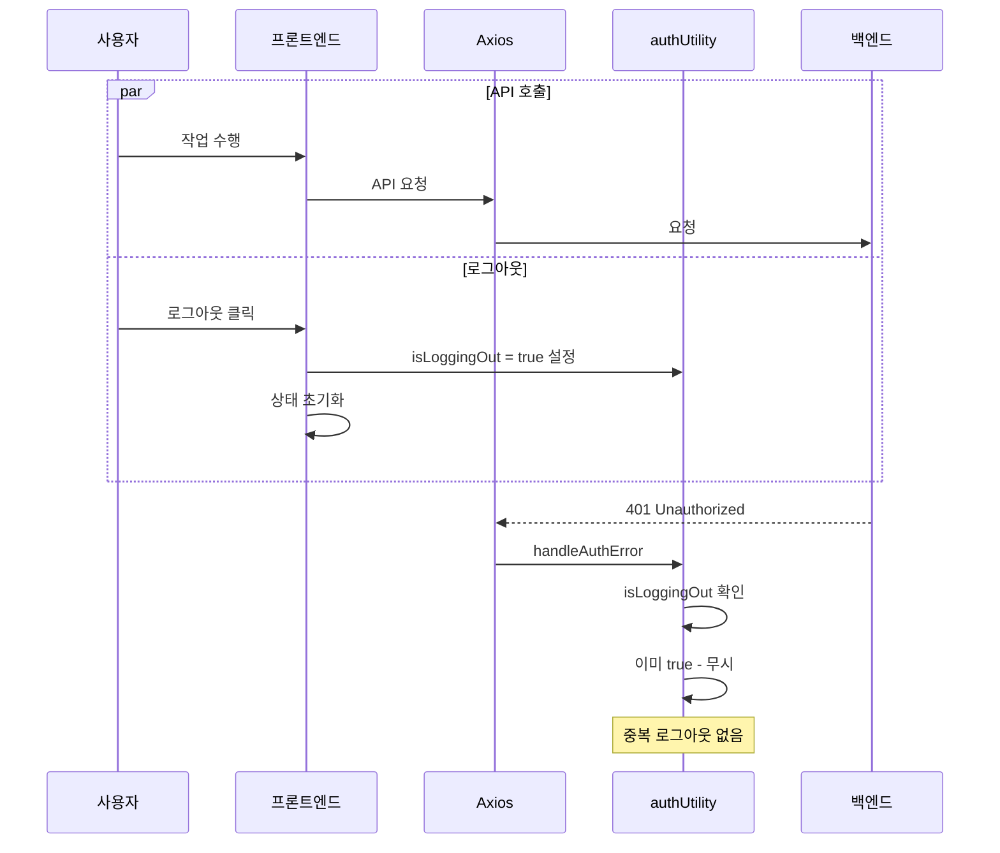
```mermaid
sequenceDiagram
    participant U as 사용자
    participant F as 프론트엔드
    participant AX as Axios
    participant AU as authUtility
    participant B as 백엔드
    
    par API 호출
        U->>F: 작업 수행
        F->>AX: API 요청
        AX->>B: 요청
    and 로그아웃
        U->>F: 로그아웃 클릭
        F->>AU: isLoggingOut = true 설정
        F->>F: 상태 초기화
    end
    
    B-->>AX: 401 Unauthorized
    AX->>AU: handleAuthError
    AU->>AU: isLoggingOut 확인
    AU->>AU: 이미 true - 무시
    Note over AU: 중복 로그아웃 없음
```

---

## 6. 토큰 만료 시나리오

### 6.1 유휴 상태에서 토큰 만료

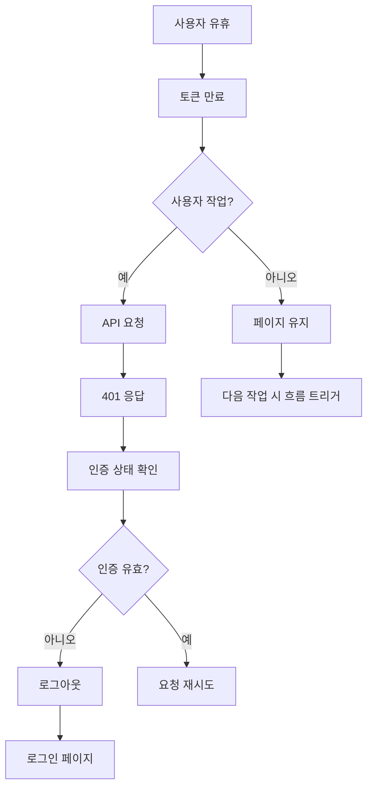
```mermaid
flowchart TB
    A[사용자 유휴] --> B[토큰 만료]
    B --> C{사용자 작업?}
    C -->|예| D[API 요청]
    D --> E[401 응답]
    E --> F[인증 상태 확인]
    F --> G{인증 유효?}
    G -->|아니오| H[로그아웃]
    G -->|예| I[요청 재시도]
    H --> J[로그인 페이지]
    
    C -->|아니오| K[페이지 유지]
    K --> L[다음 작업 시 흐름 트리거]
```

### 6.2 웹소켓 연결 중 토큰 만료

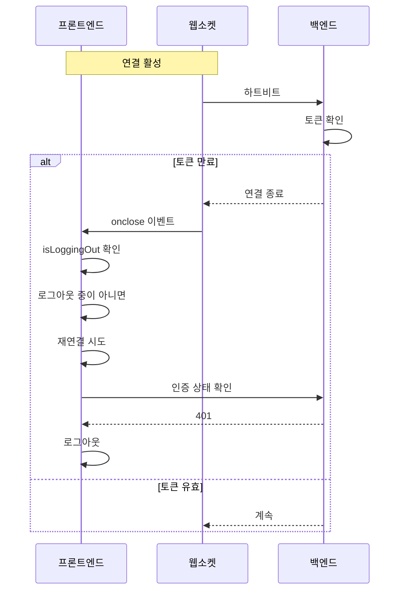
```mermaid
sequenceDiagram
    participant F as 프론트엔드
    participant WS as 웹소켓
    participant B as 백엔드
    
    Note over F,WS: 연결 활성
    WS->>B: 하트비트
    B->>B: 토큰 확인
    alt 토큰 만료
        B-->>WS: 연결 종료
        WS->>F: onclose 이벤트
        F->>F: isLoggingOut 확인
        F->>F: 로그아웃 중이 아니면
        F->>F: 재연결 시도
        F->>B: 인증 상태 확인
        B-->>F: 401
        F->>F: 로그아웃
    else 토큰 유효
        B-->>WS: 계속
    end
```

---

## 7. 페이지 이동 시나리오

### 7.1 보호된 경로 접근

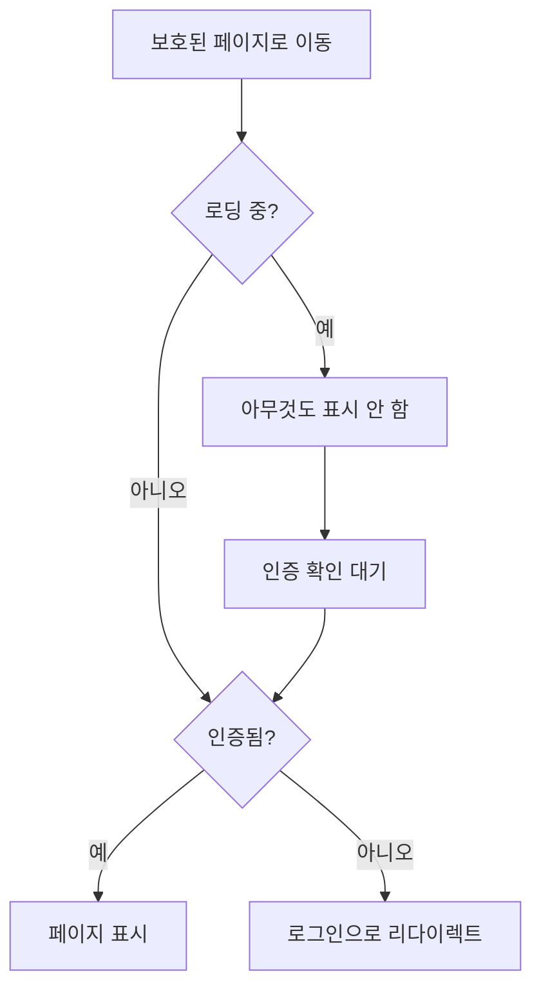
```mermaid
flowchart TB
    A[보호된 페이지로 이동] --> B{로딩 중?}
    B -->|예| C[아무것도 표시 안 함]
    B -->|아니오| D{인증됨?}
    D -->|예| E[페이지 표시]
    D -->|아니오| F[로그인으로 리다이렉트]
    
    C --> G[인증 확인 대기]
    G --> D
```

### 7.2 공개 경로 접근 (로그인 페이지)

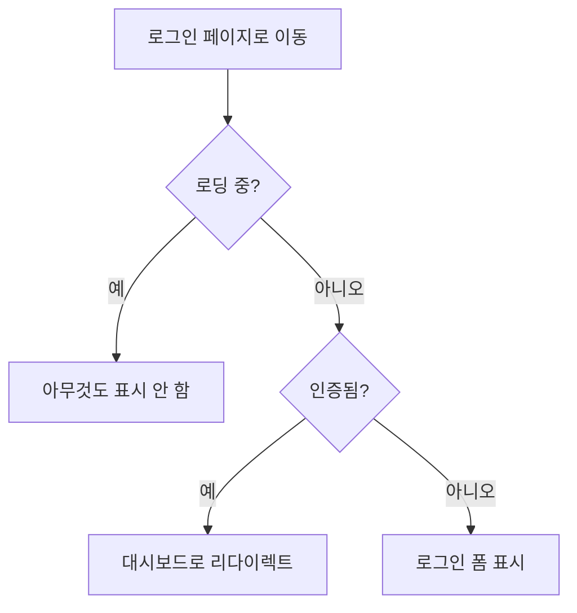
```mermaid
flowchart TB
    A[로그인 페이지로 이동] --> B{로딩 중?}
    B -->|예| C[아무것도 표시 안 함]
    B -->|아니오| D{인증됨?}
    D -->|예| E[대시보드로 리다이렉트]
    D -->|아니오| F[로그인 폼 표시]
```

---

## 8. 상태 전이 다이어그램

### 8.1 인증 상태

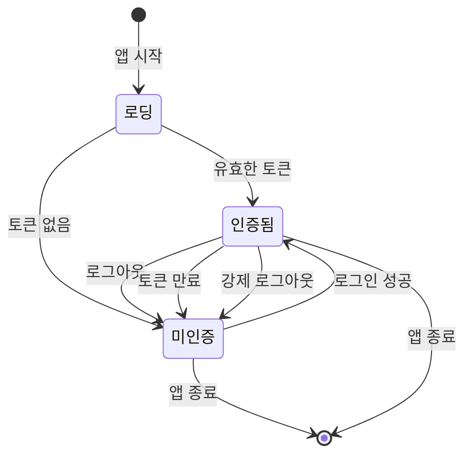
```mermaid
stateDiagram-v2
    [*] --> 로딩: 앱 시작
    로딩 --> 인증됨: 유효한 토큰
    로딩 --> 미인증: 토큰 없음
    미인증 --> 인증됨: 로그인 성공
    인증됨 --> 미인증: 로그아웃
    인증됨 --> 미인증: 토큰 만료
    인증됨 --> 미인증: 강제 로그아웃
    미인증 --> [*]: 앱 종료
    인증됨 --> [*]: 앱 종료
```

### 8.2 웹소켓 상태

```mermaid
stateDiagram-v2
    [*] --> 연결해제: 앱 시작
    연결해제 --> 연결중: 인증 성공
    연결중 --> 연결됨: 핸드셰이크 성공
    연결중 --> 연결해제: 인증 실패
    연결됨 --> 연결해제: 정상 종료
    연결됨 --> 연결해제: 강제 로그아웃 4001
    연결됨 --> 재연결중: 연결 손실
    재연결중 --> 연결됨: 재연결 성공
    재연결중 --> 연결해제: 인증 손실
    연결해제 --> [*]: 앱 종료
```

---

## 9. 전체 사용자 여정

### 9.1 정상 흐름

```mermaid
flowchart LR
    A[앱 열기] --> B[로그인 페이지]
    B --> C[자격 증명 입력]
    C --> D[대시보드]
    D --> E[기능 사용]
    E --> F[로그아웃]
    F --> B
```

### 9.2 에러 복구 흐름

```mermaid
flowchart TB
    A[대시보드 사용 중] --> B{에러 발생}
    B -->|네트워크 에러| C[토스트 표시]
    C --> A
    B -->|인증 에러| D[인증 확인]
    D -->|유효| E[재시도]
    E --> A
    D -->|무효| F[로그아웃]
    F --> G[로그인 페이지]
```

---

## 10. 시나리오 요약표

| 시나리오 | 트리거 | 예상 동작 | 예외 상황 |
|----------|--------|----------|----------|
| 로그인 | 자격 증명 입력 | 토큰 설정, 대시보드로 이동 | 잘못된 비밀번호, 네트워크 에러 |
| 로그아웃 | 버튼 클릭 | 토큰 삭제, 로그인으로 이동 | 토큰 이미 만료 |
| 토큰 만료 | API 호출 | 인증 확인, 무효하면 로그아웃 | 이미 로그아웃 중 |
| 강제 로그아웃 | 4001 코드 | 즉시 로그아웃, 토스트 없음 | 정상 로그아웃과 경합 |
| 기기 강퇴 | 관리자 작업 | 대상 기기 로그아웃 | 기기 이미 연결 해제 |
| 기기 조회 | 페이지 로드 | 모든 세션 표시 | 세션 없음 |
| 날씨 | 위젯 로드 | 날씨 데이터 표시 | API 사용 불가 |
| 메모 | 저장 버튼 | 메모 저장 | 빈 내용 |
| 채팅 | 메시지 전송 | 모두에게 브로드캐스트 | 웹소켓 연결 해제 |