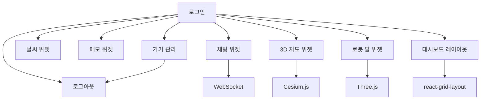

# 기능 명세서

## 1. 기능 개요

| 기능 ID | 기능명 | 우선순위 | 상태 | 설명 |
|---------|--------|----------|------|------|
| F001 | 로그인 | 높음 | 완료 | 사용자 인증 |
| F002 | 로그아웃 | 높음 | 완료 | 세션 종료 |
| F003 | 기기 관리 | 높음 | 완료 | 다중 기기 세션 제어 |
| F004 | 날씨 위젯 | 보통 | 완료 | 날씨 정보 표시 |
| F005 | 메모 위젯 | 보통 | 완료 | 개인 메모 관리 |
| F006 | 채팅 위젯 | 보통 | 완료 | 실시간 채팅 |
| F007 | 3D 지도 위젯 | 낮음 | 완료 | Cesium 3D 지도 |
| F008 | 로봇 팔 위젯 | 낮음 | 완료 | Three.js 3D 시뮬레이션 |
| F009 | 대시보드 레이아웃 | 보통 | 완료 | 커스터마이징 가능한 위젯 레이아웃 |

---

## 2. 기능 상세

### F001 - 로그인

| 속성 | 값 |
|------|-----|
| 기능 ID | F001 |
| 기능명 | 로그인 |
| 우선순위 | 높음 |
| 상태 | 완료 |
| 담당 | 시스템 |

**설명:**
ID와 비밀번호로 사용자 인증. "로그인 상태 유지" 옵션 지원.

**요구사항:**
| ID | 요구사항 | 우선순위 | 상태 |
|----|----------|----------|------|
| R001-1 | 사용자 ID 입력 | 높음 | 완료 |
| R001-2 | 비밀번호 입력 | 높음 | 완료 |
| R001-3 | 로그인 상태 유지 체크박스 | 보통 | 완료 |
| R001-4 | 잘못된 자격 증명 시 에러 표시 | 높음 | 완료 |
| R001-5 | 성공 시 대시보드로 리다이렉트 | 높음 | 완료 |

**UI 컴포넌트:**
- 로그인 폼 (ID, 비밀번호, 로그인 상태 유지)
- 에러 메시지 표시
- 로딩 인디케이터

**API 엔드포인트:**
- `POST /api/user/login`

**에러 처리:**
| 에러 | 메시지 | 동작 |
|------|--------|------|
| 잘못된 자격 증명 | "아이디 또는 비밀번호가 올바르지 않습니다" | 에러 토스트 표시 |
| 네트워크 에러 | "네트워크 오류가 발생했습니다" | 에러 토스트 표시 |
| 서버 에러 | "서버 오류가 발생했습니다" | 에러 토스트 표시 |

---

### F002 - 로그아웃

| 속성 | 값 |
|------|-----|
| 기능 ID | F002 |
| 기능명 | 로그아웃 |
| 우선순위 | 높음 |
| 상태 | 완료 |
| 담당 | 시스템 |

**설명:**
현재 세션을 종료하고 로그인 페이지로 리다이렉트.

**요구사항:**
| ID | 요구사항 | 우선순위 | 상태 |
|----|----------|----------|------|
| R002-1 | UI에 로그아웃 버튼 | 높음 | 완료 |
| R002-2 | 세션 데이터 삭제 | 높음 | 완료 |
| R002-3 | 쿠키 삭제 | 높음 | 완료 |
| R002-4 | 로그인 페이지로 리다이렉트 | 높음 | 완료 |
| R002-5 | 토스트 메시지 표시 | 보통 | 완료 |

**UI 컴포넌트:**
- 로그아웃 버튼 (헤더/사이드바)

**API 엔드포인트:**
- `POST /api/user/logout`

**예외 케이스:**
| 케이스 | 처리 방법 |
|--------|-----------|
| 토큰 이미 만료 | body의 userId 사용 |
| 네트워크 에러 | 로컬 상태 정리 계속 진행 |
| 이미 로그아웃 중 | 중복 로그아웃 건너뛰기 |

---

### F003 - 기기 관리

| 속성 | 값 |
|------|-----|
| 기능 ID | F003 |
| 기능명 | 기기 관리 |
| 우선순위 | 높음 |
| 상태 | 완료 |
| 담당 | 시스템 |

**설명:**
모든 활성 세션을 조회하고 관리. 특정 기기 또는 다른 모든 기기 강제 로그아웃 가능.

**요구사항:**
| ID | 요구사항 | 우선순위 | 상태 |
|----|----------|----------|------|
| R003-1 | 모든 활성 세션 조회 | 높음 | 완료 |
| R003-2 | 기기 타입, 위치, 시간 표시 | 높음 | 완료 |
| R003-3 | 현재 기기 하이라이트 | 보통 | 완료 |
| R003-4 | 특정 기기 강제 로그아웃 | 높음 | 완료 |
| R003-5 | 다른 모든 기기 강제 로그아웃 | 보통 | 완료 |
| R003-6 | 전체 기기 로그아웃 | 높음 | 완료 |
| R003-7 | 확인 다이얼로그 표시 | 높음 | 완료 |

**UI 컴포넌트:**
- 기기 목록 (아이콘 포함)
- 기기 상세 (IP, 위치, 시간)
- 액션 버튼 (강제 로그아웃, 전체 로그아웃)
- 확인 다이얼로그

**API 엔드포인트:**
- `GET /api/sessions`
- `POST /api/sessions/revoke`
- `DELETE /api/sessions/others`
- `DELETE /api/sessions/all`

**기기 타입:**
| 타입 | 아이콘 | 감지 방법 |
|------|--------|-----------|
| 데스크톱 | 데스크톱 아이콘 | User-Agent에 "Windows", "Mac", "Linux" 포함 |
| 모바일 | 모바일 아이콘 | User-Agent에 "Mobile", "iPhone", "Android" 포함 |
| 태블릿 | 태블릿 아이콘 | User-Agent에 "iPad", "Tablet" 포함 |

---

### F004 - 날씨 위젯

| 속성 | 값 |
|------|-----|
| 기능 ID | F004 |
| 기능명 | 날씨 위젯 |
| 우선순위 | 보통 |
| 상태 | 완료 |
| 담당 | 시스템 |

**설명:**
OpenMeteo API를 사용하여 현재 날씨와 예보 표시.

**요구사항:**
| ID | 요구사항 | 우선순위 | 상태 |
|----|----------|----------|------|
| R004-1 | 현재 날씨 표시 | 높음 | 완료 |
| R004-2 | 시간별 예보 표시 | 보통 | 완료 |
| R004-3 | 주간 예보 표시 | 보통 | 완료 |
| R004-4 | 자동 새로고침 | 보통 | 완료 |
| R004-5 | 위치 정보 사용 | 낮음 | 완료 |
| R004-6 | 기본 위치 (용인) | 보통 | 완료 |

**UI 컴포넌트:**
- 현재 날씨 표시
- 시간별 예보 캐러셀
- 주간 예보 목록
- 날씨 아이콘

**API 엔드포인트:**
- `GET /api/weather`

**외부 API:**
- OpenMeteo API (https://api.open-meteo.com)

**날씨 코드:**
| 코드 | 설명 | 아이콘 |
|------|------|--------|
| 0 | 맑음 | 태양 |
| 1-3 | 대체로 맑음 ~ 흐림 | 구름/태양 |
| 45,48 | 안개 | 안개 |
| 51-67 | 이슬비/비 | 비 |
| 71-77 | 눈 | 눈 |
| 80-82 | 소나기 | 비 |
| 95-99 | 뇌우 | 폭풍 |

---

### F005 - 메모 위젯

| 속성 | 값 |
|------|-----|
| 기능 ID | F005 |
| 기능명 | 메모 위젯 |
| 우선순위 | 보통 |
| 상태 | 완료 |
| 담당 | 시스템 |

**설명:**
개인 메모 관리 - 생성, 조회, 삭제.

**요구사항:**
| ID | 요구사항 | 우선순위 | 상태 |
|----|----------|----------|------|
| R005-1 | 메모 생성 | 높음 | 완료 |
| R005-2 | 메모 목록 조회 | 높음 | 완료 |
| R005-3 | 메모 삭제 | 높음 | 완료 |
| R005-4 | 자동 저장 | 낮음 | 부분 |
| R005-5 | 서식 있는 텍스트 | 낮음 | 미완료 |

**UI 컴포넌트:**
- 메모 입력 필드
- 메모 목록
- 삭제 버튼
- 글자 수 카운터

**API 엔드포인트:**
- `GET /api/memo/{userId}`
- `POST /api/memo`
- `DELETE /api/memo/{id}`

**데이터 모델:**
| 필드 | 타입 | 설명 |
|------|------|------|
| id | number | 메모 ID |
| userId | string | 소유자 ID |
| content | text | 메모 내용 |
| createdAt | timestamp | 생성 시간 |

---

### F006 - 채팅 위젯

| 속성 | 값 |
|------|-----|
| 기능 ID | F006 |
| 기능명 | 채팅 위젯 |
| 우선순위 | 보통 |
| 상태 | 완료 |
| 담당 | 시스템 |

**설명:**
WebSocket을 사용한 실시간 채팅. 모든 접속 사용자에게 메시지 브로드캐스트.

**요구사항:**
| ID | 요구사항 | 우선순위 | 상태 |
|----|----------|----------|------|
| R006-1 | 메시지 전송 | 높음 | 완료 |
| R006-2 | 메시지 수신 | 높음 | 완료 |
| R006-3 | 발신자 이름 표시 | 높음 | 완료 |
| R006-4 | 타임스탬프 표시 | 보통 | 완료 |
| R006-5 | 채팅 기록 | 보통 | 완료 |
| R006-6 | 1:1 채팅 | 낮음 | 미완료 |

**UI 컴포넌트:**
- 메시지 목록
- 입력 필드
- 전송 버튼
- 사용자 표시기

**WebSocket 이벤트:**
| 이벤트 | 방향 | 페이로드 |
|--------|------|----------|
| CHAT | 클라이언트 -> 서버 | `{ message: string }` |
| CHAT | 서버 -> 클라이언트 | `{ senderId, senderName, message, timestamp }` |

**API 엔드포인트:**
- `GET /api/chat/history`

---

### F007 - 3D 지도 위젯 (Cesium)

| 속성 | 값 |
|------|-----|
| 기능 ID | F007 |
| 기능명 | 3D 지도 위젯 |
| 우선순위 | 낮음 |
| 상태 | 완료 |
| 담당 | 시스템 |

**설명:**
Cesium 라이브러리를 사용한 3D 지구 시각화.

**요구사항:**
| ID | 요구사항 | 우선순위 | 상태 |
|----|----------|----------|------|
| R007-1 | 3D 지구 표시 | 높음 | 완료 |
| R007-2 | 줌 컨트롤 | 보통 | 완료 |
| R007-3 | 위치 마커 | 낮음 | 완료 |
| R007-4 | 지형 | 낮음 | 완료 |

**UI 컴포넌트:**
- 3D 지구 캔버스
- 줌 컨트롤
- 위치 마커

**외부 라이브러리:**
- Cesium.js

**기능:**
- 3D 지형 렌더링
- 위치 마커
- 카메라 컨트롤
- 시간 기반 시각화

---

### F008 - 로봇 팔 위젯 (Three.js)

| 속성 | 값 |
|------|-----|
| 기능 ID | F008 |
| 기능명 | 로봇 팔 위젯 |
| 우선순위 | 낮음 |
| 상태 | 완료 |
| 담당 | 시스템 |

**설명:**
Three.js를 사용한 3D 로봇 팔 시뮬레이션.

**요구사항:**
| ID | 요구사항 | 우선순위 | 상태 |
|----|----------|----------|------|
| R008-1 | 3D 모델 표시 | 높음 | 완료 |
| R008-2 | 애니메이션 | 보통 | 완료 |
| R008-3 | 인터랙티브 컨트롤 | 낮음 | 완료 |

**UI 컴포넌트:**
- 3D 캔버스
- 애니메이션 컨트롤
- 관절 각도 표시

**외부 라이브러리:**
- Three.js

**기능:**
- 관절형 로봇 팔
- 관절 애니메이션
- 인터랙티브 컨트롤
- 조명 및 그림자

---

### F009 - 대시보드 레이아웃

| 속성 | 값 |
|------|-----|
| 기능 ID | F009 |
| 기능명 | 대시보드 레이아웃 |
| 우선순위 | 보통 |
| 상태 | 완료 |
| 담당 | 시스템 |

**설명:**
react-grid-layout을 사용한 커스터마이징 가능한 위젯 레이아웃.

**요구사항:**
| ID | 요구사항 | 우선순위 | 상태 |
|----|----------|----------|------|
| R009-1 | 위젯 드래그 앤 드롭 | 높음 | 완료 |
| R009-2 | 위젯 크기 조절 | 높음 | 완료 |
| R009-3 | 레이아웃 저장 | 보통 | 완료 |
| R009-4 | 반응형 레이아웃 | 보통 | 완료 |
| R009-5 | 위젯 추가/제거 | 낮음 | 부분 |

**UI 컴포넌트:**
- 그리드 컨테이너
- 위젯 카드
- 드래그 핸들
- 크기 조절 핸들

**외부 라이브러리:**
- react-grid-layout

**레이아웃 설정:**
| 속성 | 타입 | 설명 |
|------|------|------|
| x | number | 그리드 X 위치 |
| y | number | 그리드 Y 위치 |
| w | number | 그리드 단위 너비 |
| h | number | 그리드 단위 높이 |
| minW | number | 최소 너비 |
| minH | number | 최소 높이 |

---

## 3. 기능 매트릭스

### 3.1 사용자 역할별

| 기능 | 게스트 | 사용자 | 관리자 |
|------|--------|--------|--------|
| 로그인 | O | O | O |
| 로그아웃 | - | O | O |
| 기기 관리 | - | O | O |
| 날씨 위젯 | O | O | O |
| 메모 위젯 | - | O | O |
| 채팅 위젯 | - | O | O |
| 3D 지도 위젯 | - | O | O |
| 로봇 팔 위젯 | - | O | O |
| 대시보드 레이아웃 | - | O | O |

### 3.2 기기 타입별

| 기능 | 데스크톱 | 태블릿 | 모바일 |
|------|----------|--------|--------|
| 로그인 | 전체 | 전체 | 전체 |
| 로그아웃 | 전체 | 전체 | 전체 |
| 기기 관리 | 전체 | 전체 | 축소 |
| 날씨 위젯 | 전체 | 전체 | 축소 |
| 메모 위젯 | 전체 | 전체 | 전체 |
| 채팅 위젯 | 전체 | 전체 | 전체 |
| 3D 지도 위젯 | 전체 | 제한 | 제한 |
| 로봇 팔 위젯 | 전체 | 제한 | 제한 |
| 대시보드 레이아웃 | 전체 | 축소 | 축소 |

---

## 4. 비기능 요구사항

### 4.1 성능

| 지표 | 목표 | 측정 방법 |
|------|------|-----------|
| 페이지 로드 시간 | < 3초 | Lighthouse |
| API 응답 시간 | < 500ms | 서버 로그 |
| WebSocket 지연 | < 100ms | 클라이언트 측정 |
| 상호작용 가능 시간 | < 5초 | Lighthouse |

### 4.2 보안

| 요구사항 | 구현 방법 |
|----------|-----------|
| 비밀번호 저장 | BCrypt 해싱 |
| 토큰 저장 | HttpOnly 쿠키 |
| CSRF 방지 | SameSite 쿠키 |
| XSS 방지 | React 이스케이핑 + HttpOnly |
| 입력 검증 | 서버 측 검증 |

### 4.3 가용성

| 요구사항 | 목표 |
|----------|------|
| 가동 시간 | 99% |
| 에러 복구 | 자동 재시도 |
| 우아한 성능 저하 | 위젯 수준 폴백 |

---

## 5. 향후 기능 (백로그)

| 기능 ID | 기능명 | 우선순위 | 설명 |
|---------|--------|----------|------|
| F010 | 사용자 등록 | 높음 | 자체 등록 |
| F011 | 비밀번호 재설정 | 높음 | 이메일 기반 재설정 |
| F012 | 2단계 인증 | 보통 | TOTP 지원 |
| F013 | 1:1 채팅 | 보통 | 직접 메시징 |
| F014 | 파일 업로드 | 보통 | 채팅에서 파일 공유 |
| F015 | 위젯 스토어 | 낮음 | 커스텀 위젯 마켓플레이스 |
| F016 | 테마 시스템 | 낮음 | 다크/라이트 모드 |
| F017 | 국제화 | 낮음 | 다국어 지원 |

---

## 6. 기능 의존성

---

## 7. 테스트 시나리오

### 7.1 로그인 테스트

| 테스트 ID | 시나리오 | 예상 결과 |
|-----------|----------|-----------|
| T001-1 | 올바른 자격 증명 | 대시보드로 리다이렉트 |
| T001-2 | 잘못된 비밀번호 | 에러 메시지 표시 |
| T001-3 | 존재하지 않는 사용자 | 에러 메시지 표시 |
| T001-4 | 로그인 상태 유지 체크 | 쿠키 7일간 유지 |
| T001-5 | 로그인 상태 유지 미체크 | 세션 쿠키 |

### 7.2 로그아웃 테스트

| 테스트 ID | 시나리오 | 예상 결과 |
|-----------|----------|-----------|
| T002-1 | 정상 로그아웃 | 로그인 페이지로 리다이렉트 |
| T002-2 | 토큰 만료 상태에서 로그아웃 | 여전히 로그인 페이지로 리다이렉트 |

### 7.3 기기 관리 테스트

| 테스트 ID | 시나리오 | 예상 결과 |
|-----------|----------|-----------|
| T003-1 | 세션 조회 | 모든 활성 세션 표시 |
| T003-2 | 기기 강제 로그아웃 | 대상 기기 로그아웃 |
| T003-3 | 다른 기기 모두 강제 로그아웃 | 현재 기기 제외 모든 기기 로그아웃 |
| T003-4 | 전체 기기 로그아웃 | 현재 기기 포함 모든 기기 로그아웃 |

### 7.4 토큰 만료 테스트

| 테스트 ID | 시나리오 | 예상 결과 |
|-----------|----------|-----------|
| T-EXP-1 | API 호출 중 토큰 만료 | 토스트 표시, 로그인 페이지로 리다이렉트 |
| T-EXP-2 | 페이지 이동 중 토큰 만료 | 반환 URL과 함께 로그인 페이지로 리다이렉트 |
| T-EXP-3 | 여러 로그아웃 호출 | 하나의 로그아웃만 실행 |
| T-EXP-4 | 로그아웃 중 로그아웃 | 중복 건너뛰고 계속 진행 |

### 7.5 WebSocket 테스트

| 테스트 ID | 시나리오 | 예상 결과 |
|-----------|----------|-----------|
| T-WS-1 | 새 기기 로그인 | 알림 표시 |
| T-WS-2 | 강제 연결 해제 (4001) | 토스트 표시, 로그인 페이지로 리다이렉트 |
| T-WS-3 | 연결 끊김 | 자동 재연결 |
| T-WS-4 | 채팅 메시지 전송 | 모든 사용자가 메시지 수신 |