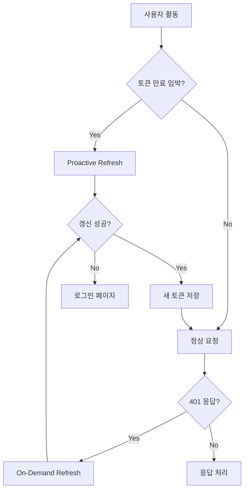
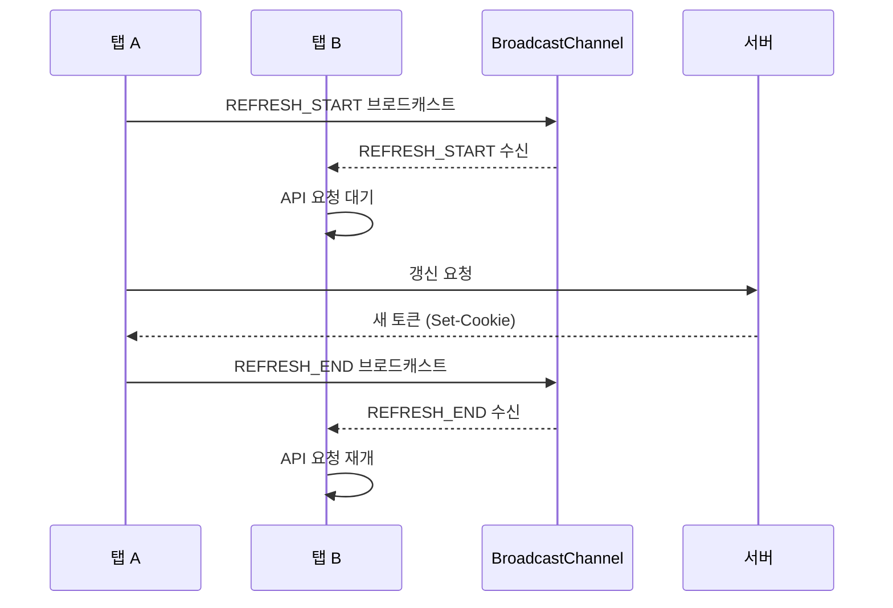

# 액세스 토큰 갱신 전략 분석

## 1. 현재 상황

### 1.1 현재 프로젝트 설정

| 항목 | 값 | 비고 |
|------|-----|------|
| accessToken 만료 시간 | 1800초 (30분) | 운영 설정 |
| accessToken 만료 시간 | 15초 | 테스트 설정 |
| refreshToken 만료 시간 | 604800초 (7일) | - |
| refreshToken 저장 위치 | DB (user_sessions 테이블) | - |
| accessToken 저장 위치 | HttpOnly 쿠키 | - |

### 1.2 현재 문제점

```
NOTE: refreshToken 쿠키 제거로 /refresh endpoint 제거
accessToken 만료 시 재로그인 필요
```

현재는 accessToken이 만료되면 사용자가 다시 로그인해야 합니다. 이는 사용자 경험을 저하시킵니다.

---

## 2. 실무에서 사용하는 토큰 갱신 전략

### 2.1 전략 비교

| 전략 | 설명 | 장점 | 단점 |
|------|------|------|------|
| **Sliding Session** | 사용자 활동 시마다 토큰 갱신 | 구현 간단, 자연스러운 UX | 빈번한 갱신 요청 |
| **Proactive Refresh** | 만료 전 미리 갱신 | 끊김 없는 UX | 타이머 관리 필요 |
| **Silent Refresh** | 백그라운드에서 주기적 갱신 | 사용자 개입 없음 | 리소스 소모 |
| **On-Demand Refresh** | API 호출 시 401 받으면 갱신 | 효율적 | 첫 요청 실패 |

### 2.2 실무 사례

#### Google OAuth 2.0
- **방식**: Proactive Refresh + Sliding Session
- **갱신 시점**: 만료 5분 전
- **특징**: 사용자가 활발히 활동할 때만 갱신

#### AWS Cognito
- **방식**: Silent Refresh
- **갱신 시점**: 만료 1시간 전 (기본 1시간 토큰)
- **특징**: 백그라운드에서 자동 갱신

#### Auth0
- **방식**: On-Demand Refresh
- **갱신 시점**: 401 응답 시
- **특징**: refreshToken을 사용하여 즉시 갱신

#### Firebase Auth
- **방식**: Proactive Refresh
- **갱신 시점**: 만료 5분 전
- **특징**: 자동 갱신, 사용자 투명

---

## 3. 권장 전략

### 3.1 하이브리드 방식 (Proactive + On-Demand)



### 3.2 구현 방식

#### 방식 1: Proactive Refresh (권장)

**갱신 시점 계산:**
```
갱신 시점 = 만료 시간 - (만료 시간 * 0.2)
예: 1800초 → 1800 - 360 = 1440초 (24분) 경과 시 갱신
예: 15초 → 15 - 3 = 12초 경과 시 갱신
```

**장점:**
- 사용자가 요청할 때 이미 유효한 토큰 보유
- 끊김 없는 사용자 경험
- 만료 시간이 짧아도 안전

**구현 위치:**
- 프론트엔드: `axiosConfig.ts` 인터셉터
- 백엔드: `/api/auth/refresh` 엔드포인트

#### 방식 2: Activity-Based Refresh

**갱신 트리거:**
- 페이지 이동
- API 호출
- 사용자 클릭/스크롤

**장점:**
- 활발한 사용자만 갱신
- 유휴 상태에서는 갱신 안 함

**단점:**
- 구현 복잡도 증가
- 이벤트 리스너 관리 필요

---

## 4. 구현 계획 (상세)

### 4.1 백엔드 변경사항

#### 4.1.1 AuthController.java - Refresh API 추가

**파일:** `server/src/main/java/com/example/demo/domain/auth/controller/AuthController.java`

```java
// 추가할 import
import org.springframework.web.bind.annotation.PostMapping;
import com.example.demo.domain.user.entity.Session;
import com.example.demo.domain.user.mapper.SessionMapper;

// 추가할 의존성
private final SessionMapper sessionMapper;

/**
 * 토큰 갱신 API
 * - httpOnly 쿠키에서 accessToken을 읽어 세션 ID 추출
 * - DB에서 세션 조회 후 새 accessToken 발급
 * - 응답: 새 accessToken이 설정된 쿠키
 */
@PostMapping("/refresh")
public ResponseEntity<?> refreshToken(HttpServletRequest request, HttpServletResponse response) {
    boolean isHttps = "https".equalsIgnoreCase(request.getScheme());
    
    // 1. 현재 accessToken 쿠키에서 토큰 추출
    String token = cookieUtil.extractTokenFromCookie(request, "accessToken");
    
    if (token == null) {
        log.debug("토큰 갱신 실패: 토큰이 쿠키에 없음");
        response.addHeader("Set-Cookie", cookieUtil.deleteCookie("accessToken", isHttps).toString());
        return ResponseEntity.status(401).body(Map.of("error", "No token"));
    }
    
    try {
        // 2. 토큰에서 sessionId 추출 (만료된 토큰에서도 추출 가능)
        Long sessionId = jwtTokenProvider.getSessionIdFromExpiredToken(token);
        String userId = jwtTokenProvider.getAuthentication(token).getName();
        
        if (sessionId == null || userId == null) {
            log.debug("토큰 갱신 실패: sessionId 또는 userId 없음");
            response.addHeader("Set-Cookie", cookieUtil.deleteCookie("accessToken", isHttps).toString());
            return ResponseEntity.status(401).body(Map.of("error", "Invalid token"));
        }
        
        // 3. DB에서 세션 조회
        Session session = sessionMapper.findBySessionId(sessionId);
        if (session == null || !session.getUserId().equals(userId)) {
            log.debug("토큰 갱신 실패: 세션을 찾을 수 없음");
            response.addHeader("Set-Cookie", cookieUtil.deleteCookie("accessToken", isHttps).toString());
            return ResponseEntity.status(401).body(Map.of("error", "Session not found"));
        }
        
        // 4. 새 accessToken 생성
        String newAccessToken = jwtTokenProvider.createAccessToken(userId, sessionId);
        
        // 5. 새 쿠키 설정
        long maxAge = jwtProperties.getAccessTokenValidityInSeconds();
        ResponseCookie newCookie = cookieUtil.createTokenCookie("accessToken", newAccessToken, maxAge, isHttps);
        response.addHeader("Set-Cookie", newCookie.toString());
        
        // 6. 세션 마지막 접속 시간 업데이트
        sessionMapper.updateLastAccessedAt(sessionId);
        
        log.debug("토큰 갱신 성공: userId={}, sessionId={}", userId, sessionId);
        return ResponseEntity.ok(Map.of("success", true));
        
    } catch (Exception e) {
        log.error("토큰 갱신 중 오류: {}", e.getMessage());
        response.addHeader("Set-Cookie", cookieUtil.deleteCookie("accessToken", isHttps).toString());
        return ResponseEntity.status(401).body(Map.of("error", "Token refresh failed"));
    }
}
```

#### 4.1.2 SessionMapper.java - 메서드 추가

**파일:** `server/src/main/java/com/example/demo/domain/user/mapper/SessionMapper.java`

```java
// 마지막 접속 시간 업데이트
@Update("UPDATE user_sessions SET last_accessed_at = NOW() WHERE id = #{sessionId}")
void updateLastAccessedAt(Long sessionId);
```

#### 4.1.3 JwtTokenProvider.java - 메서드 추가

**파일:** `server/src/main/java/com/example/demo/global/security/JwtTokenProvider.java`

```java
// 토큰 만료 시간 반환
public Date getExpiration(String token) {
    return parseClaims(token).getExpiration();
}

// 토큰이 곧 만료되는지 확인 (임계값 초 단위)
public boolean isTokenExpiringSoon(String token, int thresholdSeconds) {
    try {
        Date expiration = getExpiration(token);
        long remaining = expiration.getTime() - System.currentTimeMillis();
        return remaining < (thresholdSeconds * 1000L);
    } catch (ExpiredJwtException e) {
        return true; // 이미 만료된 경우
    }
}
```

### 4.2 프론트엔드 변경사항

#### 4.2.1 authUtility.ts - 토큰 갱신 로직 추가

**파일:** `client/src/utils/authUtility.ts`

```typescript
// ============================================
// 토큰 갱신 관련 (BroadcastChannel 기반)
// ============================================

// BroadcastChannel 생성 (탭 간 통신)
const REFRESH_CHANNEL = new BroadcastChannel('token_refresh');

// 갱신 상태
let isRefreshing = false;
let refreshPromise: Promise<void> | null = null;

// 갱신 임계값 비율 (토큰 만료 시간의 20%)
const REFRESH_THRESHOLD_RATIO = 0.2;

// JWT 토큰에서 만료 시간 추출
const getTokenExpiration = (): number | null => {
    // HttpOnly 쿠키는 JavaScript에서 읽을 수 없음
    // 대신 /api/auth/check 응답에서 만료 시간을 받거나
    // 로그인 시 만료 시간을 저장해야 함
    // 간단한 방법: 로그인 시 localStorage에 만료 시간 저장
    const expiresAt = localStorage.getItem('token_expires_at');
    return expiresAt ? parseInt(expiresAt, 10) : null;
};

// 토큰이 곧 만료되는지 확인
export const isTokenExpiringSoon = (): boolean => {
    const expiresAt = getTokenExpiration();
    if (!expiresAt) return false;
    
    const now = Date.now();
    const remaining = expiresAt - now;
    
    // 만료 시간의 20% 이하가 남았으면 갱신 필요
    const tokenValidity = 1800 * 1000; // 30분 (설정에서 가져와야 함)
    const threshold = tokenValidity * REFRESH_THRESHOLD_RATIO;
    
    return remaining < threshold && remaining > 0;
};

// 갱신 시작 브로드캐스트
const broadcastRefreshStart = () => {
    REFRESH_CHANNEL.postMessage({ type: 'REFRESH_START' });
};

// 갱신 완료 브로드캐스트
const broadcastRefreshEnd = (success: boolean, expiresAt?: number) => {
    REFRESH_CHANNEL.postMessage({ type: 'REFRESH_END', success, expiresAt });
};

// 다른 탭에서 갱신 시작 감지
REFRESH_CHANNEL.onmessage = (event) => {
    if (event.data.type === 'REFRESH_START') {
        isRefreshing = true;
    } else if (event.data.type === 'REFRESH_END') {
        isRefreshing = false;
        if (event.data.success && event.data.expiresAt) {
            localStorage.setItem('token_expires_at', event.data.expiresAt.toString());
        }
    }
};

/**
 * 토큰 갱신 함수
 * - BroadcastChannel로 탭 간 동기화
 * - 갱신 중이면 대기
 */
export const refreshToken = async (): Promise<boolean> => {
    // 다른 탭에서 갱신 중이면 대기
    if (isRefreshing && refreshPromise) {
        await refreshPromise;
        return true;
    }
    
    // 이미 갱신 중이면 무시
    if (refreshPromise) {
        await refreshPromise;
        return true;
    }
    
    isRefreshing = true;
    broadcastRefreshStart();
    
    refreshPromise = (async () => {
        try {
            const response = await axios.post('/api/auth/refresh');
            
            if (response.data.success) {
                // 새 만료 시간 저장
                const newExpiresAt = Date.now() + (1800 * 1000); // 30분
                localStorage.setItem('token_expires_at', newExpiresAt.toString());
                broadcastRefreshEnd(true, newExpiresAt);
                return true;
            } else {
                broadcastRefreshEnd(false);
                return false;
            }
        } catch (error) {
            devError('토큰 갱신 실패:', error);
            broadcastRefreshEnd(false);
            return false;
        } finally {
            isRefreshing = false;
            refreshPromise = null;
        }
    })();
    
    return refreshPromise;
};

/**
 * 로그인 시 만료 시간 저장
 */
export const setTokenExpiration = (expiresInSeconds: number) => {
    const expiresAt = Date.now() + (expiresInSeconds * 1000);
    localStorage.setItem('token_expires_at', expiresAt.toString());
};

/**
 * 로그아웃 시 만료 시간 삭제
 */
export const clearTokenExpiration = () => {
    localStorage.removeItem('token_expires_at');
};
```

#### 4.2.2 axiosConfig.ts - 요청 인터셉터 수정

**파일:** `client/src/utils/axiosConfig.ts`

```typescript
import { refreshToken, isTokenExpiringSoon } from './authUtility';

// ============================================
// 요청 인터셉터 - Proactive Refresh
// ============================================

axiosInstance.interceptors.request.use(async (config) => {
    // Public 엔드포인트는 갱신 건너뜀
    if (isPublicEndpoint(config.url || '')) {
        return config;
    }
    
    // 로그아웃 중이면 요청 취소
    if (getIsLoggingOut()) {
        return Promise.reject(new Error('Logging out'));
    }
    
    // 토큰이 곧 만료되면 갱신
    if (isTokenExpiringSoon()) {
        const success = await refreshToken();
        if (!success) {
            // 갱신 실패 시 로그아웃 처리
            setIsLoggingOut(true);
            return Promise.reject(new Error('Token refresh failed'));
        }
    }
    
    return config;
}, (error) => {
    return Promise.reject(error);
});
```

#### 4.2.3 Login.tsx - 로그인 시 만료 시간 저장

**파일:** `client/src/pages/Login.tsx`

```typescript
import { setTokenExpiration } from '../utils/authUtility';

// 로그인 성공 후
const handleLoginSuccess = (response: LoginResponse) => {
    // 토큰 만료 시간 저장 (초 단위)
    setTokenExpiration(1800); // 30분
    // 또는 keepLogin이 true면 7일
    // setTokenExpiration(604800);
};
```

#### 4.2.4 AuthProvider.tsx - 로그아웃 시 만료 시간 삭제

**파일:** `client/src/contexts/AuthProvider.tsx`

```typescript
import { clearTokenExpiration } from '../utils/authUtility';

// logout 함수 내부
const logout = async (reason?: string, force: boolean = false) => {
    // ... 기존 로직 ...
    
    // 토큰 만료 시간 삭제
    clearTokenExpiration();
    
    // ... 나머지 로직 ...
};
```

---

## 5. 설정값 권장사항

### 5.1 운영 환경

| 설정 | 값 | 비고 |
|------|-----|------|
| accessToken 만료 | 1800초 (30분) | 현재 유지 |
| 갱신 임계값 | 300초 (5분) | 만료 5분 전 갱신 |
| 갱신 비율 | 0.17 (17%) | 1800 * 0.17 ≈ 300초 |

### 5.2 테스트 환경

| 설정 | 값 | 비고 |
|------|-----|------|
| accessToken 만료 | 15초 | 빠른 테스트 |
| 갱신 임계값 | 3초 | 만료 3초 전 갱신 |
| 갱신 비율 | 0.2 (20%) | 15 * 0.2 = 3초 |

---

## 6. 보안 고려사항

### 6.1 Refresh Token Rotation

```
[기존] refreshToken 고정 → 보안 위험
[개선] 갱신 시마다 새 refreshToken 발급
```

### 6.2 갱신 요청 제한

```
- 동시 갱신 요청 방지 (refreshPromise 패턴)
- 갱신 실패 시 로그인 페이지 이동
- 의심스러운 갱신 요청 감지
```

### 6.3 세션 무효화

```
- 강제 로그아웃 시 refreshToken 삭제
- 세션 만료 시 자동 정리
```

---

## 7. 구현 계획 (단계별)

### 7.1 1단계: Proactive Refresh (권장)

| 작업 | 위치 | 난이도 |
|------|------|--------|
| 백엔드 `/api/auth/refresh` API 추가 | AuthController.java | 중간 |
| 프론트엔드 요청 인터셉터 추가 | axiosConfig.ts | 중간 |

**특징:**
- HttpOnly 쿠키 방식이므로 멀티탭 문제 자연 해결
- 갱신 성공 시 서버가 Set-Cookie로 새 토큰 설정
- 모든 탭의 다음 요청부터 새 쿠키 자동 사용

### 7.2 2단계: On-Demand Refresh (선택사항)

| 작업 | 위치 | 난이도 |
|------|------|--------|
| 응답 인터셉터에 401 처리 추가 | axiosConfig.ts | 낮음 |

**추가 시점:** Proactive만으로 부족할 때 추가

### 7.3 보류 항목

| 항목 | 이유 |
|------|------|
| Refresh Token Rotation | 현재 미구현, 추가 시 복잡도 증가 |
| Activity-Based Refresh | 별도 전략, 필요 시 별도 검토 |

---

## 8. 멀티탭 레이스 컨디션 분석

### 8.1 문제 시나리오

```
1. 탭 A에서 갱신 요청 → 새 토큰 발급
2. 탭 B, C는 여전히 이전 토큰 보유
3. 탭 B, C에서 API 호출 → ???
```

### 8.2 HttpOnly 쿠키 방식의 장점

```
갱신 성공 → 서버가 Set-Cookie로 새 토큰 설정
         → 브라우저가 자동으로 쿠키 업데이트
         → 모든 탭의 다음 요청부터 새 쿠키 자동 사용
```

**결론:** HttpOnly 쿠키 방식에서는 별도 탭 동기화 불필요

### 8.3 refreshPromise 패턴의 역할

```typescript
let refreshPromise: Promise<string> | null = null;

// 같은 탭 내에서 동시 갱신 요청 방지
if (!refreshPromise) {
    refreshPromise = refreshToken().finally(() => {
        refreshPromise = null;
    });
}
await refreshPromise;
```

**역할:** 같은 탭 내에서 여러 API 호출 시 중복 갱신 요청 방지

### 8.4 모든 탭에서 API 요청 멈추는 방법

#### 방법 1: BroadcastChannel API (권장)

```typescript
// authUtility.ts
const REFRESH_CHANNEL = new BroadcastChannel('token_refresh');
let isRefreshing = false;
let refreshPromise: Promise<void> | null = null;

// 갱신 시작 브로드캐스트
function broadcastRefreshStart() {
    REFRESH_CHANNEL.postMessage({ type: 'REFRESH_START' });
}

// 갱신 완료 브로드캐스트
function broadcastRefreshEnd() {
    REFRESH_CHANNEL.postMessage({ type: 'REFRESH_END' });
}

// 다른 탭에서 갱신 시작 감지
REFRESH_CHANNEL.onmessage = (event) => {
    if (event.data.type === 'REFRESH_START') {
        isRefreshing = true;
    } else if (event.data.type === 'REFRESH_END') {
        isRefreshing = false;
    }
};

// 갱신 함수
async function refreshToken(): Promise<void> {
    if (isRefreshing) {
        // 다른 탭에서 갱신 중이면 대기
        await refreshPromise;
        return;
    }
    
    isRefreshing = true;
    broadcastRefreshStart();
    
    refreshPromise = (async () => {
        try {
            await axios.post('/api/auth/refresh');
        } finally {
            isRefreshing = false;
            broadcastRefreshEnd();
        }
    })();
    
    await refreshPromise;
}
```

#### 방법 2: localStorage 이벤트 (호환성 좋음)

```typescript
// authUtility.ts
const REFRESH_START_KEY = 'token_refresh_start';
const REFRESH_END_KEY = 'token_refresh_end';

// 갱신 시작 알림
function notifyRefreshStart() {
    localStorage.setItem(REFRESH_START_KEY, Date.now().toString());
}

// 갱신 완료 알림
function notifyRefreshEnd() {
    localStorage.setItem(REFRESH_END_KEY, Date.now().toString());
}

// 다른 탭의 갱신 감지
window.addEventListener('storage', (event) => {
    if (event.key === REFRESH_START_KEY) {
        isRefreshing = true;
    } else if (event.key === REFRESH_END_KEY) {
        isRefreshing = false;
    }
});
```

#### 방법 3: Axios 인터셉터에서 대기

```typescript
// axiosConfig.ts
let refreshPromise: Promise<void> | null = null;

axiosInstance.interceptors.request.use(async (config) => {
    // 갱신 중이면 대기
    if (refreshPromise) {
        await refreshPromise;
    }
    
    // 토큰 만료 임박 시 갱신
    if (isTokenExpiringSoon()) {
        if (!refreshPromise) {
            refreshPromise = refreshToken().finally(() => {
                refreshPromise = null;
            });
        }
        await refreshPromise;
    }
    
    return config;
});
```

### 8.5 권장 아키텍처



### 8.6 구현 난이도 비교

| 방법 | 난이도 | 호환성 | 특징 |
|------|--------|--------|------|
| BroadcastChannel | 낮음 | Chrome 54+, Firefox 38+, Safari 15.4+ | 가장 간단, 최신 브라우저 |
| localStorage 이벤트 | 중간 | 모든 브라우저 | 호환성 좋음, 다소 복잡 |
| SharedWorker | 높음 | Chrome, Firefox (Safari 제한) | 복잡하지만 강력 |

**권장:** BroadcastChannel API (모던 브라우저 타겟 시)

---

## 9. 결론

**권장 방식: Proactive Refresh 먼저 구현**

1. **Proactive Refresh**: 만료 5분 전(운영) / 3초 전(테스트)에 자동 갱신
2. **HttpOnly 쿠키**: 멀티탭 문제 자연 해결
3. **On-Demand**: 필요 시 나중에 추가 가능

**구현 범위:**
- 1단계: Proactive Refresh만 구현
- 2단계: 필요 시 On-Demand 추가
- 보류: Refresh Token Rotation, Activity-Based Refresh