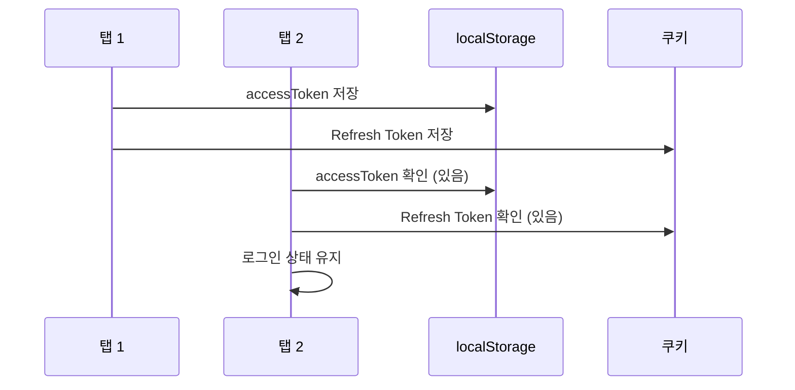
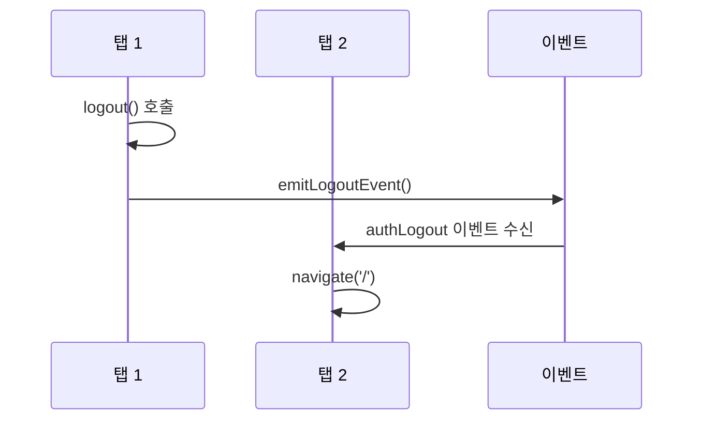
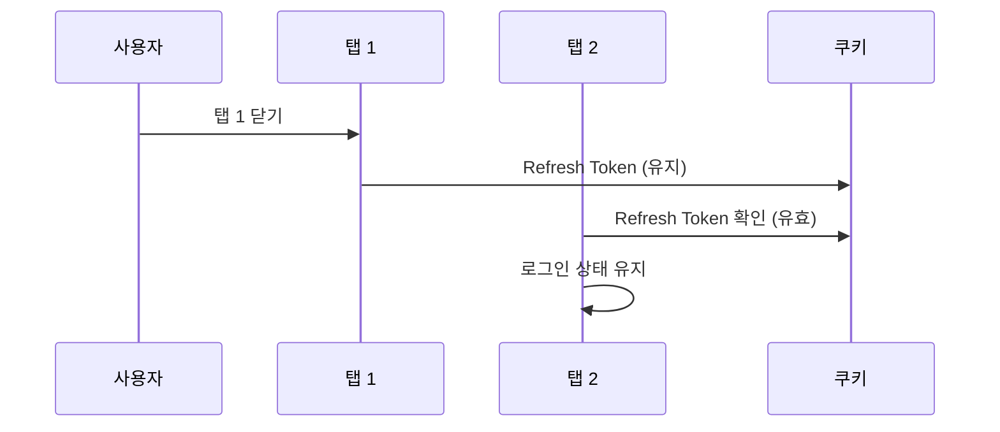

# 260206-1510 검증 보고서

## 📅 문서 정보

- **버전**: 1.0
- **작성일**: 2026-02-06 15:10
- **대상**: SpringTutorial 프로젝트 (Phase 1-3 완료 후)
- **목적**: 모듈화 전 최종 검증 및 개선 과제 도출

---

## 1. v4 계획서 완료 상태 점검

### 1.1 Phase 1: 긴급 수정 (모두 완료 ✅)

| # | 작업 내용 | 파일 | 상태 | 검증 |
|---|---------|------|------|------|
| 1 | 403 무한 루프 해결 | [`axiosConfig.ts`](src/utils/axiosConfig.ts) | 완료 | ✅ isRefreshing + 토큰 존재 확인 |
| 2 | 중심화된 logout 함수 | [`authUtility.ts`](src/utils/authUtility.ts) | 완료 | ✅ |
| 3 | isLoggingOut 플래그 | [`authUtility.ts`](src/utils/authUtility.ts) | 완료 | ✅ |
| 4 | emitLogoutEvent 추가 | [`authUtility.ts`](src/utils/authUtility.ts) | 완료 | ✅ |
| 5 | GlobalLogoutHandler | [`App.tsx`](src/App.tsx) | 완료 | ✅ navigate() 사용 |
| 6 | WebSocket authLogout 리스너 | [`WebSocketProvider.tsx`](src/contexts/WebSocketProvider.tsx) | 완료 | ✅ |
| 7 | Login.tsx forceReconnect | [`Login.tsx`](src/pages/Login.tsx) | 완료 | ✅ |
| 8 | pathname 체크 제거 | [`WebSocketProvider.tsx`](src/contexts/WebSocketProvider.tsx) | 완료 | ✅ |
| 9 | 백엔드 IllegalStateException | [`WebSocketHandler.java`](../server/src/main/java/com/example/demo/handler/WebSocketHandler.java) | 완료 | ✅ synchronized 블록 |
| 10 | ESLint 통과 | 전역 | 완료 | ✅ |
| 11 | navigate() 사용 확인 | [`authUtility.ts`](src/utils/authUtility.ts) | 완료 | ✅ |

### 1.2 Phase 2: 코드 개선 (모두 완료 ✅)

| # | 작업 내용 | 파일 | 상태 | 검증 |
|---|---------|------|------|------|
| 1 | 중복 shouldRefresh 함수 제거 | [`AuthProvider.tsx`](src/contexts/AuthProvider.tsx) | 완료 | ✅ import로 통합 |
| 2 | 임의의 타임아웃 상수화 | 다중 파일 | 완료 | ✅ 상수 정의됨 |
| 3 | auth/ 디렉토리 정리 | - | 완료 | ✅ 디렉토리 없음 |

### 1.3 Phase 3: 보안 강화 (모두 완료 ✅)

| # | 작업 내용 | 파일 | 상태 | 검증 |
|---|---------|------|------|------|
| 1 | Refresh Token Rotation | [`SessionService.java`](../server/src/main/java/com/example/demo/domain/user/service/SessionService.java) | 완료 | ✅ 새 Refresh Token 발급 |
| 2 | 쿠키 SameSite 통일 | [`UserController.java`](../server/src/main/java/com/example/demo/domain/user/controller/UserController.java) | 완료 | ✅ 동적 처리 |
| 3 | 재연결 로직 | [`WebSocketProvider.tsx`](src/contexts/WebSocketProvider.tsx) | 완료 | ⚠️ 최적화 필요 |

---

## 2. 토큰 만료 버퍼 혼합 문제

### 2.1 현재 상태

| 함수 | 테스트 모드 버퍼 | 운영 모드 버퍼 | 문제 |
|------|----------------|---------------|------|
| `shouldRefreshToken()` | 2초 (남은 시간 < 10초) | 5분 | ⚠️ 혼합 |
| `isTokenValid()` | 1초 (남은 시간 < 10초) | 5분 | ⚠️ 불일치 |

### 2.2 버퍼 동작 설명

```
테스트 모드 (10초 토큰):
├── shouldRefreshToken: 만료 2초 전부터 갱신 시도
└── isTokenValid: 만료 1초 전까지 유효

운영 모드 (30분 토큰):
├── shouldRefreshToken: 만료 5분 전부터 갱신 시도
└── isTokenValid: 만료 5분 전까지 유효
```

### 2.3 문제점

1. **버퍼 불일치**: `shouldRefreshToken`은 2초 버퍼, `isTokenValid`는 1초 버퍼
2. **혼란**: 어떤 버퍼를 써야 하는지 불명확

### 2.4 해결 방안

```typescript
// 옵션 A: 버퍼 통일 (권장)
// 테스트: 2초 버퍼, 운영: 5분 버퍼로 통일

const getTokenBuffer = (): number => {
  const expiresAt = getTokenExpiry();
  if (!expiresAt) return 0;
  
  const remaining = expiresAt - Date.now();
  // 테스트 모드(10초 토큰): 2초 버퍼, 그 외(30분 토큰): 5분 버퍼
  const isTestMode = remaining < 15000; // 15초 미만은 테스트 모드로 간주
  return isTestMode ? 2000 : 5 * 60 * 1000;
};

// shouldRefreshToken과 isTokenValid 모두 이 함수 사용
```

---

## 3. 아키텍처 분산 문제

### 3.1 현재 구조

```
authUtility.ts
├── 토큰 관리 (setToken, getTokenExpiry, setTokenExpiry)
├── 토큰 검증 (isTokenValid, shouldRefreshToken)
├── 토큰 갱신 (refreshToken, isRefreshing)
├── 로그아웃 (logout)
└── 이벤트 (emitLogoutEvent)

axiosConfig.ts
├── 요청 인터셉터 (토큰 자동 갱신)
└── 응답 인터셉터 (401/403 처리)

App.tsx
└── GlobalLogoutHandler (authLogout 이벤트 수신 → navigate)

AuthProvider.tsx
└── getAccessToken (authUtility 중복 호출)

WebSocketProvider.tsx
└── tokenChange, authLogout 이벤트 수신
```

### 3.2 문제점

| # | 분산 항목 | 현재 상태 | 권장 |
|---|---------|----------|------|
| 1 | getAccessToken 로직 | authUtility.ts + AuthProvider.tsx 분산 | authUtility 단일화 |
| 2 | Event 처리 | authUtility.ts + App.tsx 분산 | 중앙화 |
| 3 | axios interceptor | 독립적 실행 | authUtility와 통합 고려 |

### 3.3 해결 방안

```typescript
// authUtility.ts에 단일 getAccessToken 유지
export const getAccessToken = async (): Promise<string | null> => {
  const token = localStorage.getItem('accessToken');
  if (!token) return null;

  if (shouldRefreshToken()) {
    return await refreshToken();
  }
  
  return token;
};

// AuthProvider.tsx에서는 authUtility.getAccessToken 직접 사용
const getAccessToken = useCallback(async (): Promise<string | null> => {
  return authUtility.getAccessToken();
}, []);
```

---

## 4. 다중 탭 동작 검증

### 4.1 시나리오 분석

| # | 시나리오 | 현재 동작 | 예상 결과 | 상태 |
|---|---------|----------|----------|------|
| S1 | 탭1 로그인 → 탭2 열기 | 쿠키 + localStorage | 탭2도 로그인 상태 | ✅ 정상 |
| S2 | 탭1 로그아웃 → 탭2 | authLogout 이벤트 수신 | 탭2도 로그아웃 | ✅ 정상 |
| S3 | 탭1 닫기 → 탭2 유지 | 쿠키 유효 | 탭2 로그인 유지 | ✅ 정상 |
| S4 | 모든 탭 닫기 → 브라우저 재실행 | 쿠키 유효 | 자동 로그인 | ✅ 정상 |
| S5 | 브라우저 닫기 → 재실행 | 쿠키 유효 | 자동 로그인 | ✅ 정상 |

### 4.2 상세 검증

#### S1: 탭1 로그인 후 탭2 열기



**검증 결과**: ✅ 정상

#### S2: 탭1 로그아웃 시 탭2



**검증 결과**: ✅ 정상

#### S3: 탭1 닫아도 탭2 유지



**검증 결과**: ✅ 정상

### 4.3 현재 구현의 한계

| 한계점 | 현재 구현 | 권장 개선 |
|-------|----------|----------|
| 탭 간 상태 동기화 | authLogout 이벤트만 | storage 이벤트 리스너 추가 |
| 새 탭 열 때 | localStorage만 확인 | 쿠키도 함께 확인 |
| 토큰 갱신 동기화 | 각 탭 독립적 | BroadcastChannel 사용 |

### 4.4 권장 개선 (선택적)

```typescript
// storage 이벤트 리스너로 다른 탭의 localStorage 변경 감지
useEffect(() => {
  const handleStorage = (e: StorageEvent) => {
    if (e.key === 'accessToken' && !e.newValue) {
      // 다른 탭에서 로그아웃됨
      navigate('/', { replace: true });
    }
  };
  
  window.addEventListener('storage', handleStorage);
  return () => window.removeEventListener('storage', handleStorage);
}, [navigate]);
```

---

## 5. 발견된 파편화 문제

### 5.1 getAccessToken 분산

**현재**: authUtility.ts + AuthProvider.tsx

```typescript
// authUtility.ts
export const getAccessToken = async (): Promise<string | null> => {
  const token = localStorage.getItem('accessToken');
  if (!token) return null;
  
  if (shouldRefreshToken()) {
    return await refreshToken();
  }
  return token;
};

// AuthProvider.tsx (중복!)
const getAccessToken = useCallback(async (): Promise<string | null> => {
  const token = localStorage.getItem('accessToken');
  if (!token) return null;

  if (isRefreshing()) {
    return new Promise((resolve) => {
      addRefreshSubscriber((newToken) => {
        setAccessToken(newToken);
        resolve(newToken);
      });
    });
  }

  if (shouldRefreshToken()) {
    const newToken = await utilityRefreshToken();
    if (newToken) {
      setAccessToken(newToken);
      return newToken;
    }
    setAccessToken(null);
    return null;
  }
  
  return token;
}, []);
```

**해결**: AuthProvider.tsx에서 authUtility.getAccessToken 직접 사용

### 5.2 Event 처리 분산

**현재**: authUtility.ts (emit) + App.tsx (handle)

```typescript
// authUtility.ts
export const emitLogoutEvent = (): void => {
  window.dispatchEvent(new CustomEvent('authLogout'));
};

// App.tsx
const GlobalLogoutHandler = () => {
  useEffect(() => {
    const handleLogout = () => {
      navigate('/', { replace: true });
    };
    window.addEventListener('authLogout', handleLogout);
    return () => window.removeEventListener('authLogout', handleLogout);
  }, [navigate]);
  return null;
};
```

**해결**: Event 처리를 authUtility.ts 또는 별도 hook으로 중앙화

---

## 6. 권장 개선사항

### 6.1 상수 중앙 관리

```typescript
// constants/auth.ts
export const AUTH_CONSTANTS = {
  // 타임아웃
  RECONNECT_DELAY_TOKEN_REFRESH: 500,
  RECONNECT_DELAY_NORMAL: 3000,
  RECONNECT_DELAY_INITIAL: 200,
  RECONNECT_DELAY_FORCE: 100,
  NAVIGATE_DELAY_LOGIN: 100,
  
  // 버퍼 (테스트/운영 모드 자동 감지)
  BUFFER_TEST: 2000,  // 2초
  BUFFER_PROD: 300000, // 5분
  
  // 토큰 시간
  TOKEN_EXPIRY_TEST: 10,    // 10초
  TOKEN_EXPIRY_PROD: 1800,   // 30분
  
  // Refresh
  REFRESH_TOKEN_EXPIRY: 604800, // 7일
} as const;
```

### 6.2 WebSocket 재연결 최적화

**현재**: 고정 타임아웃

```typescript
const RECONNECT_DELAY_TOKEN_REFRESH = 500;
const RECONNECT_DELAY_NORMAL = 3000;
```

**권장**: 지수 백오프

```typescript
const getReconnectDelay = (attempt: number): number => {
  // 지수 백오프: 100ms, 200ms, 400ms, 800ms... 최대 3초
  const baseDelay = 100;
  const delay = Math.min(baseDelay * Math.pow(2, attempt), 3000);
  return delay + Math.random() * 100; // 랜덤 요소 추가
};
```

### 6.3 Auth 모듈화 (Phase 4에서 진행)

```
src/auth/
├── index.ts              # exports
├── types.ts              # 타입 정의
├── tokenManager.ts        # 토큰 관리 (authUtility에서 이동)
├── authContext.tsx        # AuthContext (contexts에서 이동)
└── events.ts              # 이벤트 중앙化管理
```

---

## 7. 할일 리스트

### P0: 즉시 수정 필요

| # | 작업 | 파일 | 예상 시간 | 검증 |
|---|-----|------|----------|------|
| 1 | 토큰 버퍼 통일 | [`authUtility.ts`](src/utils/authUtility.ts) | 10분 | ☐ |
| 2 | getAccessToken 중복 제거 | [`AuthProvider.tsx`](src/contexts/AuthProvider.tsx) | 5분 | ☐ |

### P1: 권장 개선

| # | 작업 | 파일 | 예상 시간 | 검증 |
|---|-----|------|----------|------|
| 3 | 상수 중앙 관리 | `src/constants/auth.ts` | 15분 | ☐ |
| 4 | WebSocket 재연결 최적화 | [`WebSocketProvider.tsx`](src/contexts/WebSocketProvider.tsx) | 20분 | ☐ |
| 5 | 다중 탭 storage 이벤트 | [`App.tsx`](src/App.tsx) | 10분 | ☐ |

### P2: 모듈화에서 진행

| # | 작업 | 파일 | 예상 시간 | 검증 |
|---|-----|------|----------|------|
| 6 | auth 모듈 분리 | `src/auth/` | 1시간 | ☐ |
| 7 | 이벤트 중앙화 | `src/auth/events.ts` | 30분 | ☐ |

---

## 8. 결론

### 8.1 현재 상태

| 영역 | 상태 | 비고 |
|------|------|------|
| Phase 1-3 완료 | ✅ | 모두 정상 동작 |
| 토큰 버퍼 | ⚠️ | 혼합 상태, 통일 필요 |
| getAccessToken | ⚠️ | 중복存在 |
| 다중 탭 | ✅ | 기본 동작 정상 |
| 아키텍처 | ⚠️ | 분산 상태 |

### 8.2 즉시 진행 사항

1. **토큰 버퍼 통일** (P0)
2. **getAccessToken 중복 제거** (P0)
3. **상수 중앙 관리** (P1)
4. **WebSocket 재연결 최적화** (P1)

### 8.3 다음 단계

사용자 확인 후 위 할일 리스트 순차 실행

---

**문서 버전**: 1.0
**작성일**: 2026-02-06 15:10
**작성자**: AI Assistant
