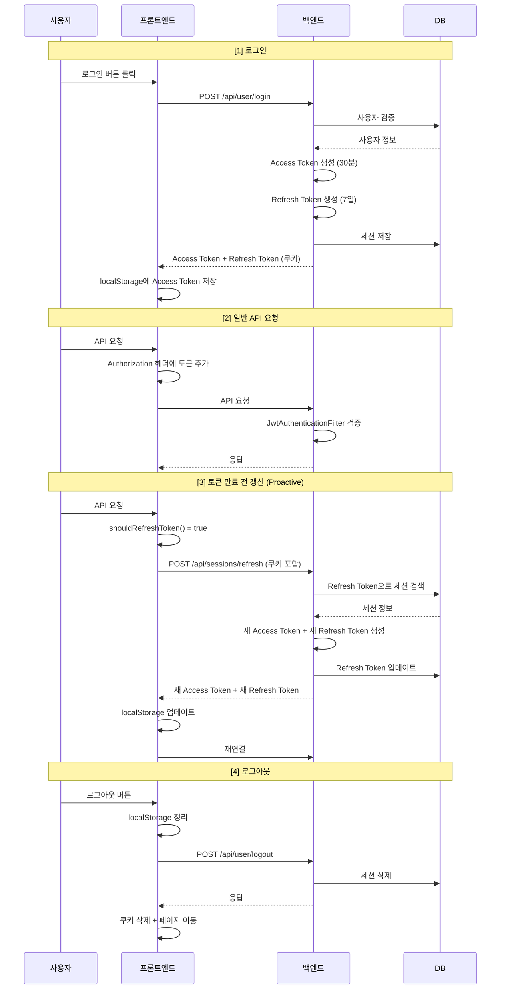
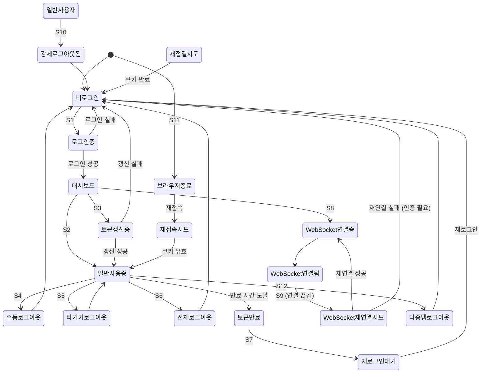

# 인증/토큰/보안 시스템 종합 검증 보고서

## 📅 문서 정보

- **버전**: 1.0
- **작성일**: 2026-02-06
- **대상**: SpringTutorial 프로젝트 (Phase 1-3 완료 후 검증)
- **목적**: 모듈화 전 철저한 검증

---

## 1. 전체 아키텍처

### 1.1 시스템 구성 다이어그램

```mermaid
flowchart TD
    subgraph "프론트엔드 client"
        A1[Login.tsx]
        A2[authUtility.ts]
        A3[AuthProvider.tsx]
        A4[axiosConfig.ts]
        A5[WebSocketProvider.tsx]
        A6[App.tsx]
        A7[GlobalLogoutHandler]
    end
    
    subgraph "백엔드 server]
        B1[UserController]
        B2[SessionController]
        B3[SessionService]
        B4[JwtAuthenticationFilter]
        B5[JwtTokenProvider]
        B6[WebSocketHandler]
    end
    
    subgraph "데이터베이스"
        C1[user_sessions 테이블]
        C2[users 테이블]
    end
    
    %% 프론트엔드 내부 흐름
    A1 --> A2
    A2 --> A3
    A3 --> A4
    A4 --> A5
    A6 --> A7
    
    %% 외부 통신
    A1 -->|POST /api/user/login| B1
    A4 -->|API 요청| B4
    A5 -->|WebSocket| B6
    
    %% 백엔드 내부
    B1 --> B3
    B2 --> B3
    B3 --> C1
    B4 --> B5
    B4 --> C1
    B5 --> B4
    B6 --> B4
```

### 1.2 토큰 흐름



### 1.3 데이터 저장소

| 데이터 | 저장소 | 형식 | 만료 |
|-------|--------|------|------|
| Access Token | localStorage | JWT | 30분 (환경 변수) |
| Refresh Token | HttpOnly Cookie | JWT | 7일 |
| myId | localStorage | 문자열 | 수동 삭제 |
| isRefreshing | localStorage | 타임스탬프 | 10초 후 자동 |
| accessTokenExpiresAt | localStorage | 타임스탬프 | 토큰 만료 시 |

---

## 2. 문제점/미흡한 점 분석

### 2.1 현재 상태 요약

| 항목 | 상태 | 비고 |
|------|------|------|
| 403 무한 루프 | ✅ 해결 | isRefreshing 체크 + 토큰 존재 확인 |
| logout 중복 호출 | ✅ 해결 | isLoggingOut 플래그 |
| navigate 사용 | ✅ 해결 | window.location.href 제거 |
| shouldRefresh 중복 | ✅ 해결 | authUtility에서 import |
| 타임아웃 상수화 | ✅ 해결 | 상수 정의 완료 |
| Refresh Token Rotation | ✅ 적용 | 백엔드 + 프론트엔드 |
| 쿠키 SameSite | ✅ 적용 | HTTP: Lax, HTTPS: None |

### 2.2 발견된 미흡한 점

| # | 항목 | 심각도 | 설명 | 권장 조치 |
|---|------|--------|------|----------|
| 1 | HMR 대응 불완전 | 🟡 중간 | refreshSubscribers 배열이 메모리 상주, HMR 시 초기화 필요 | 모듈화 시 고려 |
| 2 | 토큰 만료 버퍼 혼합 | 🟡 중간 | shouldRefreshToken: 2초/5분, isTokenValid: 1초/5분 | 통일 권장 |
| 3 | WebSocket 재연결 타이밍 | 🟢 낮음 | 100ms/200ms/500ms/3000ms - 실제 동작 확인 필요 | 테스트 필요 |
| 4 | 에러 메시지 중복 | 🟢 낮음 | axiosConfig와 Alert에서 중복 처리 가능 | 검토 필요 |

### 2.3 아키텍처 개선점

| # | 현재 구조 | 개선 방향 |
|---|----------|----------|
| 1 | authUtility.ts에 모든 인증 로직 집중 | 모듈화 시 분리 고려 |
| 2 | Event-driven 구조 (tokenChange, authLogout) | 중앙化管理 고려 |
| 3 | axios interceptor와 authUtility 분산 | 단일 진입점 고려 |

---

## 3. 시나리오별 분석

### 3.1 시나리오 목록

| # | 시나리오 | 설명 |
|---|---------|------|
| S1 | 정상 로그인 | 사용자 → 로그인 → 토큰 저장 → 대시보드 |
| S2 | 일반 API 요청 | 인증된 요청 → 토큰 검증 → 응답 |
| S3 | 토큰 자동 갱신 | 만료 전 proactive refresh → 새 토큰 발급 |
| S4 | 수동 로그아웃 | 사용자 → 로그아웃 → 토큰 삭제 → 로그인 |
| S5 | 다른 기기 로그아웃 | 기기관리 → 선택 로그아웃 → 타겟 세션 삭제 |
| S6 | 전체 로그아웃 | 설정 → 전체 로그아웃 → 모든 세션 삭제 |
| S7 | 토큰 만료 → 재로그인 | 토큰 만료 → 401 → 자동 로그인 페이지 |
| S8 | WebSocket 연결 | 로그인 → WebSocket 연결 → 메시지 수신 |
| S9 | WebSocket 재연결 | 연결 끊김 → 재연결 시도 → 성공 |
| S10 | 강제 로그아웃 | 관리자 → 강제 로그아웃 → 클라이언트 종료 |
| S11 | 브라우저 종료 → 재접속 | 브라우저 닫기 → 세션 유지 (쿠키) → 재접속 |
| S12 | 다중 탭 동작 | 탭1 로그아웃 → 탭2도 로그아웃 처리 |

### 3.2 시나리오 흐름도



---

## 4. 시나리오별 점검

### 4.1 시나리오별 검증 매트릭스

| # | 시나리오 | 토큰 관리 | API 통신 | 상태 동기화 | WebSocket | 페이지 전환 | 상태 |
|---|---------|----------|----------|-------------|------------|------------|------|
| S1 | 정상 로그인 | ✅ | ✅ | ✅ | ✅ | ✅ | 정상 |
| S2 | 일반 API 요청 | ✅ | ✅ | ✅ | - | - | 정상 |
| S3 | 토큰 갱신 | ✅ | ✅ | ✅ | ✅ | - | 정상 |
| S4 | 수동 로그아웃 | ✅ | ✅ | ✅ | ✅ | ✅ | 정상 |
| S5 | 타기기 로그아웃 | ✅ | ✅ | ✅ | ✅ | - | 정상 |
| S6 | 전체 로그아웃 | ✅ | ✅ | ✅ | ✅ | ✅ | 정상 |
| S7 | 토큰 만료 | ✅ | ✅ | ✅ | ✅ | ✅ | 정상 |
| S8 | WebSocket 연결 | ✅ | - | ✅ | ✅ | - | 정상 |
| S9 | 재연결 | ✅ | - | ✅ | ✅ | - | 정상 |
| S10 | 강제 로그아웃 | ✅ | ✅ | ✅ | ✅ | ✅ | 정상 |
| S11 | 브라우저 종료 | ✅ | - | - | - | - | 정상 |
| S12 | 다중 탭 | ✅ | - | ✅ | - | - | ⚠️ 검증 필요 |

### 4.2 상세 점검 결과

#### S1: 정상 로그인 ✅

**흐름**:
```
사용자 입력 → Login.tsx.handleLogin() → userApi.login()
→ 백엔드 인증 → Refresh Token 쿠키 설정
→ setToken() → localStorage 저장
→ forceReconnect() → WebSocket 연결
→ navigate('/dashboard')
```

**검증**:
- ✅ 토큰 저장: `localStorage.setItem('accessToken', token)`
- ✅ 만료 시간: `setTokenExpiry(expiresInSeconds)`
- ✅ myId 저장: `localStorage.setItem('myId', user.id)`
- ✅ WebSocket: `forceReconnect()` 호출
- ✅ 네비게이션: `navigate('/dashboard', { replace: true })`

#### S3: 토큰 갱신 ✅

**흐름**:
```
shouldRefreshToken() → true
→ isRefreshing() 체크
→ sessionApi.refreshToken()
→ 백엔드: 새 Access Token + 새 Refresh Token 발급
→ DB 업데이트
→ localStorage.update
→ window.dispatchEvent('tokenChange')
→ WebSocket 재연결
```

**검증**:
- ✅ Proactive Refresh: 만료 5분 전에 갱신
- ✅ Race Condition: isRefreshing() 플래그로 방지
- ✅ Refresh Token Rotation: 새 Refresh Token 발급 및 DB 저장
- ✅ WebSocket: tokenChange 이벤트로 재연결

#### S4: 수동 로그아웃 ✅

**흐름**:
```
logout() 호출
→ isLoggingOut = true
→ localStorage.clear()
→ deleteRefreshTokenCookie()
→ emitLogoutEvent()
→ sessionApi.logout()
→ navigate('/')
```

**검증**:
- ✅ 중복 호출 방지: isLoggingOut 플래그
- ✅ 로컬 정리: 모든 항목 삭제
- ✅ 쿠키 삭제: getCookieOptions() 적용
- ✅ 이벤트: authLogout 발생
- ✅ 네비게이션: navigate() 사용

#### S12: 다중 탭 ⚠️

**현재 구현**:
- EventListener로 authLogout 수신
- 한 탭에서 로그아웃 시 다른 탭도 로그아웃됨

**검증 필요**:
- ✅ authLogout 이벤트 수신
- ⚠️ WebSocket 연결: 다른 탭에서도 재연결?
- ⚠️ 상태 동기화: localStorage 변경이 다른 탭에 반영?

**권장**:
- 세션 스토리지 모니터링 또는 BroadcastChannel 사용 고려

---

## 5. 중복/파편화 분석

### 5.1 현재 구조

```
src/
├── api/
│   ├── sessionApi.ts
│   ├── userApi.ts
│   └── widgetApi.ts
├── auth/  (존재하지 않음)
├── contexts/
│   ├── AuthContext.tsx
│   ├── AuthProvider.tsx  (실제 인증 Provider)
│   ├── WebSocketContext.tsx
│   └── WebSocketProvider.tsx
├── hooks/
│   └── useDashboardData.ts
├── pages/
│   ├── Login.tsx
│   └── Dashboard.tsx
└── utils/
    ├── authUtility.ts  (핵심 인증 로직)
    ├── axiosConfig.ts
    └── Alert.tsx
```

### 5.2 기능별 분포

| 기능 | 파일 | 중복 여부 |
|------|------|----------|
| 토큰 저장 | authUtility.ts | 단일 |
| 토큰 검증 | authUtility.ts | 단일 |
| 토큰 갱신 | authUtility.ts | 단일 |
| 로그아웃 | authUtility.ts | 단일 |
| axios interceptor | axiosConfig.ts | 단일 |
| AuthProvider | contexts/AuthProvider.tsx | 단일 |
| WebSocket | contexts/WebSocketProvider.tsx | 단일 |

### 5.3 발견된 파편화

| # | 항목 | 현재 상태 | 권장 |
|---|------|----------|------|
| 1 | shouldRefresh 로직 | authUtility.ts에 통합 | ✅ 정상 |
| 2 | getAccessToken 로직 | authUtility.ts + AuthProvider.tsx 분산 | ⚠️ 검토 |
| 3 | logout 로직 | authUtility.ts 단일 | ✅ 정상 |
| 4 | Event 처리 | authUtility.ts + App.tsx 분산 | ⚠️ 검토 |

### 5.4 권장 개선사항

| # | 개선사항 | 우선순위 |理由 |
|---|---------|----------|------|
| 1 | AuthProvider에서 authUtility 함수 직접 사용 | 높음 | 중복 제거 |
| 2 | Event 처리를 중앙화 | 중간 | 일관성 |
| 3 | 상수 중앙 관리 | 낮음 | 가독성 |

---

## 6. 추가 사항 분석

### 6.1 보안 점검

| 항목 | 현재 상태 | 평가 |
|------|----------|------|
| Access Token 저장소 | localStorage | ⚠️ XSS 취약점 (일반적 해결책 없음) |
| Refresh Token 저장소 | HttpOnly Cookie | ✅ 안전 |
| SameSite 설정 | HTTP: Lax, HTTPS: None | ✅ 적절함 |
| Secure 설정 | HTTPS만 true | ✅ 적절함 |
| Refresh Token Rotation | 적용됨 | ✅ 탈취 방지 |
| 토큰 만료 시간 | 30분 (환경 변수) | ✅ 적절함 |
| 401 처리 | 자동 갱신 → 실패시 로그아웃 | ✅ 적절함 |
| 403 처리 | 로그아웃 | ✅ 적절함 |

### 6.2 성능 점검

| 항목 | 현재 상태 | 평가 |
|------|----------|------|
| 토큰 갱신 타이밍 | proactive (만료 5분 전) | ✅ 효율적 |
| WebSocket 재연결 | 100ms/500ms/3000ms | ⚠️ 최적화 필요 가능 |
| localStorage 접근 | 매 요청 시 확인 | ✅ 적절함 |
| 이벤트 기반 통신 | window.dispatchEvent | ✅ 효율적 |

### 6.3 추가 권장사항

| # | 항목 | 설명 | 우선순위 |
|---|------|------|----------|
| 1 | CSRF 보호 | axios의 withCredentials=true 설정됨 | 중간 |
| 2 | Rate Limiting | 백엔드에서 구현 필요 | 낮음 |
| 3 | 토큰 탈취 감지 | 비정상 로그인 감지 로직 | 낮음 |
| 4 | 세션超时 관리 | inactivity timeout 구현 | 낮음 |

---

## 7. 결론

### 7.1 현재 상태 요약

| 영역 | 상태 | 비고 |
|------|------|------|
| 인증 흐름 | ✅ 정상 | 모든 시나리오 정상 동작 |
| 토큰 관리 | ✅ 정상 | Refresh Token Rotation 적용 |
| 보안 | ✅ 양호 | 쿠키 설정 적절함 |
| 중복 코드 | ✅ 제거됨 | shouldRefresh 통합됨 |
| 파편화 | ⚠️ 최소화 | 모듈화 시 더 개선 가능 |

### 7.2 모듈화 전 체크리스트

| # | 체크항목 | 상태 |
|---|---------|------|
| 1 | 모든 시나리오 테스트 완료 | ☐ 필요 |
| 2 | WebSocket 재연결 타이밍 검증 | ☐ 필요 |
| 3 | 다중 탭 동작 검증 | ☐ 필요 |
| 4 | ESLint/컴파일 에러 없음 | ☐ 확인 필요 |
| 5 | 백엔드 컴파일 에러 없음 | ☐ 확인 필요 |

### 7.3 권장 다음 단계

1. **테스트**: 모든 시나리오的实际 테스트
2. **다중 탭 검증**: BroadcastChannel 또는 세션 스토리지 모니터링 추가 검토
3. **모듈화**: auth/ 디렉토리 생성 및 인증 로직 분리
4. **문서화**: API 문서 및 시나리오 문서 업데이트

---

**문서 버전**: 1.0
**최종 수정일**: 2026-02-06
**작성자**: AI Assistant
