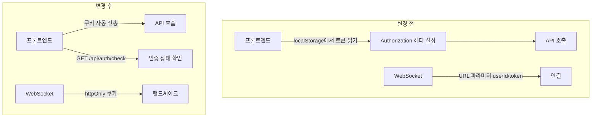

# localStorage 의존성 제거 및 httpOnly 쿠키 기반 인증 전환 계획

## 목표
- `localStorage.getItem('accessToken')` 완전 제거
- `myId`, `isAuthenticated` 등 localStorage 의존성 모두 제거
- httpOnly 쿠키 기반 인증으로 전면 전환
- WebSocket 인증도 쿠키 기반으로 변경

---

## 이전 실패 사례 분석

### 문제점 및 근본 원인

| 문제 | 근본 원인 | 대책 |
|------|-----------|------|
| **로그인 실패** | 쿠키 설정/전달 문제 | `withCredentials: true` 확인, SameSite 설정 |
| **로그아웃 실패** | 쿠키 삭제 미전달 | `maxAge=0` + 정확한 도메인/경로 |
| **새로고침 시 무한 토스트** | 여러 컴포넌트의 중복 인증 확인 | 단일 인증 확인 (Singleton) |
| **토큰 만료 후 무한 토스트** | 401 인터셉터의 중복 토스트 표시 | 토스트 한 번만, 플래그 사용 |
| **대시보드 플리커링** | ProtectedRoute와 인증 확인의 경쟁 조건 | 인증 완료 전 로딩 상태 유지 |

### 핵심 문제: 경쟁 조건 (Race Condition)

```mermaid
sequenceDiagram
    participant U as 사용자
    participant A as AuthProvider
    participant R as ProtectedRoute
    participant S as 서버
    
    U->>A: 페이지 새로고침
    A->>S: /api/auth/check
    R->>A: isAuthenticated?
    Note over R: 토큰 없음 → 로그인 이동
    A-->>S: 응답 대기중...
    R->>U: /login으로 리다이렉트
    S-->>A: 401 응답
    Note over A: 토스트 표시
    
    문제: 리다이렉트와 토스트가 동시에 발생
```

---

## 이전 실패 사례 분석

### 문제점 및 근본 원인

| 문제 | 근본 원인 | 대책 |
|------|-----------|------|
| **로그인 실패** | 쿠키 설정/전달 문제 | `withCredentials: true` 확인, SameSite 설정 |
| **로그아웃 실패** | 쿠키 삭제 미전달 | `maxAge=0` + 정확한 도메인/경로 |
| **새로고침 시 무한 토스트** | 여러 컴포넌트의 중복 인증 확인 | 단일 인증 확인 (Singleton) |
| **토큰 만료 후 무한 토스트** | 401 인터셉터의 중복 토스트 표시 | 토스트 한 번만, 플래그 사용 |
| **대시보드 플리커링** | ProtectedRoute와 인증 확인의 경쟁 조건 | 인증 완료 전 로딩 상태 유지 |

### 핵심 문제: 경쟁 조건 (Race Condition)

```mermaid
sequenceDiagram
    participant U as 사용자
    participant A as AuthProvider
    participant R as ProtectedRoute
    participant S as 서버
    
    U->>A: 페이지 새로고침
    A->>S: /api/auth/check
    R->>A: isAuthenticated?
    Note over R: 토큰 없음 → 로그인 이동
    A-->>S: 응답 대기중...
    R->>U: /login으로 리다이렉트
    S-->>A: 401 응답
    Note over A: 토스트 표시
    
    문제: 리다이렉트와 토스트가 동시에 발생
```

---

## 문제별 상세 대책

### 대책 1: 단일 인증 확인 (Singleton Pattern)

**문제**: 여러 컴포넌트가 동시에 `/api/auth/check`를 호출하여 중복 응답/토스트 발생

**해결**: 인증 확인을 한 번만 수행하고 결과를 공유

```typescript
// src/utils/authUtility.ts

// 인증 확인 상태 관리
let authCheckPromise: Promise<{ authenticated: boolean; user?: UserInfo }> | null = null;
let authCheckResult: { authenticated: boolean; user?: UserInfo } | null = null;

export const checkAuthStatus = async (): Promise<{ authenticated: boolean; user?: UserInfo }> => {
  // 이미 확인 완료했으면 캐시된 결과 반환
  if (authCheckResult !== null) {
    return authCheckResult;
  }
  
  // 이미 확인 중이면 해당 프라미스 반환
  if (authCheckPromise !== null) {
    return authCheckPromise;
  }
  
  // 최초 확인
  authCheckPromise = axios.get('/api/auth/check')
    .then(response => {
      authCheckResult = { authenticated: true, user: response.data.user };
      return authCheckResult;
    })
    .catch(error => {
      authCheckResult = { authenticated: false };
      return authCheckResult;
    })
    .finally(() => {
      authCheckPromise = null;
    });
  
  return authCheckPromise;
};

// 결과 리셋 (로그아웃 시 호출)
export const resetAuthCheck = () => {
  authCheckPromise = null;
  authCheckResult = null;
};
```

### 대책 2: 토스트 중복 방지

**문제**: 401 인터셉터가 여러 번 토스트를 표시

**해결**: 토스트 표시 여부를 플래그로 관리

```typescript
// src/utils/axiosConfig.ts

let isRedirecting = false;
let hasShown401Toast = false;

axios.interceptors.response.use(
  response => response,
  async error => {
    const originalRequest = error.config;
    
    // 로그아웃 요청은 무시
    if (originalRequest.url?.includes('/logout')) {
      return Promise.resolve({ data: 'ok' });
    }
    
    if (error.response?.status === 401 && !isRedirecting) {
      isRedirecting = true;
      
      // 토스트는 한 번만 표시
      if (!hasShown401Toast) {
        hasShown401Toast = true;
        showToast('세션이 만료되었습니다. 다시 로그인해주세요.', 'error');
      }
      
      // 리다이렉트
      window.location.href = '/';
      
      // 상태 리셋
      setTimeout(() => {
        isRedirecting = false;
        hasShown401Toast = false;
      }, 1000);
    }
    
    return Promise.reject(error);
  }
);
```

### 대책 3: ProtectedRoute에서 로딩 상태 처리

**문제**: 인증 확인 전에 리다이렉트되어 플리커링 발생

**해결**: 인증 확인이 완료될 때까지 로딩 화면 표시

```typescript
// src/App.tsx

function ProtectedRoute({ children }: { children: React.ReactNode }) {
  const [authState, setAuthState] = useState<{
    authenticated: boolean;
    loading: boolean;
  }>({ authenticated: false, loading: true });

  useEffect(() => {
    checkAuthStatus().then(result => {
      setAuthState({
        authenticated: result.authenticated,
        loading: false
      });
    });
  }, []);

  // 로딩 중에는 아무것도 표시하지 않음
  if (authState.loading) {
    return null; // 또는 로딩 스피너
  }

  // 인증되지 않았으면 로그인 페이지로
  if (!authState.authenticated) {
    return <Navigate to="/" replace />;
  }

  return <>{children}</>;
}
```

### 대책 4: AuthProvider에서 초기 인증 확인

**문제**: 마운트 시마다 인증 상태를 확인하지 않아 로그인 상태가 유지되지 않음

**해결**: 앱 시작 시 한 번만 인증 확인

```typescript
// src/contexts/AuthProvider.tsx

const [authState, setAuthState] = useState<{
  authenticated: boolean;
  user: UserInfo | null;
  loading: boolean;
}>({ authenticated: false, user: null, loading: true });

useEffect(() => {
  let mounted = true;
  
  checkAuthStatus().then(result => {
    if (mounted) {
      setAuthState({
        authenticated: result.authenticated,
        user: result.user || null,
        loading: false
      });
    }
  });

  return () => {
    mounted = false;
  };
}, []);
```

### 대책 5: 쿠키 설정 확인

**문제**: 쿠키가 제대로 설정되지 않아 인증이 유지되지 않음

**해결**: CORS 및 쿠키 설정 점검

```java
// SecurityConfig.java - 이미 설정됨 확인
.config.setAllowCredentials(true);  // ← 중요: 클라이언트 쿠키 허용

// CookieUtil.java - SameSite 설정 확인
.sameSite(isHttps ? "None" : "Lax")  // ← 개발 환경은 Lax
```

```typescript
// axiosConfig.ts - 이미 설정됨 확인
axios.defaults.withCredentials = true;  // ← 중요: 쿠키 포함 요청
```

---

## 현재 발견된 의존성

### localStorage.getItem (8곳)
| 파일 | 줄 | 용도 |
|------|-----|------|
| src/utils/axiosConfig.ts | 46 | Authorization 헤더 설정 |
| src/utils/authUtility.ts | 88 | 토큰 유효성 검사 |
| src/utils/authUtility.ts | 163 | 토큰 반환 |
| src/pages/Login.tsx | 21 | 로그인 상태 체크 |
| src/contexts/WebSocketProvider.tsx | 28 | 토큰 읽기 |
| src/contexts/AuthProvider.tsx | 18 | accessToken 상태 |
| src/App.tsx | 51 | ProtectedRoute |
| src/App.tsx | 60 | PublicRoute |

### localStorage.setItem (인증 관련 7곳)
| 파일 | 줄 | 저장 항목 |
|------|-----|----------|
| src/utils/authUtility.ts | 151 | accessToken |
| src/utils/authUtility.ts | 155 | isAuthenticated (true) |
| src/utils/authUtility.ts | 123 | isAuthenticated (false) |
| src/utils/authUtility.ts | 62 | tokenExpiry |
| src/pages/Login.tsx | 35 | myId |
| src/contexts/AuthProvider.tsx | 35 | myId |
| src/contexts/WebSocketProvider.tsx | 35 | myId |

> **참고:** Dashboard.tsx, UserLocationProvider.tsx의 localStorage 사용은 별도 영역이므로 유지

---

## 백엔드 현황 분석

### 현재 백엔드 상태 (문제점 포함)

| 파일 | 현재 구현 | 문제점/필수 변경 |
|------|-----------|-----------------|
| `UserController.java:63-68` | httpOnly 쿠키 설정 + 응답 바디에 accessToken 반환 | **중복**: 쿠키에 이미 설정됨, 응답 바디에서 제거 필요 |
| `JwtHandshakeInterceptor.java:57-90` | userId를 쿼리 파라미터/헤더에서 읽음 | **쿠키 읽기 미구현**: httpOnly 쿠키에서 토큰 읽기 추가 필요 |
| `CookieUtil.java` | httpOnly 쿠okie 생성 유틸리티 | 이미 구현됨 ✓ |
| `SecurityConfig.java` | Stateless JWT + CORS 설정 | 이미 구현됨 ✓ |

### 1.1 서버 측 변경사항

#### 변경 1: UserController.java - 응답 바디에서 accessToken 제거

**변경 전:**
```java
// Access Token을 HttpOnly 쿠키로 설정
ResponseCookie accessCookie = cookieUtil.createTokenCookie("accessToken", result.getAccessToken(), maxAge, isHttps);
response.addHeader("Set-Cookie", accessCookie.toString());

Map<String, Object> body = new HashMap<>();
body.put("accessToken", result.getAccessToken());  // ← 제거 필요
body.put("user", result.getUser());

return ResponseEntity.ok(body);
```

**변경 후:**
```java
// Access Token을 HttpOnly 쿠키로 설정
ResponseCookie accessCookie = cookieUtil.createTokenCookie("accessToken", result.getAccessToken(), maxAge, isHttps);
response.addHeader("Set-Cookie", accessCookie.toString());

// accessToken은 응답 바디에 포함하지 않음 (httpOnly 쿠키로 충분)
Map<String, Object> body = new HashMap<>();
body.put("user", result.getUser());

return ResponseEntity.ok(body);
```

#### 변경 2: JwtHandshakeInterceptor.java - 쿠키 기반 인증 추가

**변경 전:** (라인 57-90)
```java
private String resolveUserId(HttpServletRequest req) {
    // 1. 쿼리 파라미터에서 userId 직접 확인
    String userId = req.getParameter("userId");
    if (userId != null && !userId.isEmpty()) {
        return userId;
    }
    // 2. 토큰이 있으면 JWT에서 userId 추출 (헤더/쿼리)
    // ...
}
```

**변경 후:**
```java
private String resolveUserId(HttpServletRequest req) {
    // 1. httpOnly 쿠키에서 accessToken 읽기 (최우선)
    String token = getTokenFromCookie(req);
    if (token != null) {
        try {
            String extractedUserId = jwtTokenProvider.getUserIdFromExpiredToken(token);
            if (extractedUserId != null) {
                return extractedUserId;
            }
        } catch (Exception e) {
            log.debug("JWT 파싱 실패: {}", e.getMessage());
        }
    }
    
    // 2. 쿼리 파라미터에서 userId 직접 확인 (하위 호환성)
    String userId = req.getParameter("userId");
    if (userId != null && !userId.isEmpty()) {
        return userId;
    }
    
    return null;
}

private String getTokenFromCookie(HttpServletRequest req) {
    // httpOnly 쿠키에서 accessToken 읽기
    if (req.getCookies() != null) {
        for (Cookie cookie : req.getCookies()) {
            if ("accessToken".equals(cookie.getName())) {
                return cookie.getValue();
            }
        }
    }
    return null;
}
```

#### 변경 3: AuthController.java - 신규 API 추가 (생성 필요)

**새 파일:** `src/main/java/com/example/demo/domain/auth/controller/AuthController.java`

```java
@RestController
@RequestMapping("/api/auth")
@RequiredArgsConstructor
public class AuthController {

    private final JwtTokenProvider jwtTokenProvider;

    @GetMapping("/check")
    public ResponseEntity<?> checkAuthStatus(HttpServletRequest request) {
        // httpOnly 쿠키에서 토큰 읽기
        String token = extractTokenFromCookie(request);
        
        if (token == null || !jwtTokenProvider.validateToken(token)) {
            return ResponseEntity.status(401).body(Map.of("authenticated", false));
        }
        
        String userId = jwtTokenProvider.getAuthentication(token).getName();
        // 필요한 사용자 정보 조회 후 반환
        User user = userService.findById(userId);
        
        return ResponseEntity.ok(Map.of(
            "authenticated", true,
            "user", Map.of("id", user.getId(), "name", user.getName())
        ));
    }
    
    private String extractTokenFromCookie(HttpServletRequest request) {
        if (request.getCookies() != null) {
            for (Cookie cookie : request.getCookies()) {
                if ("accessToken".equals(cookie.getName())) {
                    return cookie.getValue();
                }
            }
        }
        return null;
    }
}
```

---

## Phase 1: 서버 측 변경

### 1.1 인증 상태 확인 API 추가

**새 API 엔드포인트:**
```http
GET /api/auth/check
```
- 쿠키의 세션으로 인증 상태 확인
- 응답: `{ authenticated: true, user: { id, name, ... } }` 또는 401

### 1.2 WebSocket 인증 변경

**변경 전:**
```java
// WebSocketHandler.java
// URL 파라미터 또는 핸드셰이크에서 userId/token 읽음
```

**변경 후:**
```java
// CookieHandshakeInterceptor 생성
// httpOnly 쿠키에서 JSESSIONID 또는 세션 ID 읽어서 인증
```

---

## Phase 2: 클라이언트 측 변경

### 2.1 제거할 파일/코드

| 파일 | 제거/변경할 코드 |
|------|-----------------|
| `src/App.tsx` | `localStorage.getItem('accessToken')` 체크 제거 |
| `src/utils/axiosConfig.ts` | Authorization 헤더 설정 제거, 401 인터셉터 추가 |
| `src/utils/authUtility.ts` | `getAccessToken()`, `isTokenValid()` 전체 재작성 |
| `src/pages/Login.tsx` | localStorage 체크 및 setToken 호출 제거 |
| `src/contexts/AuthProvider.tsx` | useState 초기값에서 localStorage 제거 |
| `src/contexts/WebSocketProvider.tsx` | 토큰/myId 읽기 제거 |

### 2.2 새로 추가할 코드

**`src/utils/authUtility.ts` - 새 인증 유틸리티:**
```typescript
// 인증 상태 확인 API 호출
export const checkAuthStatus = async (): Promise<{ authenticated: boolean; user?: UserInfo }> => {
  try {
    const { data } = await axios.get('/api/auth/check');
    return { authenticated: true, user: data.user };
  } catch (error) {
    return { authenticated: false };
  }
};

// 로그인 이벤트
export const emitLoginEvent = (): void => {
  window.dispatchEvent(new CustomEvent('authLogin'));
};

// 로그아웃 이벤트
export const emitLogoutEvent = (): void => {
  window.dispatchEvent(new CustomEvent('authLogout'));
};
```

**`src/utils/axiosConfig.ts` - 401 인터셉터:**
```typescript
// 401 응답 처리 - 로그인 페이지로 리다이렉트
axios.interceptors.response.use(
  response => response,
  error => {
    if (error.response?.status === 401) {
      window.location.href = '/';
    }
    return Promise.reject(error);
  }
);
```

### 2.3 AuthProvider 리팩토링

**변경 전:**
```typescript
const [accessToken, setAccessToken] = useState<string | null>(() => 
  localStorage.getItem('accessToken')
);
const [myId, setMyId] = useState<string | null>(() => 
  localStorage.getItem('myId')
);
```

**변경 후:**
```typescript
// 인증 상태를 서버에서 항상 가져옴
const [authState, setAuthState] = useState<{
  authenticated: boolean;
  user: UserInfo | null;
}>({ authenticated: false, user: null });

// 앱 마운트 시 인증 상태 확인
useEffect(() => {
  checkAuthStatus().then(setAuthState);
}, []);
```

---

## Phase 3: 테스트 및 검증

1. 로그인 → 쿠키 설정 확인
2. 페이지 새로고침 → 인증 상태 유지 확인
3. 로그아웃 → 쿠키 삭제 및 상태 초기화 확인
4. WebSocket 연결 → 쿠키 기반 인증 확인

---

## 아키텍처 변경 요약



---

## 작업 체크리스트

### 서버 측
- [ ] `UserController.java` - 응답 바디에서 `accessToken` 제거
- [ ] `JwtHandshakeInterceptor.java` - 쿠키에서 토큰 읽기 추가
- [ ] `AuthController.java` 생성 - `/api/auth/check` API 구현
- [ ] SecurityConfig.java - `/api/auth/check` 경로 permitAll 설정 확인

### 클라이언트 측
- [ ] `src/utils/authUtility.ts` - 단일 인증 확인 (Singleton) 구현
- [ ] `src/utils/authUtility.ts` - 토스트 중복 방지 플래그 추가
- [ ] `src/utils/axiosConfig.ts` - Authorization 헤더 설정 제거, 401 인터셉터 추가
- [ ] `src/App.tsx` - ProtectedRoute에 로딩 상태 처리 추가
- [ ] `src/pages/Login.tsx` - localStorage 체크 및 setToken 호출 제거
- [ ] `src/contexts/AuthProvider.tsx` - 서버 기반 인증 상태 관리로 재설계
- [ ] `src/contexts/WebSocketProvider.tsx` - URL 파라미터 토큰 제거
- [ ] `src/api/userApi.ts` - logout 호출 시 userId body 전달 유지

### 방어 코드 (대책)
- [ ] **토스트 중복 방지**: `hasShown401Toast` 플래그로 한 번만 표시
- [ ] **리다이렉트 중복 방지**: `isRedirecting` 플래그로 여러 번 리다이렉트 방지
- [ ] **인증 확인 캐싱**: `authCheckResult`로 중복 API 호출 방지
- [ ] **마운트 체크**: `mounted` 플래그로 언마운트 후 상태 업데이트 방지

---

## 다음 단계

이 계획에 동의하시면 **Code 모드**로 전환하여 구현을 진행하겠습니다.

### 구현 순서

1. **서버 측 먼저 구현**
   - `AuthController.java` 생성
   - `UserController.java` 수정
   - `JwtHandshakeInterceptor.java` 수정

2. **프론트엔드 인증 유틸리티 구현**
   - `authUtility.ts` - 단일 인증 확인 + 토스트 방지

3. **핵심 컴포넌트 수정**
   - `axiosConfig.ts` - 401 인터셉터
   - `AuthProvider.tsx` - 인증 상태 관리
   - `App.tsx` - ProtectedRoute 로딩 처리

4. **나머지 파일 수정**
   - `Login.tsx`, `WebSocketProvider.tsx` 등

5. **통합 테스트**
   - 로그인 → 쿠키 설정 확인
   - 새로고침 → 인증 상태 유지
   - 로그아웃 → 정상 동작
   - 토큰 만료 → 정상 처리


