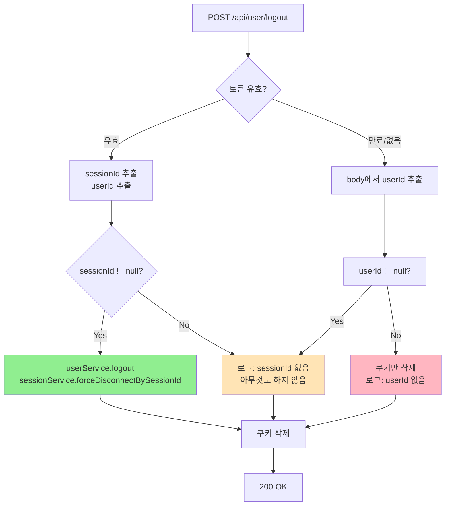

# UserController.logout 개선 설계 (v3)

## 1. 핵심 원칙

**UserController.logout은 "내 로그아웃"만 처리한다.**
- 다른 기기의 세션을 삭제/끊는 것은 이 곳에서 다루지 않는다.
- `forceDisconnectAll()` 호출 제거.

## 2. 현재 문제점

### 2.1 현재 코드

```java
if (sessionId != null) {
    userService.logout(userId, sessionId, userAgent, ipAddress);
    sessionService.forceDisconnectOne(userId, sessionId);
} else {
    // ❌ 문제: 전체 세션 삭제 및 WebSocket 모두 끊음
    userService.logoutAll(userId, userAgent, ipAddress);
    sessionService.forceDisconnectAll(userId);  // ❌ 이건 여기서 하면 안됨
}
```

### 2.2 문제점

| 호출 | 현재 동작 | 문제 |
|------|----------|------|
| 로그아웃 버튼 | 내 세션만 삭제 ✅ | 정상 |
| forceDisconnectAll | 모든 기기 WebSocket 끊음 | 다른 기기까지 끊김 |

**핵심**: `forceDisconnectAll()`은 "다른 기기 추방" 기능을 위해 존재.
- UserController.logout에서 호출하면 → **나의 다른 기기까지 모두 끊김**
- 이는 **의도된 동작이 아님**

## 3. 개선 설계

### 3.1 목표

1. **sessionId가 없으면 전체 로그아웃하지 않음**
   - `userService.logoutAll()` 호출 제거
   - 단순히 "sessionId 없음" 로그만 출력

2. **WebSocket은 UserController에서 다루지 않음**
   - `forceDisconnectAll()` 호출 제거
   - WebSocket 끊은 것은 다른 곳에서 처리 (또는 자연스럽게 끊김)

3. **세션 삭제 시 로그 추가**

### 3.2 개선된 UserController.logout

```java
@PostMapping("/logout")
public ResponseEntity<?> logout(@RequestBody(required = false) Map<String, String> body, 
                                  HttpServletRequest request, HttpServletResponse response) {
    String userId = null;
    Long sessionId = null;
    String token = jwtTokenProvider.resolveToken(request);
    
    // body에서 userId 우선 사용 (토큰 만료 시)
    if (body != null && body.containsKey("userId")) {
        userId = body.get("userId");
    }
    
    // 토큰이 유효하면 sessionId 추출
    if (token != null && jwtTokenProvider.validateToken(token)) {
        sessionId = jwtTokenProvider.getSessionId(token);
        if (userId == null) {
            userId = jwtTokenProvider.getAuthentication(token).getName();
        }
    }
    
    // ✅ userId가 있을 때만 처리
    if (userId != null) {
        String userAgent = request.getHeader("User-Agent");
        String ipAddress = request.getRemoteAddr();
        
        if (sessionId != null) {
            // ✅ 정상 로그아웃: 해당 세션만 삭제
            userService.logout(userId, sessionId, userAgent, ipAddress);
            
            // ⚠️ WebSocket은 여기서 끊지 않음
            // 브라우저가 페이지를 떠나면 WebSocket이 자연스럽게 끊김
            // 또는 frontend에서 WebSocket.close() 호출
            
            log.info("로그아웃: userId={}, sessionId={}", userId, sessionId);
        } else {
            // ⚠️ sessionId가 없는 경우 (토큰 없음/만료)
            // 전체 삭제하지 않음!
            
            log.warn("로그아웃 요청: sessionId 없음, userId={}", userId);
            // ⚠️ WebSocket은 여기서 끊지 않음
        }
    }
    
    // 쿠키 삭제
    boolean isHttps = "https".equalsIgnoreCase(request.getScheme());
    ResponseCookie accessCookie = cookieUtil.deleteCookie("accessToken", isHttps);
    response.addHeader("Set-Cookie", accessCookie.toString());

    return ResponseEntity.ok().body("로그아웃 되었습니다.");
}
```

### 3.3 시나리오별 동작

| 시나션 | sessionId | UserController 동작 | WebSocket |
|-------|-----------|-------------------|-----------|
| 정상 로그아웃 | ✅ | 해당 세션만 DB 삭제 | 자연스럽게 끊김 |
| 토큰 만료, 세션 존재 | ❌ | 로그만 출력 | ❌ 끊지 않음 |
| 토큰 만료, 세션 없음 | ❌ | 로그만 출력 | ❌ 끊지 않음 |

### 3.4 ⚠️ 남은 문제: WebSocket 끊김

**질문**: WebSocket을 어떻게 끊어야 할까요?

**옵션 1: Frontend에서 WebSocket.close() 호출**
- logout 함수에서 `socket.close()` 또는 `forceReconnect()` 호출
- 단점: 로그인 페이지로 이동하면 자연스럽게 끊김

**옵션 2: forceDisconnectOne만 호출**
- sessionId가 있을 때만 WebSocket 끊음
- sessionId가 없으면 끊지 않음
- 단점: 토큰 만료 시 WebSocket이 안 끊김

**옵션 3: 새로운 메서드 추가**
- `sessionService.forceDisconnectBySessionId(sessionId)`
- sessionId가 없으면 아무것도 하지 않음
- UserController에서 항상 호출

### 3.5 권장: 옵션 3

```java
@PostMapping("/logout")
public ResponseEntity<?> logout(@RequestBody(required = false) Map<String, String> body, 
                                  HttpServletRequest request, HttpServletResponse response) {
    String userId = null;
    Long sessionId = null;
    String token = jwtTokenProvider.resolveToken(request);
    
    if (body != null && body.containsKey("userId")) {
        userId = body.get("userId");
    }
    
    if (token != null && jwtTokenProvider.validateToken(token)) {
        sessionId = jwtTokenProvider.getSessionId(token);
        if (userId == null) {
            userId = jwtTokenProvider.getAuthentication(token).getName();
        }
    }
    
    if (userId != null) {
        String userAgent = request.getHeader("User-Agent");
        String ipAddress = request.getRemoteAddr();
        
        if (sessionId != null) {
            // 세션 삭제
            userService.logout(userId, sessionId, userAgent, ipAddress);
            
            // ✅ WebSocket 끊기 (sessionId 기반)
            sessionService.forceDisconnectBySessionId(sessionId);
            
            log.info("로그아웃: userId={}, sessionId={}", userId, sessionId);
        } else {
            // sessionId가 없으면 WebSocket을 알 수 없으므로 끊지 않음
            log.warn("로그아웃 요청: sessionId 없음, userId={}", userId);
        }
    }
    
    // 쿠키 삭제
    boolean isHttps = "https".equalsIgnoreCase(request.getScheme());
    ResponseCookie accessCookie = cookieUtil.deleteCookie("accessToken", isHttps);
    response.addHeader("Set-Cookie", accessCookie.toString());

    return ResponseEntity.ok().body("로그아웃 되었습니다.");
}
```

### 3.6 SessionService에 새로운 메서드 추가

```java
/**
 * 특정 sessionId로 WebSocket 강제 종료
 * (userId가 아닌 sessionId 기반으로 끊음)
 */
public void forceDisconnectBySessionId(Long sessionId) {
    // 현재 접속 중인 모든 세션에서 해당 sessionId 찾기
    for (Map.Entry<String, Set<WebSocketSession>> entry : webSocketSessionsMap.entrySet()) {
        String userId = entry.getKey();
        Set<WebSocketSession> sessions = entry.getValue();
        
        for (WebSocketSession session : sessions) {
            Long sId = (Long) session.getAttributes().get("sessionId");
            if (sId != null && sId.equals(sessionId)) {
                try {
                    log.info("WebSocket 강제 종료: userId={}, sessionId={}", userId, sessionId);
                    session.close(new CloseStatus(4001, "Logout"));
                } catch (Exception e) {
                    log.error("WebSocket 종료 중 에러", e);
                }
                return; // 하나 찾으면 종료
            }
        }
    }
    log.debug("WebSocket 세션 찾기 실패: sessionId={}", sessionId);
}
```

## 4. 세션 삭제 로그 추가

### 4.1 UserService.logout()

```java
public void logout(String userId, Long sessionId, String userAgent, String ipAddress) {
    // DB에서 세션 삭제
    sessionMapper.deleteBySessionId(sessionId);
    
    // ✅ 로그 추가
    log.info("세션 삭제됨: userId={}, sessionId={}, device={}, ip={}", 
             userId, sessionId, userAgent, ipAddress);
    
    // 로그 기록
    accessLogService.saveLog(userId, sessionId, 
                            SecurityConstants.TYPE_LOGOUT, null, null, ipAddress, userAgent);
}
```

### 4.2 SessionService.deleteSession() (기존)

```java
@Transactional
@CacheEvict(value = "online_users", allEntries = true)
public void deleteSession(Long targetSessionId, Long currentSessionId) {
    Session targetSession = sessionMapper.findBySessionId(targetSessionId);
    if (targetSession == null) {
        throw new CustomException(ErrorCode.SESSION_NOT_FOUND);
    }
    
    String currentUserId = sessionMapper.findBySessionId(currentSessionId).getUserId();
    if (!targetSession.getUserId().equals(currentUserId)) {
        throw new CustomException(ErrorCode.NOT_MY_DEVICE);
    }
    
    sessionMapper.deleteBySessionId(targetSessionId);
    
    // ✅ 로그 추가
    log.info("관리자 세션 삭제: admin={}, targetUserId={}, sessionId={}", 
             currentUserId, targetSession.getUserId(), targetSessionId);
    
    accessLogService.saveLog(currentUserId, currentSessionId, 
                            SecurityConstants.TYPE_KICK, null, null, null, null);
}
```

## 5. 플로우 다이어그램



## 6. 질문

WebSocket 끊김 처리는 어떻게 해야 할까요?

1. **sessionId가 있을 때만 끊음** (옵션 3)
   - 장점: 정확한 세션만 끊음
   - 단점: 토큰 만료 시 WebSocket이 안 끊김

2. **Frontend에서 WebSocket.close() 호출**
   - logout 함수에서 `forceReconnect()` 또는 직접 close
   - 장점: 토큰 만료해도 끊김
   - 단점: frontend 변경 필요

3. **기존대로 forceDisconnectOne 유지**
   - 장점: 기존 로직 활용
   - 단점: userId가 필요함

어떤 옵션을 선택하시겠습니까?