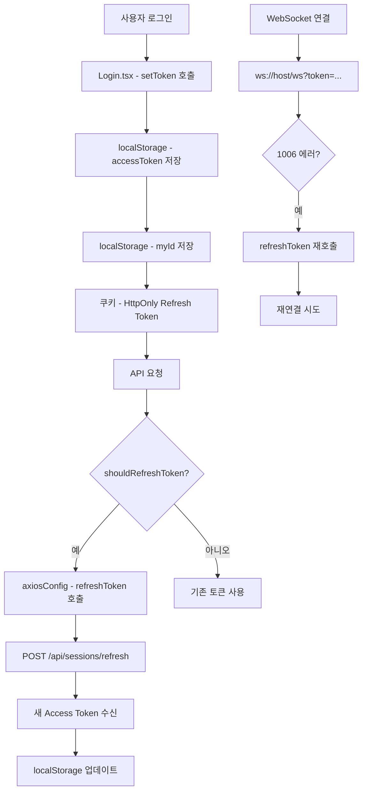
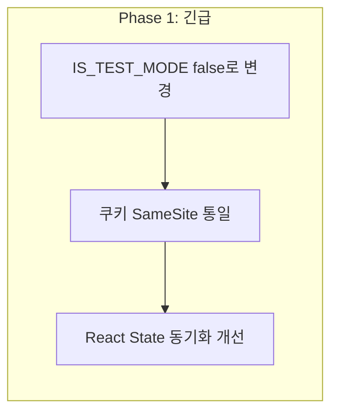

현재 프로젝트의 인증/보안 관련 코드를 분석했습니다. 발견된 문제점과 개선 계획을 상세히 정리하겠습니다.

## 🔍 현재 아키텍처 분석 결과

### 1. 현재 인증 흐름도



---

## ⚠️ 발견된 문제점

### 심각도: 🔴 높음

#### 1. **테스트 모드가 운영 환경에서 활성화됨**
```typescript
// src/utils/authUtility.ts:13
const IS_TEST_MODE = true; // 테스트 모드: true = 10초, false = 30분
```
- **문제**: 10초마다 토큰이 만료되어 실제 운영에서 심각한 문제 발생
- **영향**: 사용자 경험 저하, 불필요한 API 호출 증가

#### 2. **localStorage에 Access Token 저장 (XSS 취약점)**
```typescript
// src/utils/authUtility.ts:219
localStorage.setItem('accessToken', token);
```
- **문제**: XSS 공격 시 토큰 탈취 위험
- **대안**: HttpOnly 쿠키 사용 또는 메모리 저장 + Worker 활용

#### 3. **Refresh Token 쿠키 SameSite 불일치**
```typescript
// src/utils/authUtility.ts:161
document.cookie = 'refreshToken=; ... SameSite=Lax';
```
- **문제**: 쿠키 생성 시 `SameSite=None` 사용, 삭제 시 `SameSite=Lax` 사용 불일치

### 심각도: 🟡 중간

#### 4. **코드 중복 문제**

| 위치 | 중복 내용 |
|------|----------|
| [`authUtility.ts:78`](src/utils/authUtility.ts:78) | `shouldRefreshToken()` 함수 |
| [`AuthProvider.tsx:50`](src/contexts/AuthProvider.tsx:50) | 동일한 로직 중복 구현 |
| [`authUtility.ts:91`](src/utils/authUtility.ts:91) | `isTokenValid()` 함수 |
| [`AuthProvider.tsx:23`](src/contexts/AuthProvider.tsx:23) | `checkTokenValid()` 중복 |

#### 5. **인증 상태 동기화 문제**
```typescript
// AuthProvider.tsx:14-16
const [accessToken, setAccessToken] = useState<string | null>(() => {
  return localStorage.getItem('accessToken');
});
```
- **문제**: React State와 localStorage 간 불일치 가능성
- **영향**: AuthContext의 `isAuthenticated`가 실제 상태와 다를 수 있음

#### 6. **에러 처리 로직 파편화**

| 파일 | 에러 처리 내용 |
|------|---------------|
| [`axiosConfig.ts`](src/utils/axiosConfig.ts:69) | 401, 403, 404 처리 |
| [`WebSocketProvider.tsx`](src/contexts/WebSocketProvider.tsx:80) | 1006 에러 처리 |
| [`App.tsx`](src/App.tsx:21) | FORCE_LOGOUT 이벤트 처리 |

#### 7. **재연결 로직 미흡**
```typescript
// WebSocketProvider.tsx:109
reconnectTimerRef.current = window.setTimeout(() => {
  connectSocketRef.current?.();
}, 3000);
```
- **문제**: 재시도 횟수 제한 없음, 지수 백오프 미구현

### 심각도: 🟢 낮음 (개선 권장)

#### 8. **토큰 탈취 감지 미구현**
- 비정상적 위치/기기에서의 로그인 감지 로직 부재

#### 9. **Refresh Token Rotation 미구현**
- Refresh Token 사용 시마다 새로운 Refresh Token 발급 미실행

#### 10. **CSRF 보호 미구현**
- 앞서 논의한 CSRF 토큰 검증 로직 미구현

---

## 📋 개선 우선순위 및 계획

### Phase 1: 긴급 수정 (즉시 적용 필요)



| 순서 | 작업 내용 | 파일 |
|------|----------|------|
| 1 | `IS_TEST_MODE = false` 변경 | [`authUtility.ts:13`](src/utils/authUtility.ts:13) |
| 2 | 쿠키 SameSite 속성 통일 (`SameSite=None`) | [`authUtility.ts:161-163`](src/utils/authUtility.ts:161) |
| 3 | AuthProvider와 authUtility 간 로직 통합 | [`AuthProvider.tsx`](src/contexts/AuthProvider.tsx) |

### Phase 2: 보안 강화

| 순서 | 작업 내용 | 설명 |
|------|----------|------|
| 1 | Access Token을 HttpOnly 쿠키로 전환 | XSS 방지 |
| 2 | Refresh Token Rotation 구현 | 보안 향상 |
| 3 | CSRF 토큰 검증 추가 | 크로스사이트 요청 위조 방지 |

### Phase 3: 코드 리팩토링 및 모듈화

```mermaid
flowchart TD
    subgraph "현재 구조"
        A[authUtility.ts] --> B[authCore.ts]
        A --> C[axiosConfig.ts]
        A --> D[AuthProvider.tsx]
        A --> E[WebSocketProvider.tsx]
    end
    
    subgraph "모듈화 후 구조"
        F[@spring-core/auth-core] --> G[@spring-core/axios-interceptor]
        F --> H[@spring-core/react-auth]
        F --> I[@spring-core/websocket]
    end
```

---

## 🎯 모듈화된 인증 라이브러리 설계

### 권장 디렉토리 구조

```
src/
├── auth/                          # 새로운 인증 모듈 디렉토리
│   ├── core/                      # 핵심 인증 로직
│   │   ├── index.ts              # exports
│   │   ├── tokenManager.ts       # 토큰 관리 (CRUD)
│   │   ├── tokenRefresh.ts       # 토큰 갱신 로직
│   │   ├── tokenValidator.ts     # 토큰 검증
│   │   └── types.ts              # 타입 정의
│   │
│   ├── axios/                     # Axios 관련
│   │   ├── index.ts
│   │   ├── interceptor.ts        # 요청/응답 인터셉터
│   │   └── errorHandler.ts       # 에러 처리
│   │
│   ├── react/                    # React 관련
│   │   ├── index.ts
│   │   ├── AuthProvider.tsx      # Context Provider
│   │   ├── useAuth.ts            # useAuth hook
│   │   ├── useToken.ts           # useToken hook
│   │   └── ProtectedRoute.tsx    # Protected Route
│   │
│   └── websocket/                 # WebSocket 관련
│       ├── index.ts
│       ├── WebSocketProvider.tsx
│       └── reconnectManager.ts   # 재연결 관리
```

### 핵심 인터페이스 설계

```typescript
// auth/core/types.ts
export interface TokenManagerConfig {
  accessTokenKey: string;
  refreshTokenCookieName: string;
  expiresAtKey: string;
  accessTokenExpiresInSeconds: number;
  proactiveRefreshThresholdSeconds: number;
}

export interface AuthState {
  accessToken: string | null;
  refreshToken: string | null;
  expiresAt: number | null;
  isAuthenticated: boolean;
}

export interface TokenRefreshResult {
  success: boolean;
  newAccessToken?: string;
  error?: string;
}

// auth/core/tokenManager.ts
export class TokenManager {
  private config: TokenManagerConfig;
  
  constructor(config: TokenManagerConfig) {
    this.config = config;
  }
  
  // 단일 책임 원칙: 토큰 저장만 담당
  setAccessToken(token: string, expiresInSeconds: number): void {
    const expiresAt = Date.now() + (expiresInSeconds * 1000);
    localStorage.setItem(this.config.accessTokenKey, token);
    localStorage.setItem(this.config.expiresAtKey, expiresAt.toString());
  }
  
  getAccessToken(): string | null {
    return localStorage.getItem(this.config.accessTokenKey);
  }
  
  shouldRefresh(): boolean {
    const expiresAt = this.getExpiresAt();
    if (!expiresAt) return false;
    
    const threshold = this.config.proactiveRefreshThresholdSeconds * 1000;
    return Date.now() >= (expiresAt - threshold);
  }
}
```

---

## 📝 향후 작업 계획

### 즉시 적용할 것 (오늘)

1. **테스트 모드 비활성화**
   ```typescript
   // authUtility.ts
   const IS_TEST_MODE = false; // 운영 모드
   ```

2. **쿠키 SameSite 통일**
   ```typescript
   // 모든 쿠키 작업에 SameSite=None; secure 추가
   document.cookie = `refreshToken=; path=/; expires=Thu, 01 Jan 1970 00:00:00 GMT; SameSite=None; secure`;
   ```

### 1주 이내

3. **코드 중복 제거**
   - `shouldRefreshToken()` 로직을 authUtility로 통합
   - AuthProvider에서 authUtility 함수 재사용

4. **재연결 로직 개선**
   - 재시도 횟수 제한 (최대 5회)
   - 지수 백오프 적용

### 1개월 이내

5. **보안 강화**
   - Access Token HttpOnly 쿠키 전환 검토
   - Refresh Token Rotation 구현
   - CSRF 보호 추가

6. **모듈화**
   - auth 디렉토리 생성 및 코드 분리
   - npm 패키지화 준비

---

## ❓ 확인이 필요한 사항

1. **백엔드 쿠키 설정 확인**: `SameSite=None`과 `Secure` 속성이 백엔드에서도 동일하게 설정되어 있는지 확인이 필요합니다.

2. **Refresh Token Rotation 적용 여부**: 보안 강화를 위해 Refresh Token 사용 시마다 새로운 Refresh Token을 발급하는 로직을 백엔드에 적용해야 합니다.

3. **CSRF 보호 방식**: 앞서 논의한 대로 Double Submit Cookie 방식이나 기존 Spring Security CSRF 보호를 활용할지 결정이 필요합니다.

CRF(CSRF)와 관련해서, 현재 상태에서 **Double Submit Cookie** 방식을 추천드립니다. 이는:
- 구현이 단순함
- 기존 Spring Security CSRF와 호환 가능
- Refresh Token 쿠키에 추가 검증 적용 가능

이 분석 결과에 대해 확인하고 싶은 사항이나 추가 검토가 필요한 부분이 있으신가요?
