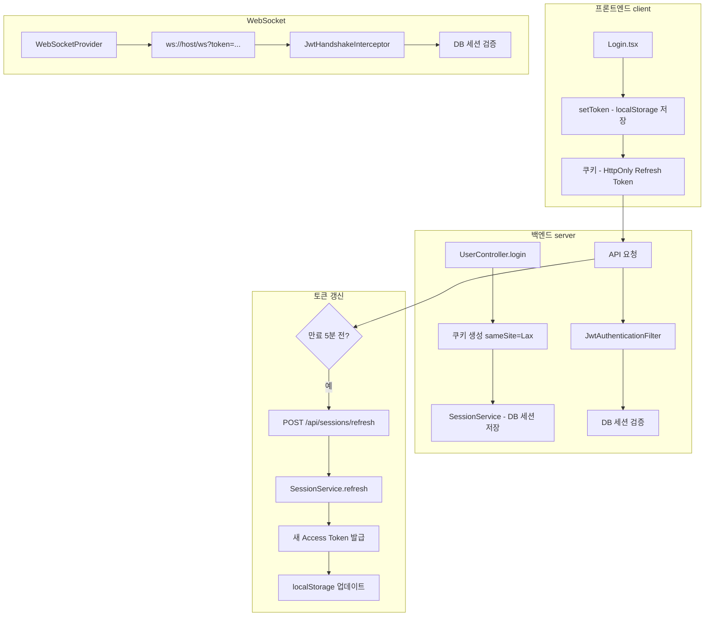

## 🔍 프론트엔드 + 백엔드 전체 분석 결과

### 현재 아키텍처 흐름



---

## ⚠️ 발견된 문제점 종합 (프론트엔드 + 백엔드)

### 🔴 심각도: 높음 - 즉시 수정 필요

| # | 문제 | 위치 | 영향 |
|---|------|------|------|
| 1 | **테스트 모드 활성화 (10초 토큰)** | [`application.yml:47`](../server/src/main/resources/application.yml:47), [`authUtility.ts:13`](src/utils/authUtility.ts:13) | 10초마다 로그아웃됨 |
| 2 | **쿠키 SameSite 불일치** | [`UserController.java:67`](../server/src/main/java/com/example/demo/domain/user/controller/UserController.java:67), [`authUtility.ts:161`](src/utils/authUtility.ts:161) | 크로스오리진 요청 시 쿠키 미전송 |
| 3 | **Refresh Token Rotation 미구현** | [`SessionController.java:36`](../server/src/main/java/com/example/demo/domain/user/controller/SessionController.java:36) | Refresh Token 탈취 시 무한 사용 가능 |

### 🟡 심각도: 중간 -尽快 수정 권장

| # | 문제 | 위치 | 영향 |
|---|------|------|------|
| 4 | **코드 중복** | [`authUtility.ts`](src/utils/authUtility.ts) vs [`AuthProvider.tsx`](src/contexts/AuthProvider.tsx) | 유지보수 어려움 |
| 5 | **Access Token localStorage 저장** | [`authUtility.ts:219`](src/utils/authUtility.ts:219) | XSS 취약점 |
| 6 | **재연결 로직 미흡** | [`WebSocketProvider.tsx:109`](src/contexts/WebSocketProvider.tsx:109) | 무한 재시도 가능 |
| 7 | **CSRF 보호 비활성화** | [`SecurityConfig.java:53`](../server/src/main/java/com/example/demo/global/config/SecurityConfig.java:53) | XSS 공격 시 토큰 탈취 위험 |

### 🟢 심각도: 낮음 - 개선 권장

| # | 문제 | 위치 | 영향 |
|---|------|------|------|
| 8 | **에러 처리 로직 파편화** | [`axiosConfig.ts`](src/utils/axiosConfig.ts), [`App.tsx`](src/App.tsx) | 일관성 부족 |
| 9 | **토큰 탈취 감지 미구현** | 전역 | 비정상 로그인 감지 불가 |
| 10 | **환경별 설정 분리 미흡** | [`authUtility.ts:13`](src/utils/authUtility.ts:13) | 개발/운영 전환 불편 |

---

## 📋 Phase 1: 긴급 수정 (오늘 진행)

### 1.1 테스트 모드 비활성화 + 환경 변수 분리

**현재:**
```typescript
// src/utils/authUtility.ts
const IS_TEST_MODE = true;
const TEST_TOKEN_EXPIRY = 10;
const PROD_TOKEN_EXPIRY = 1800;
```

**개선:**
```typescript
// src/utils/authUtility.ts
// 환경 변수에서 설정값을 가져오도록 변경
const getEnvConfig = () => {
  const isTest = import.meta.env.VITE_TEST_MODE === 'true';
  return {
    tokenExpiry: isTest ? 10 : 1800,  // 초 단위
    proactiveRefreshThreshold: isTest ? 2 : 300  // 만료 N초 전에 갱신
  };
};

// 백엔드도 동일하게 환경 변수 사용
// application.yml에서 직접 수정하거나 환경변수 사용
```

**백엔드 [`application.yml`](../server/src/main/resources/application.yml:47):**
```yaml
jwt:
  access-token-validity-in-seconds: ${JWT_ACCESS_TOKEN_EXPIRY:1800}  # 기본 30분
```

### 1.2 쿠키 SameSite 통일

**현재 불일치:**
| 위치 | SameSite |
|------|----------|
| [`UserController.java:67`](../server/src/main/java/com/example/demo/domain/user/controller/UserController.java:67) | `Lax` |
| [`SessionController.java:45`](../server/src/main/java/com/example/demo/domain/user/controller/SessionController.java:45) | `Lax` |
| [`authUtility.ts:161`](src/utils/authUtility.ts:161) | `Lax` |

**개선 (개발/운영 분리):**

```java
// 백엔드 - UserController.java, SessionController.java
// 개발 환경(Local): SameSite=Lax, Secure=false
// 운영 환경(HTTPS): SameSite=None, Secure=true

ResponseCookie cookie = ResponseCookie.from("refreshToken", token)
    .httpOnly(true)
    .path("/")
    .secure(isProduction())  // HTTPS 환경에서만 true
    .sameSite(isProduction() ? "None" : "Lax")
    .maxAge(maxAge)
    .build();
```

```typescript
// 프론트엔드 - authUtility.ts
const isProduction = () => window.location.protocol === 'https:';
const cookieOptions = isProduction() 
  ? 'SameSite=None; Secure'
  : 'SameSite=Lax';
```

---

## 📋 Phase 2: 보안 강화

### 2.1 Refresh Token Rotation 적용

**현재:** Access Token만 갱신
```java
// SessionService.java:86-90
String newAccessToken = jwtTokenProvider.createAccessToken(userId, session.getId());
return RefreshSessionRes.builder()
    .accessToken(newAccessToken)
    .build();
```

**개선:** 새 Refresh Token도 함께 발급
```java
// SessionService.java
@Transactional
public RefreshSessionRes refresh(String refreshToken) {
    // 1. 기존 검증 로직...
    
    // 2. 새 Refresh Token 생성
    String newRefreshToken = jwtTokenProvider.createRefreshToken(userId);
    
    // 3. DB 세션 업데이트 (새 Refresh Token 저장)
    sessionMapper.updateRefreshToken(session.getId(), newRefreshToken);
    
    // 4. 새 Access Token + 새 Refresh Token 반환
    String newAccessToken = jwtTokenProvider.createAccessToken(userId, session.getId());
    
    return RefreshSessionRes.builder()
        .accessToken(newAccessToken)
        .refreshToken(newRefreshToken)  // 새 Refresh Token 반환
        .build();
}
```

**프론트엔드同步:**
```typescript
// sessionApi.ts
refreshToken: async () => {
  const {data} = await axios.post<RefreshSessionResDTO>('/api/sessions/refresh');
  // 새 Refresh Token을 쿠키에 저장 (백엔드가 Set-Cookie로 처리)
  return data;
}

// authUtility.ts - 쿠키 업데이트 감지
export const getRefreshTokenFromCookie = (): string | null => {
  const matches = document.cookie.match(/refreshToken=([^;]*)/);
  return matches ? matches[1] : null;
};
```

### 2.2 Access Token 보안 강화 (선택적)

**옵션 A: HttpOnly 쿠키로 전환 (권장)**
```java
// 백엔드에서 Access Token도 쿠키로 반환
ResponseCookie accessCookie = ResponseCookie.from("accessToken", accessToken)
    .httpOnly(true)  // JS에서 접근 불가
    .path("/")
    .secure(true)
    .sameSite("None")
    .build();
```

**옵션 B: 메모리 저장 + Worker (고급)**
```typescript
// authUtility.ts
class TokenManager {
  private static worker: Worker | null = null;
  private static accessToken: string | null = null;
  
  static init() {
    // Web Worker에서 토큰 관리
    this.worker = new Worker('/token-worker.js');
  }
  
  static getToken() {
    return this.accessToken;  // Worker로부터 가져옴
  }
}
```

---

## 📋 Phase 3: 모듈화 설계

### 목표
- 프론트엔드/백엔드 인증 코드를 독립적인 모듈로 분리
- 다른 프로젝트에서 쉽게 이식 가능
- 설정만 변경하면 즉시 사용 가능

### 권장 디렉토리 구조

```
projects/
├── spring-core-auth/              # 백엔드 인증 모듈
│   ├── src/main/java/com/springcore/auth/
│   │   ├── config/
│   │   │   ├── SecurityConfig.java
│   │   │   ├── JwtProperties.java
│   │   │   └── CorsProperties.java
│   │   ├── filter/
│   │   │   └── JwtAuthenticationFilter.java
│   │   ├── provider/
│   │   │   └── JwtTokenProvider.java
│   │   ├── service/
│   │   │   └── SessionService.java
│   │   └── dto/
│   │       ├── LoginReq.java
│   │       └── RefreshSessionRes.java
│   └── src/main/resources/
│       └── application-auth.yml   # 인증 관련 설정 분리
│
└── react-auth-module/              # 프론트엔드 인증 모듈
    ├── src/
    │   ├── core/
    │   │   ├── index.ts
    │   │   ├── tokenManager.ts
    │   │   ├── tokenRefresh.ts
    │   │   └── types.ts
    │   ├── axios/
    │   │   ├── interceptor.ts
    │   │   └── errorHandler.ts
    │   ├── react/
    │   │   ├── AuthProvider.tsx
    │   │   ├── useAuth.ts
    │   │   └── ProtectedRoute.tsx
    │   └── websocket/
    │       ├── WebSocketProvider.tsx
    │       └── reconnectManager.ts
    └── package.json
```

### 핵심 인터페이스 설계

```typescript
// react-auth-module/src/core/types.ts
export interface AuthConfig {
  apiBaseUrl: string;
  wsUrl: string;
  tokenExpirySeconds: number;
  proactiveRefreshThresholdSeconds: number;
  cookieDomain?: string;
  enableDebugMode?: boolean;
}

export interface TokenManager {
  getAccessToken(): string | null;
  setAccessToken(token: string, expiresIn: number): void;
  clearTokens(): void;
  shouldRefresh(): boolean;
}

export interface AuthState {
  isAuthenticated: boolean;
  accessToken: string | null;
  userId: string | null;
}

// react-auth-module/src/core/tokenManager.ts
export class DefaultTokenManager implements TokenManager {
  private readonly config: AuthConfig;
  private readonly storage: Storage;
  
  constructor(config: AuthConfig, storage: Storage = localStorage) {
    this.config = config;
    this.storage = storage;
  }
  
  getAccessToken(): string | null {
    const token = this.storage.getItem('accessToken');
    const expiresAt = this.storage.getItem('accessTokenExpiresAt');
    
    if (!token || !expiresAt) return null;
    
    // 만료 확인
    if (Date.now() >= parseInt(expiresAt)) {
      this.storage.removeItem('accessToken');
      this.storage.removeItem('accessTokenExpiresAt');
      return null;
    }
    
    return token;
  }
  
  // ... 기타 메서드
}
```

```java
// spring-core-auth/src/main/java/com/springcore/auth/config/SecurityConfig.java
@Configuration
@EnableWebSecurity
public class SecurityConfig {
    
    @Bean
    public SecurityFilterChain filterChain(HttpSecurity http, 
                                           JwtTokenProvider jwtTokenProvider,
                                           SessionMapper sessionMapper) throws Exception {
        http
            .csrf(csrf -> csrf.disable())  // JWT 사용 시
            .cors(cors -> cors.configurationSource(corsConfigurationSource()))
            .sessionManagement(session -> 
                session.sessionCreationPolicy(SessionCreationPolicy.STATELESS))
            .authorizeHttpRequests(auth -> auth
                .requestMatchers("/api/auth/login", "/api/auth/refresh").permitAll()
                .anyRequest().authenticated()
            )
            .addFilterBefore(
                new JwtAuthenticationFilter(jwtTokenProvider, sessionMapper),
                UsernamePasswordAuthenticationFilter.class
            );
        
        return http.build();
    }
}
```

---

## 📋 실행 순서 (단계별)

### Step 1: 긴급 수정 (오늘)
- [ ] `IS_TEST_MODE` 환경 변수 분리
- [ ] `application.yml` 토큰 만료 시간 1800초로 변경
- [ ] 쿠키 SameSite 통일

### Step 2: 보안 강화 (내일)
- [ ] Refresh Token Rotation 구현 (백엔드)
- [ ] 프론트엔드 새 Refresh Token 동기화
- [ ] 재연결 로직 개선 (횟수 제한, 지수 백오프)

### Step 3: 코드 정리 (이주)
- [ ] 코드 중복 제거
- [ ] 에러 처리 로직 통합
- [ ] 테스트 코드 작성

### Step 4: 모듈화 (2주 후)
- [ ] auth 디렉토리 생성
- [ ] 핵심 로직 분리
- [ ] npm 패키지화 준비

---

## ❓ 확인 요청 사항

**Refresh Token Rotation 적용 방향:**

1. **적용:** Refresh Token 사용 시마다 새 Refresh Token 발급 (더 안전)
   - 장점: Refresh Token 탈취 시 즉시 사용 불가發現
   - 단점: 구현 복잡도 증가, 쿠키 관리 복잡
   
2. **미적용:** 현재 방식 유지
   - 장점: 구현 간단
   - 단점: Refresh Token 탈취 시 7일 동안 사용 가능

**권장:** **적용** - 보안이 더 중요합니다.

**CSRF 보호:**

현재 Bearer Token 방식을 사용하므로 기존 CSRF 공격은 효과적이지 않습니다. 나중에 Double Submit Cookie 방식을 추가하는 것이 좋겠습니다.

이 분석 결과를 어떻게 진행하시겠습니까?
