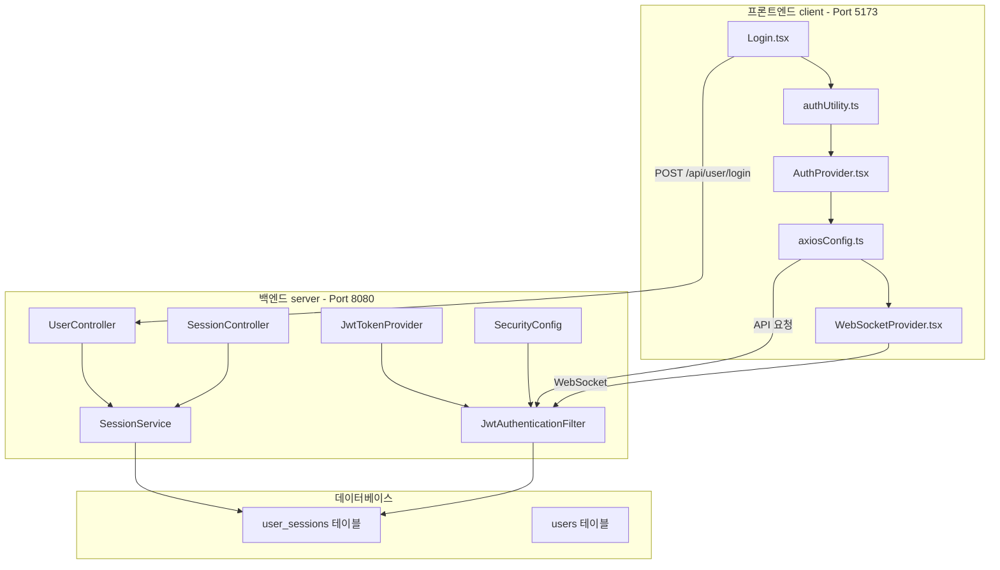
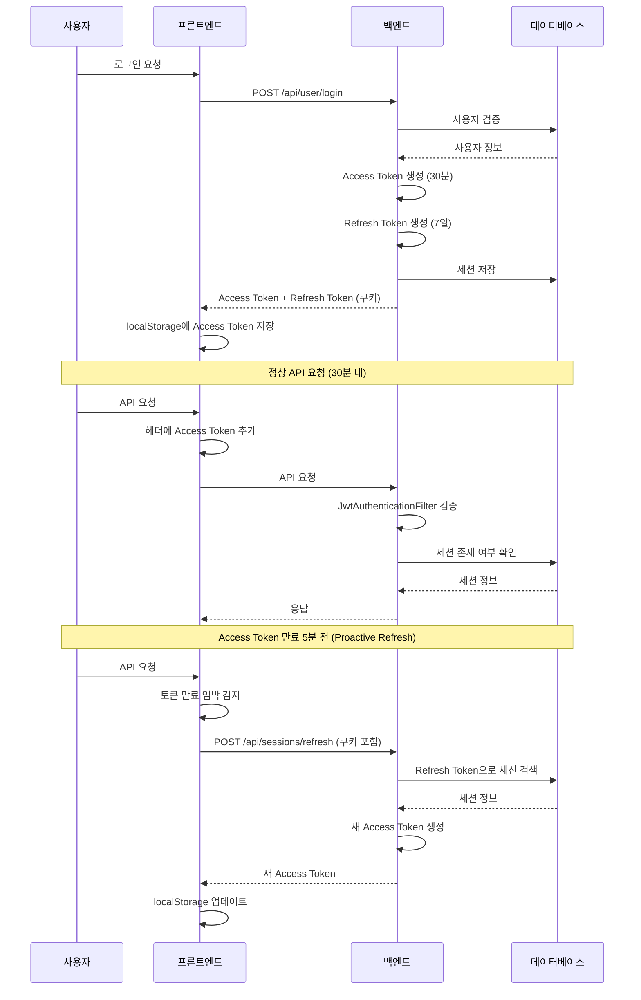

# 인증/토큰/보안 통합 분석 및 개선 계획

## 📅 문서 정보

- **버전**: 3.0
- **작성일**: 2026-02-05
- **최종 수정**: 2026-02-06
- **작성자**: AI Assistant
- **대상 프로젝트**: SpringTutorial (프론트엔드 + 백엔드)

---

## 🔍 1. 현재 아키텍처 개요

### 1.1 시스템 구성



### 1.2 토큰 구조

| 토큰 | 저장소 | 만료 시간 | 용도 |
|------|--------|----------|------|
| **Access Token** | localStorage | 30분 (1800초) | API 요청 인증 |
| **Refresh Token** | HttpOnly Cookie | 7일 (604800초) | Access Token 갱신 |

### 1.3 인증 흐름



---

## ⚠️ 2. 발견된 문제점 종합

### 🔴 심각도: 높음 - 즉시 수정 필요

| # | 문제 | 위치 | 영향 | 수정 우선순위 |
|---|------|------|------|---------------|
| 1 | **테스트 모드 활성화 (10초 토큰)** | [`application.yml:47`](../server/src/main/resources/application.yml:47), [`authUtility.ts:13`](src/utils/authUtility.ts:13) | 10초마다 로그아웃됨 | **P0** |
| 2 | **쿠키 SameSite 불일치** | [`UserController.java:67`](../server/src/main/java/com/example/demo/domain/user/controller/UserController.java:67), [`SessionController.java:45`](../server/src/main/java/com/example/demo/domain/user/controller/SessionController.java:45), [`authUtility.ts:161`](src/utils/authUtility.ts:161) | 크로스오리진 요청 시 쿠키 미전송 | **P0** |
| 3 | **Refresh Token Rotation 미구현** | [`SessionService.java:61`](../server/src/main/java/com/example/demo/domain/user/service/SessionService.java:61) | Refresh Token 탈취 시 무한 사용 가능 | **P0** |

### 🟡 심각도: 중간 -尽快 수정 권장

| # | 문제 | 위치 | 영향 | 수정 우선순위 |
|---|------|------|------|---------------|
| 4 | **코드 중복** | [`authUtility.ts`](src/utils/authUtility.ts) vs [`AuthProvider.tsx`](src/contexts/AuthProvider.tsx) | 유지보수 어려움 | P1 |
| 5 | **Access Token localStorage 저장** | [`authUtility.ts:219`](src/utils/authUtility.ts:219) | XSS 취약점 | P1 |
| 6 | **재연결 로직 미흡** | [`WebSocketProvider.tsx:109`](src/contexts/WebSocketProvider.tsx:109) | 무한 재시도 가능 | P1 |
| 7 | **CSRF 보호 비활성화** | [`SecurityConfig.java:53`](../server/src/main/java/com/example/demo/global/config/SecurityConfig.java:53) | XSS 공격 시 토큰 탈취 위험 | P2 (나중에) |
| 8 | **환경별 설정 분리 미흡** | [`auth`](src/utils/authUtility.ts:13Utility.ts:13) | 개발/운영 전환 불편 | P1 |

### 🟢 심각도: 낮음 - 개선 권장

| # | 문제 | 위치 | 영향 |
|---|------|------|------|
| 9 | **에러 처리 로직 파편화** | [`axiosConfig.ts`](src/utils/axiosConfig.ts), [`App.tsx`](src/App.tsx:21) | 일관성 부족 |
| 10 | **토큰 탈취 감지 미구현** | 전역 | 비정상 로그인 감지 불가 |
| 11 | **통합 테스트 부재** | 전域 | 회귀 버그 발생 가능 |

---

## 📋 3. Phase 1: 긴급 수정

### 3.1 테스트 모드 비활성화 + 환경 변수 분리

#### 목표
- 하드코딩된 테스트 모드를 환경 변수로 분리
- 개발/운영 전환을 쉽게 변경 가능하게 함

#### 수정 대상 파일

**[`src/utils/authUtility.ts`](src/utils/authUtility.ts)**

```typescript
// ========== BEFORE ==========
const IS_TEST_MODE = true; // 테스트 모드: true = 10초, false = 30분
const TEST_TOKEN_EXPIRY = 10; // 테스트용 토큰 만료 시간 (초)
const PROD_TOKEN_EXPIRY = 1800; // 운영용 토큰 만료 시간 (초) = 30분

export const getTokenExpirySeconds = (): number => {
  return IS_TEST_MODE ? TEST_TOKEN_EXPIRY : PROD_TOKEN_EXPIRY;
};

// ========== AFTER ==========

// 환경 변수에서 설정값을 가져오도록 변경
// 사용법: .env 파일에 VITE_TOKEN_EXPIRY_SECONDS=1800 설정
const getEnvConfig = (): { tokenExpiry: number; proactiveRefreshThreshold: number } => {
  // 환경 변수에서 토큰 만료 시간 가져오기 (기본값: 30분)
  const envExpiry = import.meta.env.VITE_TOKEN_EXPIRY_SECONDS;
  const tokenExpiry = envExpiry ? parseInt(envExpiry, 10) : 1800;
  
  // 환경 변수에서 Proactive Refresh 임계값 가져오기 (기본값: 5분)
  const envThreshold = import.meta.env.VITE_REFRESH_THRESHOLD_SECONDS;
  const proactiveRefreshThreshold = envThreshold ? parseInt(envThreshold, 10) : 300;
  
  return { tokenExpiry, proactiveRefreshThreshold };
};

export const getTokenExpirySeconds = (): number => {
  return getEnvConfig().tokenExpiry;
};

export const getProactiveRefreshThreshold = (): number => {
  return getEnvConfig().proactiveRefreshThreshold;
};
```

**[`server/src/main/resources/application.yml`](../server/src/main/resources/application.yml)**

```yaml
# ========== BEFORE ==========
jwt:
  secret: "MySuperSecretKeyForSpringTutorialProject2026!!KeepItSafe"
  access-token-validity-in-seconds: 10  # ⚠️ 테스트용 10초
  refresh-token-validity-in-seconds: 604800

# ========== AFTER ==========
jwt:
  secret: "${JWT_SECRET:MySuperSecretKeyForSpringTutorialProject2026!!KeepItSafe}"
  access-token-validity-in-seconds: "${JWT_ACCESS_TOKEN_EXPIRY:1800}"  # 기본 30분
  refresh-token-validity-in-seconds: "${JWT_REFRESH_TOKEN_EXPIRY:604800}"  # 7일
```

**`.env` 파일 생성 (개발 환경)**
```properties
VITE_TOKEN_EXPIRY_SECONDS=1800
VITE_REFRESH_THRESHOLD_SECONDS=300
```

### 3.2 쿠키 SameSite 통일

#### 목표
- 백엔드와 프론트엔드의 쿠키 SameSite 속성을 통일
- 개발 환경(Local HTTP)과 운영 환경(HTTPS)을 구분하여 처리

#### 수정 대상 파일

**[`src/utils/authUtility.ts`](src/utils/authUtility.ts)**

```typescript
// ========== BEFORE ==========
const deleteRefreshTokenCookie = (): void => {
  document.cookie = 'refreshToken=; path=/; expires=Thu, 01 Jan 1970 00:00:00 GMT; SameSite=Lax';
  document.cookie = 'refreshToken=; path=/; domain=localhost; expires=Thu, 01 Jan 1970 00:00:00 GMT; SameSite=Lax';
  document.cookie = 'refreshToken=; path=/; domain=' + window.location.hostname + '; expires=Thu, 01 Jan 1970 00:00:00 GMT; SameSite=Lax';
};

// ========== AFTER ==========

/**
 * 쿠키 옵션 생성 (환경별 SameSite 처리)
 * - 개발 환경 (HTTP): SameSite=Lax, Secure=false
 * - 운영 환경 (HTTPS): SameSite=None, Secure=true
 */
const getCookieOptions = (): string => {
  const isProduction = window.location.protocol === 'https:';
  
  if (isProduction) {
    return 'path=/; SameSite=None; Secure';
  } else {
    return 'path=/; SameSite=Lax';
  }
};

const deleteRefreshTokenCookie = (): void => {
  const cookieOptions = getCookieOptions();
  const domains = ['', 'localhost', window.location.hostname];
  
  domains.forEach(domain => {
    const domainPart = domain ? `; domain=${domain}` : '';
    document.cookie = `refreshToken=;${domainPart}; expires=Thu, 01 Jan 1970 00:00:00 GMT; ${cookieOptions}`;
  });
};
```

**[`server/src/main/java/com/example/demo/domain/user/controller/UserController.java`](../server/src/main/java/com/example/demo/domain/user/controller/UserController.java)**

```java
// ========== BEFORE ==========
ResponseCookie cookie = ResponseCookie.from("refreshToken", result.getRefreshToken())
            .httpOnly(true)
            .path("/")
            .secure(false) // HTTPS 환경이면 true 권장
            .sameSite("Lax") // HTTP 개발 환경에서는 Lax 사용
            .maxAge(maxAge)
            .build();

// ========== AFTER ==========

/**
 * 환경별 쿠키 옵션 생성
 * - 개발 환경: SameSite=Lax, Secure=false
 * - 운영 환경: SameSite=None, Secure=true
 */
private ResponseCookie createRefreshTokenCookie(String refreshToken, int maxAge, boolean isProduction) {
    return ResponseCookie.from("refreshToken", refreshToken)
                .httpOnly(true)
                .path("/")
                .secure(isProduction)  // HTTPS 환경에서만 true
                .sameSite(isProduction ? "None" : "Lax")
                .maxAge(maxAge)
                .build();
}

// login 메서드에서 호출
boolean isProduction = request.getScheme().equals("https");
ResponseCookie cookie = createRefreshTokenCookie(result.getRefreshToken(), maxAge, isProduction);
response.addHeader("Set-Cookie", cookie.toString());
```

**[`server/src/main/java/com/example/demo/domain/user/controller/SessionController.java`](../server/src/main/java/com/example/demo/domain/user/controller/SessionController.java)**

```java
// ========== BEFORE ==========
ResponseCookie cookie = ResponseCookie.from("refreshToken", "")
            .httpOnly(true)
            .path("/")
            .secure(false)
            .sameSite("Lax")
            .maxAge(0)
            .build();

// ========== AFTER ==========

// login 메서드와 동일한 isProduction 체크 로직 적용
boolean isProduction = request.getScheme().equals("https");
ResponseCookie cookie = ResponseCookie.from("refreshToken", "")
            .httpOnly(true)
            .path("/")
            .secure(isProduction)
            .sameSite(isProduction ? "None" : "Lax")
            .maxAge(0)
            .build();
```

---

## 📋 4. Phase 2: 보안 강화

### 4.1 Refresh Token Rotation 적용

#### 목표
- Access Token 갱신 시 새 Refresh Token도 함께 발급
- Refresh Token 탈취 시 무한 사용 방지

#### 수정 대상 파일

**[`server/src/main/java/com/example/demo/domain/user/dto/RefreshSessionRes.java`](../server/src/main/java/com/example/demo/domain/user/dto/RefreshSessionRes.java)**

```java
// ========== BEFORE ==========
@Data
@Builder
public class RefreshSessionRes {
    private String accessToken;
}

// ========== AFTER ==========

@Data
@Builder
public class RefreshSessionRes {
    private String accessToken;
    private String refreshToken;  // 새 Refresh Token 추가
}
```

**[`server/src/main/java/com/example/demo/domain/user/service/SessionService.java`](../server/src/main/java/com/example/demo/domain/user/service/SessionService.java)**

```java
// ========== BEFORE ==========
@Transactional
public RefreshSessionRes refresh(String refreshToken) {
    log.warn("리프레시 토큰으로 액세스 토큰 재발급 시도: {}", refreshToken);

    // 1. 토큰 유효성 검사 (서명 위조 등)
    if (!jwtTokenProvider.validateToken(refreshToken)) {
        throw new CustomException(ErrorCode.INVALID_TOKEN);
    }

    // 2. DB에서 세션 확인
    Session session = sessionMapper.findByRefreshToken(refreshToken);
    if (session == null) {
        throw new CustomException(ErrorCode.EXPIRED_TOKEN);
    }

    // 3. 세션 존재 여부 재확인
    if (sessionMapper.findBySessionId(session.getId()) == null) {
        throw new CustomException(ErrorCode.SESSION_NOT_FOUND);
    }

    // 4. 새 Access Token 발급
    String userId = session.getUserId();
    String newAccessToken = jwtTokenProvider.createAccessToken(userId, session.getId());

    return RefreshSessionRes.builder()
                .accessToken(newAccessToken)
                .build();
}

// ========== AFTER ==========

@Transactional
public RefreshSessionRes refresh(String refreshToken) {
    log.warn("리프레시 토큰으로 액세스 토큰 재발급 시도: {}", refreshToken);

    // 1. 토큰 유효성 검사 (서명 위조 등)
    if (!jwtTokenProvider.validateToken(refreshToken)) {
        throw new CustomException(ErrorCode.INVALID_TOKEN);
    }

    // 2. DB에서 세션 확인
    Session session = sessionMapper.findByRefreshToken(refreshToken);
    if (session == null) {
        throw new CustomException(ErrorCode.EXPIRED_TOKEN);
    }

    // 3. 세션 존재 여부 재확인
    if (sessionMapper.findBySessionId(session.getId()) == null) {
        throw new CustomException(ErrorCode.SESSION_NOT_FOUND);
    }

    // 4. 새 Refresh Token 생성 (Rotation)
    String newRefreshToken = jwtTokenProvider.createRefreshToken(session.getUserId());

    // 5. DB 세션 업데이트 (새 Refresh Token 저장)
    sessionMapper.updateRefreshToken(session.getId(), newRefreshToken);

    // 6. 새 Access Token 발급
    String userId = session.getUserId();
    String newAccessToken = jwtTokenProvider.createAccessToken(userId, session.getId());

    log.info("토큰Rotation 적용 for userId={}: 새 Refresh Token 발급", userId);

    return RefreshSessionRes.builder()
                .accessToken(newAccessToken)
                .refreshToken(newRefreshToken)  // 새 Refresh Token 반환
                .build();
}
```

**[`server/src/main/java/com/example/demo/domain/user/mapper/SessionMapper.java`](../server/src/main/java/com/example/demo/domain/user/mapper/SessionMapper.java)**

```java
// ========== AFTER ==========

// SessionMapper 인터페이스에 추가
void updateRefreshToken(@Param("sessionId") Long sessionId, @Param("refreshToken") String refreshToken);
```

**[`server/src/main/resources/mapper/SessionMapper.xml`](../server/src/main/resources/mapper/SessionMapper.xml)**

```xml
<!-- SessionMapper.xml에 추가 -->
<update id="updateRefreshToken">
    UPDATE user_sessions
    SET refresh_token = #{refreshToken}, last_accessed_at = NOW()
    WHERE id = #{sessionId}
</update>
```

**[`src/utils/authUtility.ts`](src/utils/authUtility.ts)**

```typescript
// ========== AFTER ==========

/**
 * Refresh Token Rotation 감지
 * 백엔드에서 새 Refresh Token이 반환되면 쿠키가 업데이트됨
 * 쿠키 변경을 감지하기 위한 폴링 또는 이벤트 리스너 필요
 */

// 쿠키 변경 감지 ( polling 방식)
let lastCookieValue: string | null = null;

const checkCookieUpdate = (): string | null => {
  const matches = document.cookie.match(/refreshToken=([^;]*)/);
  const currentValue = matches ? matches[1] : null;
  
  if (currentValue !== lastCookieValue) {
    lastCookieValue = currentValue;
    return currentValue;
  }
  return null;
};

// authUtility.ts에서 logout 시 쿠키 삭제 확인
export const logout = async (reason?: string): Promise<void> => {
  if (reason) {
    showToast(reason, 'error');
  }
  
  await new Promise(resolve => setTimeout(resolve, 1000));
  
  // 로컬 스토리지 정리
  localStorage.removeItem('accessToken');
  localStorage.removeItem('myId');
  localStorage.removeItem(TOKEN_EXPIRY_KEY);
  localStorage.removeItem(TOKEN_REFRESHING_KEY);
  
  refreshSubscribers = [];
  
  // 서버 로그아웃 API 호출
  try {
    await sessionApi.logout();
  } catch {
    // 서버 로그아웃 실패해도 클라이언트 측 로그아웃은 수행
  }
  
  // 쿠키 삭제
  deleteRefreshTokenCookie();
  
  // 페이지 리로드로 쿠키 상태 동기화
  if (window.location.pathname !== '/') {
    window.location.href = '/';
  }
};
```

### 4.2 재연결 로직 개선

#### 목표
- WebSocket 재시도 횟수 제한
- 지수 백오프 적용

#### 수정 대상 파일

**[`src/contexts/WebSocketProvider.tsx`](src/contexts/WebSocketProvider.tsx)**

```typescript
// ========== BEFORE ==========
const reconnectTimerRef = useRef<number | null>(null);

// ...

// 다른 종료 코드는 3초 후 재연결
reconnectTimerRef.current = window.setTimeout(() => {
  connectSocketRef.current?.();
}, 3000);

// ========== AFTER ==========

const reconnectTimerRef = useRef<number | null>(null);
const reconnectAttemptsRef = useRef(0);
const MAX_RECONNECT_ATTEMPTS = 5;
const BASE_RECONNECT_DELAY = 1000; // 1초
const MAX_RECONNECT_DELAY = 30000; // 30초

// 지수 백오프 계산
const calculateReconnectDelay = (attempt: number): number => {
  const delay = BASE_RECONNECT_DELAY * Math.pow(2, attempt);
  return Math.min(delay, MAX_RECONNECT_DELAY);
};

// ...

ws.onclose = (event: CloseEvent) => {
  isConnectingRef.current = false;
  
  // 정상 종료 또는 로그인 페이지면 재연결하지 않음
  if (event.code === 1000 || window.location.pathname === '/') {
    setIsConnected(false);
    socketRef.current = null;
    reconnectAttemptsRef.current = 0; // 재연결 시도 횟수 초기화
    return;
  }

  setIsConnected(false);
  socketRef.current = null;

  // 재연결 시도 횟수 초과
  if (reconnectAttemptsRef.current >= MAX_RECONNECT_ATTEMPTS) {
    log.warn(`WebSocket 재연결 시도 횟수 초과 (${MAX_RECONNECT_ATTEMPTS}회)`);
    showToast('서버 연결에 실패했습니다. 페이지를 새로고침해주세요.', 'error');
    reconnectAttemptsRef.current = 0;
    return;
  }

  // 1006(비정상 종료)면 토큰 갱신 후 재연결
  if (event.code === 1006) {
    if (isRefreshing()) {
      return;
    }
    refreshToken().then((newToken) => {
      if (newToken) {
        reconnectAttemptsRef.current++; // 재연결 시도 횟수 증가
        const delay = calculateReconnectDelay(reconnectAttemptsRef.current);
        setTimeout(() => {
          connectSocketRef.current?.();
        }, delay);
      }
    });
    return;
  }

  // 다른 종료 코드는 지수 백오프 적용
  reconnectAttemptsRef.current++; // 재연결 시도 횟수 증가
  const delay = calculateReconnectDelay(reconnectAttemptsRef.current);
  reconnectTimerRef.current = window.setTimeout(() => {
    connectSocketRef.current?.();
  }, delay);
};
```

### 4.3 코드 중복 제거

#### 목표
- `authUtility.ts`와 `AuthProvider.tsx`의 중복 로직 통합
- `shouldRefreshToken()` 함수를 한 곳에서 관리

#### 수정 대상 파일

**[`src/contexts/AuthProvider.tsx`](src/contexts/AuthProvider.tsx)**

```typescript
// ========== BEFORE ==========
const getAccessToken = useCallback(async (): Promise<string | null> => {
  const token = localStorage.getItem('accessToken');
  if (!token) return null;

  const shouldRefresh = () => {
    const expiresAt = localStorage.getItem('accessTokenExpiresAt');
    if (!expiresAt) return false;
    const fiveMinutes = 5 * 60 * 1000;
    return Date.now() >= (parseInt(expiresAt) - fiveMinutes);
  };
  
  // ... 나머지 코드
}, []);

// ========== AFTER ==========

// authUtility.ts의 함수를 재사용
import { shouldRefreshToken } from '../utils/authUtility';

const getAccessToken = useCallback(async (): Promise<string | null> => {
  const token = localStorage.getItem('accessToken');
  if (!token) return null;

  // authUtility.ts의 shouldRefreshToken() 사용
  if (shouldRefreshToken()) {
    // ... 기존 로직
  }
  
  return token;
}, []);
```

---

## 📋 5. Phase 3: 모듈화 설계

### 5.1 목표
- 프론트엔드/백엔드 인증 코드를 독립적인 모듈로 분리
- 다른 프로젝트에서 쉽게 이식 가능
- 설정만 변경하면 즉시 사용 가능

### 5.2 권장 디렉토리 구조

```
projects/
├── spring-core-auth/                    # 백엔드 인증 모듈
│   ├── pom.xml
│   └── src/main/java/com/springcore/auth/
│       ├── config/
│       │   ├── SecurityConfig.java
│       │   ├── JwtProperties.java
│       │   └── CorsProperties.java
│       ├── filter/
│       │   └── JwtAuthenticationFilter.java
│       ├── provider/
│       │   └── JwtTokenProvider.java
│       ├── service/
│       │   ├── AuthService.java
│       │   └── SessionService.java
│       ├── dto/
│       │   ├── LoginReq.java
│       │   ├── LoginRes.java
│       │   └── RefreshSessionRes.java
│       └── entity/
│           └── Session.java
│
└── react-auth-module/                   # 프론트엔드 인증 모듈
    ├── package.json
    ├── tsconfig.json
    └── src/
        ├── core/
        │   ├── index.ts
        │   ├── tokenManager.ts
        │   ├── tokenRefresh.ts
        │   └── types.ts
        ├── axios/
        │   ├── index.ts
        │   ├── interceptor.ts
        │   └── errorHandler.ts
        ├── react/
        │   ├── index.ts
        │   ├── AuthProvider.tsx
        │   ├── useAuth.ts
        │   └── ProtectedRoute.tsx
        └── websocket/
            ├── index.ts
            ├── WebSocketProvider.tsx
            └── reconnectManager.ts
```

### 5.3 핵심 인터페이스 설계

#### 프론트엔드 모듈

```typescript
// react-auth-module/src/core/types.ts

export interface AuthConfig {
  apiBaseUrl: string;
  wsUrl?: string;
  tokenExpirySeconds: number;
  proactiveRefreshThresholdSeconds: number;
  cookieDomain?: string;
  enableDebugMode?: boolean;
  onTokenRefresh?: (token: string) => void;
  onLogout?: (reason?: string) => void;
}

export interface TokenManager {
  getAccessToken(): string | null;
  setAccessToken(token: string, expiresIn: number): void;
  clearTokens(): void;
  shouldRefresh(): boolean;
  getExpiresAt(): number | null;
}

export interface AuthState {
  isAuthenticated: boolean;
  accessToken: string | null;
  userId: string | null;
  expiresAt: number | null;
}

export interface TokenRefreshResult {
  success: boolean;
  accessToken?: string;
  refreshToken?: string;
  error?: string;
}
```

```typescript
// react-auth-module/src/core/tokenManager.ts

export class DefaultTokenManager implements TokenManager {
  private readonly config: Required<AuthConfig>;
  private readonly storage: Storage;
  
  private readonly ACCESS_TOKEN_KEY = 'accessToken';
  private readonly EXPIRES_AT_KEY = 'accessTokenExpiresAt';
  private readonly USER_ID_KEY = 'authUserId';
  
  constructor(config: AuthConfig, storage: Storage = localStorage) {
    this.config = {
      ...config,
      wsUrl: config.wsUrl || '',
      cookieDomain: config.cookieDomain || '',
      enableDebugMode: config.enableDebugMode || false,
      onTokenRefresh: config.onTokenRefresh || (() => {}),
      onLogout: config.onLogout || (() => {}),
    };
    this.storage = storage;
  }
  
  getAccessToken(): string | null {
    const token = this.storage.getItem(this.ACCESS_TOKEN_KEY);
    const expiresAt = this.storage.getItem(this.EXPIRES_AT_KEY);
    
    if (!token || !expiresAt) return null;
    
    // 만료 확인
    if (Date.now() >= parseInt(expiresAt, 10)) {
      this.clearTokens();
      return null;
    }
    
    return token;
  }
  
  setAccessToken(token: string, expiresInSeconds: number): void {
    const expiresAt = Date.now() + (expiresInSeconds * 1000);
    this.storage.setItem(this.ACCESS_TOKEN_KEY, token);
    this.storage.setItem(this.EXPIRES_AT_KEY, expiresAt.toString());
    
    if (this.config.enableDebugMode) {
      console.log('[TokenManager] Access Token 설정됨, 만료:', new Date(expiresAt).toISOString());
    }
  }
  
  clearTokens(): void {
    this.storage.removeItem(this.ACCESS_TOKEN_KEY);
    this.storage.removeItem(this.EXPIRES_AT_KEY);
    this.storage.removeItem(this.USER_ID_KEY);
  }
  
  shouldRefresh(): boolean {
    const expiresAt = this.getExpiresAt();
    if (!expiresAt) return false;
    
    const threshold = this.config.proactiveRefreshThresholdSeconds * 1000;
    return Date.now() >= (expiresAt - threshold);
  }
  
  getExpiresAt(): number | null {
    const expiresAt = this.storage.getItem(this.EXPIRES_AT_KEY);
    return expiresAt ? parseInt(expiresAt, 10) : null;
  }
  
  getUserId(): string | null {
    return this.storage.getItem(this.USER_ID_KEY);
  }
  
  setUserId(userId: string): void {
    this.storage.setItem(this.USER_ID_KEY, userId);
  }
}
```

#### 백엔드 모듈

```java
// spring-core-auth/src/main/java/com/springcore/auth/config/SecurityConfig.java

@Configuration
@EnableWebSecurity
@RequiredArgsConstructor
public class SecurityConfig {
    
    private final JwtTokenProvider jwtTokenProvider;
    private final SessionMapper sessionMapper;
    private final CorsProperties corsProperties;
    
    @Bean
    public SecurityFilterChain filterChain(HttpSecurity http) throws Exception {
        http
            .httpBasic(basic -> basic.disable())
            .csrf(csrf -> csrf.disable())  // JWT 사용 시 CSRF 비활성화
            .cors(cors -> cors.configurationSource(corsConfigurationSource()))
            .sessionManagement(session -> 
                session.sessionCreationPolicy(SessionCreationPolicy.STATELESS))
            .authorizeHttpRequests(auth -> auth
                .requestMatchers("/api/auth/login", "/api/auth/refresh").permitAll()
                .requestMatchers("/ws/**").permitAll()
                .requestMatchers("/swagger-ui/**", "/v3/api-docs/**").permitAll()
                .anyRequest().authenticated()
            )
            .addFilterBefore(
                new JwtAuthenticationFilter(jwtTokenProvider, sessionMapper),
                UsernamePasswordAuthenticationFilter.class
            );
        
        return http.build();
    }
    
    @Bean
    public CorsConfigurationSource corsConfigurationSource() {
        CorsConfiguration config = new CorsConfiguration();
        config.setAllowedOrigins(corsProperties.getAllowedOrigins());
        config.setAllowedMethods(List.of("GET", "POST", "PUT", "DELETE", "OPTIONS"));
        config.setAllowedHeaders(List.of("*"));
        config.setAllowCredentials(true);
        config.setExposedHeaders(List.of("Authorization"));
        
        UrlBasedCorsConfigurationSource source = new UrlBasedCorsConfigurationSource();
        source.registerCorsConfiguration("/**", config);
        return source;
    }
}
```

---

## 📋 6. 실행 순서 (단계별 체크리스트)

### Step 1: 긴급 수정 (1일차)

- [ ] **1.1** `src/utils/authUtility.ts` - 환경 변수 분리 구현
- [ ] **1.2** `server/src/main/resources/application.yml` - 토큰 만료 시간 1800초로 변경
- [ ] **1.3** `src/utils/authUtility.ts` - 쿠키 SameSite 통일 함수 구현
- [ ] **1.4** `UserController.java` - 쿠키 SameSite 환경별 처리 추가
- [ ] **1.5** `SessionController.java` - 쿠키 SameSite 환경별 처리 추가
- [ ] **1.6** `.env` 파일 생성 (개발 환경 설정)

### Step 2: 보안 강화 (2-3일차)

- [ ] **2.1** `RefreshSessionRes.java` - refreshToken 필드 추가
- [ ] **2.2** `SessionMapper.java` - `updateRefreshToken` 메서드 추가
- [ ] **2.3** `SessionMapper.xml` - `updateRefreshToken` SQL 추가
- [ ] **2.4** `SessionService.java` - Refresh Token Rotation 로직 구현
- [ ] **2.5** `WebSocketProvider.tsx` - 재연결 로직 개선 (횟수 제한, 지수 백오프)

### Step 3: 코드 정리 (4-5일차)

- [ ] **3.1** `AuthProvider.tsx` - authUtility 함수 재사용 (중복 제거)
- [ ] **3.2** 에러 처리 로직 통합 검토

### Step 4: 모듈화 (2주차)

- [ ] **4.1** `auth/` 디렉토리 생성
- [ ] **4.2** 핵심 로직 분리 (tokenManager, tokenRefresh 등)
- [ ] **4.3** `spring-core-auth` 모듈 구조 설계
- [ ] **4.4** `react-auth-module` 모듈 구조 설계
- [ ] **4.5** npm 패키지화 준비

---

## 📋 7. 테스트 체크리스트

### 긴급 수정 후 테스트

- [ ] **T1** 로그인 후 30분 내 API 요청 정상 작동 확인
- [ ] **T2** Access Token 만료 5분 전 Proactive Refresh 작동 확인
- [ ] **T3** 크롬 개발자 도구에서 쿠키 SameSite 속성 확인
- [ ] **T4** 다른 기기에서 로그아웃 시 현재 기기 로그아웃 확인

### 보안 강화 후 테스트

- [ ] **T5** Refresh Token Rotation 작동 확인 (갱신 시 새 Refresh Token 발급)
- [ ] **T6** 웹소켓 1006 에러 발생 시 재연결 확인 (최대 5회)
- [ ] **T7** 재연결 시 지수 백오프 작동 확인
- [ ] **T8** 로그아웃 시 쿠키 삭제 확인

---

## 📋 8. 향후 개선 사항 (Phase 4+)

### 8.1 CSRF 보호 추가 (나중에)

**Double Submit Cookie 방식:**
1. 서버에서 CSRF 토큰 생성
2. Access Token과 함께 CSRF 토큰을 HttpOnly 쿠키로 저장
3. 모든 API 요청 시 X-CSRF-TOKEN 헤더에 CSRF 토큰 추가
4. 서버에서 쿠키와 헤더의 토큰 비교

### 8.2 Access Token 보안 강화 (선택적)

**옵션 A: HttpOnly 쿠키로 전환**
- 장점: XSS 공격으로부터 토큰 보호
- 단점: JavaScript에서 토큰 접근 불가, 쿠키 관리 복잡

**옵션 B: 메모리 저장 + Web Worker**
- 장점: XSS 공격 시 토큰 탈취 어려움
- 단점: 구현 복잡도 증가, 페이지 새로고침 시 토큰 유실

### 8.3 토큰 탈취 감지

- 비정상적 위치/기기에서의 로그인 감지
- 동시에 여러 기기에서 로그인 시 알림

---

## 📋 9. 참고 자료

### 관련 파일 경로

| 파일 | 경로 |
|------|------|
| 프론트엔드 authUtility | [`client/src/utils/authUtility.ts`](src/utils/authUtility.ts) |
| 프론트엔드 AuthProvider | [`client/src/contexts/AuthProvider.tsx`](src/contexts/AuthProvider.tsx) |
| 프론트엔드 axiosConfig | [`client/src/utils/axiosConfig.ts`](src/utils/axiosConfig.ts) |
| 프론트엔드 WebSocketProvider | [`client/src/contexts/WebSocketProvider.tsx`](src/contexts/WebSocketProvider.tsx) |
| 백엔드 UserController | [`server/src/main/java/com/example/demo/domain/user/controller/UserController.java`](../server/src/main/java/com/example/demo/domain/user/controller/UserController.java) |
| 백엔드 SessionController | [`server/src/main/java/com/example/demo/domain/user/controller/SessionController.java`](../server/src/main/java/com/example/demo/domain/user/controller/SessionController.java) |
| 백엔드 SessionService | [`server/src/main/java/com/example/demo/domain/user/service/SessionService.java`](../server/src/main/java/com/example/demo/domain/user/service/SessionService.java) |
| 백엔드 SecurityConfig | [`server/src/main/java/com/example/demo/global/config/SecurityConfig.java`](../server/src/main/java/com/example/demo/global/config/SecurityConfig.java) |
| 백엔드 application.yml | [`server/src/main/resources/application.yml`](../server/src/main/resources/application.yml) |

---

## 📋 10. 승인

| 항목 | 내용 |
|------|------|
| **작성일** | 2026-02-05 |
| **작성자** | AI Assistant |
| **검토자** | _____________ |
| **검토일** | _____________ |
| **승인자** | _____________ |
| **승인일** | _____________ |
