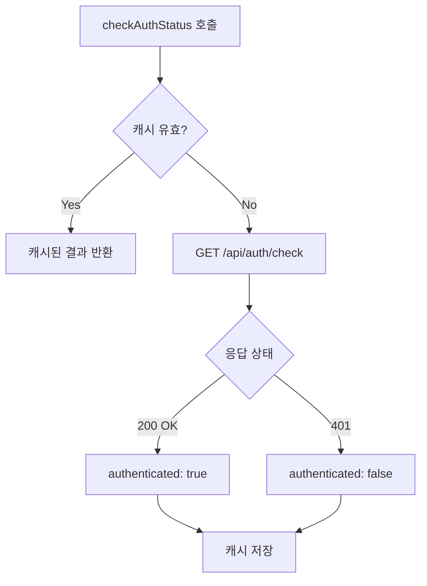

# checkAuthStatus 개선 분석

> 작성일: 2026-02-19
> 목적: checkAuthStatus에서 토큰 갱신 시도 방안 분석

---

## 1. 현재 동작 분석

### 1.1 checkAuthStatus 흐름



### 1.2 문제 시나리오

**페이지 새로고침 시:**
1. 메모리 변수(`tokenExpiresAt`, `tokenDuration`) 초기화
2. `checkAuthStatus()` 호출
3. `/api/auth/check` 요청
4. 토큰이 만료되어 있으면 401 반환
5. `authenticated: false` → 로그인 페이지 리다이렉트

---

## 2. 개선 방안: checkAuthStatus에서 토큰 갱신 시도

### 2.1 제안 코드

```typescript
// authUtility.ts

export const checkAuthStatus = async (): Promise<{ authenticated: boolean; user?: UserInfo }> => {
  // ... 기존 캐시 체크 로직 ...

  authCheckPromise = axios.get('/api/auth/check')
    .then(response => {
      // 성공 시 기존 로직
      const result = {
        authenticated: true,
        user: response.data.user as UserInfo
      };
      
      if (response.data.expiresIn) {
        setTokenExpiration(response.data.expiresIn);
      }
      
      cachedAuthResult = { result, timestamp: Date.now() };
      return result;
    })
    .catch(async error => {
      // [추가] 401일 경우 토큰 갱신 시도
      if (error.response?.status === 401) {
        // 토큰 갱신 시도
        const refreshSuccess = await refreshToken();
        
        if (refreshSuccess) {
          // 갱신 성공 → 다시 인증 확인
          const retryResponse = await axios.get('/api/auth/check');
          const result = {
            authenticated: true,
            user: retryResponse.data.user as UserInfo
          };
          
          if (retryResponse.data.expiresIn) {
            setTokenExpiration(retryResponse.data.expiresIn);
          }
          
          cachedAuthResult = { result, timestamp: Date.now() };
          return result;
        }
        
        // 갱신 실패 → 인증 실패
        const result = { authenticated: false };
        cachedAuthResult = { result, timestamp: Date.now() };
        return result;
      }
      
      // 다른 에러
      devError('[authUtility] 인증 확인 중 오류:', error);
      const result = { authenticated: false };
      cachedAuthResult = { result, timestamp: Date.now() };
      return result;
    })
    .finally(() => {
      authCheckPromise = null;
    });

  return authCheckPromise;
};
```

### 2.2 영향 분석

#### ✅ 긍정적 영향

1. **새로고침 시 토큰 복구**
   - 만료된 토큰도 갱신하여 세션 유지
   - 사용자 경험 개선

2. **기존 로직과 호환**
   - 401일 때만 갱신 시도
   - 갱신 실패 시 기존대로 `authenticated: false` 반환

#### ⚠️ 잠재적 문제

1. **오류 토스트 중복**
   - `refreshToken()` 실패 시 토스트가 표시될 수 있음
   - 현재 `refreshToken()`은 실패해도 토스트를 표시하지 않음 (`devError`만 호출)
   - **문제 없음**

2. **API 호출 증가**
   - 401 → refresh → checkAuthStatus (최대 3회 호출)
   - 네트워크 비용 증가
   - **허용 범위**

3. **경쟁 조건 가능성**
   - 여러 곳에서 동시에 `checkAuthStatus()` 호출 시
   - 현재 `authCheckPromise`로 방지됨
   - **문제 없음**

4. **무한 루프 가능성**
   - refresh 성공 → checkAuthStatus → 401 → refresh → ...
   - refresh 후 새 토큰으로 checkAuthStatus 호출 시 200이어야 함
   - **문제 없음** (서버가 정상이라면)

---

## 3. 오류 토스트 영향 분석

### 3.1 현재 토스트 발생 지점

| 위치 | 트리거 | 메시지 |
|------|--------|--------|
| `AuthProvider.login()` | 로그인 실패 | "로그인 실패" |
| `AuthProvider.logout()` | 로그아웃 | reason 메시지 |
| `axiosConfig.handleAuthError()` | 인증 실패 | "세션이 만료되었습니다." |
| `refreshToken()` | 갱신 실패 | 없음 (devError만) |

### 3.2 개선 후 토스트 발생 시나리오

**시나리오 1: 새로고침 시 토큰 만료**
```
페이지 로드
  ↓
checkAuthStatus() → 401
  ↓
refreshToken() → 성공
  ↓
checkAuthStatus() → 200
  ↓
authenticated: true
```
**토스트: 없음** ✅

**시나리오 2: 새로고침 시 세션 만료 (DB에서 삭제됨)**
```
페이지 로드
  ↓
checkAuthStatus() → 401
  ↓
refreshToken() → 실패 (세션 없음)
  ↓
authenticated: false
  ↓
AuthProvider → 로그인 페이지 이동
```
**토스트: 없음** (로그인 페이지로 이동만)

**시나리오 3: API 요청 중 토큰 만료**
```
API 요청
  ↓
401 응답
  ↓
axiosConfig.handleAuthError()
  ↓
checkAuthStatus() → 401
  ↓
refreshToken() → 성공/실패
```
**토스트: "세션이 만료되었습니다."** (handleAuthError에서 표시)

### 3.3 결론

- **오류 토스트 중복 없음**
- `refreshToken()`은 토스트를 표시하지 않음
- `handleAuthError()`에서만 토스트 표시

---

## 4. 권장 사항

### 4.1 구현 여부

**현재 상황:**
- 백그라운드 토큰 갱신 타이머 구현 완료
- 토큰 만료 시간 실제 계산 적용 완료

**checkAuthStatus 개선 필요성:**

| 상황 | 백그라운드 타이머만 | checkAuthStatus 개선 추가 |
|------|---------------------|---------------------------|
| 활성 사용자 | ✅ 토큰 유지 | ✅ 토큰 유지 |
| 30분 비활성 후 새로고침 | ❌ 로그아웃 | ✅ 토큰 복구 |
| 장시간 비활성 (세션 만료) | ❌ 로그아웃 | ❌ 로그아웃 |

### 4.2 구현 순서

1. **1단계: 백그라운드 타이머** (완료)
   - 활성 사용자의 토큰 유지

2. **2단계: checkAuthStatus 개선** (선택)
   - 비활성 후 새로고침 시 토큰 복구
   - 추가 코드가 많지 않음 (약 20줄)

### 4.3 최종 권장

**checkAuthStatus 개선을 구현하는 것을 권장합니다.**

이유:
1. 사용자 경험 개선 (비활성 후 새로고침해도 로그인 유지)
2. 오류 토스트 중복 없음
3. 기존 로직과 호환
4. 추가 코드가 적음

---

## 5. 구현 코드 (최종)

```typescript
// authUtility.ts의 checkAuthStatus 함수 수정

export const checkAuthStatus = async (): Promise<{ authenticated: boolean; user?: UserInfo }> => {
  // 로그인 진행 중이면 캐시된 결과 반환
  if (isLoggingIn) {
    if (isCacheValid()) {
      return cachedAuthResult!.result;
    }
    return { authenticated: false };
  }

  // 로그아웃 진행 중이면 무조건 인증 안됨
  if (isLoggingOut) {
    return { authenticated: false };
  }

  // 캐시가 유효하면 캐시된 결과 반환
  if (isCacheValid()) {
    return cachedAuthResult!.result;
  }

  // 캐시 만료되었으면 초기화
  if (cachedAuthResult !== null) {
    cachedAuthResult = null;
  }

  // 이미 확인 중이면 해당 프라미스 반환
  if (authCheckPromise !== null) {
    return authCheckPromise;
  }

  // 최초 확인 시작
  authCheckPromise = axios.get('/api/auth/check')
    .then(response => {
      const result = {
        authenticated: true,
        user: response.data.user as UserInfo
      };
      
      if (response.data.expiresIn) {
        setTokenExpiration(response.data.expiresIn);
      }
      
      cachedAuthResult = { result, timestamp: Date.now() };
      return result;
    })
    .catch(async error => {
      // 401일 경우 토큰 갱신 시도
      if (error.response?.status === 401) {
        const refreshSuccess = await refreshToken();
        
        if (refreshSuccess) {
          try {
            const retryResponse = await axios.get('/api/auth/check');
            const result = {
              authenticated: true,
              user: retryResponse.data.user as UserInfo
            };
            
            if (retryResponse.data.expiresIn) {
              setTokenExpiration(retryResponse.data.expiresIn);
            }
            
            cachedAuthResult = { result, timestamp: Date.now() };
            return result;
          } catch {
            // 재시도 실패
          }
        }
        
        // 갱신 실패 또는 재시도 실패
        const result = { authenticated: false };
        cachedAuthResult = { result, timestamp: Date.now() };
        return result;
      }
      
      // 다른 에러
      devError('[authUtility] 인증 확인 중 오류:', error);
      const result = { authenticated: false };
      cachedAuthResult = { result, timestamp: Date.now() };
      return result;
    })
    .finally(() => {
      authCheckPromise = null;
    });

  return authCheckPromise;
};
```

---

## 6. 요약

| 항목 | 내용 |
|------|------|
| 구현 필요성 | **권장** |
| 오류 토스트 영향 | **없음** |
| 기존 로직 영향 | **없음** (호환) |
| 추가 코드 | **약 20줄** |
| 사용자 경험 | **개선** |

**결론: checkAuthStatus 개선을 구현하는 것이 좋습니다.**
