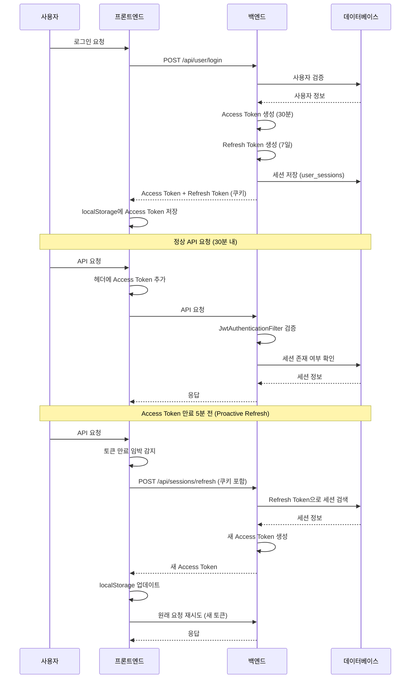
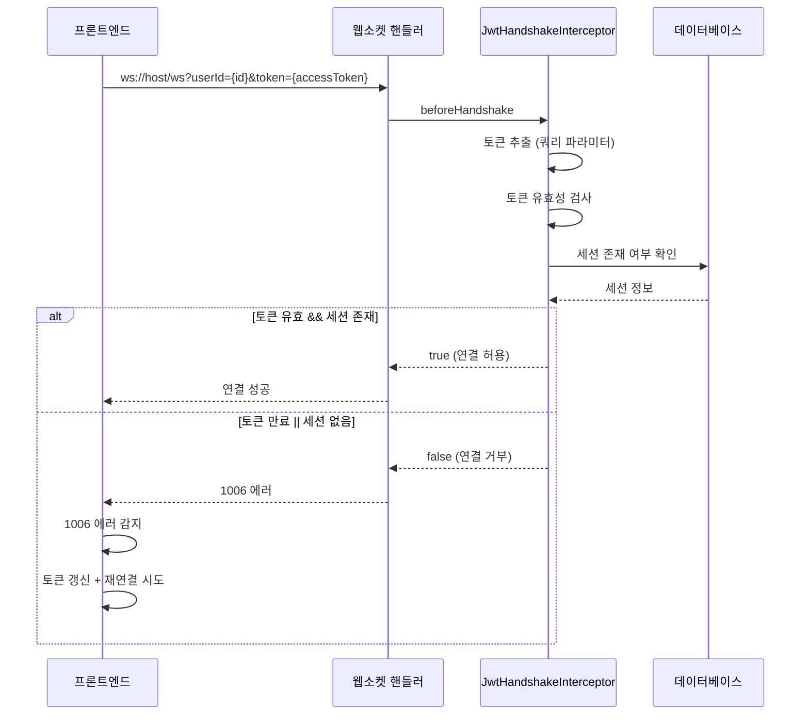

# 인증/토큰 관리 분석 보고서

## 1. 현재 아키텍처 개요

### 1.1 토큰 구조

```
┌─────────────────────────────────────────────────────────────────┐
│                        토큰 구조                                  │
├─────────────────────────────────────────────────────────────────┤
│                                                                 │
│  Access Token (30분)                                             │
│  - 헤더: Authorization: Bearer {accessToken}                    │
│  - 저장소: localStorage                                          │
│  - 포함 정보: userId, sessionId                                  │
│  - 용도: API 요청 인증                                           │
│                                                                 │
│  Refresh Token (7일)                                            │
│  - 저장소: HttpOnly Cookie (SameSite=None)                       │
│  - 포함 정보: userId                                              │
│  - 용도: Access Token 갱신                                       │
│                                                                 │
└─────────────────────────────────────────────────────────────────┘
```

### 1.2 인증 흐름도



### 1.3 웹소켓 인증 흐름



---

## 2. 문제점 분석

### 2.1 토큰 관리 로직 파편화 (해결됨)

#### 문제 1: 토큰 갱신 로직이 여러 곳에 분산 (해결됨)

| 위치 | 파일 | 역할 | 해결 방법 |
|------|------|------|-----------|
| 프론트엔드 | `src/utils/authUtility.ts` | 토큰 갱신, 로그아웃, 유틸리티 | **통합 완료** - 모든 토큰 관련 로직이 여기서 처리 |
| 프론트엔드 | `src/utils/axiosConfig.ts` | HTTP 요청 시 토큰 갱�신 | authUtility 사용하도록 수정 |
| 프론트엔드 | `src/contexts/WebSocketProvider.tsx` | 웹소켓 연결 시 토큰 갱신 | authUtility 사용하도록 수정 |
| 프론트엔드 | `src/contexts/AuthProvider.tsx` | React 인증 컨텍스트 | **신규 생성** - 통합된 인증 상태 관리 |

**해결:** `authUtility.ts`에 모든 토큰 관리 로직을 통합하고, 다른 파일들에서 이를 참조하도록 수정.

### 2.2 쿠키 SameSite 문제 (해결됨)

#### 문제: Refresh Token 쿠키가 크로스오리진 POST 요청에서 전송되지 않음

**원인:**
- 쿠키에 `SameSite` 속성이 누락됨
- modern 브라우저에서 `SameSite=Lax`가 기본값
- POST 요청에서 쿠키가 차단됨

**해결:** 백엔드 쿠키 설정에 `sameSite("none")` 추가

```java
// UserController.java
ResponseCookie cookie = ResponseCookie.from("refreshToken", result.getRefreshToken())
            .httpOnly(true)
            .path("/")
            .secure(false)
            .sameSite("none")  // ← 추가
            .maxAge(maxAge)
            .build();
```

### 2.3 Access Token 만료 시간 문제 (해결됨)

#### 문제: 테스트용으로 10초로 설정되어 있었음

**원인:**
- `application.yml`에서 `access-token-validity-in-seconds: 10`으로 설정

**해결:** 30분(1800초)으로 복원

```yaml
# application.yml
access-token-validity-in-seconds: 1800  # 30분
```

### 2.4 30분 후 로그아웃 원인 (해결됨)

#### 원인 1: Access Token 만료 (30분) → Refresh 실패

**기존 문제:**
1. Access Token이 만료되면 401 에러 발생
2. Refresh Token 쿠키가 크로스오리진 문제로 전송 안됨
3. Refresh 요청 실패 → 로그아웃

**해결:**
1. SameSite=None으로 쿠키 설정 수정
2. Proactive Refresh 구현 (만료 5분 전에 미리 갱신)
3. authUtility.ts에서 `shouldRefreshToken()` 함수로 만료 시간 추적

#### 원인 2: 토큰 갱신 타이밍 문제

**기존:** Reactive Refresh - 토큰이 만료된 후에야 갱신 시도

**해결:** Proactive Refresh - 만료 5분 전에 미리 갱신

```typescript
// authUtility.ts
export const shouldRefreshToken = (): boolean => {
  const expiresAt = getTokenExpiry();
  if (!expiresAt) return false;
  const fiveMinutes = 5 * 60 * 1000;
  return Date.now() >= (expiresAt - fiveMinutes);
};
```

---

## 3. 해결된 파일 목록

### 백엔드 (Spring Boot)

| 파일 | 수정 내용 |
|------|-----------|
| [`UserController.java`](../server/src/main/java/com/example/demo/domain/user/controller/UserController.java) | 쿠키에 `sameSite("none")` 추가 |
| [`SessionController.java`](../server/src/main/java/com/example/demo/domain/user/controller/SessionController.java) | 쿠키에 `sameSite("none")` 추가 |
| [`application.yml`](../server/src/main/resources/application.yml) | `access-token-validity-in-seconds: 1800` (30분) 복원 |

### 프론트엔드 (React + TypeScript)

| 파일 | 수정 내용 |
|------|-----------|
| [`src/utils/authUtility.ts`](src/utils/authUtility.ts) | `isRefreshing` export 추가, 토큰 관리 로직 통합 |
| [`src/utils/axiosConfig.ts`](src/utils/axiosConfig.ts) | Proactive Refresh 로직 수정, 에러 처리 개선 |
| [`src/contexts/WebSocketProvider.tsx`](src/contexts/WebSocketProvider.tsx) | 1006 에러 처리 개선 (null 체크 추가) |
| [`src/contexts/AuthProvider.tsx`](src/contexts/AuthProvider.tsx) | **신규 생성** - 통합된 인증 컨텍스트 |
| [`src/App.tsx`](src/App.tsx) | ProtectedRoute 컴포넌트 사용으로 인증 처리 통합 |
| [`src/pages/Login.tsx`](src/pages/Login.tsx) | authUtility.setToken() 사용으로 통합 |
| [`src/pages/DeviceManagement.tsx`](src/pages/DeviceManagement.tsx) | authUtility.logout() 사용으로 통합 |

---

## 4. 새로운 아키텍처

### 4.1 토큰 관리 흐름

```
┌─────────────────────────────────────────────────────────────────┐
│                    토큰 관리 통합 흐름                             │
├─────────────────────────────────────────────────────────────────┤
│                                                                 │
│  1. 로그인 (Login.tsx)                                          │
│     └── authUtility.setToken() 호출                             │
│         └── localStorage에 accessToken 저장                      │
│         └── 만료 시간 (30분) 저장                                │
│                                                                 │
│  2. API 요청 (axiosConfig.ts)                                    │
│     └── 요청 인터셉터에서 shouldRefreshToken() 확인              │
│         └── 만료 5분 전이면 refreshToken() 호출                 │
│             └── POST /api/sessions/refresh (쿠키 자동 전송)      │
│                 └── 새 Access Token 수신                         │
│                     └── localStorage 업데이트                    │
│                                                                 │
│  3. 웹소켓 연결 (WebSocketProvider.tsx)                          │
│     └── localStorage에서 accessToken 읽기                        │
│         └── ws://host/ws?token={accessToken} 연결                │
│             └── 1006 에러 시 refreshToken() 호출                │
│                 └── 재연결 (retryCount 증가)                     │
│                                                                 │
│  4. 로그아웃 (authUtility.logout())                             │
│     └── localStorage에서 토큰/만료시간 삭제                      │
│         └── 백엔드에 POST /api/user/logout 호출                 │
│             └── DB에서 세션 삭제                                 │
│                 └── 로그인 페이지로 리다이렉트                   │
│                                                                 │
└─────────────────────────────────────────────────────────────────┘
```

### 4.2 에러 처리 흐름

```typescript
// authUtility.ts
export const refreshToken = async (): Promise<string | null> => {
  if (isRefreshing) {
    // 이미 갱신 중이면 대기
    return new Promise((resolve) => {
      addRefreshSubscriber((token) => resolve(token));
    });
  }
  
  isRefreshing = true;
  try {
    const data = await sessionApi.refreshToken();
    if (data?.accessToken) {
      localStorage.setItem('accessToken', data.accessToken);
      setTokenExpiry(30 * 60);
      onRefreshed(data.accessToken);
      isRefreshing = false;
      return data.accessToken;
    }
    isRefreshing = false;
    return null;
  } catch {
    isRefreshing = false;
    refreshSubscribers = [];
    return null;
  }
};
```

---

## 5. 용어 정리

| 용어 | 설명 |
|------|------|
| **Access Token** | API 요청 시 사용하는 단기 토큰 (30분) |
| **Refresh Token** | Access Token 갱신 시 사용하는 장기 토큰 (7일) |
| **Session** | 사용자의 로그인 상태를 DB에 저장한 레코드 |
| **JWT (JSON Web Token)** | 사용자 정보를 안전하게 전달하는 토큰 형식 |
| **HttpOnly Cookie** | JavaScript에서 접근할 수 없는 쿠키 (XSS 방지) |
| **SameSite Cookie** | 크로스사이트 요청에서 쿠키 전송을 제어하는 속성 |
| **Interceptor** | 요청/응답을 가로채서 처리하는 필터 |
| **Proactive Refresh** | 토큰이 만료되기 전에 미리 갱신하는 전략 |
| **Reactive Refresh** | 토큰이 만료된 후에 갱신하는 전략 (기존 방식) |

---

## 6. 테스트 체크리스트

- [ ] 로그인 후 30분 내 API 요청 정상 작동 확인
- [ ] Access Token 만료 5분 전 Proactive Refresh 작동 확인
- [ ] 웹소켓 1006 에러 발생 시 자동 재연결 확인
- [ ] 로그아웃 시 localStorage 정리 및 리다이렉트 확인
- [ ] 다른 기기에서 로그아웃 시 현재 기기 로그아웃 확인
- [ ] 크롬 개발자 도구에서 쿠키가 올바르게 설정되었는지 확인

---

## 7. 향후 개선 사항

1. **CSRF 보호 추가**: Refresh Token 쿠키에 CSRF 토큰 검증 추가
2. **토큰 탈취 감지**: unusual activity 감지 로직 추가
3. **Access Token 저장소 개선**: localStorage 대신 메모리 저장 고려 (XSS 방지)
4. **Refresh Token Rotation**: Refresh Token 사용 시마다 새로운 Refresh Token 발급
