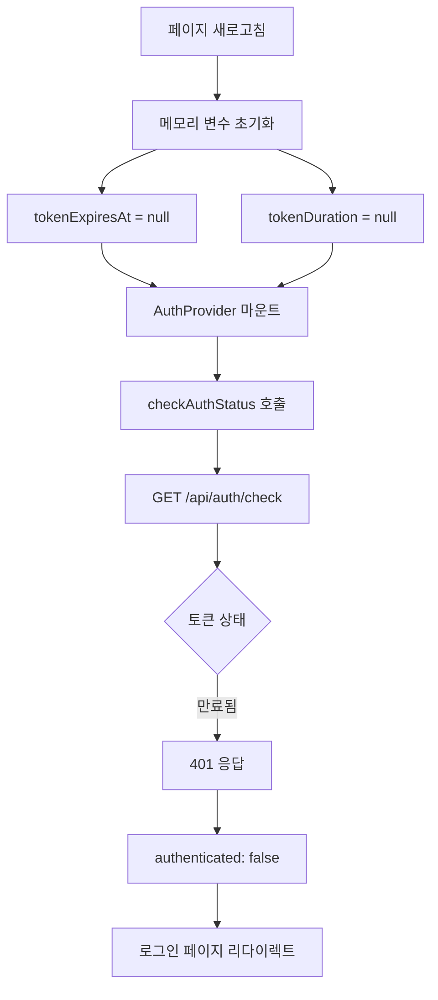
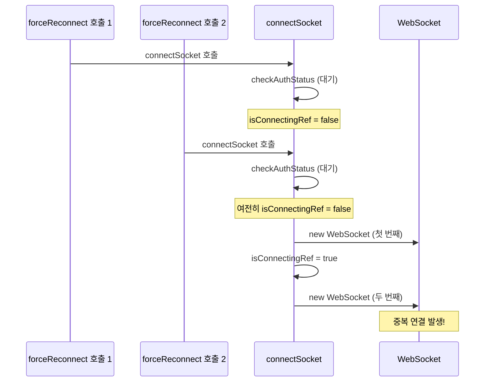

# 문제 해결 방안: 토큰 만료 시간 불일치 & WebSocket 경쟁 조건

> 작성일: 2026-02-19

---

## 1. 문제 1: 30분 후 새로고침 시 로그아웃되는 문제

### 1.1 문제 원인 분석

**시나리오:**
1. 사용자가 로그인 → `tokenExpiresAt`, `tokenDuration` 메모리 변수 설정
2. 30분 동안 아무런 API 요청 없이 대기
3. 30분 후 새로고침 (F5 또는 타이틀 클릭)
4. **로그아웃 발생**

**원인:**



**핵심 문제점:**

1. **Proactive Refresh는 API 요청이 있을 때만 트리거됨**
   - [`axiosConfig.ts`](src/utils/axiosConfig.ts:140)의 `isTokenExpiringSoon()` 체크는 API 요청 시에만 실행
   - 사용자가 30분 동안 아무런 활동을 하지 않으면 토큰이 만료됨

2. **메모리 변수 초기화**
   - [`authUtility.ts`](src/utils/authUtility.ts:26-28)의 `tokenExpiresAt`, `tokenDuration`은 페이지 새로고침 시 `null`로 초기화
   - 새로고침 후 `isTokenExpiringSoon()`은 `false` 반환 (변수가 `null`이므로)

3. **checkAuthStatus의 한계**
   - [`checkAuthStatus()`](src/utils/authUtility.ts:183)는 `/api/auth/check` 호출
   - 이 API는 토큰 검증만 하고, 만료된 토큰을 갱신하지 않음
   - 만료된 토큰이면 401 반환 → 로그아웃

### 1.2 해결 방안

#### 방안 A: checkAuthStatus에서 토큰 갱신 시도 (권장)

**수정 파일:** [`authUtility.ts`](src/utils/authUtility.ts)

```typescript
// authUtility.ts의 checkAuthStatus 함수 수정

export const checkAuthStatus = async (): Promise<{ authenticated: boolean; user?: UserInfo }> => {
  // ... 기존 코드 ...

  // 최초 확인 시작
  authCheckPromise = axios.get('/api/auth/check')
    .then(response => {
      // 성공 시 기존 로직
      const result = {
        authenticated: true,
        user: response.data.user as UserInfo
      };
      
      if (response.data.expiresIn) {
        setTokenExpiration(response.data.expiresIn);
      }
      
      cachedAuthResult = { result, timestamp: Date.now() };
      return result;
    })
    .catch(async error => {
      // [추가] 401일 경우 토큰 갱신 시도
      if (error.response?.status === 401) {
        // 토큰 갱신 시도
        const refreshSuccess = await refreshToken();
        
        if (refreshSuccess) {
          // 갱신 성공 → 다시 인증 확인
          const retryResponse = await axios.get('/api/auth/check');
          const result = {
            authenticated: true,
            user: retryResponse.data.user as UserInfo
          };
          
          if (retryResponse.data.expiresIn) {
            setTokenExpiration(retryResponse.data.expiresIn);
          }
          
          cachedAuthResult = { result, timestamp: Date.now() };
          return result;
        }
        
        // 갱신 실패 → 인증 실패
        const result = { authenticated: false };
        cachedAuthResult = { result, timestamp: Date.now() };
        return result;
      }
      
      // 다른 에러
      devError('[authUtility] 인증 확인 중 오류:', error);
      const result = { authenticated: false };
      cachedAuthResult = { result, timestamp: Date.now() };
      return result;
    })
    .finally(() => {
      authCheckPromise = null;
    });

  return authCheckPromise;
};
```

#### 방안 B: 백그라운드 토큰 갱신 타이머

**새로운 기능 추가:**

```typescript
// authUtility.ts에 추가

let backgroundRefreshTimer: number | null = null;

/**
 * 백그라운드 토큰 갱신 시작
 * - 토큰 만료 6분 전부터 1분마다 갱신 체크
 */
export const startBackgroundRefresh = () => {
  if (backgroundRefreshTimer) return;
  
  // 1분마다 체크
  backgroundRefreshTimer = window.setInterval(async () => {
    if (isTokenExpiringSoon()) {
      const success = await refreshToken();
      if (!success) {
        // 갱신 실패 시 타이머 정지
        stopBackgroundRefresh();
      }
    }
  }, 60 * 1000); // 1분
};

/**
 * 백그라운드 토큰 갱신 정지
 */
export const stopBackgroundRefresh = () => {
  if (backgroundRefreshTimer) {
    window.clearInterval(backgroundRefreshTimer);
    backgroundRefreshTimer = null;
  }
};
```

**AuthProvider에서 호출:**

```typescript
// AuthProvider.tsx

useEffect(() => {
  if (authState.authenticated) {
    startBackgroundRefresh();
  } else {
    stopBackgroundRefresh();
  }
  
  return () => stopBackgroundRefresh();
}, [authState.authenticated]);
```

### 1.3 권장 해결 방안

**방안 A + 방안 B 조합:**

1. **checkAuthStatus에서 토큰 갱신 시도** (방안 A)
   - 새로고침 시 만료된 토큰 복구
   
2. **백그라운드 토큰 갱신 타이머** (방안 B)
   - 장시간 활동 없을 때도 토큰 유지

---

## 2. 문제 2: 토큰 만료 시간 불일치

### 2.1 문제 원인

**현재 동작:**
- [`AuthController.checkAuthStatus()`](../server/src/main/java/com/example/demo/domain/auth/controller/AuthController.java:88)에서 `expiresIn`을 설정값 그대로 반환

```java
// 현재 코드
responseBody.put("expiresIn", jwtProperties.getAccessTokenValidityInSeconds());
```

**문제:**
- 토큰이 발급된 지 20분이 지났다면, 실제 남은 시간은 10분
- 하지만 클라이언트는 30분으로 인식하여 Proactive Refresh가 늦게 실행됨

### 2.2 해결 방안

**수정 파일:** [`AuthController.java`](../server/src/main/java/com/example/demo/domain/auth/controller/AuthController.java)

```java
@GetMapping("/check")
public ResponseEntity<?> checkAuthStatus(HttpServletRequest request, HttpServletResponse response) {
    // ... 기존 코드 ...
    
    try {
        String userId = jwtTokenProvider.getAuthentication(token).getName();
        
        // ... 사용자 조회 ...
        
        Map<String, Object> responseBody = new HashMap<>();
        responseBody.put("authenticated", true);
        responseBody.put("user", Map.of(
            "id", user.getId(),
            "name", user.getName()
        ));
        
        // [수정] 토큰의 실제 남은 시간 계산
        long remainingSeconds = jwtTokenProvider.getTokenRemainingTime(token);
        responseBody.put("expiresIn", remainingSeconds);
        
        return ResponseEntity.ok(responseBody);
    } catch (Exception e) {
        // ... 에러 처리 ...
    }
}
```

**JwtTokenProvider에 메서드 추가:**

```java
// JwtTokenProvider.java

/**
 * 토큰의 실제 남은 시간 계산 (초 단위)
 */
public long getTokenRemainingTime(String token) {
    try {
        Claims claims = parseClaims(token);
        Date expiration = claims.getExpiration();
        long remainingMs = expiration.getTime() - System.currentTimeMillis();
        return Math.max(0, remainingMs / 1000);
    } catch (ExpiredJwtException e) {
        return 0;
    } catch (Exception e) {
        log.error("토큰 남은 시간 계산 오류: {}", e.getMessage());
        return 0;
    }
}
```

---

## 3. 문제 3: WebSocket 재연결 경쟁 조건

### 3.1 문제 원인

**현재 코드:** [`WebSocketProvider.tsx`](src/contexts/WebSocketProvider.tsx)

```typescript
const connectSocket = useCallback(async () => {
  // 로그아웃 중이면 연결하지 않음
  if (getIsLoggingOut()) {
    return;
  }

  // 인증 상태 확인 (비동기)
  const authResult = await checkAuthStatus();
  if (!authResult.authenticated) {
    return;
  }

  // 이미 연결 중이면 건너뜀
  if (isConnectingRef.current) {
    return;
  }

  // 이미 연결되어 있으면 건너뜀
  if (socketRef.current?.readyState === WebSocket.OPEN) {
    setIsConnected(true);
    return;
  }
  // ...
}, [WS_URL]);
```

**문제점:**
1. `checkAuthStatus()`가 비동기 함수
2. 여러 곳에서 동시에 `forceReconnect()` 호출 가능
3. `isConnectingRef` 체크가 `checkAuthStatus()` 이후에 수행됨
4. 체크 전에 다른 호출이 들어오면 중복 연결 발생

### 3.2 경쟁 조건 시나리오



### 3.3 해결 방안

**수정 파일:** [`WebSocketProvider.tsx`](src/contexts/WebSocketProvider.tsx)

```typescript
const connectSocket = useCallback(async () => {
  // [핵심] 맨 앞에서 연결 중 체크
  if (isConnectingRef.current) {
    devLog('[WebSocket] 이미 연결 중, 요청 무시');
    return;
  }

  // 로그아웃 중이면 연결하지 않음
  if (getIsLoggingOut()) {
    return;
  }

  // [핵심] 연결 시작 플래그 설정
  isConnectingRef.current = true;

  try {
    // 인증 상태 확인 (비동기)
    const authResult = await checkAuthStatus();
    if (!authResult.authenticated) {
      isConnectingRef.current = false;
      return;
    }

    // 이미 연결되어 있으면 건너뜀
    if (socketRef.current?.readyState === WebSocket.OPEN) {
      setIsConnected(true);
      isConnectingRef.current = false;
      return;
    }

    // 기존 소켓 정리
    if (socketRef.current) {
      socketRef.current.close();
    }

    // 쿠키가 자동으로 전송되므로 URL 파라미터에서 토큰 제거
    const ws = new WebSocket(`${WS_URL}/ws`);

    ws.onopen = () => {
      isConnectingRef.current = false;
      setIsConnected(true);
      if (reconnectTimerRef.current) {
        window.clearTimeout(reconnectTimerRef.current);
        reconnectTimerRef.current = null;
      }
    };

    ws.onerror = () => {
      isConnectingRef.current = false;
    };

    socketRef.current = ws;
  } catch (error) {
    isConnectingRef.current = false;
    devError('[WebSocket] 연결 중 오류:', error);
  }
}, [WS_URL]);
```

### 3.4 추가 개선: 연결 상태 관리 강화

```typescript
// WebSocketProvider.tsx

// 연결 상태 관리를 위한 상태 머신
type ConnectionState = 'DISCONNECTED' | 'CONNECTING' | 'CONNECTED' | 'RECONNECTING';

const connectionStateRef = useRef<ConnectionState>('DISCONNECTED');

const connectSocket = useCallback(async () => {
  // 상태 머신 기반 체크
  if (connectionStateRef.current === 'CONNECTING') {
    devLog('[WebSocket] 이미 연결 중, 요청 무시');
    return;
  }

  if (connectionStateRef.current === 'CONNECTED') {
    devLog('[WebSocket] 이미 연결됨');
    return;
  }

  if (getIsLoggingOut()) {
    return;
  }

  connectionStateRef.current = 'CONNECTING';

  try {
    const authResult = await checkAuthStatus();
    
    if (!authResult.authenticated) {
      connectionStateRef.current = 'DISCONNECTED';
      return;
    }

    // 기존 소켓 정리
    if (socketRef.current) {
      socketRef.current.close();
      socketRef.current = null;
    }

    const ws = new WebSocket(`${WS_URL}/ws`);

    ws.onopen = () => {
      connectionStateRef.current = 'CONNECTED';
      setIsConnected(true);
      // ...
    };

    ws.onclose = (event: CloseEvent) => {
      connectionStateRef.current = 'DISCONNECTED';
      // ... 기존 로직 ...
    };

    ws.onerror = () => {
      connectionStateRef.current = 'DISCONNECTED';
    };

    socketRef.current = ws;
  } catch (error) {
    connectionStateRef.current = 'DISCONNECTED';
    devError('[WebSocket] 연결 중 오류:', error);
  }
}, [WS_URL]);
```

---

## 4. 요약

| 문제 | 원인 | 해결 방안 |
|------|------|----------|
| 30분 후 새로고침 시 로그아웃 | Proactive Refresh가 API 요청 시에만 실행 | checkAuthStatus에서 토큰 갱신 시도 + 백그라운드 타이머 |
| 토큰 만료 시간 불일치 | 서버가 설정값 그대로 반환 | 토큰의 실제 남은 시간 계산하여 반환 |
| WebSocket 경쟁 조건 | 비동기 체크 후 연결 플래그 설정 | 연결 플래그를 맨 앞으로 이동 + 상태 머신 도입 |

---

## 5. 구현 우선순위

1. **즉시 수정 (Critical)**
   - [ ] checkAuthStatus에서 토큰 갱신 시도
   - [ ] WebSocket 연결 플래그 위치 이동

2. **단기 수정 (High)**
   - [ ] 토큰 실제 남은 시간 계산
   - [ ] 백그라운드 토큰 갱신 타이머

3. **장기 개선 (Medium)**
   - [ ] WebSocket 상태 머신 도입
