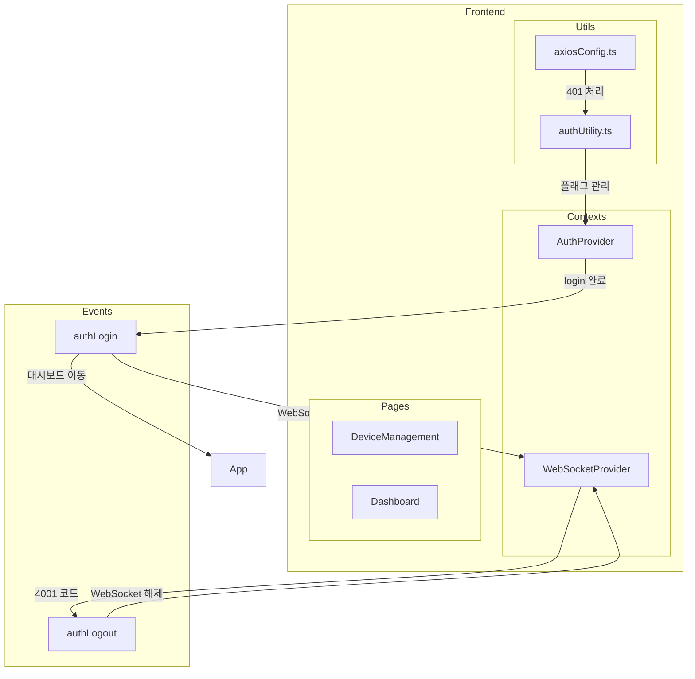

# 이벤트 기반 아키텍처 검토 (Phase 3)

## 1. 현재 상태 분석

### 1.1 Phase 1, 2 구현 완료 사항

| 항목 | 상태 | 설명 |
|------|------|------|
| 중복 인증 확인 제거 | ✅ 완료 | 경로 변경 useEffect 제거, axios interceptor가 401 처리 |
| 로그인/로그아웃 플래그 중앙화 | ✅ 완료 | `authUtility.ts`에서 `isLoggingIn`, `isLoggingOut` 관리 |
| force 파라미터 추가 | ✅ 완료 | 전체 로그아웃 시 강제 실행 가능 |
| WebSocket 4001 처리 | ✅ 완료 | Force Logout 시 `authLogout` 이벤트 발생 |

### 1.2 현재 이벤트 시스템

```typescript
// 현재 사용 중인 이벤트
window.dispatchEvent(new CustomEvent('authLogin'));   // 로그인 완료
window.dispatchEvent(new CustomEvent('authLogout'));  // Force Logout (4001)

// 이벤트 리스너 위치
// App.tsx: authLogin → 대시보드 이동
// WebSocketProvider.tsx: authLogin/authLogout → WebSocket 연결/해제
```

### 1.3 현재 아키텍처 다이어그램



---

## 2. 이벤트 기반 아키텍처 도입 검토

### 2.1 현재 방식의 장점

1. **단순함**: `window.dispatchEvent`로 간단하게 구현
2. **의존성 없음**: 외부 라이브러리 불필요
3. **동작 중**: 현재도 정상 작동 중

### 2.2 현재 방식의 단점

1. **타입 안전성 없음**: 이벤트 이름이 문자열로 하드코딩
2. **이벤트 추적 어려움**: 어떤 컴포넌트가 어떤 이벤트를 사용하는지 파악困难
3. **디버깅 어려움**: 이벤트 흐름 추적이 힘듦
4. **메모리 누수 위험**: removeEventListener 누락 시 문제

### 2.3 개선 방안 비교

| 방안 | 장점 | 단점 | 권장도 |
|------|------|------|--------|
| A. 현재 유지 | 단순, 이미 작동 중 | 타입 안전성 없음 | ⭐⭐⭐ |
| B. 이벤트 타입 정의만 추가 | 타입 안전성 확보, 변경 최소 | 여전히 분산됨 | ⭐⭐⭐⭐ |
| C. 이벤트 버스 도입 | 중앙화, 디버깅 용이 | 외부 라이브러리 필요 | ⭐⭐ |
| D. React Context 기반 | React 친화적, 타입 안전 | Context 중첩 증가 | ⭐⭐⭐ |

---

## 3. 권장 방안: B (이벤트 타입 정의만 추가)

### 3.1 이유

1. **현재 시스템이 이미 작동 중**: 큰 변경은 위험
2. **타입 안전성만으로 충분**: 주요 문제는 이벤트 이름 오타 방지
3. **변경 범위 최소**: 기존 코드 구조 유지

### 3.2 구현 계획

#### Step 1: 이벤트 타입 정의 파일 생성

```typescript
// src/constants/authEvents.ts

// 이벤트 타입 정의
export const AUTH_EVENTS = {
  LOGIN: 'authLogin',
  LOGOUT: 'authLogout',
  SESSION_EXPIRED: 'authSessionExpired',
  FORCE_LOGOUT: 'authForceLogout',
} as const;

// 이벤트 타입
export type AuthEventType = typeof AUTH_EVENTS[keyof typeof AUTH_EVENTS];

// 이벤트 디테일 타입
export interface AuthEventDetail {
  reason?: string;
  timestamp: number;
}

// 이벤트 생성 헬퍼
export const createAuthEvent = (
  type: AuthEventType, 
  detail?: AuthEventDetail
): CustomEvent => {
  return new CustomEvent(type, { 
    detail: detail || { timestamp: Date.now() } 
  });
};
```

#### Step 2: 기존 코드 수정

```typescript
// Before (AuthProvider.tsx)
window.dispatchEvent(new CustomEvent('authLogin'));

// After
import { AUTH_EVENTS, createAuthEvent } from '../constants/authEvents';
window.dispatchEvent(createAuthEvent(AUTH_EVENTS.LOGIN));
```

#### Step 3: 이벤트 리스너 수정

```typescript
// Before (App.tsx)
window.addEventListener('authLogin', handleLogin);

// After
import { AUTH_EVENTS } from './constants/authEvents';
window.addEventListener(AUTH_EVENTS.LOGIN, handleLogin);
```

---

## 4. 변경 영향도 분석

### 4.1 수정 필요 파일

| 파일 | 변경 내용 | 위험도 |
|------|----------|--------|
| `src/constants/authEvents.ts` | 신규 생성 | 없음 |
| `src/contexts/AuthProvider.tsx` | 이벤트 발생 코드 수정 | 낮음 |
| `src/contexts/WebSocketProvider.tsx` | 이벤트 발생/수신 코드 수정 | 낮음 |
| `src/App.tsx` | 이벤트 수신 코드 수정 | 낮음 |

### 4.2 테스트 시나리오

1. **로그인 → 대시보드 이동**: `AUTH_EVENTS.LOGIN` 정상 동작
2. **Force Logout (4001)**: `AUTH_EVENTS.LOGOUT` 정상 동작
3. **일반 로그아웃**: 기존 로직 유지
4. **전체 로그아웃**: force 파라미터와 함께 정상 동작

---

## 5. 대안: 이벤트 기반 아키텍처 미도입

### 5.1 현재 시스템으로 충분한 이유

1. **이벤트가 2개뿐**: `authLogin`, `authLogout`
2. **복잡도 낮음**: 이벤트 기반 아키텍처가 필요한 수준 아님
3. **안정성**: 현재 시스템이 안정적으로 작동 중

### 5.2 결론

**Phase 3은 선택 사항으로, 현재 시스템이 충분히 안정적이므로 도입하지 않아도 됨**

대신, 다음 작업 권장:
- **Phase 4 (보안 설정 환경 변수화)** 진행
- 또는 **추가 기능 개발**에 집중

---

## 6. 최종 권장사항

### 6.1 Option A: Phase 3 진행 (이벤트 타입 정의만 추가)

- 변경 범위: 최소
- 소요 시간: 짧음
- 효과: 타입 안전성 확보

### 6.2 Option B: Phase 3 스킵

- 이유: 현재 시스템으로 충분
- 대안: Phase 4 진행 또는 기능 개발

### 6.3 추천

**Option B (Phase 3 스킵)**을 권장합니다.

이유:
1. 현재 이벤트 시스템이 단 2개의 이벤트만 사용
2. 이미 안정적으로 작동 중
3. 타입 안전성 이점이 크지 않음 (이벤트 이름이 하드코딩된 곳이 4곳뿐)
4. 변경으로 인한 위험 > 이점

---

## 7. 다음 단계

Phase 3 진행 여부를 결정해 주세요:

1. **Phase 3 진행**: 이벤트 타입 정의 파일 생성 및 코드 수정
2. **Phase 3 스킵**: Phase 4 (보안 설정 환경 변수화) 진행
3. **분석 종료**: 현재 상태로 충분하다고 판단하여 종료
