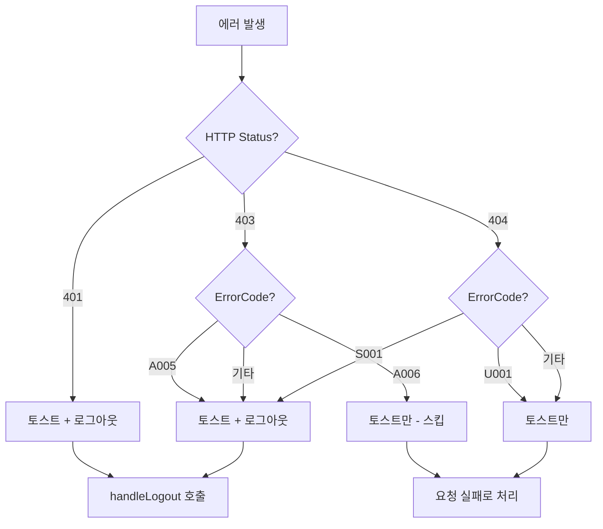

# 인증 에러 처리 개선 설계

## 1. 개요

### 1.1 배경

현재 인증 에러 처리에서 발생하는 문제들:

1. **403/404 에러 시 무조건 로그아웃 처리** - 권한/자원 문제를 인증 문제로 오인
2. **토스트 중복 표시** - 403 에러 메시지가 여러 번 출력
3. **SESSION_NOT_FOUND (S001)가 401이 아닌 404로 반환**

### 1.2 목표

| 목표 | 설명 |
|------|------|
| 적절한 에러 분류 | HTTP Status와 ErrorCode 기반 세밀한 처리 |
| UX 개선 | 불필요한 로그아웃 방지 |
| 일관된 에러 메시지 | 토스트 중복 방지 |

---

## 2. ErrorCode 정리

### 2.1 현재 서버 ErrorCode

```java
// ErrorCode.java

// 401 Unauthorized (인증 문제)
INVALID_TOKEN(HttpStatus.UNAUTHORIZED, "A002", "유효하지 않은 토큰입니다.")
EXPIRED_TOKEN(HttpStatus.UNAUTHORIZED, "A003", "만료된 토큰입니다.")
SESSION_EXPIRED(HttpStatus.UNAUTHORIZED, "A004", "세션이 만료되었거나 로그아웃 되었습니다.")

// 403 Forbidden (권한 문제)
ACCESS_DENIED(HttpStatus.FORBIDDEN, "A005", "접근 권한이 없습니다.")
NOT_MY_DEVICE(HttpStatus.FORBIDDEN, "A006", "본인의 기기만 로그아웃 할 수 있습니다.")

// 404 Not Found (자원 문제)
USER_NOT_FOUND(HttpStatus.NOT_FOUND, "U001", "사용자를 찾을 수 없습니다.")
SESSION_NOT_FOUND(HttpStatus.NOT_FOUND, "S001", "세션을 찾을 수 없습니다.")
```

### 2.2 권장 변경 사항

| ErrorCode | 현재 Status | 권장 Status | 이유 |
|-----------|-------------|-------------|------|
| S001 (SESSION_NOT_FOUND) | 404 | **401** | 세션 없음 = 인증无效 |

### 2.3 서버 변경 제안

```java
// 변경 전
SESSION_NOT_FOUND(HttpStatus.NOT_FOUND, "S001", "세션을 찾을 수 없습니다.")

// 변경 후
SESSION_NOT_FOUND(HttpStatus.UNAUTHORIZED, "S001", "세션이 존재하지 않거나 만료되었습니다.")
```

---

## 3. 클라이언트 에러 처리 설계

### 3.1 에러 분류 체계

| HTTP Status | ErrorCode | 처리 방식 | 이유 |
|-------------|-----------|-----------|------|
| 401 | - | 토스트 + **로그아웃** | 인증 문제 |
| 403 | A005 (ACCESS_DENIED) | 토스트 + **로그아웃** | 접근 권한 없음 |
| 403 | A006 (NOT_MY_DEVICE) | 토스트만 | 본인 기기 아님 (정상 처리) |
| 403 | 기타 | 토스트 + **로그아웃** | 권한 문제 |
| 404 | S001 (SESSION_NOT_FOUND) | 토스트 + **로그아웃** | 세션 없음 = 인증 문제 |
| 404 | U001 (USER_NOT_FOUND) | 토스트만 | 사용자 없음 (독립적) |
| 404 | 기타 | 토스트만 | 자원 없음 |

### 3.2 에러 처리 로직 흐름도



---

## 4. 구현 상세

### 4.1 axiosConfig.ts 변경

```typescript
// src/utils/axiosConfig.ts

// 에러별 처리 함수 분리
const handle401Error = (message: string, onAuthFailed: (msg: string) => void) => {
  showToast(message, 'error');
  isLoggingOut = true;
  onAuthFailed(message);
};

const handle403Error = (message: string, errorCode: string | undefined, onAuthFailed: (msg: string) => void) => {
  showToast(message, 'error');
  
  // A006은 토스트만 (스킵)
  if (errorCode === 'A006') {
    return false;
  }
  
  // 나머지는 로그아웃
  isLoggingOut = true;
  onAuthFailed(message);
  return false;
};

const handle404Error = (message: string, errorCode: string | undefined) => {
  showToast(message, 'error');
  
  // S001은 로그아웃 (세션 없음 = 인증 문제)
  if (errorCode === 'S001') {
    isLoggingOut = true;
    // handleLogout은 interceptor에서 호출하지 않음
    return 'logout';
  }
  
  // 나머지는 토스트만
  return 'toast';
};
```

### 4.2 interceptor 수정

```typescript
// src/utils/axiosConfig.ts

// 응답 인터셉터
axios.interceptors.response.use(
  (response) => response,
  async (error: AxiosError) => {
    // ...
    const status = error.response?.status;
    const errorCode = (error.response?.data as { code?: string })?.code;

    // 401: 항상 로그아웃
    if (status === 401) {
      handle401Error('세션이 만료되었습니다.', onAuthFailed);
      return Promise.reject(error);
    }

    // 403: ErrorCode별 분기
    if (status === 403 && errorCode !== 'A006') {
      handle403Error('접근이 거부되었습니다.', errorCode, onAuthFailed);
      return Promise.reject(error);
    }

    // 404: ErrorCode별 분기
    if (status === 404 && errorCode !== 'S001') {
      const result = handle404Error('페이지를 찾을 수 없습니다.', errorCode);
      return Promise.reject(error);
    }

    return Promise.reject(error);
  }
);
```

---

## 5. 404 페이지 구현

### 5.1 디자인 가이드

Login 페이지와 동일한 디자인 시스템 사용:

```css
:root {
  --bg-color: #0f172a;      /* Dark background */
  --card-color: #1e293b;    /* Card background */
  --text-color: #f1f5f9;    /* Text color */
}
```

### 5.2 NotFound 페이지 구현

```tsx
// src/pages/NotFound.tsx
import { useNavigate } from 'react-router-dom';

export default function NotFound() {
  const navigate = useNavigate();

  const styles = {
    container: {
      display: 'flex',
      justifyContent: 'center',
      alignItems: 'center',
      height: '100vh',
      backgroundColor: 'var(--bg-color)',
    },
    card: {
      width: '400px',
      padding: '40px',
      borderRadius: '16px',
      backgroundColor: 'var(--card-color)',
      boxShadow: '0 10px 25px rgba(0,0,0,0.5)',
      textAlign: 'center' as const,
    },
    title: {
      fontSize: '72px',
      marginBottom: '20px',
      color: 'var(--text-color)',
    },
    message: {
      fontSize: '18px',
      marginBottom: '30px',
      color: '#94a3b8',
    },
    button: {
      padding: '12px 24px',
      fontSize: '16px',
      borderRadius: '8px',
      border: 'none',
      backgroundColor: '#3b82f6',
      color: 'white',
      cursor: 'pointer',
    }
  };

  return (
    <div style={styles.container}>
      <div style={styles.card}>
        <h1 style={styles.title}>404</h1>
        <p style={styles.message}>페이지를 찾을 수 없습니다.</p>
        <button style={styles.button} onClick={() => navigate('/dashboard')}>
          대시보드로 이동
        </button>
      </div>
    </div>
  );
}
```

### 5.3 React Router 설정

```tsx
// src/App.tsx
import { Routes, Route } from 'react-router-dom';
import NotFound from './pages/NotFound';

function App() {
  return (
    <Routes>
      <Route path="/" element={<Login />} />
      <Route path="/dashboard" element={<Dashboard />} />
      <Route path="*" element={<NotFound />} />  {/* 404 페이지 */}
    </Routes>
  );
}
```

---

## 6. 실행 계획

### Phase 1: 서버 ErrorCode 수정

| Task | 파일 | 내용 |
|------|------|------|
| 1.1 | `ErrorCode.java` | S001 → 401로 변경 |
| 1.2 | 서버 빌드 | 변경사항 적용 |

### Phase 2: 클라이언트 interceptor 수정

| Task | 파일 | 내용 |
|------|------|------|
| 2.1 | `axiosConfig.ts` | handleAuthError → 에러별 처리 함수 분리 |
| 2.2 | `axiosConfig.ts` | 401/403/404별 분기 처리 |
| 2.3 | 빌드 테스트 | 변경사항 검증 |

### Phase 3: 404 페이지 구현

| Task | 파일 | 내용 |
|------|------|------|
| 3.1 | `NotFound.tsx` | 404 페이지 컴포넌트 생성 |
| 3.2 | `App.tsx` | React Router에 404 라우트 추가 |
| 3.3 | 빌드 테스트 | 페이지 동작 확인 |

---

## 7. 검증 체크리스트

### 7.1 기능 검증

- [ ] 401 에러 시 로그아웃 처리
- [ ] 403 (A006 제외) 에러 시 로그아웃 처리
- [ ] 403 (A006) 에러 시 토스트만 표시
- [ ] 404 (S001) 에러 시 로그아웃 처리
- [ ] 404 (기타) 에러 시 토스트만 표시
- [ ] 404 페이지가 정상 표시

### 7.2 UX 검증

- [ ] 토스트가 한 번만 표시
- [ ] 로그아웃 후 재로그인 가능
- [ ] 페이지 이동 시 에러 상태 리셋

---

## 8. 참고 자료

### 8.1 HTTP Status 코드 의미

| Status | 의미 | 인증 관점 |
|--------|------|----------|
| 401 | Unauthorized | 인증 필요 |
| 403 | Forbidden | 인증은 됨, 권한 없음 |
| 404 | Not Found | 자원 없음 |

### 8.2 관련 파일

| 파일 | 역할 |
|------|------|
| `src/utils/axiosConfig.ts` | Axios interceptor 및 에러 처리 |
| `src/contexts/AuthProvider.tsx` | 인증 상태 관리 |
| `server/.../ErrorCode.java` | 서버 에러 코드 정의 |
| `server/.../JwtAuthenticationFilter.java` | JWT 인증 필터 |
