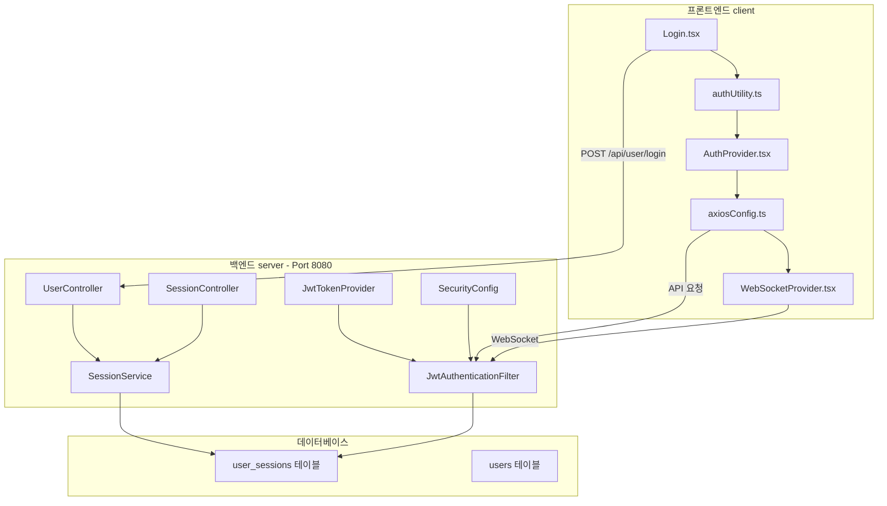
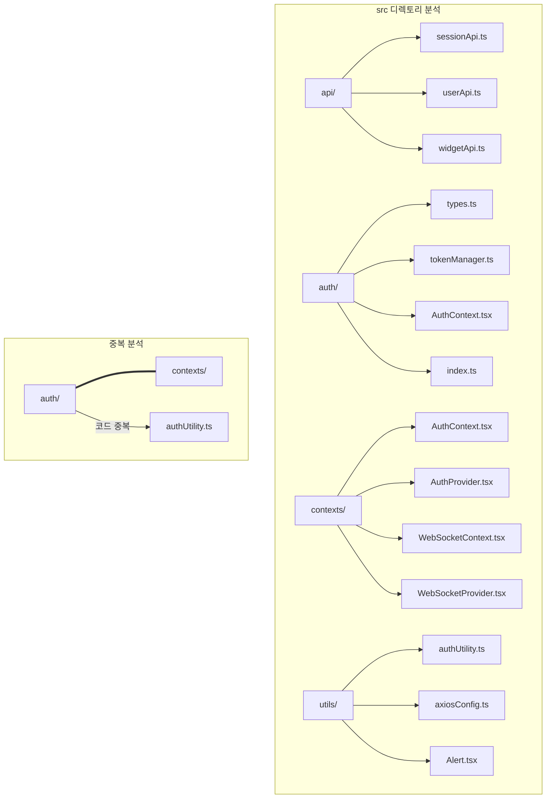

# 인증/토큰/보안 통합 분석 및 개선 계획 (v3.0 수정본)

## 📅 문서 정보

- **버전**: 3.0
- **작성일**: 2026-02-06
- **작성자**: AI Assistant
- **대상 프로젝트**: SpringTutorial (프론트엔드 + 백엔드)
- **특이사항**: v2.0에서 발생했던 모듈화 오류 문제 해결을 위한 전면 재분석 버전

---

## 🔍 1. 현재 아키텍처 개요

### 1.1 시스템 구성



### 1.2 토큰 구조

| 토큰 | 저장소 | 만료 시간 | 용도 |
|------|--------|----------|------|
| **Access Token** | localStorage | 환경 변수 설정 가능 | API 요청 인증 |
| **Refresh Token** | HttpOnly Cookie | 7일 (604800초) | Access Token 갱신 |

### 1.3 현재 포트 설정 (유지 필수)

| 포트 | 프로토콜 | 용도 |
|------|----------|------|
| 5173 | HTTP | 개발 환경 HTTP |
| 5174 | HTTPS | 개발 환경 HTTPS |

**npm run dev** 실행 시 두 포트가 동시에 실행됨 (package.json 설정 유지)

---

## ⚠️ 2. 발견된 문제점 종합

### 🐛 발견된 버그 (즉시 수정 필요)

| # | 문제 | 위치 | 원인 | 심각도 |
|---|------|------|------|--------|
| 1 | **모든 기기 로그아웃 후 403 무한 루프** | `axiosConfig.ts:118` | 403 에러에서 logout() 재호출 → 무한 루프 | 🔴 높음 |
| 2 | **logout 중복 API 호출** | `authUtility.ts:204` | logout()에서 sessionApi.logout() 호출 후 axios interceptor에서 다시 logout() 호출 | 🔴 높음 |
| 3 | **대시보드 로그아웃 후 이동하지 않음** | `AuthProvider.tsx` | logout 함수에서 상태 정리 후 navigate 호출时机 문제 | 🟡 중간 |
| 4 | **logout -> logout 중첩** | `AuthProvider.tsx` | logout() 호출 → utilityLogout() → axios 403 → logout() | 🟡 중간 |

### 체크리스트

| # | 문제 | 위치 | 체크 |
|---|------|------|------|
| 1 | **테스트 모드 토큰 시간 설정** | [`authUtility.ts:13`](src/utils/authUtility.ts:13), application.yml | ☐ 토큰 시간 10초/30초로 조절 가능 여부 확인 |
| 2 | **쿠키 SameSite 불일치** | [`UserController.java`](../server/src/main/java/com/example/demo/domain/user/controller/UserController.java), [`SessionController.java`](../server/src/main/java/com/example/demo/domain/user/controller/SessionController.java), [`authUtility.ts:160`](src/utils/authUtility.ts:160) | ☐ 크로스오리진 쿠키 전송 확인 |
| 3 | **Refresh Token Rotation 미구현** | [`SessionService.java`](../server/src/main/java/com/example/demo/domain/user/service/SessionService.java) | ☐ 토큰Rotation 적용 여부 확인 |
| 4 | **window.location.href 사용** | [`authUtility.ts:196`](src/utils/authUtility.ts:196) | ☐ navigate()로 변경 필요 (완료) |
| 5 | **코드 중복** | [`authUtility.ts`](src/utils/authUtility.ts) vs [`AuthProvider.tsx`](src/contexts/AuthProvider.tsx) | ☐ 리팩토링 필요 |
| 6 | **재연결 로직** | [`WebSocketProvider.tsx:109`](src/contexts/WebSocketProvider.tsx:109) | ☐ 재시도 로직 확인 |

---

## 📋 3. Phase 1: 긴급 수정 (인증 흐름 수정)

### 3.0 버그 수정 (재분석 중 발견)

#### 🐛 버그 1: 403 무한 루프 수정

**문제:** axios interceptor 403 처리에서 logout() 재호출 → 무한 루프

**수정 대상:** [`src/utils/axiosConfig.ts`](src/utils/axiosConfig.ts)

```typescript
// ========== BEFORE (line 96-120) ==========
// 403 접근 거부
if (status === 403) {
  if (isRefreshing()) {
    return new Promise((resolve) => {
      addRefreshSubscriber((token: string) => {
        // ...
      });
    });
  }
  
  if (errorCode === 'A006') {
    showToast("본인의 기기만 로그아웃 할 수 있습니다.", "error");
  } else {
    showToast("접근이 거부되었습니다.", "error");  // ← 계속 호출됨
  }
  logout();  // ← 403에서 logout() 호출 → 무한 루프
  return Promise.reject(error);
}

// ========== AFTER ==========
// 403 접근 거부
if (status === 403) {
  // 이미 logout 중이면 중복 호출 방지
  if (isRefreshing()) {
    return new Promise((resolve) => {
      addRefreshSubscriber((token: string) => {
        // ...
      });
    });
  }
  
  // 토큰이 이미 정리되었으면 중복 로그아웃 방지
  const token = localStorage.getItem('accessToken');
  if (!token) {
    // 이미 로그아웃 상태
    return Promise.reject(error);
  }
  
  if (errorCode === 'A006') {
    showToast("본인의 기기만 로그아웃 할 수 있습니다.", "error");
  } else {
    showToast("접근이 거부되었습니다.", "error");
  }
  logout();
  return Promise.reject(error);
}
```

#### 🐛 버그 2: logout API 중복 호출 수정

**문제:** logout()에서 sessionApi.logout() 호출 후 axios interceptor에서 다시 logout() 호출

**수정 대상:** [`src/utils/authUtility.ts`](src/utils/authUtility.ts)

```typescript
// ========== BEFORE (line 184-214) ==========
export const logout = async (reason?: string): Promise<void> => {
  // 토스트를 먼저 보여주고 대기
  if (reason) {
    showToast(reason, 'error');
  }
  
  await new Promise(resolve => setTimeout(resolve, 1000));
  
  // 로컬 스토리지 정리
  localStorage.removeItem('accessToken');
  // ...
  
  // 서버 로그아웃 API 호출
  try {
    await sessionApi.logout();  // ← 여기서 403 발생 가능
  } catch {
    // 서버 로그아웃 실패해도 클라이언트 측 로그아웃은 수행
  }
  
  deleteRefreshTokenCookie();
  redirectToLogin();
};

// ========== AFTER ==========
let isLoggingOut = false;

export const logout = async (reason?: string): Promise<void> => {
  // 이미 로그아웃 중이면 중복 호출 방지
  if (isLoggingOut) {
    return;
  }
  isLoggingOut = true;
  
  try {
    // 토스트를 먼저 보여주고 대기
    if (reason) {
      showToast(reason, 'error');
    }
    
    await new Promise(resolve => setTimeout(resolve, 1000));
    
    // 로컬 스토리지 정리 (먼저 정리)
    localStorage.removeItem('accessToken');
    localStorage.removeItem('myId');
    localStorage.removeItem(TOKEN_EXPIRY_KEY);
    localStorage.removeItem(TOKEN_REFRESHING_KEY);
    
    refreshSubscribers = [];
    
    // 쿠키 삭제
    deleteRefreshTokenCookie();
    
    // 서버 로그아웃 API 호출 (로컬 정리 후)
    // 注意: 이미 토큰이 정리되었으므로 403이 발생해도 interceptor에서 처리하지 않음
    try {
      await sessionApi.logout();
    } catch {
      // 서버 로그아웃 실패해도 클라이언트 측 로그아웃은 이미 완료
    }
    
    // 로그인 페이지로 이동
    redirectToLogin();
  } finally {
    isLoggingOut = false;
  }
};
```

#### 🐛 버그 3: AuthProvider logout 중첩 방지

**문제:** AuthProvider.logout() → utilityLogout() → axios 403 → logout() 중첩

**수정 대상:** [`src/contexts/AuthProvider.tsx`](src/contexts/AuthProvider.tsx)

```typescript
// ========== BEFORE (line 45-52) ==========
const logout = useCallback(async (reason?: string) => {
  // 먼저 로컬 상태 정리
  setAccessToken(null);
  setMyId(null);
  
  // utilityLogout은 비동기이므로 await
  await utilityLogout(reason);
}, []);

// ========== AFTER ==========
const logout = useCallback(async (reason?: string) => {
  // 먼저 로컬 상태 정리 (중요: API 호출 전에 정리)
  setAccessToken(null);
  setMyId(null);
  
  // utilityLogout 호출 (중복 호출은 utility 내부에서 방지)
  await utilityLogout(reason);
}, []);
```

### 3.1 authUtility.ts - navigate()로 변경

#### 목표
- `window.location.href = '/'`를 `navigate('/')`로 변경
- 페이지 깜빡임 방지, UX 개선

#### 수정 대상 파일

**[`src/utils/authUtility.ts`](src/utils/authUtility.ts)**

```typescript
// ========== BEFORE ==========
import { sessionApi } from '../api/sessionApi';
import { showToast } from './Alert';

// ... (중략)

// ========== AFTER ==========
import { sessionApi } from '../api/sessionApi';
import { showToast } from './Alert';
import { useNavigate } from 'react-router-dom';

// React Router의 navigate를 사용하기 위한 래퍼
let navigateInstance: ((path: string) => void) | null = null;

export const setNavigate = (navigate: (path: string) => void): void => {
  navigateInstance = navigate;
};

// 로그인 페이지 리다이렉트
const redirectToLogin = (): void => {
  if (navigateInstance) {
    navigateInstance('/');
  } else {
    // navigate가 설정되지 않은 경우 fallback
    console.warn('[authUtility] navigate가 설정되지 않음, href 사용');
    window.location.href = '/';
  }
};

// ========== BEFORE (logout 함수) ==========
export const logout = async (reason?: string): Promise<void> => {
  // ... (중략)
  
  if (window.location.pathname !== '/') {
    window.location.href = '/';  // ← 이 부분 수정
  }
};

// ========== AFTER (logout 함수) ==========
export const logout = async (reason?: string): Promise<void> => {
  // ... (중략)
  
  redirectToLogin();
};
```

### 3.2 AuthProvider.tsx - navigate 설정

**[`src/contexts/AuthProvider.tsx`](src/contexts/AuthProvider.tsx)**

```typescript
// ========== BEFORE ==========
import { createContext, useContext, useState, useEffect } from 'react';
import { sessionApi } from '../api/sessionApi';

// ... (중략)

// ========== AFTER ==========
import { createContext, useContext, useState, useEffect } from 'react';
import { sessionApi } from '../api/sessionApi';
import { useNavigate } from 'react-router-dom';
import { setNavigate } from '../utils/authUtility';

// ... (중략)

export const AuthProvider: React.FC<{ children: React.ReactNode }> = ({ children }) => {
  const navigate = useNavigate();
  
  useEffect(() => {
    // authUtility에 navigate 함수 설정
    setNavigate((path: string) => navigate(path));
  }, [navigate]);
  
  // ... (기존 코드 유지)
};
```

---

## ✅ Phase 1 완료 (2026-02-06) - 긴급 수정

### 완료된 작업

| # | 작업 내용 | 파일 | 상태 |
|---|---------|------|------|
| 1 | **403 무한 루프 해결** | [`axiosConfig.ts`](src/utils/axiosConfig.ts) | 완료 |
| 2 | **중심화된 logout 함수** | [`authUtility.ts`](src/utils/authUtility.ts) | 완료 |
| 3 | **isLoggingOut 플래그** | [`authUtility.ts:178`](src/utils/authUtility.ts:178) | 완료 |
| 4 | **emitLogoutEvent 추가** | [`authUtility.ts:167`](src/utils/authUtility.ts:167) | 완료 |
| 5 | **GlobalLogoutHandler** | [`App.tsx:16`](src/App.tsx:16) | 완료 |
| 6 | **WebSocket authLogout 리스너** | [`WebSocketProvider.tsx:133`](src/contexts/WebSocketProvider.tsx:133) | 완료 |
| 7 | **Login.tsx forceReconnect** | [`Login.tsx:14`](src/pages/Login.tsx:14) | 완료 |
| 8 | **pathname 체크 제거** | [`WebSocketProvider.tsx:20`](src/contexts/WebSocketProvider.tsx:20) | 완료 |
| 9 | **백엔드 IllegalStateException** | [`WebSocketHandler.java:123`](../server/src/main/java/com/example/demo/handler/WebSocketHandler.java:123) | 완료 |
| 10 | **ESLint 통과** | 전역 | 완료 |

### 핵심 변경 사항

**1. authUtility.ts - logout 함수**
```typescript
let isLoggingOut = false;

export const logout = async (reason?: string): Promise<void> => {
  if (isLoggingOut) return;
  isLoggingOut = true;
  
  if (reason) {
    showToast(reason, 'error');
  }
  
  await new Promise(resolve => setTimeout(resolve, 1000));
  
  localStorage.removeItem('accessToken');
  localStorage.removeItem('myId');
  localStorage.removeItem(TOKEN_EXPIRY_KEY);
  localStorage.removeItem(TOKEN_REFRESHING_KEY);
  refreshSubscribers = [];
  
  deleteRefreshTokenCookie();
  
  emitLogoutEvent();
  
  try {
    await sessionApi.logout();
  } catch {
    // 실패해도 클라이언트 로그아웃은 완료
  }
  
  isLoggingOut = false;
};
```

**2. App.tsx - GlobalLogoutHandler**
```typescript
function GlobalLogoutHandler() {
  const navigate = useNavigate();
  
  useEffect(() => {
    const handleLogout = () => {
      navigate('/', { replace: true });
    };
    window.addEventListener('authLogout', handleLogout);
    return () => window.removeEventListener('authLogout', handleLogout);
  }, [navigate]);
  
  return null;
}
```

**3. WebSocketProvider.tsx - pathname 체크 제거**
```typescript
const connectSocket = useCallback(() => {
  // 토큰이 없으면 연결하지 않음 (pathname 체크 제거)
  const token = localStorage.getItem('accessToken');
  let myId = localStorage.getItem('myId');
  
  if (!token || !myId) {
    return;
  }
  // ... 연결 로직
}, [WS_URL]);
```

**4. WebSocketHandler.java - 레이스 컨디션 방지**
```java
public void broadcastToTarget(WebSocketSession session, TextMessage message) {
  synchronized (session) {
    if (!session.isOpen()) {
      return;
    }
    try {
      session.sendMessage(message);
    } catch (IllegalStateException e) {
      log.debug("메시지 전송 중 세션关闭 (정상): {}", session.getId());
    } catch (IOException e) {
      log.debug("메시지 전송 실패: {}", session.getId());
    }
  }
}
```

---

## 📋 4. Phase 2: 프로젝트 재분석

### 4.1 현재 프로젝트 구조 분석



### 4.2 인증 관련 파일 매핑

| 기능 | 파일 | 상태 |
|------|------|------|
| 토큰 관리 | [`auth/tokenManager.ts`](src/auth/tokenManager.ts) | 분석 필요 |
| 토큰 관리 | [`utils/authUtility.ts`](src/utils/authUtility.ts) | 분석 필요 |
| 인증 컨텍스트 | [`auth/AuthContext.tsx`](src/auth/AuthContext.tsx) | 분석 필요 |
| 인증 프로바이더 | [`contexts/AuthProvider.tsx`](src/contexts/AuthProvider.tsx) | 분석 필요 |
| 세션 API | [`api/sessionApi.ts`](src/api/sessionApi.ts) | 분석 필요 |
| axios 설정 | [`utils/axiosConfig.ts`](src/utils/axiosConfig.ts) | 분석 필요 |

---

## 📋 5. Phase 3: 보안 강화 (재분석 후 진행)

### 5.1 Refresh Token Rotation

#### 멀티디바이스 호환성

**현재 설계**: 한 아이디로 여러 디바이스/프로필에서 동시 접속 가능

**Refresh Token Rotation 적용 시**: 문제 없음 ✅

| 디바이스 | 세션 ID | Refresh Token | Rotation 적용 시 | 영향 |
|----------|---------|---------------|------------------|------|
| PC-Chrome | session_001 | refresh_A | session_001의 RT만 갱신 | ✅ 다른 디바이스 영향 없음 |
| Phone-Safari | session_002 | refresh_B | session_002의 RT만 갱신 | ✅ 다른 디바이스 영향 없음 |
| Tablet-Edge | session_003 | refresh_C | session_003의 RT만 갱신 | ✅ 다른 디바이스 영향 없음 |

**왜냐하면:**
- 각 디바이스는 고유한 `session_id`를 가짐
- Refresh Token Rotation은 **세션 단위**로 작동
- DB의 `user_sessions` 테이블이 `session_id`로 구분

#### 주의사항

**같은 브라우저의 여러 탭에서 동일 세션 사용 시:**
- 첫 번째 탭이 토큰 갱신 → 두 번째 탭의 Refresh Token 무효화
- 이것은 **보안상 정상 동작** (토큰 탈취 방지)

#### 구현 범위

| 파일 | 수정 내용 |
|------|----------|
| `RefreshSessionRes.java` | refreshToken 필드 추가 |
| `SessionService.java` | 새 Refresh Token 발급 및 DB 업데이트 |
| `SessionMapper.java` | updateRefreshToken 메서드 추가 |
| `SessionMapper.xml` | UPDATE 쿼리 추가 |
| `authUtility.ts` | 새 Refresh Token 쿠키 동기화 처리 |

### 5.2 쿠키 SameSite 통일

### 5.3 재연결 로직 개선

### 5.4 에러 처리 통합

---

## 📋 6. Phase 4: 모듈화 (마지막 단계)

### 6.1 인증 모듈 분리

### 6.2 테스트 통합

---

## 📋 7. 실행 순서 (Todo List)

### Phase 1: 긴급 수정 ✅ 완료
- [x] 3.1 authUtility.ts - navigate() 래퍼 추가 및 logout 수정
- [x] 3.2 AuthProvider.tsx - navigate 설정 추가
- [x] WebSocket 연결 안정화 (pathname 체크 제거)
- [x] 백엔드 IllegalStateException 처리
- [x] ESLint 통과 확인

### Phase 2: 프로젝트 재분석
- [ ] 4.1 현재 프로젝트 전체 구조 분석
- [ ] 4.2 인증 관련 파일별 기능 매핑
- [ ] 중복 코드 식별 및 통합 계획 수립

### Phase 3: 보안 강화 (재분석 후 진행)
- [ ] Refresh Token Rotation 적용
- [ ] 쿠키 SameSite 통일
- [ ] 재연결 로직 개선
- [ ] 에러 처리 통합

### Phase 4: 모듈화 (마지막)
- [ ] 인증 모듈 분리
- [ ] 테스트 통합

---

## 📋 8. 체크리스트

### 시작 전 확인사항
- [x] 테스트 모드 토큰 시간 (10초/30초) 조절 가능 확인
- [x] http/https 동시 실행 설정 유지 확인 (package.json)
- [x] navigate() 변경으로 UX 개선 확인

### 수정 후 확인사항
- [x] 로그아웃 시 페이지 깜빡임 없음
- [x] 토스트 메시지가 정상적으로 표시됨
- [x] HTTP/HTTPS 포트 모두 정상 동작
- [x] WebSocket 연결 정상 동작
- [x] 기기 로그아웃/전체 로그아웃 정상 동작
