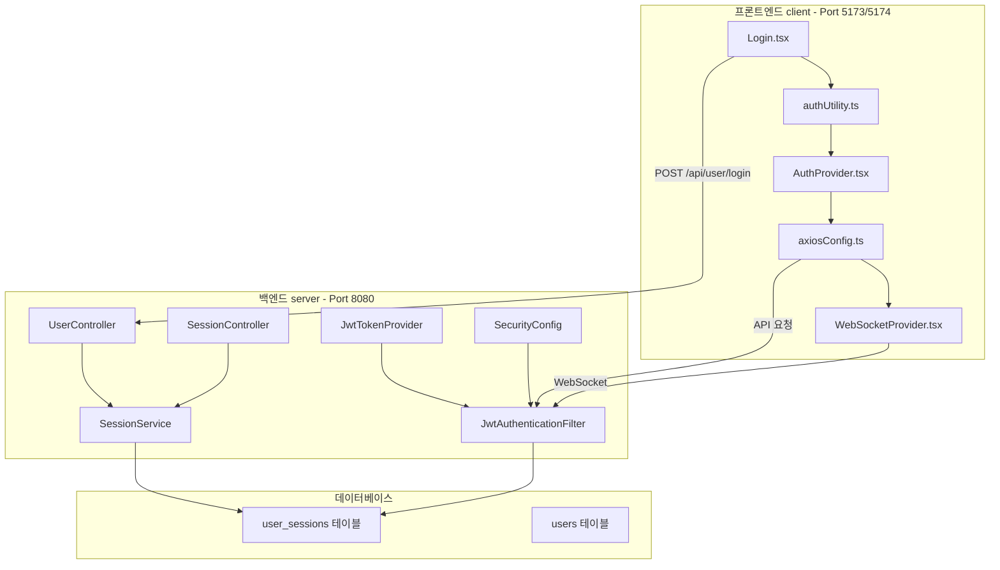

# 인증/토큰/보안 통합 분석 및 개선 계획 (v4.0)

## 📅 문서 정보

- **버전**: 4.0
- **작성일**: 2026-02-06
- **작성자**: AI Assistant
- **대상 프로젝트**: SpringTutorial (프론트엔드 + 백엔드)
- **특이사항**: 사용자 피드백 반영 + 모듈화 이전 전면 재분석 버전

---

## ⚠️ 중요 원칙 (반드시 준수)

### 🚫 절대 금지 사항

1. **window.location.href 사용 금지**: 항상 `navigate('/')` 사용 (UX 깜빡임 방지)
2. **ESLint 에러 회피 금지**: `// eslint-disable-next-line` 등으로 우회하지 말 것. 정식 수정할 것.
3. **임시 workaround 금지**: 문제의 근본 원인을 해결할 것. 임시 방편은 허용하지 않음.

### ✅ 필수 준수 사항

1. **HTTP/HTTPS 동시 사용 유지**: package.json 설정 절대 변경 금지
2. **테스트 모드 토큰 시간**: 10초/30초 등으로 조절 가능해야 함 (중요한 문제가 아님)
3. **모듈화는 마지막 단계**: 프로젝트 전체 재분석 완료 후 진행

---

## 🔍 1. 현재 아키텍처 개요

### 1.1 시스템 구성



### 1.2 토큰 구조

| 토큰 | 저장소 | 만료 시간 | 용도 |
|------|--------|----------|------|
| **Access Token** | localStorage | 환경 변수 설정 가능 | API 요청 인증 |
| **Refresh Token** | HttpOnly Cookie | 7일 (604800초) | Access Token 갱신 |

### 1.3 현재 포트 설정 (절대 변경 금지)

| 포트 | 프로토콜 | 용도 |
|------|----------|------|
| 5173 | HTTP | 개발 환경 HTTP |
| 5174 | HTTPS | 개발 환경 HTTPS |

**npm run dev** 실행 시 두 포트가 동시에 실행됨 (package.json 설정 유지 필수)

---

## 📋 2. 체크리스트

### 2.1 Phase 1: 긴급 수정 (이미 완료됨)

| # | 작업 내용 | 파일 | 상태 | 확인 |
|---|---------|------|------|------|
| 1 | 403 무한 루프 해결 | [`axiosConfig.ts`](src/utils/axiosConfig.ts) | 완료 | ☐ |
| 2 | 중심화된 logout 함수 | [`authUtility.ts`](src/utils/authUtility.ts) | 완료 | ☐ |
| 3 | isLoggingOut 플래그 | [`authUtility.ts`](src/utils/authUtility.ts) | 완료 | ☐ |
| 4 | emitLogoutEvent 추가 | [`authUtility.ts`](src/utils/authUtility.ts) | 완료 | ☐ |
| 5 | GlobalLogoutHandler | [`App.tsx`](src/App.tsx) | 완료 | ☐ |
| 6 | WebSocket authLogout 리스너 | [`WebSocketProvider.tsx`](src/contexts/WebSocketProvider.tsx) | 완료 | ☐ |
| 7 | Login.tsx forceReconnect | [`Login.tsx`](src/pages/Login.tsx) | 완료 | ☐ |
| 8 | pathname 체크 제거 | [`WebSocketProvider.tsx`](src/contexts/WebSocketProvider.tsx) | 완료 | ☐ |
| 9 | 백엔드 IllegalStateException | [`WebSocketHandler.java`](../server/src/main/java/com/example/demo/handler/WebSocketHandler.java) | 완료 | ☐ |
| 10 | ESLint 통과 | 전역 | 완료 | ☐ |
| 11 | navigate() 사용 확인 | [`authUtility.ts`](src/utils/authUtility.ts) | 완료 | ☐ |

### 2.2 Phase 2: 코드 개선

| # | 작업 내용 | 파일 | 상태 | 확인 |
|---|---------|------|------|------|
| 1 | 중복 shouldRefresh 함수 제거 | [`AuthProvider.tsx`](src/contexts/AuthProvider.tsx) | 대기 | ☐ |
| 2 | 임의의 타임아웃을 상수로 변경 | 다중 파일 | 대기 | ☐ |
| 3 | auth/ 디렉토리 분석 및 정리 | [`auth/`](src/auth/) | 대기 | ☐ |

### 2.3 Phase 3: 보안 강화 (모듈화 이전)

| # | 작업 내용 | 파일 | 상태 | 확인 |
|---|---------|------|------|------|
| 1 | Refresh Token Rotation 적용 | [`SessionService.java`](../server/src/main/java/com/example/demo/domain/user/service/SessionService.java) | 대기 | ☐ |
| 2 | 쿠키 SameSite 통일 | [`UserController.java`](../server/src/main/java/com/example/demo/domain/user/controller/UserController.java) | 대기 | ☐ |
| 3 | 재연결 로직 개선 | [`WebSocketProvider.tsx`](src/contexts/WebSocketProvider.tsx) | 대기 | ☐ |

### 2.4 Phase 4: 모듈화 (마지막 단계)

| # | 작업 내용 | 파일 | 상태 | 확인 |
|---|---------|------|------|------|
| 1 | 인증 모듈 분리 | [`src/auth/`](src/auth/) | 대기 | ☐ |
| 2 | 프로젝트 전체 재분석 | 전역 | 대기 | ☐ |
| 3 | 아키텍처 리팩토링 | 전역 | 대기 | ☐ |

### 2.5 테스트 및 설정 확인 (항상 가능해야 함)

| # | 작업 내용 | 위치 | 확인 |
|---|---------|------|------|
| 1 | **테스트 모드 토큰 시간 설정** | [`authUtility.ts`](src/utils/authUtility.ts:13), application.yml | ☐ 10초/30초로 조절 가능 |
| 2 | **HTTP/HTTPS 동시 사용** | package.json | ☐ 5173/5174 포트 동시 실행 |
| 3 | **쿠키 SameSite** | 백엔드 컨트롤러 | ☐ HTTP/HTTPS 모두 정상 동작 |

---

## 📋 3. Phase 2: 코드 개선 (현재 진행 중)

### 3.1 중복 shouldRefresh 함수 제거

**문제**: AuthProvider.tsx에 authUtility.ts의 shouldRefreshToken()과 중복되는 함수 존재

**대상 파일**: [`src/contexts/AuthProvider.tsx`](src/contexts/AuthProvider.tsx)

**수정 방향**:
```typescript
// AuthProvider.tsx에서 중복 함수 제거 후
import { shouldRefreshToken } from '../utils/authUtility';

// 사용
if (!shouldRefreshToken()) {
  return;
}
```

### 3.2 임의의 타임아웃을 상수로 변경

**문제**: setTimeout에 100ms, 200ms, 500ms, 3000ms 등 임의의 값 사용

**대상 파일**: 다중 파일

**수정 방향**:
```typescript
// 상수 정의
const LOGOUT_DELAY_MS = 1000;
const LOGIN_REDIRECT_DELAY_MS = 100;
const TOKEN_CHECK_INTERVAL = 1000;

// 사용
await new Promise(resolve => setTimeout(resolve, LOGOUT_DELAY_MS));
```

### 3.3 auth/ 디렉토리 분석

**현재 상태**:
- [`src/auth/`](src/auth/) 디렉토리 존재
- [`auth/tokenManager.ts`](src/auth/tokenManager.ts) 파일 존재
- [`auth/AuthContext.tsx`](src/auth/AuthContext.tsx) 파일 존재

**분석 필요**:
- auth/와 utils/authUtility.ts 중복 기능 확인
- contexts/AuthProvider.tsx와의 관계 정리
- 사용 여부 확인 후 정리

---

## 📋 4. Phase 3: 보안 강화 (모듈화 이전)

### 4.1 Refresh Token Rotation 적용

**목표**: Access Token 갱신 시 새 Refresh Token도 함께 발급

**대상 파일**:
- [`SessionService.java`](../server/src/main/java/com/example/demo/domain/user/service/SessionService.java)
- [`RefreshSessionRes.java`](../server/src/main/java/com/example/demo/domain/user/dto/RefreshSessionRes.java)
- [`SessionMapper.java`](../server/src/main/java/com/example/demo/domain/user/mapper/SessionMapper.java)
- [`authUtility.ts`](src/utils/authUtility.ts)

### 4.2 쿠키 SameSite 통일

**목표**: 백엔드와 프론트엔드의 쿠키 SameSite 속성 통일

**대상 파일**:
- [`UserController.java`](../server/src/main/java/com/example/demo/domain/user/controller/UserController.java)
- [`SessionController.java`](../server/src/main/java/com/example/demo/domain/user/controller/SessionController.java)
- [`authUtility.ts`](src/utils/authUtility.ts)

### 4.3 재연결 로직 개선

**목표**: WebSocket 재시도 로직 개선

**대상 파일**:
- [`WebSocketProvider.tsx`](src/contexts/WebSocketProvider.tsx)

---

## 📋 5. Phase 4: 모듈화 (마지막 단계)

### 5.1 인증 모듈 분리

**목표**: 인증 관련 기능을 독립적인 모듈로 분리

**대상 디렉토리**: [`src/auth/`](src/auth/)

**단계**:
1. 현재 auth/ 디렉토리 분석
2. utils/authUtility.ts에서 인증 관련 함수 추출
3. 독립적인 인증 모듈로 구성
4. contexts/AuthProvider.tsx와 통합

### 5.2 프로젝트 전체 재분석

**목표**: 모듈화 전에 프로젝트 전체 구조를 다시 분석

**분석 내용**:
- 모든 인증 관련 파일 의존성 분석
- 중복 기능 정리
- 아키텍처 개선점 식별

### 5.3 아키텍처 리팩토링

**목표**: 분석 결과를 바탕으로 아키텍처 개선

**방향**:
- 단일 진실 공급원 원칙 적용
- 코드 중복 최소화
- 유지보수성 향상

---

## 📋 6. 테스트 시나리오

### 6.1 기본 인증 흐름

| # | 시나리오 | 예상 결과 | 확인 |
|---|---------|----------|------|
| 1 | 정상 로그인 | 토큰 저장, 대시보드 이동 | ☐ |
| 2 | 토큰 만료 시 | 자동 갱신, API 연속 동작 | ☐ |
| 3 | 수동 로그아웃 | 토큰 삭제, 로그인 페이지 이동 | ☐ |
| 4 | 다른 기기 로그아웃 | 403 에러, 로그인 페이지 이동 | ☐ |
| 5 | WebSocket 재연결 | 자동 재연결, 메시지 수신 | ☐ |

### 6.2 테스트 모드 설정

| # | 설정 | 토큰 시간 | 확인 |
|---|------|----------|------|
| 1 | 기본값 | 30분 (1800초) | ☐ |
| 2 | 테스트 모드 | 10초 | ☐ |
| 3 | 짧은 테스트 | 30초 | ☐ |

### 6.3 HTTP/HTTPS 설정

| # | 프로토콜 | 포트 | 확인 |
|---|---------|------|------|
| 1 | HTTP | 5173 | ☐ 쿠키 정상 전송 |
| 2 | HTTPS | 5174 | ☐ 쿠키 정상 전송 |

---

## 📋 7. 주의사항

### 7.1 코드 수정 시

1. **ESLint 에러 발생 시**: 즉시 수정하고, 우회하지 말 것
2. **window.location.href 사용**: 절대 금지. navigate() 사용할 것
3. **새로운 의존성 추가**: 기존 구조를 먼저 확인하고 필요할 때만 추가

### 7.2 테스트 시

1. **토큰 시간 조절**: 언제든 10초/30초 등으로 변경 가능 (문제가 아님)
2. **HTTP/HTTPS**: 두 프로토콜 모두 테스트할 것
3. **임시 코드**: 테스트 후 반드시 정리할 것

### 7.3 모듈화 시

1. **완전한 분석 후**: 모듈화 전에 프로젝트 전체를 완전히 분석할 것
2. **점진적 리팩토링**: 한 번에 많은 변경을 피할 것
3. **기능 유지**: 리팩토링 중 기능이 항상 동작해야 함

---

## 📅 진행 일정

| Phase | 내용 | 상태 |
|-------|------|------|
| Phase 1 | 긴급 수정 (403 루프, logout 등) | 완료 |
| Phase 2 | 코드 개선 (중복 제거, 상수화) | 진행 중 |
| Phase 3 | 보안 강화 (Refresh Rotation 등) | 대기 |
| Phase 4 | 모듈화 (마지막 단계) | 대기 |

---

## 🔧 참고 자료

### 현재 설정 확인

**토큰 만료 시간**:
- [`authUtility.ts:13`](src/utils/authUtility.ts:13) - 프론트엔드 설정
- [`application.yml`](../server/src/main/resources/application.yml) - 백엔드 설정

**HTTP/HTTPS 설정**:
- [`package.json`](package.json) - npm scripts
- [`vite.config.ts`](vite.config.ts) - Vite 설정

**인증 관련 파일**:
- [`authUtility.ts`](src/utils/authUtility.ts) - 중심 유틸리티
- [`AuthProvider.tsx`](src/contexts/AuthProvider.tsx) - 인증 컨텍스트
- [`axiosConfig.ts`](src/utils/axiosConfig.ts) - Axios 설정

---

**문서 버전**: 4.0
**최종 수정일**: 2026-02-06
**작성자**: AI Assistant
