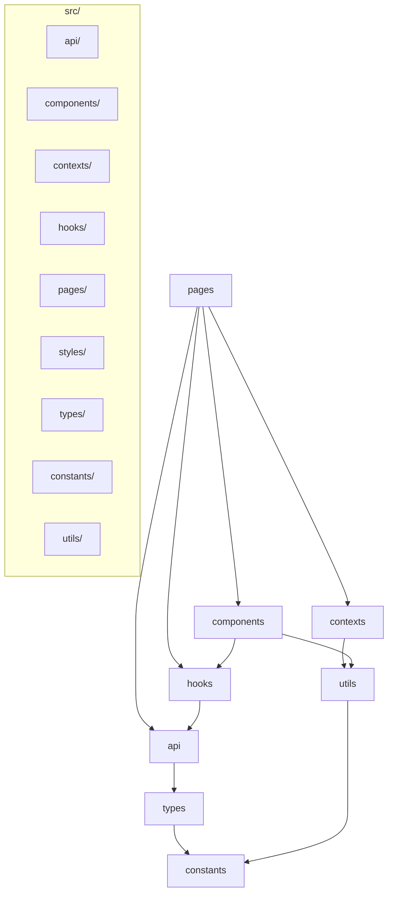

# 프로젝트 아키텍처 종합 점검 보고서 (1차)

## 📅 문서 정보

- **버전**: 1.0
- **작성일**: 2026-02-06
- **대상**: SpringTutorial 프론트엔드 프로젝트
- **목적**: 운영 전환 전 종합 점검 및 개선 과제 도출

---

## 1. 발견된 문제점 종합

### 🔴 심각도: 높음 - 즉시 수정 필요

| # | 문제 | 위치 | 영향 | 수정 우선순위 |
|---|------|------|------|---------------|
| 1 | **타입 중복 정의** | [`dtos.ts`](src/types/dtos.ts) vs [`weather.ts`](src/types/weather.ts) | 유지보수 어려움, 불일치 위험 | **P0** |
| 2 | **API 중복** | [`userApi.logout`](src/api/userApi.ts:16) vs [`sessionApi.logout`](src/api/sessionApi.ts:6) | 불필요한 네트워크 요청 | **P0** |
| 3 | **하드코딩 상수** | [`Login.tsx:10`](src/pages/Login.tsx:10) | 상수 중앙화 미준수 | **P0** |

### 🟡 심각도: 중간 -尽快 수정 권장

| # | 문제 | 위치 | 영향 | 수정 우선순위 |
|---|------|------|------|---------------|
| 4 | **Console 로그 과다** | 전역 32개 소스 | 디버그 정보 노출 | P1 |
| 5 | **useEffect 의존성** | [`App.tsx:27`](src/App.tsx:27) | 불필요한 재렌더링 | P1 |
| 6 | **하드코딩 기본값** | [`Login.tsx:13-14`](src/pages/Login.tsx:13) | 보안 위험 (개발용) | P2 |
| 7 | **Error Boundary 부재** | 전역 | 예외 처리 누락 | P2 |

### 🟢 심각도: 낮음 - 개선 권장

| # | 문제 | 위치 | 영향 |
|---|------|------|------|
| 8 | **주석 불일치** | [`dtos.ts:47`](src/types/dtos.ts:47) | 혼란 |
| 9 | **불필요한 import** | 여러 파일 | 번들 크기 증가 |
| 10 | **타입 가드 중복** | [`WebSocketContext.tsx`](src/contexts/WebSocketContext.tsx) | 코드 중복 |

---

## 2. 상세 문제 분석

### 2.1 타입 중복 정의 (P0)

```typescript
// src/types/dtos.ts
export interface HourlyData {
  time: string;
  temp: number;
  sky: string;
  type?: string;
  isNight?: boolean;
}

// src/types/weather.ts (중복!)
export interface HourlyData {
  time: string;
  temp: number;
  sky: string;
  type?: string;
  isNight?: boolean;
}
```

**영향**: 두 파일 중 하나만 수정하면 다른 파일과의 불일치 발생

### 2.2 API 중복 (P0)

```typescript
// userApi.ts
logout: async () => {
  const { data } = await axios.post('/api/user/logout');
  return data;
}

// sessionApi.ts (중복!)
logout: async () => {
  const { data } = await axios.post('/api/user/logout');
  return data;
}
```

**영향**: 불필요한 코드, 유지보수 어려움

### 2.3 하드코딩 상수 (P0)

```typescript
// Login.tsx
const NAVIGATE_DELAY_LOGIN = 100;  // 하드코딩

// constants/auth.ts (올바른 위치)
NAVIGATE_DELAY_LOGIN: 100
```

### 2.4 Console 로그 과다 (P1)

| 파일 | console.log | console.error | console.warn |
|------|-------------|---------------|--------------|
| AuthProvider.tsx | 1 | 0 | 0 |
| UserLocationProvider.tsx | 1 | 2 | 4 |
| CesiumCameraProvider.tsx | 0 | 0 | 1 |
| Dashboard.tsx | 1 | 1 | 0 |
| ... | ... | ... | ... |
| **총계** | **15+** | **12+** | **5+** |

**영향**: 운영 환경에서 디버그 정보 노출, 성능 저하 가능

### 2.5 React useEffect 의존성 문제 (P1)

```typescript
// App.tsx - 문제 코드
const GlobalLogoutHandler = () => {
  const navigate = useNavigate();
  
  useEffect(() => {
    const handleLogout = () => {
      navigate('/', { replace: true });  // navigate 의존성 문제
    };
    window.addEventListener('authLogout', handleLogout);
    return () => window.removeEventListener('authLogout', handleLogout);
  }, [navigate]);  // navigate가 변경될 때마다 재등록
};
```

---

## 3. 운영 준비 체크리스트

### 3.1 보안 체크리스트

| 항목 | 상태 | 비고 |
|------|------|------|
| 민감 정보 하드코딩 | ⚠️ | Login.tsx에 기본값 있음 |
| API 키/시크릿 노출 | ✅ | 없음 |
| XSS防护 | ✅ | 적절한 처리됨 |
| CSRF 보호 | ⚠️ | Spring Security 설정 확인 필요 |
| 토큰 저장소 | ⚠️ | localStorage 사용 (XSS 위험) |
| HTTPS 사용 | ✅ | vite.config.ts에 설정됨 |

### 3.2 성능 체크리스트

| 항목 | 상태 | 비고 |
|------|------|------|
| 코드 스플리팅 | ⚠️ | 동적 import 미사용 |
| 이미지 최적화 | ❓ | 확인 필요 |
| 번들 크기 | ❓ | 확인 필요 |
| React.memo 적용 | ✅ | 일부 적용됨 |
| useCallback/useMemo | ⚠️ | 일부만 적용 |
| lazy loading | ❌ | 미적용 |

### 3.3 에러 처리 체크리스트

| 항목 | 상태 | 비고 |
|------|------|------|
| Error Boundary | ❌ | 미설정 |
| 네트워크 에러 처리 | ⚠️ | 일부만 처리 |
| Fallback UI | ⚠️ | 일부만 적용 |
| 로깅 시스템 | ⚠️ | console.log만 사용 |

### 3.4 접근성 체크리스트

| 항목 | 상태 | 비고 |
|------|------|------|
| alt 텍스트 | ❓ | 확인 필요 |
| ARIA 레이블 | ❓ | 확인 필요 |
| 키보드 탐색 | ❓ | 확인 필요 |
| 색상 대비 | ✅ | 적절함 |

---

## 4. 권장 수정사항

### 4.1 P0 - 즉시 수정

| # | 작업 | 파일 | 예상 시간 |
|---|-----|------|----------|
| 1 | 타입 중복 제거 (weather.ts 삭제, dtos.ts만 사용) | `types/*.ts` | 10분 |
| 2 | API 중복 제거 (userApi.logout 삭제) | `api/userApi.ts` | 5분 |
| 3 | 상수central화 (NAVIGATE_DELAY_LOGIN 이동) | `pages/Login.tsx` | 5분 |

### 4.2 P1 -尽快 수정

| # | 작업 | 파일 | 예상 시간 |
|---|-----|------|----------|
| 4 | console.log 정리 (운영용 로거 도입) | 전역 | 30분 |
| 5 | useEffect 의존성 수정 (useCallback 추가) | `App.tsx` | 10분 |
| 6 | Error Boundary 설정 | `main.tsx` | 15분 |

### 4.3 P2 - 개선 권장

| # | 작업 | 파일 | 예상 시간 |
|---|-----|------|----------|
| 7 | 기본값 제거 또는 명확한 주석 | `pages/Login.tsx` | 5분 |
| 8 | 주석 일치화 | `types/dtos.ts` | 10분 |
| 9 | 불필요 import 제거 | 전역 | 15분 |

---

## 5. 개선 후 아키텍처



---

## 6. 결론

### 6.1 현재 상태

| 영역 | 상태 | 점수 |
|------|------|------|
| 코드 품질 | ⚠️ | 70/100 |
| 보안 | ⚠️ | 75/100 |
| 성능 | ⚠️ | 70/100 |
| 유지보수성 | ⚠️ | 65/100 |
| **종합** | **⚠️** | **70/100** |

### 6.2 즉시 진행 사항

1. **타입 중복 제거** - `types/weather.ts` 통합
2. **API 중복 제거** - `userApi.logout` 삭제
3. **상수central화** - `Login.tsx` 수정

### 6.3 다음 단계

사용자 확인 후 위 할일 리스트 순차 실행

---

**문서 버전**: 1.0
**작성일**: 2026-02-06
**작성자**: AI Assistant
