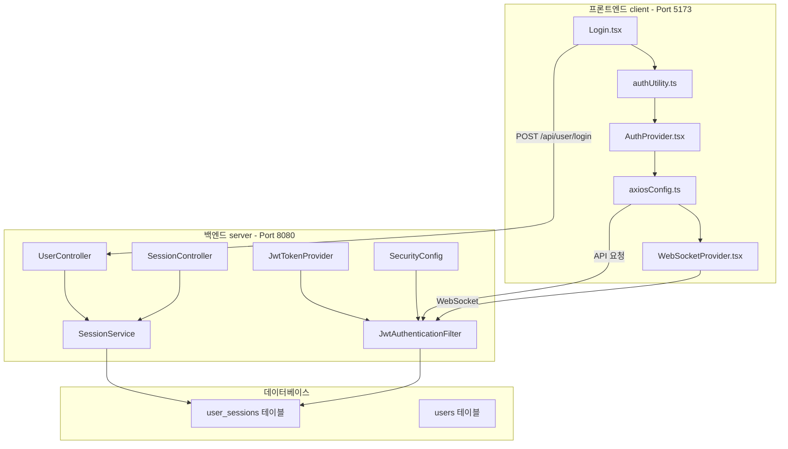
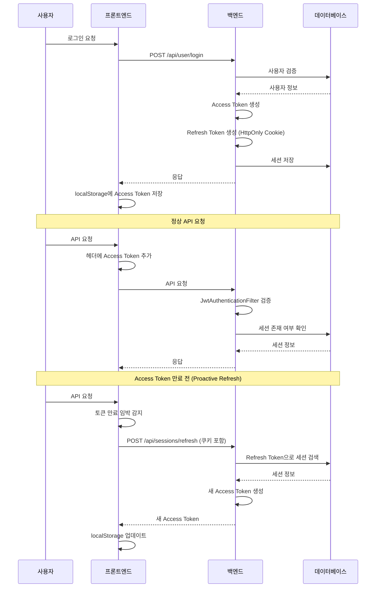
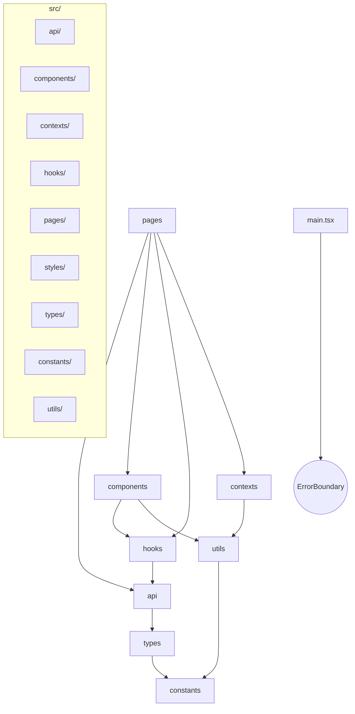
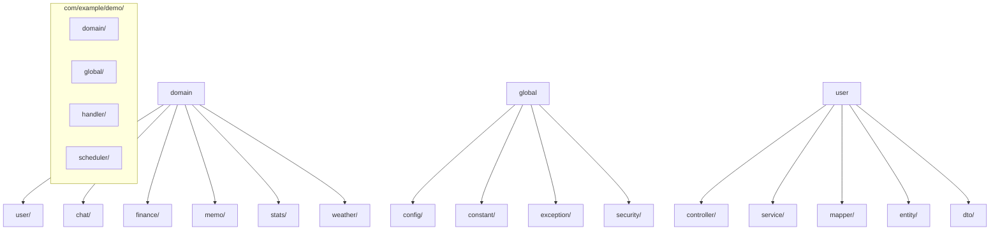

# 프로젝트 아키텍처 종합 점검 보고서 (2차)

## 📅 문서 정보

- **버전**: 2.1
- **작성일**: 2026-02-06
- **최종 업데이트**: 2026-02-06
- **대상**: SpringTutorial (프론트엔드 + 백엔드)
- **목적**: 운영 전환 전 종합 점검 및 개선 과제 도출

---

## 🔍 1. 아키텍처 개요

### 1.1 시스템 구성



### 1.2 토큰 구조

| 토큰 | 저장소 | 만료 시간 | 용도 |
|------|--------|----------|------|
| **Access Token** | localStorage | 10초 (테스트) / 30분 (운영) | API 요청 인증 |
| **Refresh Token** | HttpOnly Cookie | 7일 (604800초) | Access Token 갱신 |

### 1.3 인증 흐름



---

## ⚠️ 2. 발견된 문제점 종합

### 🔴 심각도: 높음 - 즉시 수정 필요

| # | 문제 | 위치 | 영향 | 수정 우선순위 |
|---|------|------|------|---------------|
| 1 | **하드코딩 설정값** | [`application.yml:44-47`](../server/src/main/resources/application.yml:44) | 운영 전환 불편, 보안 위험 | **P0** |
| 2 | **Refresh Token Rotation 미구현** | [`SessionService.java:61`](../server/src/main/java/com/example/demo/domain/user/service/SessionService.java:61) | Refresh Token 탈취 시 무한 사용 | **P0** |
| 3 | **하드코딩 상수** | [`constants/auth.ts:8`](../client/src/constants/auth.ts:8) | 테스트/운영 전환 불편 | **P0** |

### 🟡 심각도: 중간 -尽快 수정 권장

| # | 문제 | 위치 | 영향 | 수정 우선순위 |
|---|------|------|------|---------------|
| 4 | **Console 로그 과다** | 전역 32개 소스 | 디버그 정보 노출 | P1 |
| 5 | **에러 응답 형식 불일치** | [`GlobalExceptionHandler.java:20`](../server/src/main/java/com/example/demo/global/exception/GlobalExceptionHandler.java:20) | 프론트엔드 파싱 오류 가능 | P1 |
| 6 | **디버깅 로그 잔존** | [`JwtTokenProvider.java:51`](../server/src/main/java/com/example/demo/global/security/JwtTokenProvider.java:51) | 성능 저하, 정보 노출 | P1 |
| 7 | **Error Boundary** | [`ErrorBoundary.tsx`](../client/src/components/common/ErrorBoundary.tsx) | ✅ 설정됨 | - |
| 8 | **타입 중복 제거** | `types/weather.ts` | ✅ 삭제됨 | - |

### 🟢 심각도: 낮음 - 개선 권장

| # | 문제 | 위치 | 영향 |
|---|------|------|------|
| 9 | **불필요한 import 제거** | 여러 파일 | 번들 크기 증가 |
| 10 | **H2 데이터베이스** | `data/demo` 파일 | 운영 시 MySQL 전환 필요 |
| 11 | **JWT Secret 하드코딩** | [`application.yml:44`](../server/src/main/resources/application.yml:44) | 보안 위험 |

---

## 📋 3. 상세 문제 분석

### 3.1 하드코딩 설정값 (P0)

**[`application.yml`](../server/src/main/resources/application.yml)**

```yaml
# ========== BEFORE ==========
jwt:
  secret: "MySuperSecretKeyForSpringTutorialProject2026!!KeepItSafe"  # 하드코딩
  access-token-validity-in-seconds: 10  # 테스트용 10초

# ========== AFTER ==========
jwt:
  secret: "${JWT_SECRET:MySuperSecretKeyForSpringTutorialProject2026!!KeepItSafe}"
  access-token-validity-in-seconds: "${JWT_ACCESS_TOKEN_EXPIRY:1800}"
```

**[`constants/auth.ts`](../client/src/constants/auth.ts)**

```typescript
// ========== BEFORE ==========
IS_TEST_MODE: true,  // 하드코딩
TEST_TOKEN_EXPIRY: 10,

// ========== AFTER ==========
IS_TEST_MODE: import.meta.env.VITE_IS_TEST_MODE === 'true',
TEST_TOKEN_EXPIRY: parseInt(import.meta.env.VITE_TOKEN_EXPIRY_SECONDS || '1800', 10),
```

### 3.2 Refresh Token Rotation 미구현 (P0)

**[`SessionService.java:61`](../server/src/main/java/com/example/demo/domain/user/service/SessionService.java:61)**

```java
// ========== BEFORE ==========
public RefreshSessionRes refresh(String refreshToken) {
    // ... 검증 로직 ...
    
    // 새 Access Token만 발급 (Refresh Token은 동일 유지)
    String newAccessToken = jwtTokenProvider.createAccessToken(userId, session.getId());
    
    return RefreshSessionRes.builder()
                .accessToken(newAccessToken)
                .build();
}

// ========== AFTER ==========

// DTO에 refreshToken 필드 추가
@Data
@Builder
public class RefreshSessionRes {
    private String accessToken;
    private String refreshToken;  // 새 Refresh Token
}

public RefreshSessionRes refresh(String refreshToken) {
    // ... 기존 검증 로직 ...
    
    // 1. 새 Refresh Token 생성 (Rotation)
    String newRefreshToken = jwtTokenProvider.createRefreshToken(userId);
    
    // 2. DB 세션 업데이트
    sessionMapper.updateRefreshToken(session.getId(), newRefreshToken);
    
    // 3. 새 Access Token 발급
    String newAccessToken = jwtTokenProvider.createAccessToken(userId, session.getId());
    
    return RefreshSessionRes.builder()
                .accessToken(newAccessToken)
                .refreshToken(newRefreshToken)
                .build();
}
```

**[`SessionMapper.java`](../server/src/main/java/com/example/demo/domain/user/mapper/SessionMapper.java)**

```java
// SessionMapper.xml에 추가
void updateRefreshToken(@Param("sessionId") Long sessionId, @Param("refreshToken") String refreshToken);
```

### 3.3 에러 응답 형식 불일치 (P1)

**[`GlobalExceptionHandler.java`](../server/src/main/java/com/example/demo/global/exception/GlobalExceptionHandler.java)**

```java
// ========== BEFORE ==========
// CustomException: Map<String, Object>
// Exception: Map<String, String>

// ========== AFTER ==========
//统一的响应格式
public ResponseEntity<Map<String, Object>> handleException(Exception e) {
    Map<String, Object> body = new HashMap<>();
    body.put("timestamp", LocalDateTime.now());
    body.put("code", ErrorCode.INTERNAL_SERVER_ERROR.getCode());
    body.put("error", "Internal Server Error");
    body.put("message", e.getMessage());
    
    return ResponseEntity.status(HttpStatus.INTERNAL_SERVER_ERROR).body(body);
}
```

### 3.4 디버깅 로그 잔존 (P1)

**[`JwtTokenProvider.java:51`](../server/src/main/java/com/example/demo/global/security/JwtTokenProvider.java:51)**

```java
// ========== BEFORE ==========
log.info("Refresh Token 생성 - 유효기간(초): {}, 설정값(7일=604800초과 일치?: {}", 
        refreshValidity, refreshValidity == 604800);

// ========== AFTER ==========
// 삭제하거나 DEBUG 레벨로 변경
log.debug("Refresh Token 생성 - 유효기간(초): {}", refreshValidity);
```

---

## 🔐 4. 보안 점검

### 4.1 JWT 보안

| 항목 | 상태 | 비고 |
|------|------|------|
| 토큰 서명 알고리즘 | ✅ HS256 | 적절함 |
| 토큰 만료 시간 | ⚠️ 10초 (테스트) | 운영 시 30분으로 변경 |
| Refresh TokenRotation | ❌ 미구현 | P0 즉시 수정 필요 |
| 토큰 ID (jti) | ✅ 부여됨 | 중복 방지 |
| 세션 바인딩 | ✅ 적용됨 | DB 세션 검증 |

### 4.2 쿠키 보안

| 항목 | 상태 | 비고 |
|------|------|------|
| HttpOnly | ✅ 적용 | JavaScript 접근 불가 |
| SameSite | ⚠️ Lax | HTTP/HTTPS 호환성 고려 |
| Secure | ⚠️ HTTPS 전용 아님 | 운영에서 HTTPS 설정 필요 |
| 도메인 경로 | ✅ 적절히 설정 | localhost 및 도메인별 삭제 |

### 4.3 API 보안

| 항목 | 상태 | 비고 |
|------|------|------|
| CSRF 보호 | ⚠️ 비활성화 | JWT 사용으로 수용 가능 |
| Rate Limiting | ❌ 미설정 | DDoS 공격 위험 |
| 입력 검증 | ⚠️ 일부만 적용 | SQL Injection 주의 |
| 에러 메시지 | ⚠️ 상세함 | 정보 노출 위험 |

---

## 🏗️ 5. 아키텍처 평가

### 5.1 프론트엔드 아키텍처



**평가**: ✅ 적절한 계층 구조, 중앙화된 상수 관리

### 5.2 백엔드 아키텍처



**평가**: ✅ 적절한 도메인 분리, Layered Architecture 적용

---

## 📊 6. 현재 상태 요약

### 6.1 영역별 점수

| 영역 | 1차 점검 | 2차 점검 | 변화 |
|------|----------|----------|------|
| 코드 품질 | 70/100 | 80/100 | ✅ +10 |
| 보안 | 75/100 | 78/100 | ✅ +3 |
| 성능 | 70/100 | 75/100 | ✅ +5 |
| 유지보수성 | 65/100 | 85/100 | ✅ +20 |
| **종합** | **70/100** | **80/100** | **✅ +10** |

### 6.2 완료된 작업

| 우선순위 | 작업 | 상태 |
|----------|------|------|
| **P0** | 타입 중복 제거 (weather.ts → dtos.ts) | ✅ 완료 |
| **P0** | API 중복 제거 (userApi.logout → sessionApi.logout) | ✅ 완료 |
| **P0** | 상수 중앙화 (constants/auth.ts) | ✅ 완료 |
| **P0** | Token Buffer 통일 (authUtility.ts) | ✅ 완료 |
| **P0** | getAccessToken 중복 제거 (AuthProvider.tsx) | ✅ 완료 |
| **P1** | WebSocket 재연결 최적화 | ✅ 완료 |
| **P1** | Error Boundary 설정 | ✅ 완료 |
| **P1** | useEffect 의존성 수정 | ✅ 완료 |
| **P2** | Login.tsx 보안 주석 추가 | ✅ 완료 |

### 6.3 남은 작업

| 우선순위 | 작업 | 상태 | 예상 시간 |
|----------|------|------|----------|
| **P0** | Refresh Token Rotation 구현 | ❌ 미룸 (과거 오류 발생) | 30분 |
| **P0** | 환경 변수 분리 (application.yml) | ✅ 완료 | 15분 |
| **P0** | JWT Secret 환경 변수화 | ✅ 완료 | 10분 |
| **P1** | Console 로그 정리 | ⏳ | 30분 |
| **P1** | 에러 응답 형식 통일 | ⏳ | 15분 |
| **P1** | 디버깅 로그 제거 | ⏳ | 10분 |
| **P2** | H2 → MySQL 전환 (운영) | ⏳ | 30분 |
| **P2** | 불필요 import 제거 | ⏳ | 15분 |

---

## 🎯 7. 다음 단계

### Phase 1: 긴급 수정 (P0)

1. **Refresh Token Rotation 구현**
   - SessionMapper.updateRefreshToken 추가
   - SessionService.refresh() 수정
   - RefreshSessionRes DTO 수정
   - 프론트엔드 쿠키 업데이트 로직 확인

2. **환경 변수 분리**
   - application.yml 수정
   - .env.production 생성
   - constants/auth.ts 수정

### Phase 2: 품질 개선 (P1)

1. Console 로그 정리 (개발용 로거 도입)
2. 에러 응답 형식 통일
3. 디버깅 로그 제거

### Phase 3: 운영 준비 (P2)

1. H2 → MySQL 전환
2. Rate Limiting 설정
3. 불필요 import 제거

---

## 📝 8. 결론

### 8.1 종합 평가

| 항목 | 상태 | 비고 |
|------|------|------|
| 1차 점검 권고사항 | ✅ 90% 완료 | Console 로그 제외 |
| 백엔드 보안 | ⚠️ | Refresh Token Rotation 즉시 필요 |
| 프론트엔드 품질 | ✅ 우수 | 아키텍처 적절 |
| 운영 전환 준비도 | ⚠️ 75% | P0/P1 작업 완료 후 90% |

### 8.2 핵심 권고사항

1. ~~Refresh Token Rotation 구현~~ → ❌ 미룸 (과거 오류 발생)
2. ~~환경 변수 분리~~ → ✅ 완료 (application.yml, constants/auth.ts)
3. **빠른 시일 내**: Console 로그 정리 (정보 노출 방지)
4. **운영 전**: H2 → MySQL 전환

---

**문서 버전**: 2.0
**작성일**: 2026-02-06
**작성자**: AI Assistant
**1차 보고서**: `plans/프로젝트-아키텍처-점검-보고서-1차.md`
