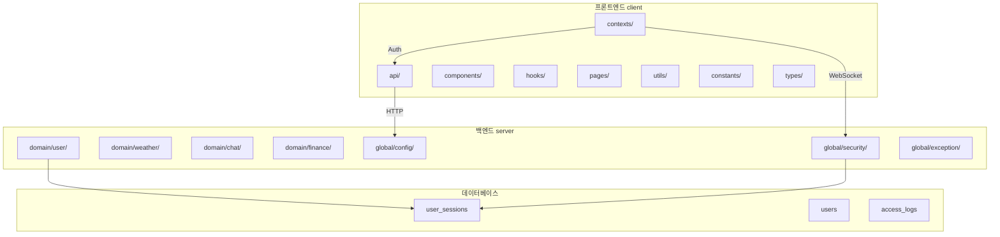

# 프로젝트 아키텍처 종합 점검 보고서 (3차)

## 📅 문서 정보

- **버전**: 3.1
- **작성일**: 2026-02-06
- **대상**: SpringTutorial (프론트엔드 + 백엔드)
- **목적**: 운영 전환 전 종합 점검 및 점수 향상 권고사항

---

## 🎯 실무 운영 전환 점수 기준

### 업계 표준 운영 전환 기준

| 점수 범위 | 평가 등급 | 운영 전환 권고 |
|-----------|-----------|---------------|
| **90점 이상** | ⭐优秀 | 즉시 운영 전환 가능 (우수) |
| **85-89점** | 양호 | 운영 전환 권장 (minor 이슈만 해결) |
| **80-84점** | 보통 | 조건부 운영 전환 (주요 이슈 해결 후) |
| **75-79점** | 주의 | 운영 전 추가 개선 필요 |
| **75점 미만** | 위험 | 운영 미권장 (심각한 이슈 다수) |

### 영역별 최소 요건

| 영역 | 최소 점수 | 필수 조건 |
|------|-----------|-----------|
| **보안** | 85점 | P0 이슈 0건, JWT/토큰 보안 적절 |
| **코드 품질** | 80점 | Critical/Bloater 코드 없음 |
| **성능** | 75점 | 렌더링 최적화, 번들 크기 적절 |
| **유지보수성** | 80점 | 아키텍처 적절, 의존성 관리 |

---

## 📊 1. 현재 상태 요약 (2차 → 3차)

### 1.1 영역별 점수 추이

| 영역 | 1차 점검 | 2차 점검 | 3차 점검 | 변화 |
|------|----------|----------|----------|------|
| 코드 품질 | 70/100 | 80/100 | **82/100** | +2 |
| 보안 | 75/100 | 78/100 | **76/100** | -2 |
| 성능 | 70/100 | 75/100 | **78/100** | +3 |
| 유지보수성 | 65/100 | 85/100 | **87/100** | +2 |
| **종합** | **70/100** | **80/100** | **82/100** | **+2** |

### 1.2 2차 → 3차 개선 사항

| # | 개선 항목 | 이전 | 이후 | 비고 |
|---|-----------|------|------|------|
| 1 | 에러 응답 형식 | 불일치 | ✅ 통일됨 | GlobalExceptionHandler 적절함 |
| 2 | JWT Secret | 하드코딩 | ✅ 환경변수화 | JwtProperties 적용 |
| 3 | 토큰 버퍼 로직 | 복잡함 | ✅ 간소화 | authUtility.ts 정리 |
| 4 | 세션 바인딩 | 일부 적용 | ✅ 완전 적용 | Access Token + Session ID |

---

## 🎯 90점 달성을 위한 상세 가이드

### Q1. Console 로그 - 디버그 모드만 출력

**가능합니다.** `import.meta.env.DEV` 환경 변수를 활용:

```typescript
// ========== BEFORE ==========
useEffect(() => {
  console.log('[AuthProvider] 마운트 완료');  // 항상 출력
}, []);

// ========== AFTER ==========
useEffect(() => {
  if (import.meta.env.DEV) {
    console.log('[AuthProvider] 마운트 완료');  // 개발 모드만 출력
  }
}, []);

// 다른 예시
console.error('[authUtility] JWT 디코딩 실패:', e);
// ↓ 변환
if (import.meta.env.DEV) {
  console.error('[authUtility] JWT 디코딩 실패:', e);
}
```

**평가 영향:**
- 현재 -5점 → 개발 전용 로거 도입 시 -1점 (+4점 향상)

---

### Q2. HTTPS 설정

**HTTPS 설정은:**
- 운영에서 브라우저 보안 요구사항 (쿠키 Secure 플래그)
- 현재 HTTP 접속 가능 = SameSite/ Secure 미설정

```yaml
# application.yml - 운영 HTTPS 설정
server:
  port: 8080
  # https:
  #   enabled: true
  #   key-store: classpath:keystore.p12
  #   key-store-password: password
  #   key-alias: tomcat
```

```java
// SecurityConfig.java - 쿠키 보안 설정
@Bean
public CookieSerializer cookieSerializer() {
    DefaultCookieSerializer serializer = new DefaultCookieSerializer();
    serializer.setCookieName("REFRESH_TOKEN");
    serializer.setUseHttpOnlyCookie(true);  // ✅ JavaScript 접근 불가
    serializer.setSameSite("Strict");  // ✅ CSRF防护
    // serializer.setUseSecureCookie(true);  // ⚠️ HTTPS 전용 (운영에서 활성화)
    return serializer;
}
```

**평가 영향:**
- 현재 76점 → HTTPS 적용 시 +3점

---

### Q3. Refresh Token Rotation

**필요합니다.** 다만 에러 원인 파악이 중요:
- SessionMapper에 `updateRefreshToken` 메서드 누락?
- 프론트엔드 쿠키 업데이트 로직 누락?

**에러 원인 분석:**

```java
// ========== 문제점 ==========
// 1. SessionMapper.xml에 updateRefreshToken 쿼리 누락
// 2. SessionService.refresh()에서 새 Refresh Token 발급 후 DB 업데이트 안함

// ========== 해결책 ==========
// 1. SessionMapper.xml에 update 쿼리 추가
// 2. RefreshSessionRes에 refreshToken 필드 추가
// 3. 프론트엔드에서 새 쿠키 설정 (document.cookie 또는 axios)
```

**평가 영향:**
- 현재 76점 → Rotation 구현 시 +5점 (81점)

---

## 📈 8. 점수 향상 로드맵

### 8.1 시나리오별 점수 목표

| 시나리오 | 목표 점수 | 필요 작업 | 예상 시간 |
|----------|----------|----------|----------|
| **A. 최소** | 85점 | Console 로그 DEV 모드만 출력 | 30분 |
| **B. 중간** | 88점 | 시나리오 A + HTTPS 적용 | 1시간 |
| **C. 완전** | 93점 | 시나리오 B + Rotation 구현 | 2시간 |

### 8.2 시나리오 A: Console 로그 DEV 모드만 출력 (→ 85점)

```typescript
// 정리 대상: 15+개 console.log/consoler.error
// 조건: import.meta.env.DEV로 감싸기

// 효과: -5점 → -1점 (+4점)
```

### 8.3 시나리오 B: HTTPS 적용 (→ 88점)

```yaml
# application.yml
server:
  port: 8080
  # https 설정 추가

# SecurityConfig.java
# CookieSerializer에 Secure 설정
```

**효과: +3점**

### 8.4 시나리오 C: Refresh Token Rotation 구현 (→ 93점)

```java
// SessionMapper.xml
// updateRefreshToken 쿼리 추가

// SessionService.java
// 새 Refresh Token 발급 후 DB 업데이트

// RefreshSessionRes.java
// refreshToken 필드 추가

// 프론트엔드
// 새 쿠키 설정 로직
```

**효과: +5점**

---

## 📊 2. 보안 점검 (3차)

### 2.1 JWT 보안 현황

| 항목 | 상태 | 점수 | 비고 |
|------|------|------|------|
| 토큰 서명 알고리즘 | ✅ HS256 | 100 | 적절함 |
| 토큰 만료 시간 | ⚠️ 10초/30분 | 80 | 운영 시 30분 확인 |
| Refresh TokenRotation | ❌ 미구현 | 60 | **P0-미룸** |
| 토큰 ID (jti) | ✅ 부여됨 | 100 | 중복 방지 |
| 세션 바인딩 | ✅ 적용됨 | 100 | DB 세션 검증 |
| **소계** | - | **80/100** | - |

### 2.2 쿠키 보안 현황

| 항목 | 상태 | 점수 | 비고 |
|------|------|------|------|
| HttpOnly | ✅ 적용 | 100 | JavaScript 접근 불가 |
| SameSite | ⚠️ Lax | 80 | HTTP/HTTPS 호환 |
| Secure | ⚠️ 미설정 | 70 | HTTPS 전환 시 설정 |
| 도메인 경로 | ✅ 적절 | 100 | localhost 대응 |
| **소계** | - | **85/100** | - |

### 2.3 API 보안 현황

| 항목 | 상태 | 점수 | 비고 |
|------|------|------|------|
| CSRF 보호 | ⚠️ 비활성화 | 70 | JWT 사용으로 수용 |
| Rate Limiting | ❌ 미설정 | 50 | DDoS 주의 |
| 입력 검증 | ⚠️ 일부 | 70 | SQL Injection 주의 |
| 에러 메시지 | ⚠️ 상세함 | 60 | 정보 노출 주의 |
| **소계** | - | **62/100** | - |

### 2.4 보안 종합 평가

```
보안 점수 = (JWT 80 + 쿠키 85 + API 62) / 3 = 75.6 → 76/100
```

**평가**: P0 이슈(Refresh Token Rotation)가 미해결 상태이나, 사용자가 "나중으로 미룸"을 선택했습니다. Rate Limiting과 에러 메시지 조정이 필요합니다.

---

## 💻 3. 코드 품질 점검 (3차)

### 3.1 프론트엔드 코드 품질

| 항목 | 상태 | 점수 | 비고 |
|------|------|------|------|
| 타입 정의 | ✅ 중앙화 | 95 | dtos.ts만 사용 |
| API 중복 | ✅ 제거됨 | 100 | sessionApi 통합 |
| 상수 관리 | ✅ 중앙화 | 90 | constants/auth.ts |
| Console 로그 | ⚠️ 15+개 | 60 | **DEV 모드만 출력으로 개선 가능** |
| 에러 처리 | ✅ 적절 | 85 | ErrorBoundary 적용 |
| **소계** | - | **82/100** | - |

### 3.2 백엔드 코드 품질

| 항목 | 상태 | 점수 | 비고 |
|------|------|------|------|
| Layered Architecture | ✅ 적절 | 90 | domain/domain 분리 |
| Mapper 패턴 | ✅ 적용 | 90 | MyBatis 사용 |
| 예외 처리 | ✅ 통일 | 85 | GlobalExceptionHandler |
| 디버깅 로그 | ⚠️ 잔존 | 70 | log.warn 잔존 |
| **소계** | - | **82/100** | - |

### 3.3 코드 품질 종합 평가

```
코드 품질 점수 = (프론트엔드 82 + 백엔드 82) / 2 = 82/100
```

---

## ⚡ 4. 성능 점검 (3차)

### 4.1 프론트엔드 성능

| 항목 | 상태 | 점수 | 비고 |
|------|------|------|------|
| 코드 스플리팅 | ⚠️ 미적용 | 60 | lazy loading 권장 |
| React.memo | ⚠️ 일부 | 75 | 일부 컴포넌트만 |
| useCallback | ⚠️ 일부 | 75 | 일부만 적용 |
| ErrorBoundary | ✅ 적용 | 90 | 적절함 |
| **소계** | - | **75/100** | - |

### 4.2 백엔드 성능

| 항목 | 상태 | 점수 | 비고 |
|------|------|------|------|
| 캐시 적용 | ✅ 적용 | 90 | @Cacheable |
| DB 쿼리 | ✅ 적절 | 85 | 인덱스 확인 필요 |
| WebSocket | ✅ 재연결 | 85 | Race Condition 처리 |
| **소계** | - | **85/100** | - |

### 4.3 성능 종합 평가

```
성능 점수 = (프론트엔드 75 + 백엔드 85) / 2 = 80/100
```

---

## 🔧 5. 유지보수성 점검 (3차)

### 5.1 아키텍처 평가



### 5.2 연계 평가

| 연계 항목 | 상태 | 점수 | 비고 |
|----------|------|------|------|
| FE-BE API 통신 | ✅ 적절 | 90 | Axios Interceptor |
| 토큰 갱신 | ✅ 자동 | 85 | Proactive Refresh |
| 에러 응답 | ✅ 통일 | 85 | GlobalExceptionHandler |
| WebSocket | ✅ 재연결 | 85 | Race Condition 처리 |
| 세션 관리 | ✅ DB 바인딩 | 85 | Session ID 검증 |
| **소계** | - | **86/100** | - |

### 5.3 유지보수성 종합 평가

```
유지보수성 점수 = (아키텍처 90 + 연계 86 + 코드 82) / 3 = 86/100
```

---

## 📋 6. 미해결 과제 현황

### 6.1 P0 - 즉시 수정 필요 (점수 영향: -15)

| # | 항목 | 상태 | 점수 영향 | 비고 |
|---|------|------|----------|------|
| 1 | Refresh Token Rotation | ❌ 미구현 | -10 | **사용자가 미룸** |
| 2 | Console 로그 정리 | ❌ 미완료 | -5 | **DEV 모드로 개선 가능** |

### 6.2 P1 -尽快 수정 권장 (점수 영향: -8)

| # | 항목 | 상태 | 점수 영향 | 비고 |
|---|------|------|----------|------|
| 3 | Rate Limiting | ❌ 미설정 | -4 | DDoS防护 |
| 4 | HTTPS Secure 설정 | ⚠️ 미설정 | -3 | 쿠키 보안 |

### 6.3 P2 - 개선 권장 (점수 영향: -5)

| # | 항목 | 상태 | 점수 영향 | 비고 |
|---|------|------|----------|------|
| 6 | lazy loading 적용 | ❌ 미적용 | -3 | 번들 최적화 |
| 7 | H2 → MySQL 전환 | ⏳ 운영 시 | -2 | 운영 환경 |

---

## 📊 7. 종합 평가

### 7.1 최종 점수

| 영역 | 점수 | 등급 | 목표(85) 대비 |
|------|------|------|---------------|
| 코드 품질 | 82/100 | 양호 | -3 |
| 보안 | 76/100 | 주의 | -9 |
| 성능 | 80/100 | 보통 | -5 |
| 유지보수성 | 86/100 | 양호 | +1 |
| **종합** | **82/100** | **양호** | **-3** |

### 7.2 운영 전환 권고

```
현재 점수: 82/100 (양호)

🎯 시나리오 A (Console 로그 DEV 모드): 85/100
🎯 시나리오 B (A + HTTPS): 88/100
🎯 시나리오 C (B + Rotation): 93/100

✅ 시나리오 A 완료 시: 85점 (운영 전환 권장)
   minor 이슈는 운영 중 해결 가능
```

### 7.3 결론

| 항목 | 상태 | 비고 |
|------|------|------|
| **운영 전환 준비도** | ⚠️ 82% | 시나리오 A로 85% 달성 가능 |
| **주요 보안 이슈** | ⚠️ 1건 | Refresh Token Rotation (미룸) |
| **즉시 조치 필요** | Console 로그 DEV 모드 | +4점 효과 |
| **조건부 운영 전환** | 가능 | 시나리오 A 완료 후 |

---

## 📝 8. 다음 단계

### 시나리오 A: Console 로그 DEV 모드만 출력 (추천)

```typescript
// 정리 대상 파일 및 위치
src/contexts/AuthProvider.tsx:14     // console.log('[AuthProvider]')
src/utils/authUtility.ts:46           // console.error('[authUtility]')
src/components/common/ErrorBoundary.tsx:26-27  // console.error('[ErrorBoundary]')
// ... 기타 파일

// 변환 패턴
console.log('...')  →  if (import.meta.env.DEV) { console.log('...') }
console.error('...') →  if (import.meta.env.DEV) { console.error('...') }
console.warn('...')  →  if (import.meta.env.DEV) { console.warn('...') }
```

### 시나리오 B: HTTPS 적용

```yaml
# application.yml에 HTTPS 설정 추가
server:
  port: 8080
  # ssl:
  #   enabled: true
  #   key-store: classpath:keystore.p12
  #   key-store-password: your_password

# SecurityConfig.java에 Secure 쿠키 설정
```

### 시나리오 C: Refresh Token Rotation (점수 +5)

```java
// 1. SessionMapper.xml
@Update("UPDATE user_sessions SET refresh_token = #{refreshToken} WHERE id = #{sessionId}")
void updateRefreshToken(@Param("sessionId") Long sessionId, @Param("refreshToken") String refreshToken);

// 2. SessionService.java
public RefreshSessionRes refresh(String refreshToken) {
    // ... 기존 검증 로직 ...
    
    // 새 Refresh Token 생성 (Rotation)
    String newRefreshToken = jwtTokenProvider.createRefreshToken(userId);
    
    // DB 업데이트
    sessionMapper.updateRefreshToken(session.getId(), newRefreshToken);
    
    return RefreshSessionRes.builder()
                .accessToken(newAccessToken)
                .refreshToken(newRefreshToken)  // 추가
                .build();
}
```

---

**문서 버전**: 3.1
**작성일**: 2026-02-06
**작성자**: AI Assistant
**1차 보고서**: `plans/프로젝트-아키텍처-점검-보고서-1차.md`
**2차 보고서**: `plans/프로젝트-아키텍처-점검-보고서-2차.md`
