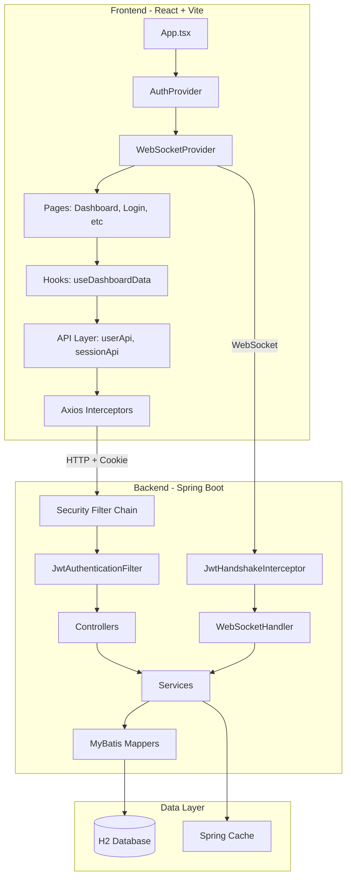
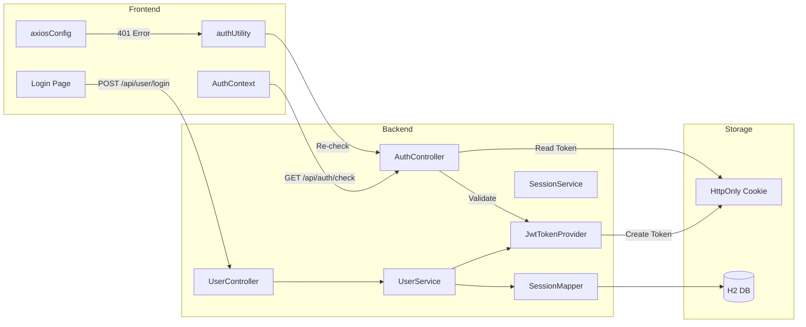
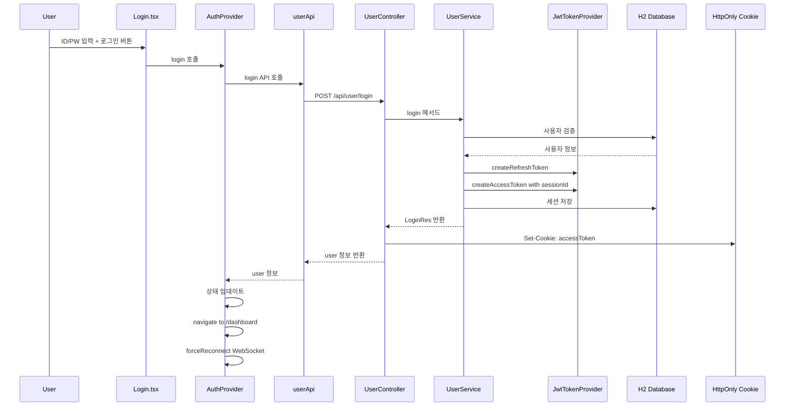
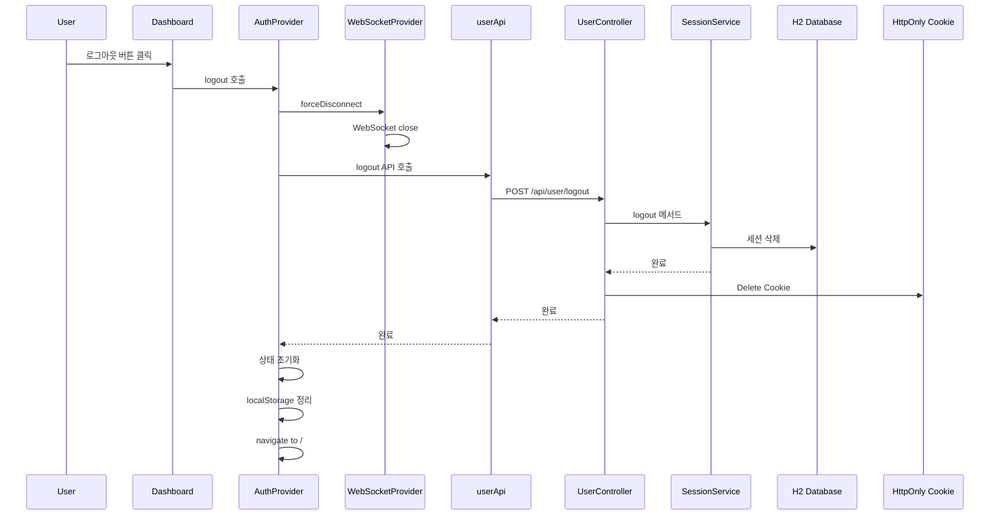
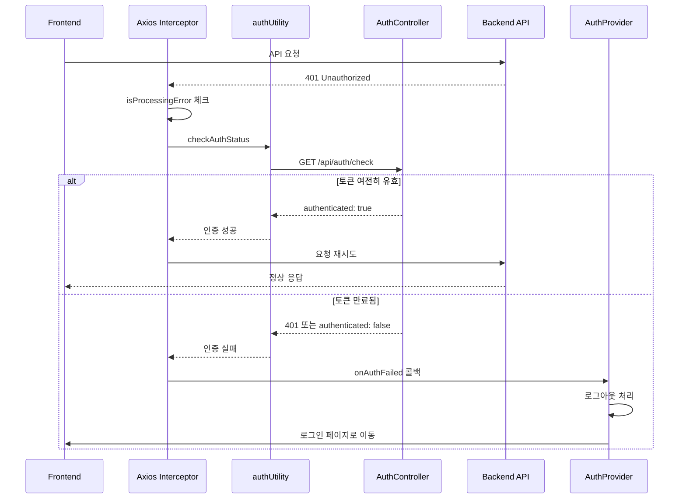
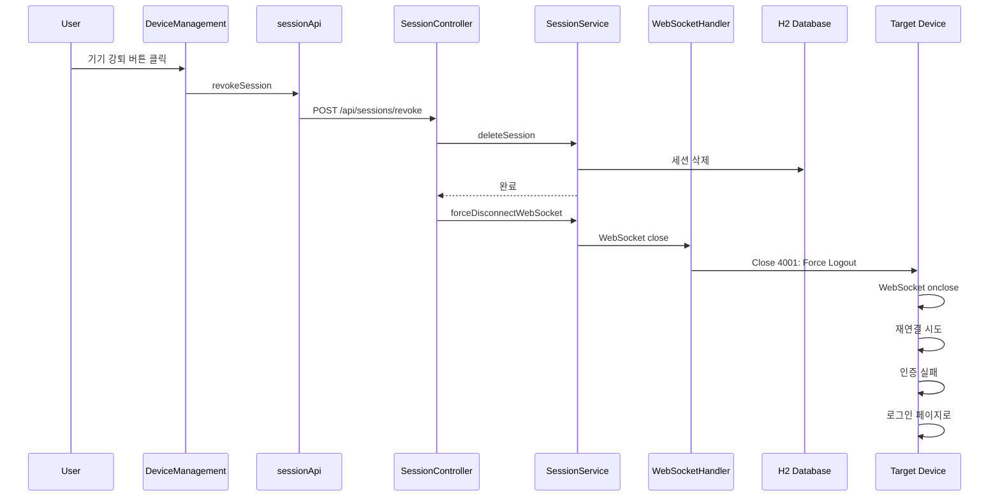
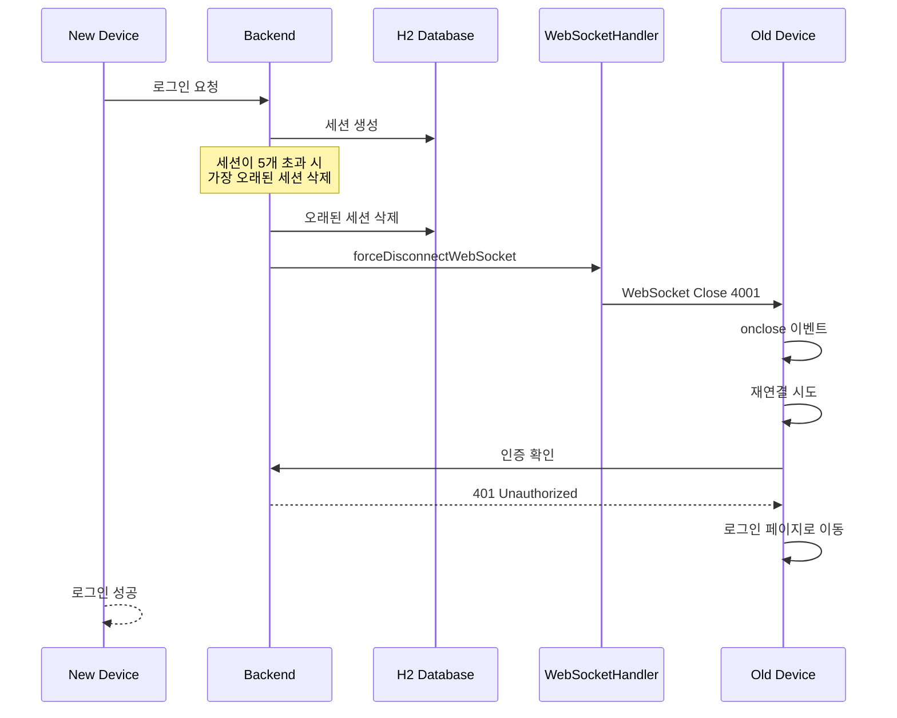
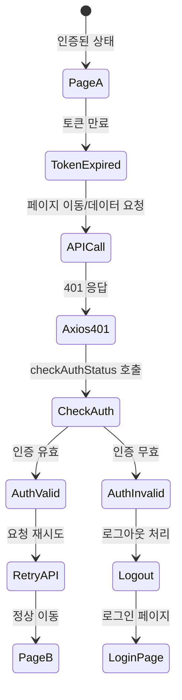
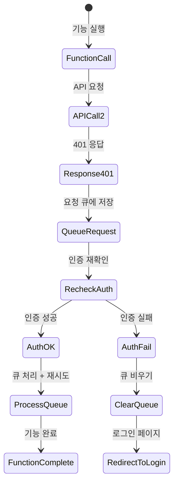
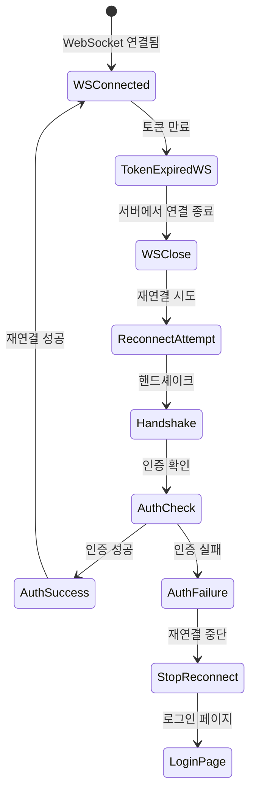

# 프로젝트 전체 아키텍처 분석 보고서

## 1. 개요

본 문서는 SpringTutorial 프로젝트의 프론트엔드(React + Vite)와 백엔드(Spring Boot) 전체 아키텍처를 분석하고, 주요 시나리오별 문제점과 개선사항을 도출합니다.

---

## 2. 시스템 아키텍처 다이어그램

### 2.1 전체 시스템 구성



### 2.2 인증 아키텍처 상세



---

## 3. 주요 시나리오 도식화

### 3.1 로그인 시나리오



### 3.2 로그아웃 시나리오



### 3.3 토큰 만료 시나리오



### 3.4 기기 강퇴(Kick) 시나리오



### 3.5 다른 기기에서 로그인으로 인한 강제 로그아웃 시나리오



---

## 4. 토큰 만료/Kick 시나리오 상세 분석

### 4.1 페이지 이동 중 토큰 만료



### 4.2 기능 실행 중 토큰 만료



### 4.3 WebSocket 연결 중 토큰 만료



---

## 5. 시나리오별 문제점 분석

### 5.1 로그인 시나리오 문제점

| 문제점 | 심각도 | 설명 |
|--------|--------|------|
| 세션 제한 경고 없음 | 중 | 5개 세션 초과 시 가장 오래된 세션이 삭제되지만, 사용자에게 알림이 없음 |
| WebSocket 연결 타이밍 | 낮음 | 로그인 후 WebSocket 연결이 setTimeout으로 처리되어 타이밍 이슈 가능성 |

### 5.2 로그아웃 시나리오 문제점

| 문제점 | 심각도 | 설명 |
|--------|--------|------|
| 토큰 없는 로그아웃 | 중 | 토큰 만료 상태에서 로그아웃 시 sessionId를 알 수 없어 DB 세션이 삭제되지 않음 |
| WebSocket 종료 순서 | 낮음 | Frontend에서 먼저 WebSocket을 닫지만, 이미 닫혀있을 수 있음 |

### 5.3 토큰 만료 시나리오 문제점

| 문제점 | 심각도 | 설명 |
|--------|--------|------|
| Refresh Token 미사용 | 높음 | AccessToken만 사용하여 만료 시 재로그인 필수 (UX 저하) |
| 인증 확인 캐싱 | 중 | authUtility에서 인증 결과를 캐싱하여 만료 후에도 캐시된 결과 사용 가능 |
| Race Condition | 중 | 여러 API 동시 호출 시 인증 확인 중복 발생 가능 |

### 5.4 기기 강퇴(Kick) 시나리오 문제점

| 문제점 | 심각도 | 설명 |
|--------|--------|------|
| 피드백 없음 | 중 | 강퇴당한 기기에서 명확한 피드백 없이 로그인 페이지로 이동 |
| WebSocket 코드 미처리 | 낮음 | Close Code 4001에 대한 Frontend 처리가 명확하지 않음 |

### 5.5 WebSocket 관련 문제점

| 문제점 | 심각도 | 설명 |
|--------|--------|------|
| sessionId 미전달 | 높음 | JwtHandshakeInterceptor에서 sessionId를 null로 설정하여 WebSocket에서 세션 식별 불가 |
| 재연결 무한 루프 가능성 | 중 | 인증 상태 확인 실패 시 재연결이 무한히 시도될 수 있음 |
| 만료된 토큰으로 연결 허용 | 높음 | 만료된 토큰에서도 userId를 추출하여 WebSocket 연결을 허용함 |

---

## 6. 로직/아키텍처/보안 개선사항

### 6.1 로직 개선사항

#### 6.1.1 Refresh Token 도입 검토

**현재 상황:**
- AccessToken만 사용 (기본 30분, 테스트 시 15초)
- 토큰 만료 시 재로그인 필수

**개선 방안:**
```
1. Refresh Token 도입
   - AccessToken: 30분 (기존)
   - RefreshToken: 7일 (DB에 저장됨)
   - AccessToken 만료 시 RefreshToken으로 갱신

2. 또는 Session 기반 연장
   - 사용자 활동 시 세션 연장
   - API 호출 시 lastAccessedAt 업데이트
```

#### 6.1.2 인증 확인 캐싱 개선

**현재 문제:**
```typescript
// authUtility.ts
let authCheckResult: { authenticated: boolean; user?: UserInfo } | null = null;
```

**개선 방안:**
```typescript
// 캐시에 TTL 추가
interface CachedAuthResult {
  result: { authenticated: boolean; user?: UserInfo };
  timestamp: number;
  ttl: number; // 5초 등
}

// 또는 토큰 만료 시간과 연동
```

#### 6.1.3 로그아웃 로직 개선

**현재 문제:**
```java
// UserController.java - logout
if (sessionId != null) {
    userService.logout(userId, sessionId, userAgent, ipAddress);
} else {
    // sessionId가 없는 경우 전체 삭제하지 않음
    log.warn("로그아웃 요청: sessionId 없음, userId={}", userId);
}
```

**개선 방안:**
```java
// sessionId가 없는 경우에도 사용자의 모든 세션 삭제 옵션 제공
if (sessionId != null) {
    userService.logout(userId, sessionId, userAgent, ipAddress);
} else {
    // 전체 세션 삭제 (사용자 요청 시)
    userService.logoutAll(userId, userAgent, ipAddress);
}
```

### 6.2 아키텍처 개선사항

#### 6.2.1 WebSocket sessionId 전달

**현재 문제:**
```java
// JwtHandshakeInterceptor.java
attributes.put("sessionId", (Long) null);  // 항상 null
```

**개선 방안:**
```java
// 토큰에서 sessionId 추출하여 전달
Long sessionId = jwtTokenProvider.getSessionIdFromExpiredToken(token);
if (sessionId != null) {
    attributes.put("sessionId", sessionId);
}
```

#### 6.2.2 이벤트 기반 아키텍처 검토

**현재:**
- Context 간 직접 호출
- Props drilling 일부 존재

**개선 방안:**
```
1. 전역 이벤트 시스템 도입
   - authLogin, authLogout 이벤트 표준화
   - 커스텀 이벤트 대신 상태 관리 라이브러리 활용

2. React Query 활용 확대
   - 현재 일부 데이터만 React Query 사용
   - 모든 서버 상태를 React Query로 관리
```

#### 6.2.3 에러 바운더리 강화

**현재:**
- ErrorBoundary 컴포넌트 존재
- 인증 에러는 별도 처리

**개선 방안:**
```
1. 인증 에러 전용 에러 바운더리
2. 네트워크 에러 전용 에러 바운더리
3. 각 에러 타입별 Fallback UI 제공
```

### 6.3 보안 개선사항

#### 6.3.1 WebSocket 인증 강화

**현재 문제:**
```java
// JwtHandshakeInterceptor.java
// 만료된 토큰에서도 userId 추출하여 연결 허용
userId = jwtTokenProvider.getUserIdFromExpiredToken(token);
```

**개선 방안:**
```java
// 1. 유효한 토큰만 허용
if (jwtTokenProvider.validateToken(token)) {
    userId = jwtTokenProvider.getUserIdFromToken(token);
} else {
    // 연결 거부
    response.setStatusCode(HttpStatus.UNAUTHORIZED);
    return false;
}

// 2. 또는 세션 존재 확인 추가
Long sessionId = jwtTokenProvider.getSessionIdFromExpiredToken(token);
if (sessionMapper.findBySessionId(sessionId) == null) {
    response.setStatusCode(HttpStatus.UNAUTHORIZED);
    return false;
}
```

#### 6.3.2 세션 관리 보안 강화

**현재:**
- 세션 5개 제한
- 오래된 세션 자동 삭제

**개선 방안:**
```
1. 세션 알림 시스템
   - 새 기기 로그인 시 기존 기기에 알림
   - 세션 삭제 전 확인 요청

2. 세션 활동 모니터링
   - 비정상적인 세션 활동 감지
   - 의심스러운 세션 자동 종료

3. IP/기기 기반 세션 관리
   - 동일 IP에서 다중 세션 감지
   - 위치 기반 이상 징후 감지
```

#### 6.3.3 CORS 및 쿠키 보안

**현재 설정:**
```yaml
# application.yml
app:
  cors:
    hosts: localhost, 10.10.10.183
    ports: 5173, 5174
```

**개선 방안:**
```yaml
# 1. 환경 변수로 관리
app:
  cors:
    hosts: ${CORS_HOSTS:localhost}
    ports: ${CORS_PORTS:5173}

# 2. 쿠키 보안 강화
# CookieUtil.java에서 이미 적용 중이나 확인 필요
# - SameSite: Strict 또는 Lax
# - Secure: HTTPS에서만
# - HttpOnly: 항상 true
```

#### 6.3.4 토큰 보안 강화

**현재:**
- JWT Secret이 기본값 존재
- 토큰에 sessionId 포함

**개선 방안:**
```java
// 1. 필수 환경 변수화
@Value("${jwt.secret}")
private String secret; // 기본값 제거

// 2. 토큰에 추가 정보 포함
builder.claim("ip", ipAddress);  // 선택적
builder.claim("device", deviceType);  // 선택적

// 3. 토큰 블랙리스트 (Redis 활용)
// 로그아웃 시 토큰을 블랙리스트에 추가
```

---

## 7. 기타 발견 사항

### 7.1 코드 품질

| 항목 | 상태 | 비고 |
|------|------|------|
| TypeScript 타입 정의 | 양호 | DTO 타입 잘 정의됨 |
| 에러 처리 | 개선 필요 | 일부 try-catch에서 로그만 남김 |
| 주석/문서화 | 양호 | 핵심 로직에 주석 존재 |
| 테스트 코드 | 미확인 | 별도 분석 필요 |

### 7.2 성능 고려사항

| 항목 | 상태 | 비고 |
|------|------|------|
| React Query 캐싱 | 양호 | staleTime 적절히 설정 |
| Spring Cache | 양호 | online_users 캐시 적용 |
| WebSocket 메시지 | 개선 필요 | 브로드캐스트 최적화 가능 |
| DB 쿼리 | 미확인 | MyBatis Mapper 분석 필요 |

### 7.3 사용자 경험

| 항목 | 상태 | 비고 |
|------|------|------|
| 로딩 상태 | 양호 | loading 상태 관리 |
| 에러 피드백 | 양호 | Toast 알림 사용 |
| 인증 만료 처리 | 개선 필요 | 명확한 안내 메시지 필요 |
| 기기 관리 UI | 양호 | DeviceManagement 페이지 존재 |

---

## 8. 우선순위별 개선 계획

### 8.1 높은 우선순위 (즉시 개선 권장)

1. **WebSocket sessionId 전달 수정**
   - 위치: JwtHandshakeInterceptor.java
   - 영향: 기기 강퇴 기능 정상 동작

2. **만료된 토큰으로 WebSocket 연결 차단**
   - 위치: JwtHandshakeInterceptor.java
   - 영향: 보안 강화

3. **인증 확인 캐싱 TTL 추가**
   - 위치: authUtility.ts
   - 영향: 토큰 만료 후 즉시 감지

### 8.2 중간 우선순위 (단기 개선 권장)

1. **로그아웃 시 세션 처리 개선**
   - 위치: UserController.java
   - 영향: 만료된 토큰으로도 로그아웃 가능

2. **세션 알림 시스템**
   - 위치: 전체
   - 영향: UX 개선

3. **Refresh Token 도입 검토**
   - 위치: 전체 인증 시스템
   - 영향: UX 대폭 개선

### 8.3 낮은 우선순위 (장기 개선 권장)

1. **이벤트 기반 아키텍처**
   - 위치: Frontend 전체
   - 영향: 코드 유지보수성 향상

2. **토큰 블랙리스트**
   - 위치: Backend + Redis
   - 영향: 보안 강화

3. **세션 활동 모니터링**
   - 위치: Backend
   - 영향: 보안 강화

---

## 9. 결론

본 프로젝트는 전반적으로 잘 구조화되어 있으며, 인증/세션 관리의 핵심 기능은 정상 동작합니다. 다만 다음 사항에 주의가 필요합니다:

1. **WebSocket 인증**: 만료된 토큰으로 연결이 허용되는 문제
2. **세션 식별**: WebSocket에서 sessionId가 전달되지 않는 문제
3. **토큰 갱신**: Refresh Token 미사용으로 인한 UX 저하
4. **캐싱 전략**: 인증 확인 결과 캐싱에 TTL 필요

이상의 개선사항을 단계적으로 적용하면 보안성과 사용자 경험이 크게 향상될 것입니다.
