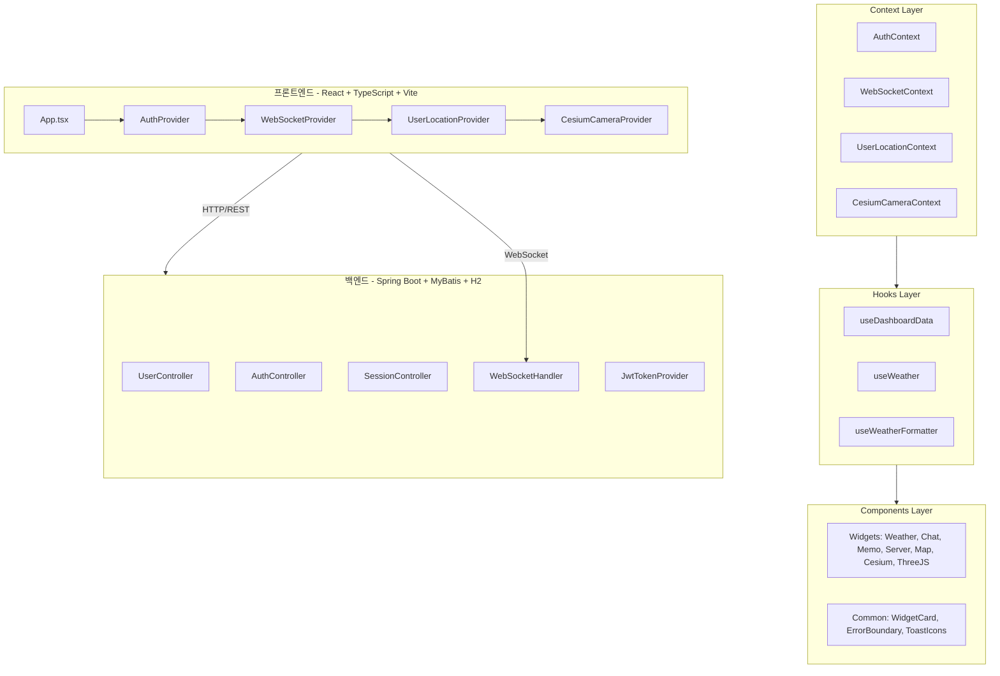
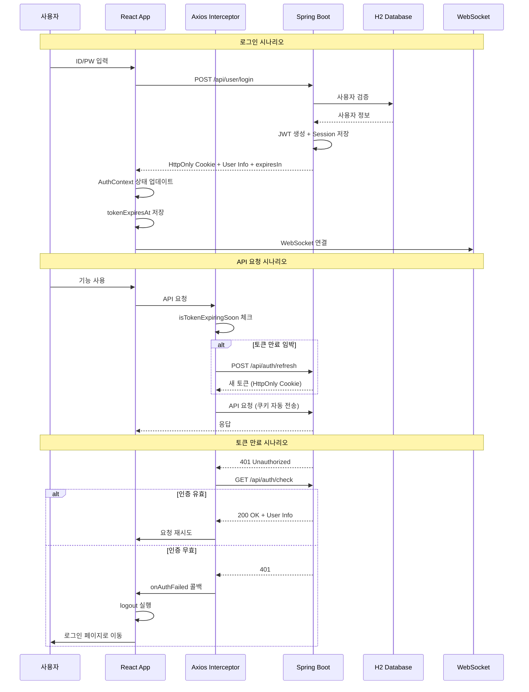
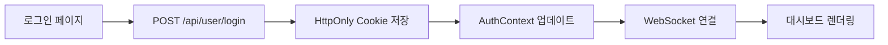
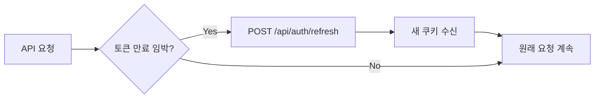
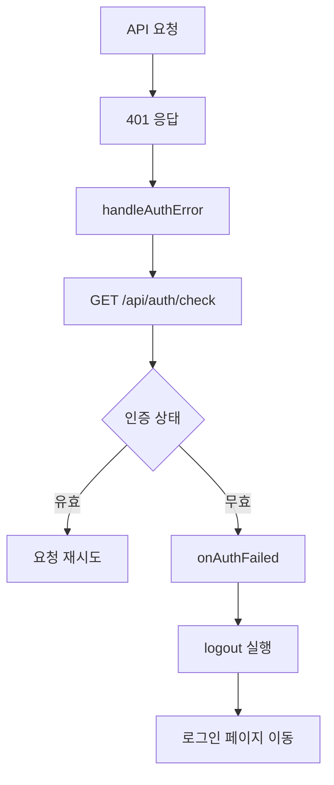
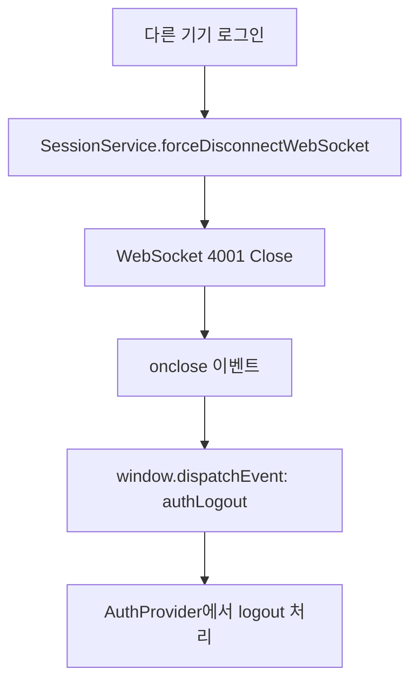
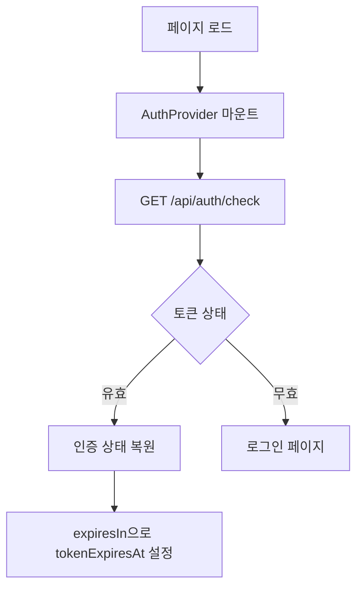

# 프로젝트 전체 종합 분석 보고서

> 작성일: 2026-02-19
> 분석 범위: 프론트엔드 + 백엔드 전체 파일

---

## 1. 프로젝트 아키텍처 개요

### 1.1 시스템 구성도



### 1.2 기술 스택

| 영역 | 기술 |
|------|------|
| 프론트엔드 | React 18, TypeScript, Vite, React Router v6 |
| 상태관리 | React Context, React Query (TanStack Query) |
| UI 라이브러리 | Framer Motion, React Icons, SweetAlert2, React Hot Toast |
| 3D/지도 | Cesium, Three.js, react-three-fiber |
| 차트 | Recharts |
| 그리드 | react-grid-layout |
| 백엔드 | Spring Boot 3.x, MyBatis, H2 Database |
| 보안 | Spring Security, JWT (io.jsonwebtoken) |
| 실시간 | WebSocket (STOMP 아님, Raw WebSocket) |

---

## 2. 인증 아키텍처 상세 분석

### 2.1 인증 흐름도



### 2.2 토큰 관리 방식

| 항목 | 방식 | 설명 |
|------|------|------|
| 토큰 저장 | HttpOnly Cookie | XSS 방지, JavaScript 접근 불가 |
| 만료 시간 관리 | 메모리 변수 | `tokenExpiresAt`, `tokenDuration` |
| Proactive Refresh | 동적 20% 임계값 | 최소 1분 보장 |
| Refresh 방식 | 세션 기반 | DB에 저장된 sessionId로 검증 후 재발급 |

### 2.3 토큰 갱신 로직 분석

**[`authUtility.ts`](src/utils/authUtility.ts:61-74)**
```typescript
export const isTokenExpiringSoon = (): boolean => {
  if (!tokenExpiresAt || !tokenDuration) return false;
  
  const now = Date.now();
  const remaining = tokenExpiresAt - now;
  
  if (remaining <= 0) return false;
  
  // 동적 임계값: 전체 시간의 20% (최소 1분)
  const threshold = Math.max(tokenDuration * 0.2, MIN_REFRESH_THRESHOLD_MS);
  
  return remaining < threshold;
};
```

**특징:**
- 1800초(30분) 토큰 → 360초(6분) 남았을 때 갱신
- 10초 토큰 → 2초 남았을 때 갱신 (최소 1분 보장으로 1분 전 갱신)
- 페이지 새로고침 시 메모리 변수 초기화 → 서버 응답에서 재설정

---

## 3. 시나리오별 분석

### 3.1 정상 시나리오

#### 3.1.1 로그인 → 대시보드 접근



**상태:** ✅ 정상 동작

#### 3.1.2 API 요청 중 토큰 갱신



**상태:** ✅ 정상 동작

### 3.2 예외 시나리오

#### 3.2.1 토큰 만료로 인한 401 응답



**분석:**
- ✅ `isProcessingError` 플래그로 중복 처리 방지
- ✅ `authRetryQueue`로 대기 중인 요청 일괄 처리
- ⚠️ **잠재적 문제**: `checkAuthStatus`의 5초 TTL 캐시가 만료된 토큰 정보를 반환할 수 있음

#### 3.2.2 다른 기기에서 강제 로그아웃 (Kick)



**분석:**
- ✅ WebSocket 종료 코드 4001로 명확한 구분
- ✅ 커스텀 이벤트로 AuthProvider에 알림
- ⚠️ **잠재적 문제**: 이벤트 리스너 등록 순서에 따른 경쟁 조건 가능성

#### 3.2.3 페이지 새로고침 시 토큰 상태 복구



**분석:**
- ✅ HttpOnly Cookie는 새로고침해도 유지
- ✅ 서버 응답의 `expiresIn`으로 메모리 변수 복원
- ⚠️ **잠재적 문제**: `expiresIn`이 고정값(설정값) 반환, 실제 남은 시간과 다를 수 있음

---

## 4. 발견된 문제점 및 개선 사항

### 4.1 🔴 Critical Issues

#### 4.1.1 토큰 만료 시간 불일치

**문제:**
- [`AuthController.checkAuthStatus()`](../server/src/main/java/com/example/demo/domain/auth/controller/AuthController.java:88)에서 `expiresIn`을 설정값 그대로 반환
- 실제 토큰이 발급된 지 얼마 안 됐다면 남은 시간이 더 김
- 프론트엔드에서 잘못된 만료 시간으로 Proactive Refresh 수행

**해결 방안:**
```java
// AuthController.java
// 토큰의 실제 남은 시간 계산
Claims claims = jwtTokenProvider.parseClaims(token);
Date expiration = claims.getExpiration();
long remainingSeconds = (expiration.getTime() - System.currentTimeMillis()) / 1000;
responseBody.put("expiresIn", remainingSeconds);
```

#### 4.1.2 WebSocket 재연결 시 경쟁 조건

**문제:**
- [`WebSocketProvider.tsx`](src/contexts/WebSocketProvider.tsx:22-50)의 `connectSocket`이 async 함수
- 여러 곳에서 동시에 `forceReconnect` 호출 시 중복 연결 가능

**해결 방안:**
- `isConnectingRef` 체크를 더 엄격하게 수행
- 연결 시도 중에는 새 연결 요청 무시

### 4.2 🟡 Medium Issues

#### 4.2.1 localStorage 사용 (위치 정보)

**문제:**
- [`UserLocationProvider.tsx`](src/contexts/UserLocationProvider.tsx:109-110)에서 위치 정보를 localStorage에 저장
- 사용자가 의도하지 않은 위치 정보 노출 가능

**현재 상태:**
- 인증 관련 데이터는 localStorage 사용 안 함 (보안 문제 해결됨)
- 위치 정보는 편의 기능이므로 허용 가능

#### 4.2.2 React Query enabled 조건

**문제:**
- [`useDashboardData.ts`](src/hooks/useDashboardData.ts:33)에서 `isAuthenticatedRef.current` 사용
- Ref 값 변경 시 리렌더링이 트리거되지 않아 Query가 활성화되지 않을 수 있음

**해결 방안:**
- `useAuth()` 훅의 `isAuthenticated` 상태를 직접 사용
- 또는 `useSyncExternalStore` 활용

#### 4.2.3 만료된 토큰에서 sessionId 추출

**문제:**
- [`JwtTokenProvider.java`](../server/src/main/java/com/example/demo/global/security/JwtTokenProvider.java:183-194)의 `parseClaimsWithExpired`에서 만료된 토큰의 Claims 추출
- 토큰이 변조되었을 경우에도 Claims 추출 시도

**현재 상태:**
- 서명 검증은 수행됨 (`verifyWith(key)`)
- 만료된 토큰만 예외 처리, 변조된 토큰은 다른 예외 발생

### 4.3 🟢 Minor Issues

#### 4.3.1 하드코딩된 API 키

**문제:**
- [`CesiumMapViewer.tsx`](src/components/cesium/CesiumMapViewer.tsx:9-11)에 API 키 하드코딩
- 기본값이 노출됨

**해결 방안:**
- `.env` 파일에서만 가져오기
- 빌드 시 환경 변수 필수 체크

#### 4.3.2 콘솔 로그

**문제:**
- [`logger.ts`](src/utils/logger.ts)에서 DEV 모드에서만 로그 출력
- 일부 파일에서 `console.error` 직접 사용

**해결 방안:**
- 모든 로그를 `logger` 모듈로 통일

---

## 5. 보안 분석

### 5.1 인증 보안 체크리스트

| 항목 | 상태 | 비고 |
|------|------|------|
| HttpOnly Cookie 사용 | ✅ | XSS 방지 |
| Secure Cookie (HTTPS) | ✅ | 환경별 적용 |
| SameSite 설정 | ✅ | CSRF 방지 |
| JWT 서명 검증 | ✅ | HMAC-SHA256 |
| 토큰 만료 처리 | ✅ | Proactive Refresh |
| 세션 관리 | ✅ | DB 기반 세션 저장 |
| 다중 기기 관리 | ✅ | 세션 ID 기반 구분 |
| 강제 로그아웃 | ✅ | WebSocket 종료 코드 4001 |

### 5.2 보안 권장 사항

1. **토큰 만료 시간 단축 검토**
   - 현재: 30분 (세션 쿠키) / 7일 (Remember Me)
   - 권장: 15분 + Refresh Token Rotation

2. **Rate Limiting 추가**
   - 로그인 API에 Brute Force 방지
   - 토큰 갱신 API에 호출 제한

3. **감사 로그 강화**
   - 현재: AccessLog 테이블에 기록
   - 권장: 민감한 작업(기기 강퇴, 전체 로그아웃)에 대한 상세 로그

---

## 6. 아키텍처 개선 제안

### 6.1 프론트엔드 구조 개선

```
src/
├── api/              # API 호출 계층
│   ├── axiosConfig.ts
│   └── endpoints/
├── contexts/         # 전역 상태 관리
│   ├── AuthContext.tsx
│   └── ...
├── hooks/            # 커스텀 훅
├── components/       # UI 컴포넌트
│   ├── common/
│   └── features/
├── pages/            # 페이지 컴포넌트
├── types/            # TypeScript 타입
├── utils/            # 유틸리티 함수
└── constants/        # 상수 정의
```

**현재 상태:** ✅ 잘 구조화됨

### 6.2 백엔드 구조 개선

```
com.example.demo/
├── domain/           # 도메인별 패키지
│   ├── user/
│   ├── auth/
│   └── ...
├── global/           # 전역 설정
│   ├── config/
│   ├── security/
│   └── exception/
├── handler/          # WebSocket 핸들러
└── scheduler/        # 스케줄러
```

**현재 상태:** ✅ 잘 구조화됨

### 6.3 제안 사항

1. **이벤트 기반 아키텍처 도입 검토**
   - 현재: 서비스 간 직접 호출
   - 제안: Spring Event로 느슨한 결합

2. **API 응답 표준화**
   - 현재: 각 컨트롤러마다 다른 응답 형식
   - 제안: `ApiResponse<T>` 표준 클래스

3. **프론트엔드 에러 바운더리 강화**
   - 현재: `ErrorBoundary` 컴포넌트 존재
   - 제안: 각 위젯별 개별 에러 처리

---

## 7. 종합 평가

### 7.1 강점

1. **보안성**: HttpOnly Cookie 기반 인증으로 XSS 방지
2. **사용자 경험**: Proactive Refresh로 끊김 없는 세션 유지
3. **다중 기기 지원**: 세션 ID 기반 기기 관리
4. **실시간 통신**: WebSocket으로 즉각적인 알림
5. **코드 구조**: 관심사의 분리가 잘 된 아키텍처

### 7.2 개선 필요 사항

1. **토큰 만료 시간 정확성**: 실제 남은 시간 반환
2. **경쟁 조건 방지**: WebSocket 재연결 로직 보강
3. **React Query 활성화**: Ref 대신 상태 직접 사용
4. **API 키 관리**: 환경 변수로 완전 이동

### 7.3 결론

프로젝트는 전반적으로 잘 설계되어 있으며, 보안과 사용자 경험 모두 고려된 구조입니다. 발견된 문제점들은 치명적이지 않으며, 제안된 개선 사항을 적용하면 더욱 견고한 시스템이 될 것입니다.

---

## 8. 다음 단계

1. **즉시 수정 필요**
   - [ ] 토큰 만료 시간 실제 계산 로직 적용
   - [ ] WebSocket 재연결 경쟁 조건 수정

2. **단기 개선**
   - [ ] React Query enabled 조건 수정
   - [ ] API 키 환경 변수화

3. **장기 개선**
   - [ ] 이벤트 기반 아키텍처 도입
   - [ ] API 응답 표준화
   - [ ] Rate Limiting 추가
