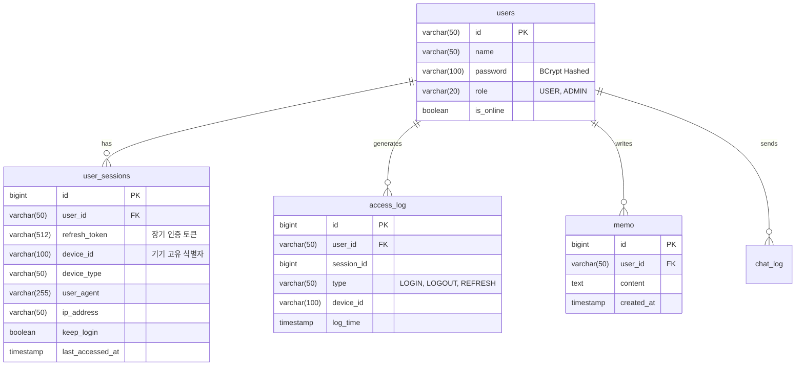

# 데이터베이스 설계 (Database Schema)

본 프로젝트는 MyBatis ORM을 사용하여 H2 임베디드 데이터베이스와 통신합니다.

## 1. 전체 ERD

## 2. 핵심 테이블 상세 설명

### 2.1 `users`
애플리케이션의 사용자 기본 정보를 담습니다. 비밀번호는 Spring Security의 `BCryptPasswordEncoder`를 통해 암호화되어 저장됩니다.

### 2.2 `user_sessions` (기기 관리 및 세션 유지의 핵심)
JWT 기반의 Stateless 속성을 보완하기 위한 Stateful 세션 관리 테이블입니다.
* 사용자가 새로운 브라우저/기기로 로그인할 때마다 레코드가 생성됩니다.
* `device_id` 컬럼을 통해 유령 기기(중복 생성)를 방지하고, 기존 세션을 업데이트하여 재사용합니다.
* 사용자는 설정 페이지에서 이 테이블의 정보를 바탕으로 자신의 활성 기기 목록을 조회하고 원격 로그아웃할 수 있습니다.

### 2.3 `access_log`
시스템 보안 감사를 위한 로깅 테이블입니다. 접속 시간, IP, 브라우저 정보 및 `device_id`를 추적합니다.