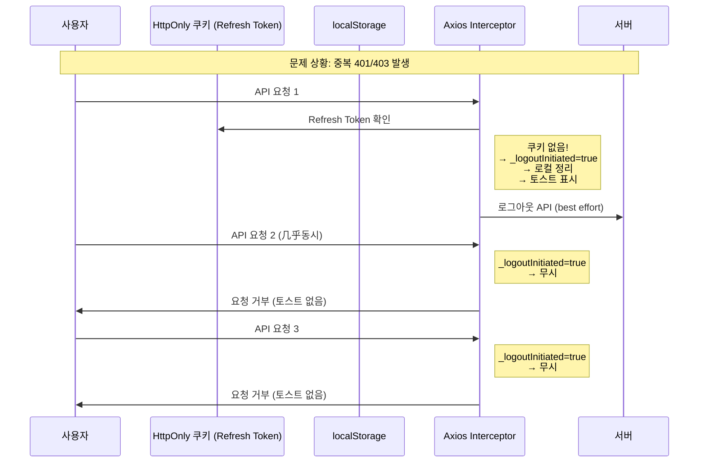

# 인증 시스템 개선 계획 (최종)

## 문제 재확인

### 문제 1: 토스트 메시지 반복 표시
- `keepLogin=false`로 로그인
- 브라우저를 끄고 다시 켬
- Refresh Token 쿠키가 없음
- interceptor가 `/refresh` API 호출 → 401 오류
- 토스트 메시지 "로그인 세션이 만료되었습니다. 다시 로그인해주세요." 반복 표시

### 문제 2: 중복 로그아웃 루프
- 401/403 오류가 짧은 시간에 반복 발생
- interceptor에서 매번 `logout()` 호출
- 서버 API가 계속 실패 → 또 401/403 → 무한 루프

---

## 해결 방안

### 1. 토큰 저장 로직 (기존 구조 유지)

| 토큰 | 저장 위치 | 설명 |
|------|----------|------|
| Access Token | `localStorage` | JavaScript로 접근 가능, API 요청 시 헤더에 포함 |
| Refresh Token | `HttpOnly 쿠키` | JavaScript 접근 불가, 보안상 안전 |

### 2. "로그인 상태 유지" 기능 (실무 표준)

| 설정 | Access Token | Refresh Token 쿠키 |
|-----|-------------|-------------------|
| `keepLogin=true` | 짧게 (10초/30분) - **자동 갱신** | 7일 |
| `keepLogin=false` | 짧게 (10초/30분) - **자동 갱신** | 세션 (브라우저 닫으면 삭제) |

### 3. axios interceptor 개선 (핵심!)

#### 3.1 Refresh Token 쿠키 확인 (문제 1 해결)
```typescript
// /refresh API 호출 전에 쿠키 확인
const hasRefreshToken = document.cookie.includes('refreshToken=');

if (!hasRefreshToken) {
  // 쿠키가 없으면 서버 API 호출 없이 바로 로컬 정리 + 로그아웃
  clearLocalStorage();
  deleteRefreshTokenCookie();
  emitLogoutEvent();
  return Promise.reject(error);
}
```

#### 3.2 중복 로그아웃 방지 (문제 2 해결)
```typescript
// interceptor에 _logoutInitiated 플래그 추가
if (originalRequest._logoutInitiated) {
  return Promise.reject(error); // 이미 logout 중이면 무시
}

originalRequest._logoutInitiated = true;

// 로컬 정리 먼저 (서버 API 없이)
clearLocalStorage();
deleteRefreshTokenCookie();
emitLogoutEvent();

// 서버 로그아웃 API는 "best effort" (실패해도 무시)
userApi.logout().catch(() => {});

return Promise.reject(error);
```

### 4. authUtility.ts 개선

```typescript
// 로그아웃 중복 호출 방지 (이미 존재)
let isLoggingOut = false;

// 빠른 로컬 정리 (서버 API 호출 없이)
export const clearLocalState = (): void => {
  localStorage.removeItem('accessToken');
  localStorage.removeItem('myId');
  localStorage.removeItem(TOKEN_EXPIRY_KEY);
  localStorage.removeItem(TOKEN_REFRESHING_KEY);
};

// 전체 로그아웃 (서버 API 포함)
export const logout = async (reason?: string): Promise<void> => {
  if (isLoggingOut) return;
  isLoggingOut = true;

  if (reason) showToast(reason, 'error');

  // 로컬 정리 먼저 (서버 API 실패해도 완료)
  clearLocalState();
  deleteRefreshTokenCookie();
  emitLogoutEvent();

  // 서버 로그아웃 API (best effort)
  try {
    await userApi.logout();
  } catch {}

  isLoggingOut = false;
};
```

### 5. 세션 삭제 로그 추가 (백엔드)

`SessionService.java`의 삭제 메서드에 로그 추가

---

## 파일별 변경 사항

### 5.1 클라이언트: axiosConfig.ts
- Refresh Token 쿠키 확인 로직 추가
- `_logoutInitiated` 플래그로 중복 로그아웃 방지
- 로컬 정리 먼저, 서버 API는 best effort

### 5.2 클라이언트: authUtility.ts
- `clearLocalState()` 함수 추가
- `logout()` 로직 정리 (로컬 먼저, 서버는 best effort)

### 5.3 클라이언트: Login.tsx
- `keepLogin` 쿠키 설정/삭제

### 5.4 클라이언트: AuthProvider.tsx
- `keepLogin` 쿠키 복원

### 5.5 서버: SessionService.java
- 세션 삭제 로그 추가

---

## 예상 동작

| 시나리오 | 동작 |
|---------|------|
| 브라우저 닫기 + 재접속 (keepLogin=false) | 첫 API 요청에서 쿠키 없음 감지 → 로컬 정리 → 로그아웃 (토스트 1회) |
| 여러 API 요청 동시 실패 | 첫 번째에서만 logout 처리 → 이후 요청은 무시 |
| 로그아웃 버튼 클릭 | 로컬 정리 → 서버 로그아웃 API (best effort) |

---

## 아키텍처 다이어그램



---

## 실무에서 사용하는 패턴

| 패턴 | 설명 |
|-----|------|
| **Idempotency** | 동일한 요청이 여러 번 와도 한 번만 처리 |
| **Circuit Breaker** | 연속 실패 시 빠르게 실패 처리 |
| **Best Effort** | 부가 작업은 실패해도 핵심 작업은 완료 |
| **Graceful Degradation** | 서버 API 실패해도 로컬 정리는 완료 |
